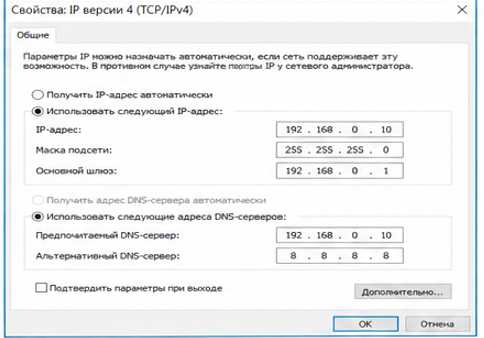
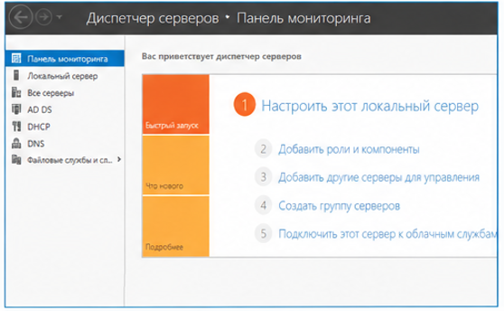
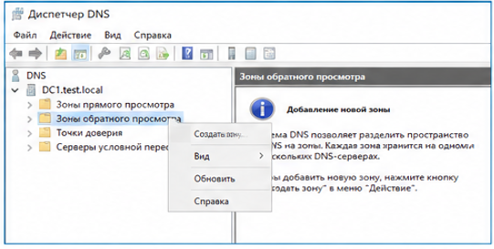
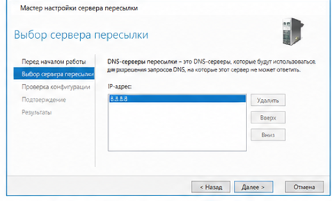
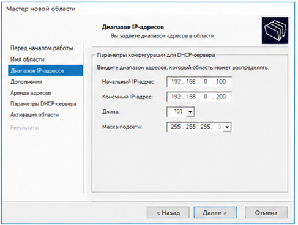
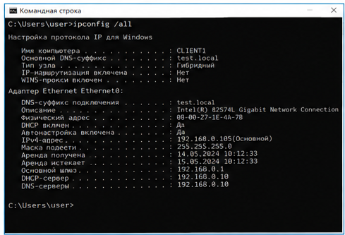
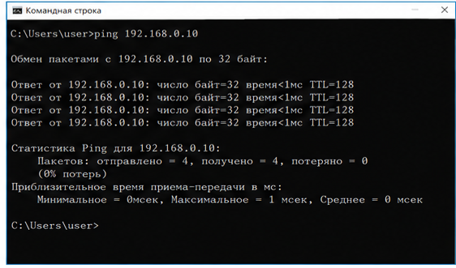

[//]: # is_table=true
[//]: # teacher ="Воробьев С.П."
[//]: # numerate = False

__ФИО__: Швырев А.П, Скиба А.Р, Мусиенко А.Е  
__Группа__: 090302-ИСТа-023

# Лабораторная работа №25

## Развертывание контроллера домена на базе Windows Server и настройка служб AD DS, DNS и DHCP

#### Цель работы

Целью работы являлось выполнение установки и базовой настройки операционной системы _Windows Server_, развертывание службы _Active Directory Domain Services_, настройка службы _DNS_, создание и настройка службы _DHCP_, а также проверка сетевого взаимодействия между устройствами в доменной инфраструктуре.

#### Исходные данные

В качестве исходных данных использовались:
    - виртуальная машина с установленной системой _Windows Server 2022_,
    - локальная сеть с подсетью 192.168.0.0/24,
    - служба _Active Directory_,
    - служба _DNS_,
    - служба _DHCP_,
    - сетевые интерфейсы _GigabitEthernet_,
    - средства администрирования _Server Manager_.

Для работы использовался домен test.local. Серверу был назначен статический _IP-адрес_ 192.168.0.10. В качестве шлюза использовался адрес 192.168.0.1.

#### Оборудование и ПО

В процессе выполнения лабораторной работы использовались:
    - персональный компьютер,
    - виртуальная машина,
    - операционная система _Windows Server 2022_,
    - средство виртуализации,
    - служба _Active Directory_,
    - служба _DNS_,
    - служба _DHCP_,
    - утилита _ping_,
    - сетевой протокол _TCP/IP_,
    - приложение _Server Manager_.

#### Ход выполнения работы

На первом этапе была выполнена установка операционной системы _Windows Server 2022_. В процессе установки была выбрана редакция с графическим интерфейсом, после чего выполнена первоначальная настройка сервера.

Перед настройкой ролей была выполнена базовая конфигурация сетевых параметров сервера. Для корректной работы служб был назначен статический _IP-адрес_, настроен _default gateway_ и указан локальный _DNS_-сервер.

Настройка сетевого интерфейса показана на рисунке 1.

После настройки сети было изменено имя сервера. В качестве имени использовалось значение DC1. Это необходимо для корректной идентификации устройства в доменной инфраструктуре.

На следующем этапе выполнялось добавление серверных ролей через средство _Server Manager_. Была выбрана установка ролей и компонентов для локального сервера.

Процесс выбора ролей приведен на рисунке 2.

Для развертывания доменной инфраструктуры была установлена роль _Active Directory Domain Services_. Дополнительно автоматически были выбраны необходимые компоненты для поддержки работы службы.

После установки роли выполнялось повышение сервера до контроллера домена. В мастере конфигурации был выбран вариант создания нового леса. В качестве корневого домена использовалось имя test.local.

Процесс создания нового домена показан на рисунке 3.

В параметрах контроллера домена была включена служба _DNS_. Дополнительно был задан пароль режима восстановления служб каталогов.

Во время настройки использовались следующие параметры:
    - домен test.local,
    - имя сервера DC1,
    - служба _DNS_,
    - функциональный уровень по умолчанию,
    - автоматическая установка компонентов.

После завершения предварительной проверки была запущена установка служб _AD DS_. После окончания установки сервер был автоматически перезагружен.

После перезагрузки выполнялась настройка службы _DNS_. Для корректной работы сети была создана зона обратного просмотра. Данная зона позволяет выполнять преобразование _IP-адресов_ в имена устройств.

Настройка зоны обратного просмотра показана на рисунке 4.

В процессе настройки использовались параметры сети 192.168.0.0/24. Для динамического обновления была выбрана возможность использования безопасных и небезопасных обновлений.

Далее выполнялась настройка серверов пересылки. В качестве внешнего _DNS_-сервера использовался адрес 8.8.8.8. Это обеспечило возможность разрешения внешних доменных имен и подключения к сети Интернет.

Настройка серверов пересылки приведена на рисунке 5.

После завершения настройки _DNS_ выполнялась установка службы _DHCP_. Установка производилась через средство _Server Manager_ путем добавления серверной роли.

Процесс установки службы _DHCP_ показан на рисунке 6.

После завершения установки была выполнена авторизация службы _DHCP_ в _Active Directory_. Затем производилась настройка области выдачи адресов.

Для создаваемой области были указаны:
    - начальный адрес 192.168.0.100,
    - конечный адрес 192.168.0.200,
    - маска подсети 255.255.255.0,
    - время аренды адреса,
    - адрес шлюза,
    - адрес _DNS_-сервера.

Настройка диапазона адресов приведена на рисунке 7.

Для корректной работы клиентов был настроен адрес шлюза и указаны параметры службы _DNS_. После завершения настройки область была активирована.

На следующем этапе выполнялась проверка работы доменной инфраструктуры. Клиентское устройство получило сетевые параметры автоматически через службу _DHCP_.

Результат получения сетевых параметров приведен на рисунке 8.

После получения параметров была выполнена проверка доступности сервера при помощи утилиты _ping_. Проверка показала успешный обмен пакетами между клиентом и сервером.

Результат проверки соединения показан на рисунке 9.

Дополнительно была выполнена проверка разрешения имен через службу _DNS_. Сервер успешно выполнял обработку запросов и возвращал корректные записи.

В ходе выполнения лабораторной работы также производилась проверка таблицы _ARP_. Это позволило убедиться в корректной работе механизмов взаимодействия устройств внутри локальной сети.

Для проверки использовались:
    - команда _ping_,
    - таблица _ARP_,
    - служба _DNS_,
    - служба _DHCP_,
    - сетевые интерфейсы _GigabitEthernet_.

После завершения настройки сервер был готов к дальнейшему использованию в качестве контроллера домена и централизованного средства управления сетью.

#### Результаты работы

В результате выполнения лабораторной работы была произведена установка и настройка операционной системы _Windows Server 2022_. На сервере были успешно развернуты службы _AD DS_, _DNS_ и _DHCP_.

В процессе выполнения работы были выполнены:
    - настройка статического _IP-адреса_,
    - настройка _default gateway_,
    - развертывание контроллера домена,
    - создание домена test.local,
    - настройка зоны обратного просмотра,
    - настройка серверов пересылки,
    - создание области выдачи адресов _DHCP_,
    - проверка сетевого взаимодействия,
    - проверка работы _DNS_,
    - проверка работы _ARP_,
    - тестирование соединения при помощи _ping_.

В результате проверки было установлено, что клиенты успешно получают сетевые параметры автоматически, выполняется корректное разрешение доменных имен и обеспечивается сетевое взаимодействие внутри локальной сети.

#### Вывод

В ходе выполнения лабораторной работы были изучены принципы установки и настройки серверной операционной системы _Windows Server_. Были освоены методы развертывания служб _Active Directory_, _DNS_ и _DHCP_.

В процессе настройки были получены навыки конфигурирования сетевых параметров, настройки доменной инфраструктуры и проверки сетевого взаимодействия. Также была выполнена проверка работы служб при помощи утилит _ping_ и _ARP_.

В результате работы был подготовлен работоспособный контроллер домена, обеспечивающий централизованное управление сетевой инфраструктурой и автоматическую выдачу сетевых параметров клиентским устройствам.

