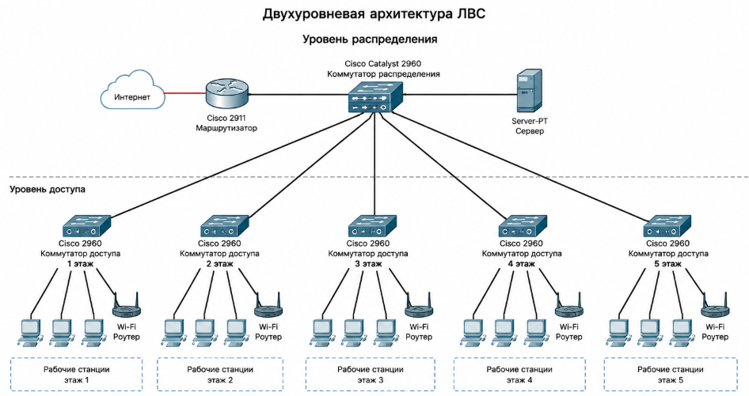
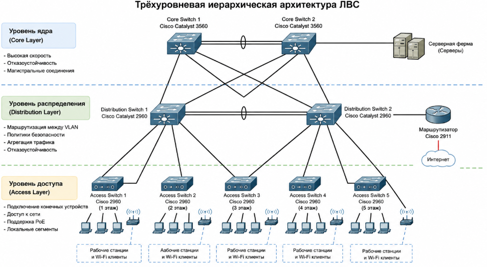
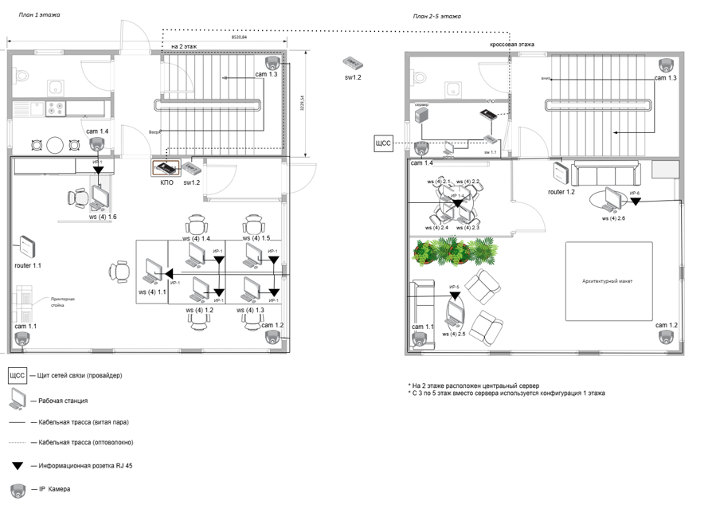
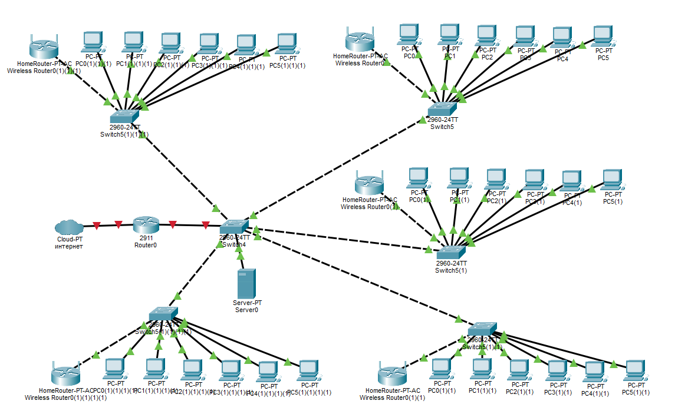
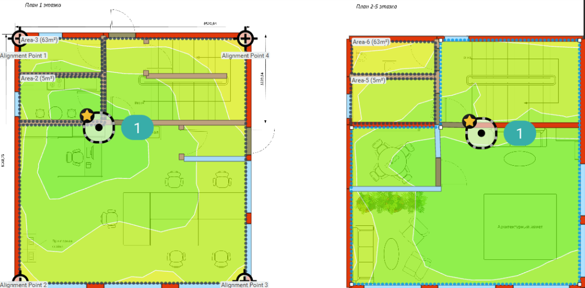
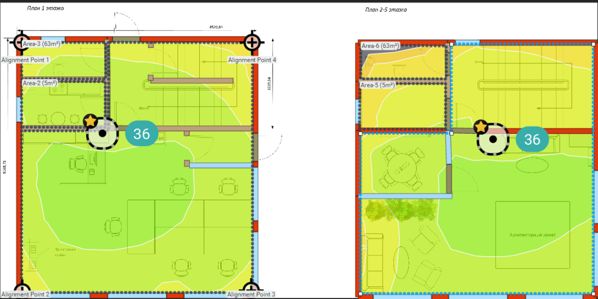

[//]: # (ОГЛАВЛЕНИЕ )

[//]: ### ( ВВЕДЕНИЕ) {

Технологии вычислительных сетей получили широкое распространение в области корпоративных информационных систем
распределенных предприятий, что позволило решать большое количество прикладных задач управления и организации
производства, а также повысить требования к оперативности и актуальности информации.

С помощью современных технических средств возможно разработать индивидуальное решение по проектированию локальной
вычислительной сети, соответствующее особенностям конкретного офисного помещения. При этом учитываются организационная
структура предприятия и расположение рабочих мест, что позволяет повысить эффективность обмена данными и
производительность труда сотрудников.

Целями создания локальной вычислительной сети являются:

- построение локальной вычислительной сети для взаимосвязи компьютеров, периферийных устройств (принтеры и т.п.) и
  оборудования, предназначенного для передачи и обработки информации;

- обеспечение возможности оперативного удовлетворения изменяющихся информационных потребностей учреждения без
  значительных затрат на модернизацию кабельной системы;

- обеспечение адаптации сети к изменениям организационной структуры, количеству пользователей и их размещению, а также к
  изменениям состава оборудования без проведения дополнительных монтажных работ.

В данном курсовом проекте рассматривается процесс проектирования локальной вычислительной сети предприятия с
обоснованием принятых технических решений на основе оборудования компании _Edimax Technology_ и компонентов
структурированной кабельной системы _LANMASTER_ с учетом требований действующих стандартов.
Для достижения поставленной цели в работе решаются следующие задачи:

- анализ исходных данных и формулирование технических требований к создаваемой сети;
- обоснование выбора архитектуры и принципов построения ЛВС;
- выбор технических помещений для размещения активного и пассивного оборудования;
- анализ модельного ряда оборудования Dell и Siemon и подбор конкретных моделей, удовлетворяющих требованиям
  производительности и надежности;
- разработка структурной схемы комплекса технических средств, включая серверное оборудование;
- выполнение моделирования зоны покрытия беспроводной сети Wi-Fi с использованием программного средства Ekahau;
- расчет и проектирование структурированной кабельной системы (горизонтальной, вертикальной и магистральной подсистем)
  на базе компонентов Siemon;
- определение состава программного обеспечения для функционирования сети и ее защиты;
- разработка мероприятий по обеспечению отказоустойчивости и безопасности;
- проектирование логической структуры сети, включая сегментацию на виртуальные сети (VLAN) и план IP-адресации;
- оформление кабельного журнала, спецификаций оборудования, поэтажных планов прокладки кабелей и схем монтажа.

}

[//]: ### (1. Постановка задачи) {

В рамках курсового проекта по дисциплине «Компьютерные сети и сетевая безопасность» необходимо выполнить проектирование
локальной вычислительной сети (ЛВС) для пятиэтажного офисного здания с организацией структурированной кабельной
системы (СКС), логической и физической структуры сети, а также подбором комплекса технических средств.

Проектируемая сеть должна обеспечивать надежное функционирование информационной инфраструктуры предприятия, включая
автоматизированные рабочие места сотрудников, серверные службы, систему видеонаблюдения и сетевое оборудование.

Основной целью работы является разработка архитектуры ЛВС, обеспечивающей:

- централизованное управление сетевыми ресурсами;
- стабильную и отказоустойчивую передачу данных;
- масштабируемость при увеличении количества подключаемых устройств;
- соответствие современным стандартам построения СКС (ISO/IEC 11801, TIA/EIA-568).

Для достижения поставленной цели необходимо решить следующие задачи:

- проанализировать исходные данные и требования к проектируемой сети;
- разработать структуру локальной вычислительной сети для пятиэтажного офисного здания;
- выполнить выбор архитектуры сети и методов ее построения;
- спроектировать структурированную кабельную систему с разделением на горизонтальную, вертикальную и магистральную
  подсистемы;
- определить состав и расположение активного и пассивного сетевого оборудования;
- выполнить выбор серверного оборудования и сетевых сервисов;
- подобрать коммутаторы, кабельную систему _LANMASTER_ и сетевые устройства _Edimax Technology_;
- разработать логическую структуру сети с учетом сегментации и возможного использования VLAN;
- выполнить расчет количества оборудования и портовой емкости;
- разработать систему видеонаблюдения и дополнительные сетевые сервисы;
- обеспечить требования по надежности, отказоустойчивости и информационной безопасности;
- подготовить схемы размещения оборудования и кабельных соединений.

В результате выполнения курсового проекта должна быть разработана полная проектная документация, включающая структурные
и функциональные схемы сети, спецификации оборудования, а также обоснование принятых технических решений для построения
ЛВС офисного здания.

}

[//]: ### (2.Технические требования к проектируемой ЛВС){

Проектируемая локальная вычислительная сеть (ЛВС) предназначена для обеспечения информационного взаимодействия
пользователей, серверного оборудования и сетевых устройств в пределах пятиэтажного офисного здания. ЛВС строится на
основе структурированной кабельной системы _LANMASTER_ и активного сетевого оборудования _Edimax Technology_, с
возможностью дальнейшего расширения без существенной модернизации существующей инфраструктуры.

ЛВС должна обеспечивать объединение всех автоматизированных рабочих мест в единую информационную систему, предоставлять
централизованный доступ к файловым ресурсам, а также поддерживать работу сетевых сервисов, включая файловый сервер,
контроллер домена, DHCP и DNS. Дополнительно сеть должна обеспечивать функционирование системы IP-видеонаблюдения и
других сетевых сервисов предприятия.

Скорость передачи данных в пределах локальной сети на уровне рабочих мест должна быть не ниже 1 Гбит/с. Магистральные
соединения между этажами должны обеспечивать пропускную способность не менее 1 Гбит/с с возможностью последующего
увеличения до 10 Гбит/с. Сеть должна гарантировать стабильную работу при одновременном подключении не менее 50 рабочих
станций с возможностью расширения до 70 и более узлов без изменения базовой архитектуры.

Структура ЛВС должна быть построена по иерархическому принципу и включать уровень доступа (этажные коммутаторы), уровень
распределения (межэтажные соединения) и уровень ядра сети (центральный коммутатор и серверное оборудование). Каждый этаж
должен быть оборудован отдельным коммутационным узлом на базе телекоммуникационного шкафа _LANMASTER_ стандарта 19".

Структурированная кабельная система должна обеспечивать использование витой пары категории Cat.5e/Cat.6 для
горизонтальных линий и оптических линий связи для вертикальной магистрали между этажами. Длина горизонтального сегмента
не должна превышать 100 метров. При монтаже должны использоваться компоненты _LANMASTER_, включая патч-панели, розетки и
патч-корды.

Активное сетевое оборудование должно поддерживать Gigabit Ethernet (IEEE 802.3ab), обеспечивать наличие управляемых
коммутаторов уровня L2/L3, поддержку VLAN для сегментации сети, а также поддержку технологии PoE для питания IP-камер.
Коммутаторы должны иметь SFP-порты для организации оптических магистралей и быть совместимыми с кабельной системой
_LANMASTER_.

Серверная часть ЛВС должна обеспечивать круглосуточный режим работы (24/7) и включать один стоечный сервер форм-фактора
Rack Server (Xeon/EPYC), размещённый в 19" телекоммуникационном шкафу. Сервер должен выполнять функции файлового
сервера, контроллера домена, DHCP/DNS-сервисов и резервного копирования данных, а также быть интегрированным с сетевым
оборудованием _Edimax Technology_.

Система IP-видеонаблюдения должна строиться на основе IP-камер с поддержкой PoE, обеспечивающих передачу видеопотока по
сети Ethernet. Камеры должны быть установлены в ключевых зонах здания (входы, коридоры, серверная) и обеспечивать
круглосуточный мониторинг.

ЛВС должна обеспечивать высокий уровень надежности и информационной безопасности, включая сегментацию сети с
использованием VLAN, защиту от несанкционированного доступа, резервирование критически важных узлов и использование
источника бесперебойного питания для серверного оборудования.

Проектируемая сеть должна обладать высокой масштабируемостью, позволяющей увеличивать количество рабочих мест до 70 и
более, добавлять новые сетевые сегменты и расширять серверные и сервисные функции без полной реконструкции
инфраструктуры.

}

[//]: ###  (3. Анализ технических требований, выбор архитектуры и обоснование принципов построения ЛВС){

### 3.1. Выбор технологии сети

Для построения локальной вычислительной сети проектируемого офисного здания выбрана технология проводной пакетной
передачи данных Ethernet, основанная на стандарте IEEE 802.3. Данная технология является наиболее распространённой для
корпоративных сетей благодаря высокой надёжности, масштабируемости, предсказуемым задержкам передачи данных и широкой
совместимости оборудования различных производителей.

В качестве среды передачи данных применяется структурированная кабельная система _LANMASTER_, включающая медные линии
связи на основе витой пары категории не ниже Cat.6 для горизонтальной подсистемы и волоконно-оптические линии связи для
вертикальной магистрали между этажами. Использование витой пары Cat.6 обеспечивает стабильную работу на скорости 1
Гбит/с и выше на уровне рабочих мест, а оптоволоконные линии обеспечивают высокоскоростную передачу данных между этажами
с минимальными потерями сигнала и высокой помехозащищённостью.

Сеть строится на основе коммутируемой технологии (Switched Ethernet), при которой каждое устройство подключается к
отдельному порту коммутатора, что исключает коллизии и повышает общую производительность сети. В качестве активного
оборудования используются управляемые коммутаторы _Edimax Technology_, обеспечивающие поддержку VLAN, QoS и функций
управления трафиком.

Для беспроводного доступа применяется технология Wi-Fi 6 (IEEE 802.11ax), обеспечивающая высокую пропускную способность,
устойчивую работу при высокой плотности подключений и улучшенную энергоэффективность клиентских устройств. Точки доступа
интегрируются в проводную инфраструктуру и получают питание по технологии PoE, что позволяет упростить монтаж и
эксплуатацию оборудования.

Дополнительно в сети реализуется технология VLAN (IEEE 802.1Q), позволяющая логически разделять пользователей на
группы (например, сотрудники, администрация, гости), что повышает уровень информационной безопасности, снижает
широковещательный трафик и улучшает управляемость сети.

Таким образом, для проектируемого объекта выбрана гибридная проводная и беспроводная технология Ethernet-сети с
централизованным управлением и поддержкой современных сетевых стандартов.

### 3.2. Архитектура сети

Архитектура проектируемой локальной вычислительной сети построена по иерархическому принципу с использованием модели
«трёх уровней»: уровень доступа, уровень распределения и уровень ядра сети. Данная архитектура является наиболее
эффективной для зданий средней этажности и позволяет обеспечить гибкость, отказоустойчивость и масштабируемость сети.

__Уровень доступа__ представлен этажными коммутаторами _Edimax Technology_, к которым подключаются конечные устройства:
персональные компьютеры, IP-камеры видеонаблюдения, принтеры и точки доступа Wi-Fi 6. На данном уровне осуществляется
первичная коммутация трафика и подключение пользовательского оборудования через горизонтальную кабельную систему
_LANMASTER_.

__Уровень распределения__ реализуется посредством вертикальной магистрали между этажами. Для соединения этажных
коммутаторов используется волоконно-оптическая линия связи, обеспечивающая высокую пропускную способность, минимальные
потери сигнала и устойчивость к электромагнитным помехам. Данный уровень выполняет функцию агрегации трафика и передачи
его на уровень ядра сети.

__Уровень ядра сети__ располагается в серверной комнате, размещённой на первом этаже здания. На данном уровне находится
центральный управляемый коммутатор, серверное оборудование и средства сетевого администрирования. Ядро сети обеспечивает
взаимодействие между VLAN, доступ к серверным ресурсам и централизованное управление сетевой инфраструктурой.

Топология сети реализуется по принципу иерархической звезды, при которой каждый этаж подключается к центральному узлу
через отдельный канал связи. Такая структура обеспечивает:

- высокую отказоустойчивость (выход из строя одного сегмента не влияет на остальные);
- простоту масштабирования сети;
- удобство администрирования и диагностики;
- оптимальное распределение нагрузки.

Кроме того, архитектура предусматривает возможность дальнейшего расширения сети за счёт добавления новых узлов без
изменения базовой структуры.

### 3.3. Характеристика объекта проектирования

Объектом внедрения является пятиэтажное офисное здание административного назначения. Каждый этаж имеет размеры 9,1 × 8,5
м, что составляет площадь одного этажа 78 м². Общая площадь здания с учётом всех этажей составляет 386 м². Высота
потолков помещений составляет 3 м, что соответствует стандартным требованиям для офисных зданий и обеспечивает удобство
размещения кабельных трасс и телекоммуникационного оборудования.

Функциональное назначение этажей распределено следующим образом:

- __1 этаж:__ рабочая зона сотрудников, кабинет руководителя, кухня, санитарный узел, зона размещения оргтехники (
  принтерная стойка);
- __2 этаж:__ серверная комната (центральный узел сети), переговорные помещения, рабочие места сотрудников;
- __3–5 этажи:__ открытые рабочие пространства, переговорные комнаты (включая закрытые), зоны отдыха и демонстрационные
  зоны.

В здании предусмотрена централизованная серверная, расположенная на втором этаже, в которой размещается основное сетевое
оборудование, сервер, центральный коммутатор и коммутационные узлы. На каждом этаже размещается 6 автоматизированных
рабочих мест (АРМ), что обеспечивает общее количество 30 рабочих станций с возможностью расширения до 40 узлов без
изменения архитектуры сети.

Для построения сетевой инфраструктуры предусмотрены следующие элементы:

- центральный узел сети в серверной;
- этажные телекоммуникационные шкафы _LANMASTER_;
- управляемые коммутаторы _Edimax Technology_;
- волоконно-оптическая магистраль между этажами;
- горизонтальная разводка на основе кабеля Cat.6;
- точки доступа Wi-Fi 6 для беспроводного подключения;
- IP-камеры видеонаблюдения с поддержкой PoE.

Таким образом, объект проектирования представляет собой компактное, но функционально насыщенное офисное здание,
требующее надежной, масштабируемой и отказоустойчивой сетевой инфраструктуры, обеспечивающей работу всех информационных
сервисов предприятия в круглосуточном режиме.

}

[//]: ### (4. Определение технических средств){

### 4.1 Выбор технических помещений и условия размещения оборудования

Для обеспечения надёжного и бесперебойного функционирования локальной вычислительной сети в проектируемом пятиэтажном
офисном здании необходимо предусмотреть специальные технические помещения, соответствующие требованиям действующих
стандартов (ГОСТ Р 53246–2008, TIA/EIA-569) и санитарно-гигиеническим нормам.

В проектируемой сети предусматриваются следующие типы технических помещений:

- Центральная серверная (главный кросс) — помещение, предназначенное для размещения основного активного оборудования
  сети: маршрутизатора, коммутатора уровня ядра, серверного оборудования, межсетевого экрана, источников бесперебойного
  питания, а также оборудования системы хранения и коммутации.
- Этажные кроссовые (телекоммуникационные шкафы) — запираемые телекоммуникационные шкафы, размещаемые на каждом этаже
  здания и предназначенные для установки коммутаторов уровня доступа, патч-панелей и другого оборудования подключения
  автоматизированных рабочих мест сотрудников.

Объектом внедрения является пятиэтажное офисное здание размерами 9,1 × 8,5 м. Площадь одного этажа составляет 78 м²,
общая площадь объекта — 386 м². На каждом этаже размещается 10 автоматизированных рабочих мест сотрудников, оснащённых
персональными компьютерами. Общее количество подключаемых узлов сети составляет 50 единиц с перспективой дальнейшего
расширения до 70 узлов.

С учётом масштабов проектируемой сети центральная серверная размещается на первом этаже здания, вблизи точки ввода
внешних телекоммуникаций и магистральных кабельных линий. Рекомендуемая площадь серверной составляет не менее 8–10 м²,
что обеспечивает возможность установки серверной стойки стандарта 19″, источников бесперебойного питания,
коммутационного оборудования и системы кондиционирования воздуха.

На каждом из пяти этажей предусматривается установка телекоммуникационного шкафа для размещения оборудования уровня
доступа и организации подключения рабочих мест. Такое решение обеспечивает удобство обслуживания сети, сокращение длины
горизонтальных кабельных линий и возможность дальнейшего масштабирования локальной вычислительной сети.

### 4.2. Коммутаторы

Применение коммутаторов является предпочтительным в ситуациях, когда необходимо увеличить производительность сети или
установить выделенный канал высокой скорости к серверу.

Использование коммутатора повышает производительность и сокращает время отклика сети путём уменьшения количества
пользователей на одном сетевом сегменте. Это достигается за счёт выделения отдельных каналов для каждого устройства,
подключённого к порту коммутатора, включая серверы и рабочие станции. Коммутаторы предпочтительны, так как они не
разделяют скорость передачи данных между пользователями, а обеспечивают каждому устройству полную пропускную способность
порта.

В соответствии с поставленными задачами по созданию локальной вычислительной сети пятиэтажного офисного здания, а также
с учётом выбранного оборудования компании Edimax Technology, было принято решение включить управляемые коммутаторы
данного производителя в реализацию проекта.

В проекте предусмотрено два уровня коммутации:

- __уровень доступа__ — этажные коммутаторы, обслуживающие рабочие места на каждом из пяти этажей;
- __уровень ядра (агрегации)__ — центральный коммутатор в главном распределительном узле, агрегирующий трафик со всех
  этажей и обеспечивающий выход к маршрутизатору.

### 4.2.1. Выбор коммутатора уровня доступа

Сравнительная таблица коммутаторов уровня доступа (Edimax Technology)

Коммутаторы фирмы Edimax Technology подразделяются на серии по их назначению. Каждая серия имеет свои особенности и
характеристики. Основные серии управляемых коммутаторов, рассматриваемых для уровня доступа:

- GS-5208PLG V2;
- GS-5216PLC;
- GS-5416PLC;
- GS-5424PLC;
- GS-5424PLC V2.

Более подробная информация о сериях и их основных особенностях представлена в таблице 1.

| Параметр                                 | GS-5208PLG V2     | GS-5216PLC         | GS-5416PLC         | GS-5424PLC         | GS-5424PLC V2      |
|------------------------------------------|-------------------|--------------------|--------------------|--------------------|--------------------|
| __Порты и интерфейсы__                   |                   |                    |                    |                    |                    |
| Портов RJ45 10/100/1000Base-T            | 8                 | 16                 | 16                 | 24                 | 24                 |
| Портов SFP Gigabit                       | 2 (выделенные)    | 2 (комбо RJ45/SFP) | 4 (комбо RJ45/SFP) | 4 (комбо RJ45/SFP) | 4 (комбо RJ45/SFP) |
| Всего портов                             | 10                | 18                 | 20                 | 28                 | 28                 |
| __PoE__                                  |                   |                    |                    |                    |                    |
| Стандарт PoE                             | IEEE 802.3af/at   | IEEE 802.3af/at    | IEEE 802.3af/at    | IEEE 802.3af/at    | IEEE 802.3af/at    |
| Портов с поддержкой PoE+                 | 8                 | 16                 | 16                 | 24                 | 24                 |
| Макс. мощность на порт                   | 30 Вт             | 30 Вт              | 30 Вт              | 30 Вт              | 30 Вт              |
| Общий бюджет мощности PoE                | 85 Вт             | 280 Вт             | 330 Вт             | 400 Вт             | 400 Вт             |
| Long Range PoE (до 200 м)                | Да                | Да                 | Да                 | Да                 | Да                 |
| Защита от обратной подачи питания        | Да                | Да                 | Да                 | Да                 | Да                 |
| PoE watchdog (PD Alive Check)            | Нет               | Да                 | Да                 | Да                 | Да                 |
| __Производительность__                   |                   |                    |                    |                    |                    |
| Коммутационная ёмкость                   | 20 Гбит/с         | 36 Гбит/с          | 40 Гбит/с          | 56 Гбит/с          | 56 Гбит/с          |
| Скорость передачи пакетов                | 14,88 Мпакет/с    | 26,7 Мпакет/с      | 29,76 Мпакет/с     | 41,67 Мпакет/с     | 41,6 Мпакет/с      |
| Таблица MAC-адресов                      | 4 000             | 8 000              | 8 000              | 8 000              | 8 000              |
| Метод коммутации                         | Store and Forward | Store and Forward  | Store and Forward  | Store and Forward  | Store and Forward  |
| Поддержка Jumbo Frame                    | 9 КБ              | 9 КБ               | 9 КБ               | 9 КБ               | 9 КБ               |
| Буферная память                          | 1,5 МБ            | 1,5 МБ             | 1,5 МБ             | 3 МБ               | 4,1 МБ             |
| __VLAN и сегментация__                   |                   |                    |                    |                    |                    |
| VLAN (IEEE 802.1Q)                       | Да                | Да                 | Да                 | Да                 | Да                 |
| Voice VLAN                               | Нет               | Да                 | Да                 | Да                 | Да                 |
| IP Surveillance VLAN                     | Нет               | Да                 | Нет                | Да                 | Да                 |
| __QoS__                                  |                   |                    |                    |                    |                    |
| QoS (IEEE 802.1p)                        | Да                | Да                 | Да                 | Да                 | Да                 |
| QoS DSCP                                 | Нет               | Да                 | Да                 | Да                 | Да                 |
| Количество очередей QoS                  | 2                 | 4                  | 4                  | 4                  | 4                  |
| CoS (Class of Service)                   | Нет               | Да                 | Да                 | Да                 | Да                 |
| __Безопасность__                         |                   |                    |                    |                    |                    |
| DHCP Snooping                            | Нет               | Да                 | Да                 | Да                 | Да                 |
| Список контроля доступа (ACL)            | Да                | Да                 | Да                 | Да                 | Да                 |
| Broadcast Storm Control                  | Да                | Да                 | Да                 | Да                 | Да                 |
| __Надёжность и управление__              |                   |                    |                    |                    |                    |
| STP / RSTP (IEEE 802.1w)                 | Да                | Да                 | Да                 | Да                 | Да                 |
| IGMP Snooping                            | v1/v2/v3          | v1/v2/v3           | v1/v2/v3           | v1/v2/v3           | v1/v2/v3           |
| Port Trunking / LACP (IEEE 802.3ad)      | Да                | Да                 | Да                 | Да                 | Да                 |
| Port Mirroring                           | Да                | Да                 | Да                 | Да                 | Да                 |
| Rate Limiting                            | Да                | Да                 | Да                 | Да                 | Да                 |
| Loop Detection / Prevention              | Да                | Да                 | Да                 | Да                 | Да                 |
| Резервный образ прошивки (Dual Firmware) | Нет               | Да                 | Да                 | Да                 | Да                 |
| Поддержка IPv4/IPv6                      | Да                | Да                 | Да                 | Да                 | Да                 |
| SNMP                                     | Нет               | v1/v2c/v3          | v1/v2c/v3          | v1/v2c/v3          | v1/v2c/v3          |
| Управление через Web-интерфейс           | Да                | Да                 | Да                 | Да                 | Да                 |
| Поддержка ONVIF Profile Q                | Нет               | Да                 | Нет                | Нет                | Да                 |
| __Физические характеристики__            |                   |                    |                    |                    |                    |
| Форм-фактор                              | 1U, 19"           | 1U, 19"            | 1U, 19"            | 1U, 19"            | 1U, 19"            |
| Корпус                                   | Металл            | Металл             | Металл             | Металл             | Металл             |
| Охлаждение                               | Без вентилятора   | Без вентилятора    | Вентилятор         | Вентилятор         | Сменный вентилятор |
| Рабочая температура                      | 0…+50 °C          | 0…+50 °C           | 0…+50 °C           | 0…+50 °C           | 0…+50 °C           |
| Питание                                  | AC 100–240 В      | AC 100–240 В       | AC 100–240 В       | AC 100–240 В       | AC 100–240 В       |

Для реализации сети целесообразно использовать 24-портовый коммутатор с поддержкой PoE+ и возможностью коммутации по
медной витой паре (RJ-45), а также с наличием SFP-портов для организации магистральных соединений между этажами.

__Выбранный коммутатор уровня доступа: Edimax GS-5424PLC.__ Артикул: GS-5424PLC.

Подробные характеристики выбранной модели коммутатора уровня доступа приведены в таблице 2.

| Параметр                                            | Значение                                                                               |
|-----------------------------------------------------|----------------------------------------------------------------------------------------|
| Количество портов 10/100/1000Base-T (RJ-45)         | 24                                                                                     |
| Количество комбо-портов RJ45/SFP (Gigabit Ethernet) | 4                                                                                      |
| Поддержка PoE (стандарт)                            | IEEE 802.3af / IEEE 802.3at (PoE+)                                                     |
| Максимальная мощность на порт PoE                   | 30 Вт                                                                                  |
| Общий бюджет мощности PoE                           | 400 Вт                                                                                 |
| Общая коммутационная ёмкость                        | 56 Гбит/с                                                                              |
| Скорость передачи пакетов                           | 41,67 Мпакет/с                                                                         |
| Метод коммутации                                    | Store and Forward                                                                      |
| Таблица MAC-адресов                                 | 8 000 записей                                                                          |
| Буферная память                                     | 3 МБ                                                                                   |
| Поддержка Jumbo Frame                               | до 9 КБ                                                                                |
| Форм-фактор                                         | 1U, 19"                                                                                |
| Поддержка VLAN (IEEE 802.1Q)                        | Да                                                                                     |
| Voice VLAN                                          | Да                                                                                     |
| IP Surveillance VLAN                                | Да                                                                                     |
| Качество обслуживания (QoS)                         | IEEE 802.1p, DSCP, 4 очереди                                                           |
| CoS (Class of Service)                              | Да                                                                                     |
| Агрегирование каналов (LACP)                        | IEEE 802.3ad                                                                           |
| Spanning Tree Protocol                              | STP, RSTP (IEEE 802.1w)                                                                |
| IGMP Snooping                                       | v1 / v2 / v3                                                                           |
| DHCP Snooping                                       | Да                                                                                     |
| ACL (Access Control List)                           | Да                                                                                     |
| Broadcast Storm Control                             | Да                                                                                     |
| PoE watchdog (авт. перезагрузка PoE-устройств)      | Да                                                                                     |
| Long Range PoE                                      | До 200 м при 10 Мбит/с                                                                 |
| Защита от обратной подачи питания PoE               | Да                                                                                     |
| Loop Detection / Prevention                         | Да                                                                                     |
| Port Mirroring                                      | Да                                                                                     |
| Rate Limiting                                       | Да                                                                                     |
| Резервный образ прошивки (Dual Firmware)            | Да                                                                                     |
| Управление                                          | Web-интерфейс, SNMP v1/v2c/v3                                                          |
| Поддержка IPv4/IPv6                                 | Да                                                                                     |
| Корпус                                              | Металл                                                                                 |
| Охлаждение                                          | Активное (вентилятор со сменным лотком)                                                |
| Рабочая температура                                 | 0…+50 °C                                                                               |
| Питание                                             | AC 100–240 В, 50/60 Гц                                                                 |
| Соответствие стандартам                             | IEEE 802.3, 802.3u, 802.3ab, 802.3z, 802.1Q, 802.1p, 802.3af, 802.3at, 802.3ad, 802.1w |

### 4.2.2. Выбор коммутатора уровня ядра (агрегации)

Коммутатор уровня ядра выполняет функцию агрегации трафика со всех пяти этажных коммутаторов и обеспечивает подключение
к маршрутизатору и серверному сегменту. В отличие от коммутаторов уровня доступа, к нему предъявляются повышенные
требования по производительности и пропускной способности аплинков: при подключении пяти этажных коммутаторов через
Gigabit-порты суммарный трафик способен создать узкое место на аплинке, что недопустимо для корпоративной сети.

В связи с этим для уровня ядра рассматриваются модели с портами 10 Gigabit Ethernet (SFP+), обеспечивающими достаточный
запас пропускной способности для агрегации трафика.

Для уровня ядра рассматриваются три модели Edimax Technology с поддержкой аплинков 10GbE:

- GS-5424LX;
- GS-5424PLX;
- GS-5654LX.

Более подробная информация о сериях и их основных особенностях представлена в таблице 3.

| Параметр                                      | GS-5424LX          | GS-5424PLX         | GS-5654LX          |
|-----------------------------------------------|--------------------|--------------------|--------------------|
| __Порты и интерфейсы__                        |                    |                    |                    |
| Портов RJ45 10/100/1000Base-T                 | 24                 | 24                 | 48                 |
| Портов SFP+ 10GbE (аплинк)                    | 4                  | 4                  | 6                  |
| Всего портов                                  | 28                 | 28                 | 54                 |
| Поддержка PoE+ на портах RJ45                 | Нет                | Да (IEEE 802.3at)  | Нет                |
| Бюджет PoE                                    | —                  | 400 Вт             | —                  |
| __Производительность__                        |                    |                    |                    |
| Коммутационная ёмкость                        | 128 Гбит/с         | 128 Гбит/с         | 176 Гбит/с         |
| Скорость передачи пакетов                     | 95,2 Мпакет/с      | 95,2 Мпакет/с      | 130,9 Мпакет/с     |
| Таблица MAC-адресов                           | 16 000             | 16 000             | 16 000             |
| Метод коммутации                              | Store and Forward  | Store and Forward  | Store and Forward  |
| Поддержка Jumbo Frame                         | 12 КБ              | 12 КБ              | 12 КБ              |
| __VLAN и сегментация__                        |                    |                    |                    |
| VLAN (IEEE 802.1Q)                            | Да                 | Да                 | Да                 |
| Voice VLAN                                    | Да                 | Да                 | Да                 |
| IP Surveillance VLAN                          | Нет                | Да                 | Нет                |
| __QoS__                                       |                    |                    |                    |
| QoS (IEEE 802.1p / DSCP)                      | Да                 | Да                 | Да                 |
| CoS (Class of Service)                        | Да                 | Да                 | Да                 |
| __Безопасность__                              |                    |                    |                    |
| ACL (Access Control List)                     | Да                 | Да                 | Да                 |
| DHCP Snooping                                 | Да                 | Да                 | Да                 |
| Broadcast Storm Control                       | Да                 | Да                 | Да                 |
| __Надёжность и управление__                   |                    |                    |                    |
| STP / RSTP (IEEE 802.1w)                      | Да                 | Да                 | Да                 |
| IGMP Snooping                                 | v1/v2/v3           | v1/v2/v3           | v1/v2/v3           |
| Port Trunking / LACP (IEEE 802.3ad)           | Да                 | Да                 | Да                 |
| Port Mirroring                                | Да                 | Да                 | Да                 |
| Loop Detection / Prevention                   | Да                 | Да                 | Да                 |
| Резервный образ прошивки (Dual Firmware)      | Да                 | Да                 | Да                 |
| Поддержка IPv4/IPv6                           | Да                 | Да                 | Да                 |
| SNMP                                          | v1/v2c/v3          | v1/v2c/v3          | v1/v2c/v3          |
| Управление через Web-интерфейс                | Да                 | Да                 | Да                 |
| Защита от перегрузок (6 кВ, Surge Protection) | Да                 | Да                 | Да                 |
| Интеллектуальный термоконтроллер вентиляторов | Да                 | Да                 | Да                 |
| __Физические характеристики__                 |                    |                    |                    |
| Форм-фактор                                   | 1U, 19"            | 1U, 19"            | 1U, 19"            |
| Корпус                                        | Металл             | Металл             | Металл             |
| Охлаждение                                    | Сменный вентилятор | Сменный вентилятор | Сменный вентилятор |
| Рабочая температура                           | 0…+50 °C           | 0…+50 °C           | 0…+50 °C           |
| Питание                                       | AC 100–240 В       | AC 100–240 В       | AC 100–240 В       |

Модель __GS-5654LX__ избыточна для объекта с пятью этажами: 48 портов RJ45 и 6 аплинков SFP+ значительно превышают
реальные потребности сети. Модель __GS-5424PLX__ оснащена поддержкой PoE+ на всех 24 портах RJ45, что увеличивает
стоимость и потребляемую мощность устройства, тогда как функция PoE на уровне ядра не требуется — все конечные
устройства получают питание через этажные коммутаторы.

__Выбранный коммутатор уровня ядра: Edimax GS-5424LX.__ Артикул: GS-5424LX.

Модель GS-5424LX оптимально соответствует задачам уровня агрегации: обеспечивает подключение пяти этажных коммутаторов
через Gigabit SFP-порты, подключение маршрутизатора через SFP+ 10GbE и обладает коммутационной ёмкостью 128 Гбит/с, в
2,3 раза превышающей ёмкость этажных коммутаторов, что полностью исключает образование узких мест при агрегации трафика.

Подробные характеристики выбранной модели коммутатора уровня ядра приведены в таблице 4.

| Параметр                                    | Значение                                                                      |
|---------------------------------------------|-------------------------------------------------------------------------------|
| Количество портов 10/100/1000Base-T (RJ-45) | 24                                                                            |
| Количество портов SFP+ 10GbE (аплинк)       | 4                                                                             |
| Всего портов                                | 28                                                                            |
| Поддержка PoE                               | Нет                                                                           |
| Общая коммутационная ёмкость                | 128 Гбит/с                                                                    |
| Скорость передачи пакетов                   | 95,2 Мпакет/с                                                                 |
| Метод коммутации                            | Store and Forward                                                             |
| Таблица MAC-адресов                         | 16 000 записей                                                                |
| Поддержка Jumbo Frame                       | до 12 КБ                                                                      |
| Форм-фактор                                 | 1U, 19"                                                                       |
| Поддержка VLAN (IEEE 802.1Q)                | Да                                                                            |
| Voice VLAN                                  | Да                                                                            |
| Качество обслуживания (QoS)                 | IEEE 802.1p, DSCP                                                             |
| CoS (Class of Service)                      | Да                                                                            |
| Агрегирование каналов (LACP)                | IEEE 802.3ad                                                                  |
| Spanning Tree Protocol                      | STP, RSTP (IEEE 802.1w)                                                       |
| IGMP Snooping                               | v1 / v2 / v3                                                                  |
| DHCP Snooping                               | Да                                                                            |
| ACL (Access Control List)                   | Да                                                                            |
| Broadcast Storm Control                     | Да                                                                            |
| Loop Detection / Prevention                 | Да                                                                            |
| Port Mirroring                              | Да                                                                            |
| Rate Limiting                               | Да                                                                            |
| Резервный образ прошивки (Dual Firmware)    | Да                                                                            |
| Управление                                  | Web-интерфейс, SNMP v1/v2c/v3                                                 |
| Поддержка IPv4/IPv6                         | Да                                                                            |
| Грозозащита (Surge Protection)              | 6 кВ                                                                          |
| Интеллектуальный термоконтроллер            | Да                                                                            |
| Корпус                                      | Металл                                                                        |
| Охлаждение                                  | Активное (сменный вентиляторный лоток)                                        |
| Рабочая температура                         | 0…+50 °C                                                                      |
| Питание                                     | AC 100–240 В, 50/60 Гц                                                        |
| Соответствие стандартам                     | IEEE 802.3, 802.3u, 802.3ab, 802.3z, 802.3ae, 802.1Q, 802.1p, 802.3ad, 802.1w |

### 4.2.3. Итоговая спецификация коммутаторов

| № | Наименование      | Назначение                            | Кол-во, шт. |
|---|-------------------|---------------------------------------|-------------|
| 1 | Edimax GS-5424PLC | Коммутатор уровня доступа (этажи 1–5) | 5           |
| 2 | Edimax GS-5424LX  | Коммутатор уровня ядра (ГРУ, этаж 1)  | 1           |
|   | __Итого__         |                                       | __6__       |

### 4.3 Маршрутизатор

Маршрутизаторы, используемые в структурированной кабельной системе на базе оборудования _LANMASTER_ и _Edimax
Technology_,
являются ключевыми компонентами компьютерной сети и обеспечивают передачу данных между устройствами внутри локальной
сети и между сетями.

Они обеспечивают взаимодействие между рабочими станциями, серверами, устройствами беспроводного доступа и другими
сетевыми узлами, а также выполняют функции маршрутизации трафика между локальной сетью и внешними сетями.

Маршрутизаторы, размещаемые в телекоммуникационных шкафах _LANMASTER_, представляют собой сетевые устройства уровня ядра
или распределения сети и обеспечивают централизованную обработку и направление сетевого трафика.

Основные функции маршрутизаторов:

- маршрутизация IP-пакетов между сетевыми сегментами;
- определение оптимальных маршрутов передачи данных;
- обеспечение взаимодействия между локальной сетью и внешними сетями;
- поддержка сетевых протоколов маршрутизации;
- обеспечение безопасности передачи данных;
- реализация сетевых сервисов (_DHCP_, _NAT_, _VPN_, _Firewall_).

Маршрутизаторы, используемые в шкафах _LANMASTER_, обычно монтируются в стандартные 19" стойки, что обеспечивает
удобство
размещения, обслуживания и охлаждения оборудования.

Оборудование компании _Edimax Technology_ в данной архитектуре используется преимущественно на уровне доступа и
распределения, а маршрутизаторы класса корпоративного сегмента применяются для организации магистральных и межсегментных
соединений.

При проектировании сети учитываются следующие требования к маршрутизаторам:

- высокая пропускная способность магистральных каналов;
- поддержка интерфейсов _Gigabit Ethernet_, _SFP_, _SFP+_;
- масштабируемость сетевой инфраструктуры;
- поддержка _VLAN_ и сегментации сети;
- интеграция с оборудованием _LANMASTER_;
- наличие средств мониторинга и управления сетью;
- поддержка резервирования каналов связи.

В проекте используется оборудование корпоративного класса, обеспечивающее необходимую производительность и возможность
дальнейшего расширения сети.

Сравнительная характеристика моделей маршрутизаторов приведена в таблице 7.

| Маршрутизатор                    | Описание / порты                                                                                                                                                          |
|----------------------------------|---------------------------------------------------------------------------------------------------------------------------------------------------------------------------|
| MIKROTIK CCR2116-12G-4S+         | 13 гигабитных портов _Ethernet_; 4 порта _SFP+_ (10 Гбит/с)                                                                                                               |
| MIKROTIK CCR2004-1G-12S+2XS      | 12 портов _SFP+_ для соединений на скорости 10 Гбит/с; 2 порта _SFP28_ для подключений на скорости 25 Гбит/с; гигабитный _Ethernet_-порт                                  |
| MIKROTIK CCR2004-16G-2S+PC       | Гигабитные порты _Ethernet_ для внутренней сети; порты _SFP+_ для нисходящего и восходящего каналов связи                                                                 |
| MIKROTIK RB5009UG+S+IN           | 7 гигабитных _Ethernet_-портов; _Ethernet_-порт 2,5 Гбит/с; порт _SFP+_ для соединений на скорости 10 Гбит/с                                                              |
| MIKROTIK CCR2216-1G-12XS-2XQ     | Гигабитный порт _Ethernet_; 12 портов _SFP28_ (25 Гбит/с); 2 порта _QSFP28_ (100 Гбит/с)                                                                                  |
| MIKROTIK RB5009UPR+S+IN          | 7 гигабитных _Ethernet_-портов; _Ethernet_-порт 2,5 Гбит/с                                                                                                                |
| MIKROTIK L009UIGS-RM             | Восемь гигабитных портов _Ethernet_; порт _SFP_ (1,25 Гбит/с) с поддержкой скорости 2,5 Гбит/с                                                                            |
| MIKROTIK RB2011IL-RM             | 5 × 10/100 Мбит/с _Fast Ethernet_ (_Auto-MDI/X_); 5 × 10/100/1000 Мбит/с _Gigabit Ethernet_ (_Auto-MDI/X_)                                                                |
| MIKROTIK RB2011UIAS-RM           | 1 разъем _SFP_ с поддержкой модулей 10/100/1000 _Mbps_ и 1,25 _Gbps_; 5 _Ethernet_ 10/100 _BASE-T_, _Auto-MDI/X_; 5 _Gigabit Ethernet_ 10/100/1000 _BASE-T_, _Auto-MDI/X_ |
| MIKROTIK RB2011UIAS-IN           | 5 × 10/100/1000 Мбит/с _Gigabit Ethernet_; 5 × 10/100 Мбит/с _Fast Ethernet_ с поддержкой _Auto-MDI/X_; 1 × _SFP_ (_Mini-GBIC_); 1 × _USB 2.0_                            |
| MIKROTIK CCR1036-8G-2S+          | 2 разъема _SFP+_, поддерживающие модули 10/100/1000 _Mbps_, 1,25 _Gbps_; 8 _Gigabit Ethernet_ 10/100/1000 _BASE-T_, _Auto-MDI/X_                                          |
| MIKROTIK CCR1036-8G-2S+EM        | 2 разъема _SFP+_, поддерживающие модули 10/100/1000 _Mbps_, 1,25 _Gbps_; 8 _Gigabit Ethernet_ 10/100/1000 _BASE-T_, _Auto-MDI/X_                                          |
| MIKROTIK CCR1072-1G-8S+          | 1 × 10/100/1000 Мбит/с _Gigabit Ethernet_ с _Auto-MDI/X_; 8 × _Ethernet SFP+ cage_; в комплекте _SFP_-модули отсутствуют; поддержка _DDM_                                 |
| MIKROTIK HEX LITE                | 5 × 10/100 Мбит/с _Fast Ethernet_ 8P8C (_RJ45_); чип коммутации _QCA9531-BL3A-R_                                                                                          |
| MIKROTIK RB3011UIAS-RM           | 10 гигабитных портов и _USB 3.0_ типа А                                                                                                                                   |
| MIKROTIK HEX                     | 5 × 10/100/1000 Мбит/с _Gigabit Ethernet_                                                                                                                                 |
| MIKROTIK CCR1016-12G             | 12 _Gigabit Ethernet_ 10/100/1000 _BASE-T_, _Auto-MDI/X_                                                                                                                  |
| MIKROTIK CCR1036-12G-4S-EM       | 4 разъема _SFP_, поддерживающие модули 10/100/1000 _Mbps_, 1,25 _Gbps_; 12 _Gigabit Ethernet_ 10/100/1000 _BASE-T_, _Auto-MDI/X_                                          |
| MIKROTIK CCR1036-12G-4S          | 4 разъема _SFP_, поддерживающие модули 10/100/1000 _Mbps_, 1,25 _Gbps_; 12 _Gigabit Ethernet_ 10/100/1000 _BASE-T_, _Auto-MDI/X_                                          |
| MIKROTIK CCR1016-12S-1S+         | 12 портов _SFP_ и 1 порт _SFP+_                                                                                                                                           |
| MIKROTIK CCR1009-7G-1C-1S+PC     | 7 × 10/100/1000 _Gigabit Ethernet_; 1 × _SFP+_ 1.25G/10G; 1 × комбинированный порт _Ethernet_ 10/100/1000 / _SFP_ 100/1.25G                                               |
| MIKROTIK CCR1009-7G-1C-1S+       | 7 × 10/100/1000 _Gigabit Ethernet_; 1 × _SFP+_ 1.25G/10G; 1 × комбинированный порт _Ethernet_ 10/100/1000 / _SFP_ 100/1.25G                                               |
| MIKROTIK CCR1009-7G-1C-PC        | 7 × 10/100/1000 _Gigabit Ethernet_; 1 × комбинированный порт _Ethernet_ 10/100/1000 / _SFP_ 100/1.25G                                                                     |
| MIKROTIK RB1100AHx4              | 13 × 10/100/1000 _Ethernet_                                                                                                                                               |
| MIKROTIK RB1100AHx4 DUDE EDITION | 13 × 10/100/1000 _Ethernet_                                                                                                                                               |
| MIKROTIK RB4011IGS+RM            | 10 гигабитных портов _Ethernet_ и порт _SFP+_                                                                                                                             |
| MIKROTIK CCR2004-16G-2S+         | 16 гигабитных портов _Ethernet_; 2 порта _SFP+_ (10 Гбит/с)                                                                                                               |

Маршрутизатор, используемый в сети: MikroTik RB1100AHx4, артикул 70239.

Подробные характеристики выбранной модели маршрутизатора представлены в таблице 8.

| Параметр                             | Значение                                                                                                                                                                                                           |
|--------------------------------------|--------------------------------------------------------------------------------------------------------------------------------------------------------------------------------------------------------------------|
| Процессор                            | AL21400, 1.4 ГГц, 4 ядра, 4 потока                                                                                                                                                                                 |
| Архитектура                          | ARM (32 бит)                                                                                                                                                                                                       |
| ОЗУ                                  | 1 ГБ RAM                                                                                                                                                                                                           |
| ПЗУ                                  | 128 МБ NAND                                                                                                                                                                                                        |
| Сетевой интерфейс                    | 13 × 10/100/1000 _Ethernet_                                                                                                                                                                                        |
| Способ питания                       | 2 × IEC 100–240 В 50/60 Гц (встроенные БП); клеммная колодка 12–57 В _DC_ (с поддержкой -48 В _Telecom DC_); _PoE Passive_ / _802.3at_ 20–57 В _DC_; функция резервирования любым входом (группа из всех 4 входов) |
| Максимальное энергопотребление       | 20 Вт                                                                                                                                                                                                              |
| Последовательный порт                | 1 × _RS232_                                                                                                                                                                                                        |
| Размеры                              | 444 × 148 × 47 мм                                                                                                                                                                                                  |
| Температура окружающей среды рабочая | -40…+70 °C (протестировано)                                                                                                                                                                                        |
| Дополнительно                        | Резервный блок питания; бипер; датчики напряжения, силы тока и температуры платы                                                                                                                                   |
| Операционная система                 | RouterOS Level 6                                                                                                                                                                                                   |
| Производитель                        | MikroTik                                                                                                                                                                                                           |
| Страна бренда                        | Латвия                                                                                                                                                                                                             |
| Гарантия                             | 12 месяцев                                                                                                                                                                                                         |

### 4.4 Сервер

Сервер является центральным элементом вычислительной инфраструктуры локальной вычислительной сети, построенной на основе
структурированной кабельной системы _LANMASTER_ и активного сетевого оборудования _Edimax Technology_. Серверное
оборудование обеспечивает обработку, хранение и распределение данных, а также предоставляет сетевые сервисы для всех
подключённых рабочих станций и сетевых устройств.

В рамках данной курсовой работы сервер используется для выполнения следующих функций:

- централизованное хранение файлов;
- резервное копирование данных;
- управление пользовательскими учетными записями и правами доступа;
- организация контроллера домена;
- предоставление сетевых сервисов DHCP и DNS;
- обеспечение файлового доступа пользователей;
- поддержка работы корпоративных приложений.

Сервер размещается в телекоммуникационном шкафу _LANMASTER_ стандарта 19", что обеспечивает его интеграцию с остальными
компонентами сети и упрощает организацию кабельной инфраструктуры. Подключение сервера осуществляется через коммутаторы
_Edimax Technology_ с использованием кабельной системы _LANMASTER_ категории Cat.5e/Cat.6.

Основными требованиями к серверному оборудованию являются:

- высокая производительность;
- поддержка круглосуточного режима работы (24/7);
- возможность масштабирования;
- наличие отказоустойчивых компонентов;
- поддержка сетевых интерфейсов Gigabit Ethernet;
- совместимость с оборудованием _LANMASTER_ и _Edimax Technology_;
- возможность установки в серверный шкаф стандарта 19".

Проектируемым объектом является пятиэтажное офисное здание общей площадью 386 м². Каждый этаж включает 10
автоматизированных рабочих мест сотрудников. Общее количество подключаемых узлов сети составляет 50, при этом
предусматривается возможность дальнейшего расширения инфраструктуры до 70 устройств.

Для организации серверной инфраструктуры могут использоваться различные типы серверов, отличающиеся форм-фактором и
назначением. Основные варианты представлены в таблице 4.

| Серия / тип  | Форм-фактор       | Назначение                                                                 |
|--------------|-------------------|----------------------------------------------------------------------------|
| Tower Server | Башенный (Tower)  | Используется в небольших офисах без серверных стоек                        |
| Rack Server  | Стоечный (Rack)   | Предназначен для установки в телекоммуникационные шкафы и серверные стойки |
| Blade Server | Модульный (Blade) | Применяется в масштабируемых корпоративных инфраструктурах                 |

Для проектируемой локальной сети наиболее целесообразным является использование стоечного сервера форм-фактора _Rack
Server_, поскольку в здании предусматривается размещение центральной серверной и телекоммуникационного шкафа стандарта
19". По сравнению с башенными серверами Rack-серверы обеспечивают более удобное размещение оборудования, эффективное
охлаждение и упрощённое обслуживание. Использование Blade-серверов для данного проекта является нецелесообразным из-за
высокой стоимости и избыточности вычислительных ресурсов для офисной сети на 50 рабочих мест.

В качестве серверной платформы рассматривались следующие модели серверов:

| Модель сервера           | Форм-фактор | Основное назначение                                       |
|--------------------------|-------------|-----------------------------------------------------------|
| Dell PowerEdge R250      | Rack 1U     | Файловый сервер и сетевые службы                          |
| Dell PowerEdge R350      | Rack 1U     | Контроллер домена, файловый сервер, резервное копирование |
| Dell PowerEdge R550      | Rack 2U     | Виртуализация и хранение данных                           |
| HPE ProLiant DL20 Gen10  | Rack 1U     | Сервер малого офиса                                       |
| Lenovo ThinkSystem SR250 | Rack 1U     | Сетевые службы и файловое хранилище                       |

Для данного проекта выбран сервер _Dell PowerEdge R350_ в стоечном исполнении Rack 1U. Выбор данной модели обусловлен её
производительностью, поддержкой круглосуточного режима работы и совместимостью с проектируемой серверной
инфраструктурой.

Сервер _Dell PowerEdge R350_ используется для выполнения следующих задач:

- файловый сервер;
- контроллер домена;
- DHCP- и DNS-сервер;
- сервер резервного копирования данных.

Выбор именно данной модели обусловлен следующими преимуществами:

- стоечное исполнение Rack 1U для установки в шкаф _LANMASTER_;
- поддержка процессоров Intel Xeon серии E-2300;
- поддержка оперативной памяти DDR4 ECC;
- возможность установки RAID-массивов;
- наличие системы удаленного администрирования iDRAC;
- поддержка интерфейсов Gigabit Ethernet;
- достаточная производительность для локальной сети на 50–70 рабочих мест;
- высокая надежность и возможность дальнейшего расширения.

По сравнению с более производительными моделями PowerEdge R550 и R750 сервер _Dell PowerEdge R350_ является более
экономически эффективным решением для офисной локальной сети и при этом полностью удовлетворяет требованиям проекта.

Основные технические характеристики сервера приведены в таблице 5.

| Параметр                 | Значение                                       |
|--------------------------|------------------------------------------------|
| Модель                   | Dell PowerEdge R350                            |
| Тип сервера              | Rack Server                                    |
| Форм-фактор              | Rack 1U                                        |
| Процессор                | Intel Xeon E-2300                              |
| Количество процессоров   | 1                                              |
| Оперативная память       | DDR4 ECC UDIMM                                 |
| Максимальный объем ОЗУ   | до 128 ГБ                                      |
| Количество слотов памяти | 4 DIMM                                         |
| Накопители               | SAS/SATA HDD/SSD                               |
| RAID-контроллер          | PERC H345 / H755                               |
| Сетевые интерфейсы       | Gigabit Ethernet                               |
| Удаленное управление     | iDRAC9                                         |
| Форм-фактор установки    | 19" Rack                                       |
| Режим работы             | круглосуточный (24/7)                          |
| Совместимость            | оборудование _LANMASTER_ и _Edimax Technology_ |

Использование сервера _Dell PowerEdge R350_ позволяет обеспечить централизованное хранение данных, управление
пользователями локальной сети и резервное копирование информации, а также повысить надежность и отказоустойчивость
вычислительной инфраструктуры предприятия.

### 4.5 Межсетевые экраны

Для защиты сетевой инфраструктуры рассматриваются межсетевые экраны
Межсетевые экраны являются важным элементом системы информационной безопасности локальной вычислительной сети. Они
предназначены для защиты сетевой инфраструктуры от несанкционированного доступа, фильтрации входящего и исходящего
трафика, а также контроля сетевых соединений между внутренней сетью организации и внешними сетями. Использование
межсетевого экрана позволяет повысить уровень безопасности корпоративной сети, предотвратить сетевые атаки и обеспечить
контроль доступа пользователей к сетевым ресурсам.

В рамках проектируемой локальной вычислительной сети офисного здания предусматривается использование аппаратного
межсетевого экрана, установленного в центральной серверной на первом этаже здания. Такое решение обеспечивает
централизованную защиту всех сегментов сети, включая рабочие станции сотрудников, серверное оборудование и сетевые
сервисы.

Основные виды межсетевых экранов представлены в таблице 6.

| Вид межсетевого экрана                   | Характеристика                                                          | Назначение                                                                           |
|------------------------------------------|-------------------------------------------------------------------------|--------------------------------------------------------------------------------------|
| Аппаратный межсетевой экран              | Отдельное сетевое устройство, устанавливаемое на границе локальной сети | Защита корпоративной сети, фильтрация трафика, контроль сетевых подключений          |
| Программный межсетевой экран             | Программное обеспечение, устанавливаемое на сервер или рабочую станцию  | Защита отдельных устройств и ограничение доступа к сетевым ресурсам                  |
| Виртуальный межсетевой экран             | Межсетевой экран, функционирующий в виртуальной среде                   | Защита виртуальных серверов и облачных сервисов                                      |
| Межсетевой экран нового поколения (NGFW) | Устройство с функциями анализа приложений и обнаружения угроз           | Глубокий анализ трафика, предотвращение атак, поддержка VPN и контроль пользователей |
| Корпоративный межсетевой экран           | Решение для сегментации и защиты сетевой инфраструктуры предприятия     | Разграничение доступа между сегментами сети и защита серверных ресурсов              |

Для проектируемой сети наиболее целесообразным является использование аппаратного межсетевого экрана класса NGFW,
поскольку он обеспечивает высокий уровень защиты, поддержку виртуальных частных сетей (VPN), централизованное управление
доступом и возможность дальнейшего масштабирования сетевой инфраструктуры предприятия.

Одним из ведущих производителей средств сетевой безопасности является компания Fortinet. Межсетевые экраны серии
FortiGate широко применяются при построении корпоративных локальных вычислительных сетей благодаря высокой
производительности, поддержке технологий VPN, встроенным средствам обнаружения угроз и возможностям централизованного
управления. Устройства данного производителя используются для защиты офисных сетей, серверной инфраструктуры и каналов
передачи данных.

Основные серии межсетевых экранов Fortinet представлены в таблице 7.

| Серия                   | Назначение                         | Особенности                                                                 |
|-------------------------|------------------------------------|-----------------------------------------------------------------------------|
| FortiGate 40F / 60F     | Малые офисы и филиалы              | Компактные устройства с базовыми функциями сетевой защиты и VPN             |
| FortiGate 80F / 100F    | Средние офисы и корпоративные сети | Повышенная производительность, поддержка большого количества пользователей  |
| FortiGate 200F / 400F   | Крупные организации                | Расширенные функции безопасности, высокая пропускная способность            |
| FortiGate 600F / 900G   | Центры обработки данных            | Высокая производительность и поддержка масштабируемых сетевых инфраструктур |
| FortiGate Rugged Series | Промышленные объекты               | Защищённое исполнение для эксплуатации в сложных условиях                   |
| FortiGate VM            | Виртуальная инфраструктура         | Виртуальный межсетевой экран для облачных и виртуализированных сред         |

Наиболее распространённые модели межсетевых экранов Fortinet представлены в таблице 8.

| Модель               | Тип устройства    | Назначение                                                                    |
|----------------------|-------------------|-------------------------------------------------------------------------------|
| FortiGate 40F        | Аппаратный NGFW   | Защита небольшой локальной сети и удалённых филиалов                          |
| FortiGate 60F        | Аппаратный NGFW   | Используется в малом офисе для фильтрации трафика и организации VPN           |
| FortiGate 80F        | Аппаратный NGFW   | Подходит для офисов среднего размера с большим количеством пользователей      |
| FortiGate 100F       | Аппаратный NGFW   | Защита корпоративной сети и серверной инфраструктуры                          |
| FortiGate 200F       | Аппаратный NGFW   | Используется в сетях с высокой нагрузкой и большим объёмом трафика            |
| FortiGate 400F       | Аппаратный NGFW   | Предназначен для крупных корпоративных сетей и дата-центров                   |
| FortiGate VM64       | Виртуальный NGFW  | Защита виртуальных серверов и облачной инфраструктуры                         |
| FortiGate Rugged 60F | Промышленный NGFW | Используется на объектах с повышенными требованиями к надёжности оборудования |

Для проектируемой локальной вычислительной сети офисного здания наиболее рациональным является использование межсетевого
экрана FortiGate 60F или FortiGate 80F. Данные модели обеспечивают необходимый уровень производительности для
обслуживания сети из 50–70 узлов, поддерживают VPN-подключения, фильтрацию трафика, защиту от сетевых атак и
централизованное администрирование сетевой безопасности предприятия.

### 4.6 Точки беспроводного доступа

Для обеспечения стабильной и качественной беспроводной связи в офисном здании необходимо использование современных точек
беспроводного доступа с поддержкой централизованного управления и интеграции с системой сетевой безопасности. В рамках
проектируемой локальной вычислительной сети точки доступа должны обеспечивать устойчивое покрытие всех этажей здания,
поддержку большого количества подключаемых устройств и совместимость с используемым межсетевым экраном.

Для построения беспроводной сети целесообразно использовать оборудование компании Fortinet серии FortiAP, поскольку
данные устройства обеспечивают тесную интеграцию с межсетевыми экранами FortiGate, централизованное управление, контроль
безопасности беспроводной сети и возможность масштабирования инфраструктуры.

Основные серии точек доступа FortiAP представлены в таблице 9.

| Серия                  | Назначение                    | Особенности                                                                 |
|------------------------|-------------------------------|-----------------------------------------------------------------------------|
| FortiAP U-Series       | Офисные помещения             | Универсальные точки доступа для корпоративных беспроводных сетей            |
| FortiAP C-Series       | Высокая плотность подключений | Поддержка большого количества пользователей и повышенная производительность |
| FortiAP Outdoor Series | Уличное размещение            | Защищённое исполнение для наружной установки                                |
| FortiAP Wall Plate     | Кабинеты и переговорные       | Компактные точки доступа для настенного монтажа                             |
| FortiAP Integrated     | Интеграция с FortiGate        | Централизованное управление через межсетевой экран                          |

Основные модели точек доступа FortiAP представлены в таблице 10.

| Модель         | Стандарт Wi-Fi | Назначение                                                                     |
|----------------|----------------|--------------------------------------------------------------------------------|
| FortiAP 231F   | Wi-Fi 6        | Универсальная точка доступа для офисных помещений                              |
| FortiAP 231G   | Wi-Fi 6        | Точка доступа с повышенной производительностью для многопользовательской среды |
| FortiAP 431F   | Wi-Fi 6        | Используется в сетях с высокой плотностью подключений                          |
| FortiAP 433F   | Wi-Fi 6        | Высокопроизводительная модель для корпоративных инфраструктур                  |
| FortiAP 223E   | Wi-Fi 5        | Решение для небольших офисов и переговорных комнат                             |
| FortiAP U421EV | Wi-Fi 6E       | Современная точка доступа с поддержкой расширенного диапазона частот           |
| FortiAP 432FR  | Wi-Fi 6        | Модель с усиленной защитой и расширенными функциями безопасности               |

Для проектируемого офисного здания наиболее рациональным является использование точек доступа FortiAP 231F или FortiAP
231G. Данные модели обеспечивают стабильное покрытие беспроводной сети на каждом этаже, поддержку современных стандартов
Wi-Fi 6, высокую скорость передачи данных и централизованное управление через межсетевой экран FortiGate. Это позволяет
повысить уровень безопасности беспроводной сети и упростить администрирование всей сетевой инфраструктуры предприятия.

### 4.7 Кабельная система

При построении структурированной кабельной системы используются кабели на основе неэкранированной витой пары. Для
корректного выбора кабеля учитываются следующие требования:

- категория кабеля;
- пропускная способность сети;
- возможность расширения сети в будущем;
- продолжительность жизненного цикла сети;
- максимальная длина кабельной линии;
- тип волоконно-оптического кабеля (при необходимости);
- условия прокладки кабеля;
- требования противопожарной безопасности;
- стоимость кабеля;
- стоимость монтажных работ, компонентов и активного оборудования.

Для организации связи между рабочими станциями и коммутационными узлами в пределах здания применяется витая пара. Такие
кабели широко используются в системах передачи данных и соответствуют международным стандартам, таким как ISO/IEC 11801
и TIA/EIA-568.

Стандарты регламентируют максимальную длину линии и предъявляют требования к параметрам кабеля, включая затухание,
перекрестные наводки (NEXT), возвратные потери, емкость и волновое сопротивление. В зависимости от требуемой скорости
передачи данных кабели делятся на категории (Cat.5e, Cat.6, Cat.6A и др.).

В данном курсовом проекте выбран кабель _LANMASTER_ UTP Cat.5e (модель LAN-5EUTP-HFLT).

Компания _LANMASTER_ выпускает широкий спектр кабельной продукции для СКС, включая медные кабели различных категорий и
типов экранирования (UTP, FTP, SFTP), соответствующие современным требованиям к качеству и безопасности [2].

Выбранный кабель относится к категории 5e и предназначен для внутренней прокладки. Он состоит из 4 пар медных
проводников диаметром 24 AWG, заключённых в изоляцию из полиэтилена (HDPE), с внешней оболочкой типа LSZH (Low Smoke
Zero Halogen), не распространяющей горение и выделяющей минимальное количество дыма и токсичных веществ [3].

Применение оболочки LSZH обеспечивает соответствие современным требованиям пожарной безопасности и позволяет
использовать кабель в административных зданиях, образовательных учреждениях и других общественных объектах.

Кабель поставляется в упаковках по 305 метров, что упрощает транспортировку и монтаж. Основные технические
характеристики кабеля приведены в таблице 2.

| Тип среды передачи:                           | UTP (неэкранированная витая пара)                  |
|-----------------------------------------------|----------------------------------------------------|
| Категория:                                    | Cat.5e                                             |
| Количество пар:                               | 4                                                  |
| Калибр проводника:                            | 24 AWG                                             |
| Тип проводника:                               | медный (solid)                                     |
| Тип изоляции:                                 | HDPE                                               |
| Тип оболочки:                                 | LSZH (низкое дымо- и газовыделение, без галогенов) |
| Внешний диаметр:                              | ≈ 4,9 мм                                           |
| Волновое сопротивление:                       | 100 ± 15 Ом                                        |
| Рабочая температура:                          | от −20°C до +60°C                                  |
| Номинальная скорость распространения сигнала: | ≈ 71%                                              |
| Длина в упаковке:                             | 305 м                                              |

### 4.8 Коммутационные розетки

Коммутационные (информационные) розетки предназначены для подключения пользовательского оборудования к структурированной
кабельной системе. Они обеспечивают интерфейс между горизонтальной подсистемой СКС и конечными устройствами (
персональными компьютерами, IP-телефонами, принтерами и другим сетевым оборудованием).

В составе информационных розеток используются модульные разъёмы типа _RJ-45_ (8P8C) с IDC-контактами (Insulation
Displacement Contact), реализующими технологию смещения изоляции. Данный способ подключения обеспечивает надежное
электрическое соединение без предварительной зачистки проводников и допускает многократные перекоммутации без ухудшения
характеристик.

Современные розеточные модули соответствуют международным стандартам ISO/IEC 11801 и TIA/EIA-568, поддерживают
приложения Ethernet до 1 Гбит/с и технологии PoE.

Коммутационные розетки различаются по следующим признакам:

- категория кабеля;
- тип экранирования;
- конструктивное исполнение;
- способ монтажа;
- количество портов.

В данном курсовом проекте используются компоненты структурированной кабельной системы _LANMASTER_, выполненные по
модульному принципу Keystone.

В качестве розеточного модуля выбран модуль _LANMASTER LAN-KM45-U5E-WH_, представляющий собой неэкранированный
Keystone-модуль категории Cat.5e с разъемом RJ-45. Модуль предназначен для подключения кабеля витой пары категории
Cat.5e и обеспечивает поддержку скоростей передачи данных до 1 Гбит/с.

Выбранный модуль обеспечивает:

- совместимость со схемами разводки T568A и T568B;
- использование IDC-контактов для быстрого монтажа;
- поддержку Gigabit Ethernet;
- возможность установки в стандартные лицевые панели и монтажные коробки;
- высокую надежность соединения.

Для установки розеточных модулей используются настенные монтажные коробки _LANMASTER LAN-SMB-1P-WH_ для накладного
монтажа на одно рабочее место. Использование монтажных коробок обеспечивает удобство размещения розеток, защиту
соединений и упрощает обслуживание кабельной инфраструктуры.

Выбранные компоненты:

- розеточный модуль _LANMASTER LAN-KM45-U5E-WH_;
- монтажная коробка _LANMASTER LAN-SMB-1P-WH_.

Основные технические характеристики розеточного модуля приведены в таблице 3.

| Параметр                       | Значение                  |
|--------------------------------|---------------------------|
| Модель                         | LANMASTER LAN-KM45-U5E-WH |
| Тип разъема                    | RJ-45 (8P8C)              |
| Категория                      | Cat.5e                    |
| Тип среды передачи             | UTP                       |
| Тип контактов                  | IDC (110)                 |
| Схема разводки                 | T568A / T568B             |
| Поддерживаемая скорость        | до 1 Гбит/с               |
| Количество циклов коммутации   | до 750                    |
| Допустимый диаметр проводников | 22–26 AWG                 |
| Рабочая температура            | от −10 °C до +60 °C       |
| Материал корпуса               | негорючий пластик         |
| Цвет                           | белый                     |
| Тип монтажа                    | Keystone                  |

Использование выбранных информационных розеток обеспечивает совместимость с кабельной системой _LANMASTER_ и активным
сетевым оборудованием _Edimax Technology_, а также позволяет организовать надежную и удобную сетевую инфраструктуру
рабочих мест.

### 4.9 Монтажный шкаф

Монтажный (телекоммуникационный) шкаф предназначен для размещения активного и пассивного сетевого оборудования, а также
организации кабельных соединений структурированной кабельной системы. В шкафах устанавливаются коммутаторы, патч-панели,
серверное оборудование, источники бесперебойного питания, блоки распределения питания и другое оборудование сети.

Современные телекоммуникационные шкафы выполняются по стандарту 19", что обеспечивает совместимость с большинством
сетевого оборудования. Монтаж оборудования осуществляется на вертикальных направляющих с юнитовой разметкой (U), что
упрощает установку, обслуживание и модернизацию сети.

Основными требованиями к монтажным шкафам являются:

- соответствие стандарту 19";
- достаточная вместимость оборудования;
- удобство монтажа и обслуживания;
- эффективная вентиляция и охлаждение;
- возможность организации кабельных соединений;
- защита оборудования;
- высокая несущая способность конструкции.

В данном курсовом проекте для размещения оборудования серверной используется напольный телекоммуникационный шкаф
_LANMASTER_ модели __LAN-DC-CBP-48Ux8x12__ высотой 48U размером 800×1200 мм. Шкаф предназначен для установки серверного
оборудования, коммутационных панелей, коммутаторов, источников бесперебойного питания и организации магистральных линий
связи. Конструкция шкафа обеспечивает размещение оборудования стандарта 19" и позволяет выполнять удобное обслуживание
установленного оборудования.

Шкаф серверной оснащается:

- передней и задней дверями;
- съемными боковыми панелями;
- регулируемыми монтажными профилями;
- кабельными вводами сверху и снизу;
- системой заземления;
- возможностью установки вентиляторных модулей и блоков распределения питания (PDU).

Перфорация дверей обеспечивает эффективное охлаждение оборудования и циркуляцию воздуха внутри шкафа, а наличие
кабельных вводов позволяет организовать аккуратную прокладку кабелей.

Для размещения оборудования на этажах используются настенные телекоммуникационные шкафы _LANMASTER_ модели _
_TWT-CBWPM-22U-6x4-GY__ высотой 22U размером 600×400 мм. В этажных шкафах размещаются коммутаторы доступа, патч-панели и
вспомогательное сетевое оборудование. Использование настенных шкафов позволяет компактно разместить оборудование при
ограниченном пространстве технических помещений.

Основные технические характеристики шкафов приведены в таблице 4.

| Параметр          | Шкаф серверной                          | Этажный шкаф                   |
|-------------------|-----------------------------------------|--------------------------------|
| Модель            | LANMASTER LAN-DC-CBP-48Ux8x12           | LANMASTER TWT-CBWPM-22U-6x4-GY |
| Серия             | DCS                                     | Pro                            |
| Тип шкафа         | телекоммуникационный, 19"               | телекоммуникационный, 19"      |
| Исполнение        | напольный                               | настенный                      |
| Высота            | 48U                                     | 22U                            |
| Ширина            | 800 мм                                  | 600 мм                         |
| Глубина           | 1200 мм                                 | 450 мм                         |
| Материал корпуса  | металл                                  | металл                         |
| Цвет              | черный                                  | серый                          |
| Тип дверей        | металлические / перфорированные         | металлическая дверь            |
| Монтажные профили | регулируемые                            | регулируемые                   |
| Степень защиты    | IP20                                    | IP20                           |
| Дополнительно     | вентиляция, кабельные вводы, заземление | кабельные вводы, вентиляция    |

### 4.10 Коммутационная патч-панели

Коммутационные патч-панели являются важным элементом структурированной кабельной системы (СКС) и используются для
организации централизованной коммутации кабельных линий в телекоммуникационных шкафах. Они обеспечивают удобное
подключение горизонтальных кабельных линий от рабочих мест к активному сетевому оборудованию, а также упрощают
обслуживание, модернизацию и диагностику сети.

В проектируемой локальной вычислительной сети офисного здания патч-панели размещаются в этажных телекоммуникационных
шкафах на каждом этаже, а также в центральной серверной на первом этаже. Это позволяет реализовать иерархическую
структуру СКС и обеспечить гибкое управление сетевыми соединениями.

В рамках проекта используются решения компании LANMASTER, которые обеспечивают высокое качество исполнения, соответствие
стандартам Cat.6/Cat.6A и надежность коммутационных соединений.

Основные типы патч-панелей представлены в таблице 12.

| Тип патч-панели          | Характеристика                                                                 | Назначение                                      |
|--------------------------|--------------------------------------------------------------------------------|-------------------------------------------------|
| Неэкранированная (UTP)   | Используется для стандартных сетей без повышенных требований к защите от помех | Применяется в офисных ЛВС с умеренной нагрузкой |
| Экранированная (FTP/STP) | Имеет дополнительную защиту от электромагнитных помех                          | Используется в серверных и магистральных линиях |
| Модульная                | Позволяет устанавливать сменные Keystone-модули                                | Обеспечивает гибкость конфигурации сети         |
| Фиксированная            | Имеет заранее установленные порты RJ-45                                        | Используется для стандартных офисных решений    |
| 24-портовая              | Наиболее распространённый вариант для этажных шкафов                           | Обеспечивает подключение до 24 рабочих точек    |
| 48-портовая              | Используется в центральной серверной                                           | Предназначена для крупных коммутационных узлов  |

Для проектируемого пятиэтажного офисного здания наиболее рациональным является использование 24-портовых патч-панелей в
этажных шкафах и 48-портовых в центральной серверной. Такое решение обеспечивает удобную организацию кабельных
соединений, упрощает администрирование сети и позволяет эффективно масштабировать инфраструктуру при увеличении
количества подключаемых устройств.
Основные выбранные модели представлены в таблице 12.

| Модель       | Категория | Порты | Форм-фактор | Назначение                                                           |
|--------------|-----------|-------|-------------|----------------------------------------------------------------------|
| LAN-PPL24U6  | Cat.6     | 24    | 1U          | Базовая этажная патч-панель для подключения рабочих мест             |
| LAN-PPL48U6  | Cat.6     | 48    | 2U          | Центральная коммутационная панель в серверной                        |
| LAN-PPC24U6  | Cat.6     | 24    | 0.5U        | Компактное решение для ограниченного пространства этажного шкафа     |
| LAN-PPC48U6  | Cat.6     | 48    | 1U          | Высокоплотная панель для серверной с большим количеством подключений |
| LAN-PPC24U6A | Cat.6A    | 24    | 0.5U        | Перспективное решение для высокоскоростных сегментов сети            |
| LAN-PPC48U6A | Cat.6A    | 48    | 1U          | Используется в магистральных участках и серверной инфраструктуре     |
| LAN-PPN24U6  | Cat.6     | 24    | 1U          | Панель с кабельным организатором для удобства обслуживания           |
| LAN-PPN24U6A | Cat.6A    | 24    | 1U          | Улучшенная защита и организация кабелей в этажных шкафах             |
| LAN-PPL24U5E | Cat.5e    | 24    | 1U          | Экономичное решение для стандартных офисных сетей                    |
| LAN-PPL48U5E | Cat.5e    | 48    | 2U          | Используется в менее нагруженных сегментах сети                      |

Обоснование выбора

В рамках данного проекта основными выбраны следующие модели:

- LAN-PPL24U6 (Cat.6, 24 порта) — для этажных телекоммуникационных шкафов;
- LAN-PPL48U6 (Cat.6, 48 портов) — для центральной серверной.

Такой выбор обусловлен следующими факторами:

- соответствие стандарту Cat.6, обеспечивающему скорость передачи данных до 1 Гбит/с на рабочих местах и до 10 Гбит/с в
  магистральных сегментах;
- обеспечение подключения 50 рабочих мест с возможностью расширения до 70 узлов без замены оборудования;
- оптимальная плотность портов (24 порта на этаж полностью покрывают текущие потребности одного этажа с резервом);
- унификация оборудования по всей структуре сети, что снижает затраты на обслуживание;
- совместимость с 19” телекоммуникационными шкафами LANMASTER;
- удобство кросс-коммутации и минимизация длины патч-кордов в шкафах;
- повышение надёжности за счёт заводской стандартизации IDC-контактов;

Использование патч-панелей LANMASTER серии PPL и PPC позволяет реализовать структурированную и масштабируемую кабельную
систему, обеспечить удобство администрирования сети и повысить общую надёжность телекоммуникационной инфраструктуры
офисного здания.
Отлично — сейчас добавлю тебе реальные, используемые в проектах модели SFP-модулей, оптических кабелей и оптических
патч-панелей LANMASTER , чтобы это выглядело как полноценный инженерный раздел курсовой.

### 4.11 Волоконно-оптическая подсистема СКС (SFP, кабели, патч-панели)

Для организации магистральных соединений между этажными телекоммуникационными шкафами и центральной серверной в
проектируемой локальной вычислительной сети применяется волоконно-оптическая подсистема. Данное решение обеспечивает
высокую пропускную способность, устойчивость к электромагнитным помехам, а также возможность масштабирования сети до
скоростей передачи данных 10 Гбит/с и выше.

В рамках проекта используется гибридная архитектура структурированной кабельной системы (СКС), при которой
горизонтальная подсистема реализуется на основе медного кабеля витой пары категории Cat.6, а вертикальная магистраль —
на основе многомодового оптического волокна стандарта OM3 (50/125 мкм).

Применение волоконно-оптической магистрали обусловлено необходимостью обеспечения надёжной связи между этажами здания, а
также повышения отказоустойчивости сети за счёт полной электрической изоляции каналов передачи данных.

### 4.11.1 SFP и SFP+ оптические модули

Для подключения оптической магистрали в активном сетевом оборудовании применяются SFP/SFP+ трансиверы, обеспечивающие
преобразование электрического сигнала в оптический и обратно.

В проекте выбраны следующие типовые  (таблица 15):

| Модель                | Тип  | Скорость  | Тип волокна         | Дальность    | Назначение                                                     |
|-----------------------|------|-----------|---------------------|--------------|----------------------------------------------------------------|
| 1G SFP LX 1310nm LC   | SFP  | 1 Гбит/с  | OS2 (single-mode)   | до 10 км     | Возможность подключения внешних узлов или резервной магистрали |
| 1G SFP SX 850nm LC    | SFP  | 1 Гбит/с  | OM2/OM3 (multimode) | до 550 м     | Базовая оптическая магистраль внутри здания                    |
| 10G SFP+ SR 850nm LC  | SFP+ | 10 Гбит/с | OM3/OM4             | до 300–400 м | Основной вариант для межэтажных соединений                     |
| 10G SFP+ LR 1310nm LC | SFP+ | 10 Гбит/с | OS2 (single-mode)   | до 10 км     | Перспективное решение для расширения и внешних соединений      |
| 10G SFP+ DAC (Twinax) | SFP+ | 10 Гбит/с | медь                | до 3 м       | Соединение оборудования внутри серверной                       |

Обоснование выбора SFP-модулей

В рамках проекта основным вариантом являются модули 10G SFP+ SR , так как:

- обеспечивают достаточную пропускную способность для офисной сети;
- совместимы с многомодовым волокном OM3;
- оптимальны для расстояний между этажами;
- обладают низкой задержкой и высокой стабильностью;
- имеют наилучшее соотношение цена/производительность.

### 4.11.2 Оптические кабели

Для организации вертикальной магистрали применяется многомодовый волоконно-оптический кабель стандарта OM3. Таблица 15 –
Оптические кабели

| Модель              | Тип         | Кол-во волокон | Стандарт      | Назначение                                     |
|---------------------|-------------|----------------|---------------|------------------------------------------------|
| LANMASTER FO-OM3-4  | Multimode   | 4 волокна      | OM3 50/125 µm | Базовая магистраль между этажами               |
| LANMASTER FO-OM3-8  | Multimode   | 8 волокон      | OM3 50/125 µm | Расширяемая магистраль с резервированием       |
| LANMASTER FO-OM3-12 | Multimode   | 12 волокон     | OM3 50/125 µm | Центральная магистраль с запасом под рост сети |
| LANMASTER FO-OS2-4  | Single-mode | 4 волокна      | OS2 9/125 µm  | Перспективное решение для межзданий соединений |
| LANMASTER FO-OS2-8  | Single-mode | 8 волокон      | OS2 9/125 µm  | Высоконагруженные магистрали и резервирование  |

Обоснование выбора кабеля

В проекте выбран кабель OM3 50/125 µm , так как он обеспечивает:

- поддержку скорости передачи до 10 Гбит/с;
- достаточную дальность для межэтажных соединений;
- совместимость с SFP+ SR модулями;
- экономичность по сравнению с одномодовым волокном;
- возможность дальнейшего апгрейда до 40G (в ограниченных сценариях).

### 4.11.3 Оптические патч-панели LANMASTER

Для организации оконцовки оптических линий в серверной и этажных шкафах используются оптические кроссы (патч-панели).
Таблица 16 – Оптические патч-панели

| Модель                  | Форм-фактор  | Тип       | Вместимость   | Назначение                      |
|-------------------------|--------------|-----------|---------------|---------------------------------|
| LANMASTER ODF-1U-24LC   | 1U           | LC duplex | 24 порта      | Этажные кроссы                  |
| LANMASTER ODF-2U-48LC   | 2U           | LC duplex | 48 портов     | Центральная серверная           |
| LANMASTER ODF-1U-12SC   | 1U           | SC        | 12 портов     | Малые распределительные узлы    |
| LANMASTER ODF-SLIDE-24  | 1U выдвижная | LC        | 24 порта      | Удобство обслуживания и монтажа |
| LANMASTER ODF-SPLICE-48 | 2U           | SC/LC     | до 48 волокон | Магистральная кроссировка       |

Обоснование выбора патч-панелей

Для проекта наиболее рационально использовать:

- ODF-1U-24LC - в этажных шкафах;
- ODF-2U-48LC - в центральной серверной.

Это обусловлено следующими факторами:

- соответствие количеству этажей и магистральных линий;
- удобство кросс-коммутации LC-разъёмов;
- компактность размещения в 19” стойках;
- возможность расширения сети без замены оборудования;
- упрощение обслуживания и диагностики линии связи.

### 4.12 Патч-корды

Патч-корды представляют собой короткие отрезки кабеля, используемые для соединения сетевых устройств между собой или с
коммутационным оборудованием.

Основное назначение патч-кордов заключается в обеспечении гибкого и удобного подключения оборудования в пределах
серверных стоек, коммутационных шкафов и рабочих мест.

К основным характеристикам патч-кордов относятся:

- категория кабеля;
- тип разъемов;
- длина;
- тип экранирования.

Категория кабеля определяет максимально поддерживаемую скорость передачи данных и частотный диапазон.

Наиболее распространенные категории:

- Cat5e;
- Cat6;
- Cat6a.

Тип разъемов для медных кабелей, как правило, соответствует стандарту _RJ-45_.

Длина патч-кордов варьируется от 0,3 до 5 метров, что позволяет оптимизировать кабельную инфраструктуру и снизить
уровень помех внутри телекоммуникационных шкафов.

В зависимости от условий эксплуатации используются следующие типы экранирования:

- UTP — неэкранированный кабель;
- FTP — кабель с фольгированным экраном;
- STP — кабель с дополнительной защитой от электромагнитных помех.

Использование качественных патч-кордов позволяет снизить потери сигнала и повысить надежность сети. Неправильный выбор
категории или длины кабеля может привести к ухудшению характеристик соединения и увеличению количества ошибок передачи
данных.

В рамках данного курсового проекта для подключения активного сетевого оборудования _Edimax Technology_, патч-панелей и
серверного оборудования используются медные патч-корды _LANMASTER_ категории Cat6. Данная категория обеспечивает
передачу данных на скорости до 1 Гбит/с и поддерживает работу сетевого оборудования, применяемого в проекте.

Для коммутации оборудования в серверном шкафу используются экранированные патч-корды _LANMASTER_ типа FTP,
обеспечивающие дополнительную защиту от электромагнитных помех. На рабочих участках сети применяются патч-корды с
разъемами RJ-45 длиной 0,5–2 м.

Для подключения оптических линий связи между коммутаторами и оптическими коммутационными панелями применяются оптические
патч-корды _LANMASTER_ типа LC-LC single-mode 9/125.

В проекте используются следующие модели патч-кордов:

- _LANMASTER LAN-PC45/CAT6/1.0-GY_ — медный патч-корд Cat6 FTP RJ-45 длиной 1 м;
- _LANMASTER LAN-PC45/CAT6/2.0-GY_ — медный патч-корд Cat6 FTP RJ-45 длиной 2 м;
- _LANMASTER LAN-FO-LC/LC-SM-1M_ — оптический патч-корд LC-LC single-mode 9/125 длиной 1 м.

Основные технические характеристики патч-кордов приведены в таблице 6.

| Параметр                | Медный патч-корд                        | Оптический патч-корд                         |
|-------------------------|-----------------------------------------|----------------------------------------------|
| Производитель           | LANMASTER                               | LANMASTER                                    |
| Модель                  | LAN-PC45/CAT6/1.0-GY                    | LAN-FO-LC/LC-SM-1M                           |
| Категория               | Cat6                                    | Single-mode 9/125                            |
| Тип кабеля              | FTP                                     | Оптический                                   |
| Тип разъемов            | RJ-45 — RJ-45                           | LC-LC                                        |
| Длина                   | 1 м                                     | 1 м                                          |
| Поддерживаемая скорость | до 1 Гбит/с                             | до 10 Гбит/с                                 |
| Материал оболочки       | PVC                                     | LSZH                                         |
| Цвет                    | серый                                   | желтый                                       |
| Назначение              | подключение коммутаторов и патч-панелей | подключение SFP-модулей и оптических панелей |

Выбранные патч-корды обеспечивают совместимость с активным сетевым оборудованием _Edimax Technology_, а также позволяют
организовать надежную и удобную коммутацию оборудования внутри телекоммуникационных шкафов и серверной инфраструктуры.

### 4.13 Источник бесперебойного питания

Источник бесперебойного питания (ИБП) является важным элементом инфраструктуры структурированной кабельной системы и
активного сетевого оборудования, обеспечивая защиту оборудования от перебоев электропитания, скачков напряжения и
кратковременных отключений электрической энергии. Использование ИБП позволяет сохранить работоспособность критически
важных компонентов сети и обеспечивает корректное завершение работы оборудования без потери данных.

Компания _LANMASTER_ специализируется на производстве компонентов структурированных кабельных систем, включая
телекоммуникационные шкафы, патч-панели, кабельную продукцию и другое пассивное оборудование. Компания _Edimax
Technology_ производит активное сетевое оборудование: коммутаторы, маршрутизаторы и точки доступа. Профессиональные
источники бесперебойного питания в линейках данных производителей отсутствуют.

В связи с этим в рамках данного курсового проекта выбран источник бесперебойного питания _APC Smart-UPS SRT 3000VA RM
230V_ модели __SRT3000RMXLI__, предназначенный для резервного электропитания серверного и сетевого оборудования,
установленного в телекоммуникационном шкафу _LANMASTER_.

Выбранный ИБП относится к классу устройств с двойным преобразованием напряжения (On-line), что обеспечивает постоянную
стабилизацию параметров электропитания и нулевое время переключения на аккумуляторные батареи при пропадании основного
питания. Использование данной топологии позволяет обеспечить высокий уровень защиты серверного и сетевого оборудования
от перепадов напряжения, импульсных помех и перегрузок.

ИБП поддерживает установку в стандартный 19" телекоммуникационный шкаф и совместим с серверным оборудованием,
коммутаторами и системой электропитания, используемыми в проекте.

Основными преимуществами выбранного ИБП являются:

- высокая надежность работы;
- on-line топология;
- нулевое время переключения;
- возможность установки в 19" стойку;
- поддержка удаленного мониторинга;
- высокая выходная мощность;
- защита оборудования от скачков напряжения и перегрузок.

Технические характеристики ИБП приведены в таблице 5.

| Параметр                        | Значение                                                           |
|---------------------------------|--------------------------------------------------------------------|
| Тип устройства                  | Источник бесперебойного питания (ИБП)                              |
| Модель                          | APC Smart-UPS SRT 3000VA RM 230V (SRT3000RMXLI)                    |
| Топология                       | двойного преобразования (On-line)                                  |
| Форм-фактор                     | стоечный (Rackmount), 19", 2U                                      |
| Номинальная мощность            | 3000 ВА                                                            |
| Активная мощность               | 2700 Вт                                                            |
| Номинальное входное напряжение  | 230 В                                                              |
| Диапазон входного напряжения    | 160–275 В                                                          |
| Частота входного сигнала        | 40–70 Гц                                                           |
| Номинальное выходное напряжение | 220/230/240 В                                                      |
| Форма выходного сигнала         | чистая синусоида                                                   |
| Время переключения              | 0 мс                                                               |
| Тип выходных разъёмов           | 8 × IEC C13, 2 × IEC C19                                           |
| Интерфейсы управления           | USB, RS-232, SmartSlot                                             |
| Тип аккумуляторов               | герметичные свинцово-кислотные (VRLA)                              |
| Время зарядки аккумуляторов     | около 3 часов                                                      |
| Рабочая температура             | 0…+40 °C                                                           |
| Относительная влажность         | 0–95 % без конденсации                                             |
| Габаритные размеры              | 85 × 432 × 635 мм                                                  |
| Масса                           | около 31 кг                                                        |
| Степень защиты                  | IP20                                                               |
| Совместимость                   | серверное и сетевое оборудование _LANMASTER_ и _Edimax Technology_ |

Использование ИБП _APC Smart-UPS SRT3000RMXLI_ позволяет повысить надежность функционирования структурированной
кабельной системы и обеспечить стабильную работу активного сетевого оборудования при возникновении аварийных ситуаций в
системе электроснабжения.

### 4.14 Вентиляционная панель

В телекоммуникационных шкафах _LANMASTER_, предназначенных для размещения активного оборудования _Edimax Technology_ и
пассивных компонентов структурированной кабельной системы, возможно образование зон локального перегрева. Это связано с
высокой плотностью установки оборудования и ограниченным естественным воздушным потоком внутри шкафа.

Для обеспечения стабильного температурного режима и предотвращения перегрева оборудования применяется вентиляционная
панель. Данный элемент инфраструктуры обеспечивает принудительную циркуляцию воздуха, улучшает теплоотвод и повышает
общую надёжность работы сетевых устройств.

В рамках данного курсового проекта используется вентиляционный модуль фирмы DKC 19" с четырьмя вентиляторами и
встроенным термостатом, предназначенный для установки в телекоммуникационные шкафы стандарта 19".

Основные технические характеристики вентиляционной панели приведены в таблице 6.

| Параметр                | Значение                                                |
|-------------------------|---------------------------------------------------------|
| Производитель           | DKC                                                     |
| Артикул                 | R519VSIT4FTB                                            |
| Тип изделия             | Вентиляционный модуль (19")                             |
| Назначение              | Охлаждение телекоммуникационного шкафа                  |
| Количество вентиляторов | 4                                                       |
| Способ монтажа          | Фланцевый (19" стойка)                                  |
| Номинальное напряжение  | 220–240 В                                               |
| Частота питания         | 50/60 Гц                                                |
| Номинальный ток         | 0.6–1.3 А                                               |
| Мощность потребления    | до 300 Вт (зависит от режима работы)                    |
| Управление              | Встроенный термостат                                    |
| Материал корпуса        | Сталь оцинкованная                                      |
| Цвет                    | Чёрный (RAL 9005)                                       |
| Уровень защиты          | IP20                                                    |
| Рабочая температура     | 0…+50 °C                                                |
| Применение              | Шкафы _LANMASTER_ 19", оборудование _Edimax Technology_ |

### 4.15 Система видеонаблюдения

Система видеонаблюдения является важной частью инфраструктуры безопасности локальной вычислительной сети офисного
здания. Основное назначение системы видеонаблюдения заключается в обеспечении визуального контроля помещений, серверной
и входных зон, а также в повышении уровня информационной и физической безопасности объекта.

Современные системы видеонаблюдения строятся на основе IP-камер, подключаемых к локальной сети предприятия через
коммутаторы с поддержкой технологии PoE. Использование IP-камер позволяет передавать видеоданные по структурированной
кабельной системе _LANMASTER_ и обеспечивает централизованное управление системой видеонаблюдения.

Основными требованиями к системе видеонаблюдения являются:

- высокое качество изображения;
- поддержка работы в круглосуточном режиме;
- возможность питания по технологии PoE;
- поддержка сетевого подключения Ethernet;
- наличие ночного режима съёмки;
- поддержка интеллектуального обнаружения движения;
- совместимость с сетевой инфраструктурой _Edimax Technology_;
- возможность установки внутри офисных помещений.

Для организации системы видеонаблюдения рассматривались современные IP-камеры различных производителей. Сравнительные
характеристики моделей представлены в таблице 7.

| Модель камеры             | Разрешение | Тип камеры              | PoE | Ночное видение | Степень защиты | Особенности                    |
|---------------------------|------------|-------------------------|-----|----------------|----------------|--------------------------------|
| TP-Link VIGI C240I        | 4 МП       | Купольная (Dome)        | Да  | IR до 30 м     | IP67           | PoE, H.265+, Smart Detection   |
| TP-Link VIGI C340         | 4 МП       | Цилиндрическая (Bullet) | Да  | Full-Color     | IP67           | Цветное ночное изображение     |
| Hikvision DS-2CD2347G2-LU | 4 МП       | Turret                  | Да  | ColorVu        | IP67           | Высокое качество ночной съёмки |
| Dahua IPC-HDW5442T-ASE    | 4 МП       | Купольная               | Да  | IR             | IP67           | Встроенный микрофон            |
| TP-Link VIGI C440I        | 4 МП       | Turret                  | Да  | IR до 30 м     | IP67           | Аналитика людей и транспорта   |

Для проектируемой локальной вычислительной сети выбрана IP-камера _TP-Link VIGI C240I_ с поддержкой PoE. Выбор данной
модели обусловлен её совместимостью с сетевой инфраструктурой предприятия, поддержкой современных технологий
видеонаблюдения и оптимальным соотношением стоимости и функциональных возможностей. ([TP-Link][1])

Выбранная камера обеспечивает:

- передачу видеоданных по сети Ethernet;
- питание по технологии PoE;
- разрешение 4 МП;
- поддержку кодека H.265+;
- интеллектуальное обнаружение движения;
- ночной режим съёмки;
- защиту корпуса по стандарту IP67;
- круглосуточную эксплуатацию.

Использование камер серии _TP-Link VIGI_ также позволяет обеспечить удобную интеграцию с сетевой инфраструктурой
предприятия и централизованное управление системой видеонаблюдения. По сравнению с решениями _Hikvision_ и _Dahua_
выбранная модель обладает более простой интеграцией, современным интерфейсом управления и меньшей стоимостью при
сохранении необходимых функциональных возможностей для офисного объекта. ([Reddit][2])

Основные технические характеристики выбранной IP-камеры приведены в таблице 8.

| Параметр                      | Значение                                                    |
|-------------------------------|-------------------------------------------------------------|
| Модель                        | TP-Link VIGI C240I                                          |
| Тип камеры                    | IP-камера купольная (Dome)                                  |
| Разрешение                    | 4 МП                                                        |
| Максимальное разрешение видео | 2560 × 1440                                                 |
| Тип объектива                 | фиксированный                                               |
| Фокусное расстояние           | 2.8 / 4 мм                                                  |
| Поддержка PoE                 | IEEE 802.3af                                                |
| Интерфейс подключения         | RJ-45 Ethernet                                              |
| Ночное видение                | IR-подсветка до 30 м                                        |
| Формат сжатия                 | H.265+ / H.264+                                             |
| Интеллектуальные функции      | детекция движения, пересечение линии, обнаружение вторжения |
| Степень защиты                | IP67                                                        |
| Питание                       | PoE / 12 В DC                                               |
| Рабочая температура           | от −30 °C до +60 °C                                         |
| Совместимость                 | оборудование _LANMASTER_ и _Edimax Technology_              |

Подключение IP-камер осуществляется через коммутаторы _Edimax Technology_ с поддержкой PoE с использованием
структурированной кабельной системы _LANMASTER_ категории Cat.5e/Cat.6. Использование системы видеонаблюдения позволяет
повысить уровень безопасности офисного здания и обеспечить контроль основных помещений и коммуникационных узлов
предприятия.

### 4.16 Альтернативные варианты построения архитектуры ЛВС

При проектировании локальной вычислительной сети офисного здания были рассмотрены различные варианты построения архитектуры ЛВС, отличающиеся топологией, принципами организации сетевого взаимодействия, уровнем отказоустойчивости и стоимостью реализации. Выбор окончательного варианта осуществлялся с учетом требований к производительности, масштабируемости, надежности и возможности дальнейшего расширения сети.

Основными рассматриваемыми вариантами архитектуры являлись:

– одноуровневая архитектура сети;
– двухуровневая архитектура сети;
– трехуровневая иерархическая архитектура;
– беспроводная архитектура с преобладанием Wi‑Fi-сегментов;
– распределенная архитектура с резервированием магистральных соединений.

Одноуровневая архитектура:

Одноуровневая архитектура предполагает использование одного центрального коммутатора, к которому напрямую подключаются все рабочие станции и сетевые устройства. Такая схема отличается простотой реализации и минимальными затратами на оборудование.

Преимущества:
– низкая стоимость внедрения;
– простота настройки и обслуживания;
– минимальное количество сетевого оборудования.

Недостатки:
– ограниченная масштабируемость;
– высокая нагрузка на центральный коммутатор;
– отсутствие резервирования;
– снижение надежности сети при отказе центрального узла.

Для проектируемого пятиэтажного офисного здания данный вариант является нецелесообразным, поскольку не обеспечивает требуемую отказоустойчивость и удобство масштабирования.

#### Двухуровневая архитектура

Двухуровневая архитектура включает уровень доступа и уровень распределения. На каждом этаже устанавливаются коммутаторы доступа, подключаемые к центральному коммутатору распределения.

Преимущества:
– снижение нагрузки на центральный узел;
– возможность сегментации сети;
– упрощение масштабирования;
– уменьшение длины горизонтальных кабельных линий.

Недостатки:
– ограниченные возможности централизованного управления;
– меньшая гибкость при дальнейшем расширении;
– отсутствие выделенного уровня ядра сети.

Данный вариант подходит для небольших офисных зданий, однако при увеличении количества пользователей или сетевых сервисов может возникнуть необходимость модернизации архитектуры.

 Трехуровневая иерархическая архитектура

Трехуровневая архитектура включает:
– уровень доступа;
– уровень распределения;
– уровень ядра сети.

Такая модель является наиболее распространенной при построении корпоративных сетей и обеспечивает оптимальное распределение сетевой нагрузки.

Преимущества:
– высокая производительность сети;
– удобство администрирования;
– возможность логической сегментации VLAN;
– высокая масштабируемость;
– возможность резервирования каналов связи;
– упрощение диагностики и локализации неисправностей.

Недостатки:
– более высокая стоимость реализации;
– увеличение количества активного оборудования;
– более сложная настройка сети.

Беспроводная архитектура сети

При данном варианте значительная часть рабочих мест подключается через беспроводную сеть Wi‑Fi, а проводная инфраструктура используется преимущественно для серверного оборудования и точек доступа.

Преимущества:
– сокращение объема кабельной инфраструктуры;
– гибкость размещения рабочих мест;
– удобство подключения мобильных устройств.

Недостатки:
– меньшая стабильность соединения;
– зависимость качества связи от радиопомех;
– снижение пропускной способности при высокой плотности подключений;
– повышенные требования к защите беспроводной сети.

Рисунок 30 – Схема беспроводной архитектуры

Полностью беспроводная архитектура не обеспечивает требуемого уровня надежности и производительности для корпоративной сети, поэтому в проекте используется комбинированный вариант с проводной основой и поддержкой Wi‑Fi 6.

#### Сравнительный анализ вариантов архитектуры

Для оценки рассмотренных вариантов была выполнена сравнительная характеристика по основным критериям.

Таблица 19 – Сравнение вариантов архитектуры ЛВС

| Критерий                   | Одноуровневая | Двухуровневая | Трехуровневая | Беспроводная |
| -------------------------- | ------------- | ------------- | ------------- | ------------ |
| Масштабируемость           | Низкая        | Средняя       | Высокая       | Средняя      |
| Надежность                 | Низкая        | Средняя       | Высокая       | Средняя      |
| Стоимость                  | Низкая        | Средняя       | Выше средней  | Средняя      |
| Производительность         | Средняя       | Высокая       | Высокая       | Средняя      |
| Сложность настройки        | Низкая        | Средняя       | Высокая       | Средняя      |
| Поддержка VLAN             | Ограниченная  | Да            | Да            | Да           |
| Возможность резервирования | Нет           | Частично      | Да            | Ограниченно  |

Таким образом, анализ альтернативных вариантов построения архитектуры ЛВС показал, что наиболее рациональным решением для проектируемого пятиэтажного офисного здания является двухуровневая иерархическая архитектура с проводной основой Ethernet, использованием управляемых коммутаторов Edimax Technology, оптоволоконной магистрали между этажами и поддержкой беспроводного доступа Wi‑Fi 6. Данный вариант обеспечивает оптимальное соотношение производительности, надежности, масштабируемости и стоимости реализации сети.
Итоговый вариант сети, привязанный к плану размещения на этажах, представлен на рисунке 3 для 2-5 этажей.

Общая схема проектируемой ЛВС в Cisco Packet Tracer

}

[//]: ### (5 Разработка СКС) {

### 5.1. Общие принципы построения СКС

Структурированная кабельная система — это набор коммутационных элементов (кабелей, разъемов, коннекторов, кроссовых панелей и шкафов), а также методика их совместного использования, которая позволяет создавать регулярные, легко расширяемые структуры связей в вычислительных сетях. Задача структурированной кабельной системы — удовлетворение потребностей всех потенциальных пользователей системы на весь срок существования здания без переделки или расширения кабельной сети.

Благодаря такому подходу к инфраструктуре здания, особенно на стадии проектирования структурированной кабельной сети, возможно создание интегрированной системы, полностью прозрачной для пользователей и не зависящей от используемых приложений.

__Топология__

Универсальная кабельная система предлагает топологию распределения кабеля, распространяющуюся на все этажи зданий. Термин «топология» относится к физической или логической организации структуры коммуникационной системы. Система состоит из следующих элементов:

1. Кабель:

   - магистраль группы зданий
   - магистраль здания
   - горизонтальный кабель

2. Распределитель группы зданий (CD)

3. Распределитель здания (BD)

4. Распределитель этажа (FD)

5. Телекоммуникационные окончания (FD)

__Горизонтальная кабельная система этажа__

Это кабель от розетки пользователя на рабочем месте до монтажного шкафа на этаже. Максимальная длина горизонтального кабеля должна составлять 90 м. Она измеряется от разъема патч-панели в распределителе этажа до телекоммуникационной розетки на рабочем месте. Максимальная механическая длина патч-кордов на рабочем месте — не более 10 метров.

Для соответствия требованиям приложений настоятельно рекомендуется использование кабелей, рабочие характеристики которых соответствуют или превышают параметры коммутационных кабелей. Длина коммутационных кабелей (патч-кордов) в распределителе этажа не должна превышать 5 м.

__Магистральная кабельная система здания__

Магистральная система здания обеспечивает соединение каждого из распределителей этажа с распределителем здания. Распределители этажа и здания оснащены активным и пассивным оборудованием.

В магистральной системе не должно быть уровней коммутации, что позволяет ограничить затухание сигнала в пассивных системах и упростить администрирование. На пути от шкафа этажа до главного распределителя должен быть не более чем один распределительный узел.

__Магистральная кабельная система группы зданий__

Включает в себя соединения каждого распределителя здания с распределителем группы зданий. Расстояние между распределителем группы зданий и распределителем этажа не должно превышать 2000 м. Расстояние между распределителем здания и распределителем этажа не должно превышать 500 м. Длина перемычек и коммутационных кабелей в РП комплекса и РП здания не должна превышать 20 м.

__Кабельная система рабочих мест__

Кабельная система рабочей зоны — это часть кабельной сети, соединяющая розетки и терминальное оборудование.

__Коммутационные розетки__

На рабочем месте устанавливается два типа розеток, обеспечивающие минимальные ресурсы рабочего места:

- RJ-45 категории 5 или выше;
- все розетки маркируются.

__Коммутационные шнуры (патч-корды)__

Коммутационные шнуры непосредственно подключают компьютер к сети. Длина коммутационных шнуров не должна превышать 5 метров.

__Распределители (Монтажные шкафы, серверная комната)__

На стадии проектирования распределителей СКС и серверной комнаты нужно взять в расчет обстановку и среду серверной комнаты. Температура комнаты должна составлять от 18 до 24 °С, а относительная влажность — от 30 до 50%. Температуру и влажность необходимо измерять на высоте 1,5 м над уровнем пола. Электромагнитные помехи не должны превосходить 3 В/м во всех диапазонах рабочих частот. Вибрацию необходимо ограничить для определенных видов оборудования и кроссов.

Маршруты и площади для телекоммуникаций в коммерческом здании включают зал для аппаратуры связи, точки входа каналов связи, горизонтальные и вертикальные кабельные каналы, и рабочие станции. Их спецификации содержат целый ряд рекомендаций. Например, в случае распределенной проводки зал для распределителей СКС должен располагаться на каждом этаже здания, что обеспечивает стык между горизонтальными и магистральными маршрутами.

Кроме того, зал для оборудования распределителей должен обслуживать рабочие станции в радиусе 90 м, а каждой рабочей станции необходимо выделить площадь пола в 10 м². Требования к площади могут оказаться еще выше, когда сетевое оборудование на базе оптического кабеля также располагается в серверной комнате. Пол должен быть достаточно прочным, чтобы выдержать нагрузку свыше 100 кг/м².

__Безопасность и связь__

Задача системы информационной безопасности состоит в обеспечении защиты от несанкционированного доступа и изменения и в то же время в обеспечении доступа к ним имеющих на то право пользователей без излишних трудностей. Серверная комната включает также информацию о системах связи и передачи данных; оборудование, программное обеспечение, файлы, кабельные трассы и компоновку межсоединений плюс записи об управлении и эксплуатации.

Компьютерный центр и банк данных нельзя располагать рядом с внешней стеной здания, а сама комната не должна иметь больших открывающихся окон. Центр здания — это, вероятно, наиболее подходящее, по крайней мере для банка данных, место.

Несанкционированный доступ к логическим и физическим элементам серверной комнаты, а также неправильное функционирование оборудования можно обнаружить с помощью целого ряда методов. Среди них звуковые сигналы типа сирены, визуальные сигналы типа разноцветных мигающих сигнальных ламп, сообщения о вирусах по электронной почте и предупреждения на пейджер.

Другие предосторожности предусматривают применение программных и аппаратных замков и ключей, магнитных карт, периодических проверок эффективности различных аспектов схем защиты. Одинаково важно защитить внутренние и внешние трассы кабеля, а также информацию или базу данных о кабельном маршруте. Меры защиты проще предусмотреть на стадии проектирования, чем внедрять их постфактум. Хорошо спроектированная серверная комната должна соответствовать или превосходить надлежащие стандарты. В первую очередь это ANSI/EIA/TIA 568A, 569, 570, 606 и 607. Другие полезные стандарты включают IEEE 1100 и NEC 210, 240 и 570.

Несмотря на уникальность любого зала для аппаратуры связи, общие рекомендации все же существуют. Конечно, добавления в проект можно сделать и позже, однако гораздо эффективнее предусмотреть максимально возможное число функций в оригинальном проекте, к тому же это отнимает меньше времени.

Процесс проектирования должен быть тщательным и последовательным, так как поспешные решения чреваты посредственными (или вообще плохими) результатами.

__Преимущества Структурированных Кабельных Систем__

- единая кабельная система для передачи данных, голоса и видеосигнала;
- модульность и возможность изменения конфигурации и наращивания без замены всей существующей сети;
- длительный срок эксплуатации, оправдывающий капиталовложения;
- отсутствие зависимости от изменений технологий и поставщиков активного оборудования;
- минимальное количество обслуживающего и административного персонала.
- высокий уровень соотношения "цена-качество".
- снижение стоимости и времени установки систем, так как прокладка всей кабельной инфраструктуры может производиться
  одной, а не несколькими фирмами. Общий вид СКС для офисного здания представлен на рисунке 4.

Оборудование, использованное в СКС представлено в таблице 15

| Идентификатор                                             | Наименование                                                               | Количество |
|:----------------------------------------------------------|:---------------------------------------------------------------------------|:-----------|
| SW1.1                                                     | Edimax GS-5424LX  Коммутатор уровня ядра (ГРУ, этаж 1)                     | 1          |
| SW1.2-1.6                                                 | Коммутатор уровня доступа  Edimax GS-5424PLC     (этажи 1–5)               | 5          |
| C1.1 / C2.1-2.4 / C3.1-3.4 / C4.1-4.4/ C5.1-5.4/ C6.1-6.4 | IP-камера купольная (Dome)  TP-Link VIGI C240I                             | 20         |
| Router                                                    | Маршрутизатор MikroTik RB1100AHx4 (арт. 70239)                             | 1          |
| Server                                                    | Сервер Dell PowerEdge R350                                                 | 1          |
| ШК                                                        | Шкаф настенный Lanmaster TWT-CBWPM-22U-6x4-GY                              | 5          |
| ШК1                                                       | Шкаф коммутационный Lanmaster LAN-DC-CBP-48Ux8x12                          | 1          |
| ИР                                                        | LANMASTER LAN-KM45-U5E-WH и  LANMASTER LAN-SMB-1P-WH                       | 30         |
| ИБП                                                       | APC Smart-UPS SRT 3000VA RM 230V (SRT3000RMXLI)                            | 6          |
| КП                                                        | Патч-панель медная LANMASTER 24-port Cat.5e                                | 10         |
| В                                                         | Модуль вентиляторный 19дюйм 4 вент. с термостатом RAL9005 DKC R519VSIT4FTB | 7          |
| Кш                                                        | LANMASTER LAN-PC45/CAT6/1.0-GY                                             | 62         |

### 5.2 Расчёт беспроводной сети в Ekahau

Для проектирования беспроводной сети офисного здания выполнено моделирование радиопокрытия в программном комплексе
Ekahau. Расчёт выполнялся с учётом архитектурных особенностей здания, материалов стен, перекрытий и уровня затухания
радиосигнала в диапазонах 2,4 ГГц и 5 ГГц.

Цель моделирования — обеспечение устойчивого Wi-Fi покрытия во всех рабочих и вспомогательных зонах, а также определение
оптимального количества и расположения точек доступа стандарта Wi-Fi 6.

Исходные данные для моделирования

При построении модели были учтены реальные параметры объекта:

- пятиэтажное офисное здание;
- размеры этажа 9,1 × 8,5 м;
- высота потолков 3 м;
- 6 рабочих мест на каждом этаже;
- серверная на 2 этаже;
- наличие переговорных комнат и перегородок;
- использование Wi-Fi 6 (802.11ax);
- питание точек доступа по PoE.

Модель строительных конструкций и затухание сигнала

В Ekahau была создана план-схема здания с учетом строительных материалов, влияющих на распространение радиосигнала. В
модели использовались следующие типы препятствий:

- __внутренние стены (гипсокартон)__ — затухание ~3–5 dB;
- __кирпичные перегородки__ — затухание ~8–12 dB;
- __бетонные перекрытия между этажами__ — затухание ~15–25 dB;
- __дверные проёмы (дерево/МДФ)__ — затухание ~2–4 dB;
- __стеклянные перегородки__ — затухание ~2–6 dB.

Таким образом, наиболее значительное влияние на распространение сигнала оказывают железобетонные перекрытия, что
особенно критично для диапазона 5 ГГц.

Расчёт покрытия в диапазоне 2,4 ГГц

Диапазон 2,4 ГГц характеризуется большей дальностью распространения сигнала и лучшей проникающей способностью через
препятствия. В модели Ekahau он демонстрирует более равномерное покрытие помещений, включая зоны за перегородками.

Однако при проектировании учитывались следующие особенности:

- высокая загруженность диапазона;
- наличие внешних помех;
- более низкая скорость передачи данных.

На __рисунке 1__ представлена карта покрытия в диапазоне 2,4 ГГц с учетом затухания стен и перекрытий.
Зоны с уровнем сигнала ниже −67 dBm считаются потенциально нестабильными для передачи данных.

Расчёт покрытия в диапазоне 5 ГГц

Диапазон 5 ГГц обеспечивает более высокую пропускную способность, но имеет меньшую проникающую способность через стены и
перекрытия.

В модели учитывалось:

- значительное затухание через бетонные перекрытия (до 25 dB);
- снижение уровня сигнала в удалённых помещениях;
- необходимость более плотного размещения точек доступа.

На __рисунке 2__ представлена карта покрытия 5 ГГц с учетом реальных потерь сигнала в конструкциях здания.
В зонах переговорных комнат и открытых рабочих пространств обеспечивается уверенный уровень сигнала не ниже −65 dBm.

Размещение точек доступа

По результатам моделирования в Ekahau точки доступа размещены с учетом:

- компенсации затухания через стены и перекрытия;
- обеспечения перекрытия зон покрытия на уровне −67 dBm;
- минимизации «мертвых зон»;
- равномерного распределения нагрузки между точками доступа.

Точки доступа размещаются преимущественно в центральных зонах этажей, что позволяет уменьшить влияние перегородок и
обеспечить равномерное покрытие рабочих зон.

### 5.2. Расчет СКС

Согласно плану размещения оборудования здание имеет 5 этажей. На каждом этаже размещены рабочие станции, IP-камеры и
сетевое оборудование. Центральный сервер расположен на 2 этаже. Межэтажное соединение выполняется оптическим кабелем,
горизонтальная подсистема — кабелем витая пара категории 5е.

Количество информационных точек определяется исходя из числа подключаемых устройств.

Для 1 этажа:

- рабочие станции — 6 шт.;
- IP-камеры — 4 шт.;
- маршрутизатор — 1 шт.

Общее количество точек на 1 этаже:

[
N_1 = 6 + 4 + 1 = 11
]

Для 2 этажа:

- рабочие станции — 6 шт.;
- IP-камеры — 4 шт.;
- маршрутизатор — 1 шт.;
- сервер — 1 шт.

Общее количество точек на 2 этаже:

[
N_2 = 6 + 4 + 1 + 1 = 12
]

Для 3 этажа:

[
N_3 = 6 + 4 + 1 = 11
]

Для 4 этажа:

[
N_4 = 6 + 4 + 1 = 11
]

Для 5 этажа:

[
N_5 = 6 + 4 + 1 = 11
]

Общее количество информационных портов СКС:

[
N_{\text{общ}} = 11 + 12 + 11 + 11 + 11 = 56
]

Таким образом, общее количество информационных точек составляет 56 портов.

Горизонтальная кабельная подсистема соединяет рабочие места пользователей с этажным коммутационным узлом. В соответствии
с ГОСТ Р 53246–2008 длина горизонтальной линии не должна превышать 90 м, а длина полного канала связи — 100 м.

Для расчета принимается средняя длина кабельной линии:

- для типовых этажей — 22 м;
- для 2 этажа — 20 м.

Дополнительно учитывается технологический запас 10 %.

Расчет длины кабеля для 1 этажа:

[
L_1 = 11 \times 22 \times 1{,}1 = 266{,}2 \text{ м}
]

Расчет длины кабеля для 2 этажа:

[
L_2 = 12 \times 20 \times 1{,}1 = 264 \text{ м}
]

Расчет длины кабеля для 3 этажа:

[
L_3 = 11 \times 22 \times 1{,}1 = 266{,}2 \text{ м}
]

Расчет длины кабеля для 4 этажа:

[
L_4 = 11 \times 22 \times 1{,}1 = 266{,}2 \text{ м}
]

Расчет длины кабеля для 5 этажа:

[
L_5 = 11 \times 22 \times 1{,}1 = 266{,}2 \text{ м}
]

Общая длина кабеля горизонтальной подсистемы определяется по формуле:

[
L_{\text{общ}} = L_1 + L_2 + L_3 + L_4 + L_5
]

[
L_{\text{общ}} = 266{,}2 + 264 + 266{,}2 + 266{,}2 + 266{,}2
]

[
L_{\text{общ}} = 1328{,}8 \text{ м}
]

Принимается:

[
L_{\text{общ}} \approx 1330 \text{ м}
]

Для организации магистральной подсистемы используется многомодовый оптический кабель. Магистраль соединяет этажные
коммутационные узлы с центральным сервером, расположенным на 2 этаже.

Количество межэтажных соединений:

[
n = 4
]

Средняя длина одного участка:

[
l = 12 \text{ м}
]

Общая длина магистрального кабеля:

[
L_{\text{маг}} = n \times l \times 1{,}1
]

[
L_{\text{маг}} = 4 \times 12 \times 1{,}1 = 52{,}8 \text{ м}
]

Принимается:

[
L_{\text{маг}} \approx 53 \text{ м}
]

Количество коммутационного оборудования определяется исходя из общего числа портов сети.

Общее количество портов:

[
N = 56
]

С учетом 20 % резерва:

[
N_{\text{рез}} = 56 \times 1{,}2 = 67{,}2
]

Для организации сети принимаются:

- коммутаторы на 24 порта — 5 шт.;
- патч-панели на 24 порта — 5 шт.;
- информационные розетки RJ-45 — 56 шт.;
- патч-корды — 112 шт.

Для горизонтальной подсистемы применяется кабель UTP Cat.5e, обеспечивающий скорость передачи данных до 1 Гбит/с. Для
магистральной подсистемы используется многомодовый оптический кабель стандарта OM3.

В результате расчета определено, что для построения структурированной кабельной системы здания требуется:

- кабель UTP Cat.5e — 1330 м;
- оптический кабель OM3 — 53 м;
- 5 коммутаторов;
- 5 патч-панелей;
- 56 информационных розеток RJ-45;
- 112 патч-кордов.

Принятая структура СКС обеспечивает надежную передачу данных, возможность расширения сети и соответствует требованиям
действующих нормативных документов.

}

[//]: # (6. Результаты проектирования){
Кабельный журнал патч-кордов в Шкафах

| №  | Идентификатор    | Откуда                     | Куда                              | Шкаф          | Тип кабеля       | Длина    | Кол-во |
|----|------------------|----------------------------|-----------------------------------|---------------|------------------|----------|------|
| 1  | ПК-1.1 – ПК-1.6  | Патч-панель U5 (порты 1–6) | GS-5424PLC U2 (порты 1–6)         | КС 1 (этаж 1) | Медный Cat.5e    | 0,5 м    | 6    |
| 2  | ПК-1.7 – ПК-1.10 | Патч-панель U6 (порты 1–4) | GS-5424PLC U2 (порты 7–10)        | КС 1 (этаж 1) | Медный Cat.5e    | 0,5 м    | 4    |
| 3  | ПК-1.11          | GS-5424PLC U2 (SFP-порт)   | ODF U11                           | КС 1 (этаж 1) | Оптический LC-LC | 0,5 м    | 1    |
| 4  | ПК-2.1 – ПК-2.6  | Патч-панель U5 (порты 1–6) | GS-5424PLC U2 (порты 1–6)         | КС 2 (этаж 2) | Медный Cat.5e    | 0,5 м    | 6    |
| 5  | ПК-2.7 – ПК-2.10 | Патч-панель U6 (порты 1–4) | GS-5424PLC U2 (порты 7–10)        | КС 2 (этаж 2) | Медный Cat.5e    | 0,5 м    | 4    |
| 6  | ПК-2.11          | GS-5424PLC U2 (SFP-порт)   | ODF U11                           | КС 2 (этаж 2) | Оптический LC-LC | 0,5 м    | 1    |
| 7  | ПК-3.1 – ПК-3.6  | Патч-панель U5 (порты 1–6) | GS-5424PLC U2 (порты 1–6)         | КС 3 (этаж 3) | Медный Cat.5e    | 0,5 м    | 6    |
| 8  | ПК-3.7 – ПК-3.10 | Патч-панель U6 (порты 1–4) | GS-5424PLC U2 (порты 7–10)        | КС 3 (этаж 3) | Медный Cat.5e    | 0,5 м    | 4    |
| 9  | ПК-3.11          | GS-5424PLC U2 (SFP-порт)   | ODF U11                           | КС 3 (этаж 3) | Оптический LC-LC | 0,5 м    | 1    |
| 10 | ПК-4.1 – ПК-4.6  | Патч-панель U5 (порты 1–6) | GS-5424PLC U2 (порты 1–6)         | КС 4 (этаж 4) | Медный Cat.5e    | 0,5 м    | 6    |
| 11 | ПК-4.7 – ПК-4.10 | Патч-панель U6 (порты 1–4) | GS-5424PLC U2 (порты 7–10)        | КС 4 (этаж 4) | Медный Cat.5e    | 0,5 м    | 4    |
| 12 | ПК-4.11          | GS-5424PLC U2 (SFP-порт)   | ODF U11                           | КС 4 (этаж 4) | Оптический LC-LC | 0,5 м    | 1    |
| 13 | ПК-5.1 – ПК-5.6  | Патч-панель U5 (порты 1–6) | GS-5424PLC U2 (порты 1–6)         | КС 5 (этаж 5) | Медный Cat.5e    | 0,5 м    | 6    |
| 14 | ПК-5.7 – ПК-5.10 | Патч-панель U6 (порты 1–4) | GS-5424PLC U2 (порты 7–10)        | КС 5 (этаж 5) | Медный Cat.5e    | 0,5 м    | 4    |
| 15 | ПК-5.11          | GS-5424PLC U2 (SFP-порт)   | ODF U11                           | КС 5 (этаж 5) | Оптический LC-LC | 0,5 м    | 1    |
| 16 | ПК-0.1           | ODF (аплинк этаж 1)        | GS-5424LX U4 (порт 1)             | КС 0 (ГРУ)    | Оптический LC-LC | 0,5 м    | 1    |
| 17 | ПК-0.2           | ODF (аплинк этаж 2)        | GS-5424LX U4 (порт 2)             | КС 0 (ГРУ)    | Оптический LC-LC | 0,5 м    | 1    |
| 18 | ПК-0.3           | ODF (аплинк этаж 3)        | GS-5424LX U4 (порт 3)             | КС 0 (ГРУ)    | Оптический LC-LC | 0,5 м    | 1    |
| 19 | ПК-0.4           | ODF (аплинк этаж 4)        | GS-5424LX U4 (порт 4)             | КС 0 (ГРУ)    | Оптический LC-LC | 0,5 м    | 1    |
| 20 | ПК-0.5           | ODF (аплинк этаж 5)        | GS-5424LX U4 (порт 5)             | КС 0 (ГРУ)    | Оптический LC-LC | 0,5 м    | 1    |
| 21 | ПК-0.6           | GS-5424LX U4 (SFP+ порт 1) | Маршрутизатор MikroTik RB1100AHx4 | КС 0 (ГРУ)    | Медный Cat.5e    | 0,5 м    | 1    |
| 22 | ПК-0.7           | GS-5424LX U4 (порт 6)      | Сервер Dell PowerEdge R350 U7     | КС 0 (ГРУ)    | Медный Cat.5e    | 0,5 м    | 1    |
|    |                  |                            |                                   |               |                  | Итого | 62|

Кабельный журнал горизонтальной и магистральной подсистемы СКС

# Кабельный журнал СКС

| Номер линии (ID кабеля) | Тип кабеля     | Откуда                      | Куда                | Длина, м | Примечания    |
|-------------------------|----------------|-----------------------------|---------------------|---------:|---------------|
| HL-1.1                  | UTP Cat.5e     | КС 1, патч-панель U5 порт 1 | WS 1.1              |       18 | Рабочее место |
| HL-1.2                  | UTP Cat.5e     | КС 1, патч-панель U5 порт 2 | WS 1.2              |       20 | Рабочее место |
| HL-1.3                  | UTP Cat.5e     | КС 1, патч-панель U5 порт 3 | WS 1.3              |       24 | Рабочее место |
| HL-1.4                  | UTP Cat.5e     | КС 1, патч-панель U5 порт 4 | WS 1.4              |       21 | Рабочее место |
| HL-1.5                  | UTP Cat.5e     | КС 1, патч-панель U5 порт 5 | WS 1.5              |       23 | Рабочее место |
| HL-1.6                  | UTP Cat.5e     | КС 1, патч-панель U5 порт 6 | WS 1.6              |       26 | Рабочее место |
| HL-1.7                  | UTP Cat.5e     | КС 1, патч-панель U6 порт 1 | Cam 1.1             |       19 | IP-камера     |
| HL-1.8                  | UTP Cat.5e     | КС 1, патч-панель U6 порт 2 | Cam 1.2             |       22 | IP-камера     |
| HL-1.9                  | UTP Cat.5e     | КС 1, патч-панель U6 порт 3 | Cam 1.3             |       25 | IP-камера     |
| HL-1.10                 | UTP Cat.5e     | КС 1, патч-панель U6 порт 4 | Cam 1.4             |       17 | IP-камера     |
| HL-1.11                 | UTP Cat.5e     | КС 1, патч-панель U6 порт 5 | Router 1.1          |       15 | Маршрутизатор |
| HL-2.1                  | UTP Cat.5e     | КС 2, патч-панель U5 порт 1 | WS 2.1              |       18 | Рабочее место |
| HL-2.2                  | UTP Cat.5e     | КС 2, патч-панель U5 порт 2 | WS 2.2              |       19 | Рабочее место |
| HL-2.3                  | UTP Cat.5e     | КС 2, патч-панель U5 порт 3 | WS 2.3              |       20 | Рабочее место |
| HL-2.4                  | UTP Cat.5e     | КС 2, патч-панель U5 порт 4 | WS 2.4              |       18 | Рабочее место |
| HL-2.5                  | UTP Cat.5e     | КС 2, патч-панель U5 порт 5 | WS 2.5              |       16 | Рабочее место |
| HL-2.6                  | UTP Cat.5e     | КС 2, патч-панель U5 порт 6 | WS 2.6              |       24 | Рабочее место |
| HL-2.7                  | UTP Cat.5e     | КС 2, патч-панель U6 порт 1 | Cam 2.1             |       17 | IP-камера     |
| HL-2.8                  | UTP Cat.5e     | КС 2, патч-панель U6 порт 2 | Cam 2.2             |       20 | IP-камера     |
| HL-2.9                  | UTP Cat.5e     | КС 2, патч-панель U6 порт 3 | Cam 2.3             |       22 | IP-камера     |
| HL-2.10                 | UTP Cat.5e     | КС 2, патч-панель U6 порт 4 | Cam 2.4             |       19 | IP-камера     |
| HL-2.11                 | UTP Cat.5e     | КС 2, патч-панель U6 порт 5 | Router 2.1          |       12 | Маршрутизатор |
| HL-2.12                 | UTP Cat.5e     | КС 2, патч-панель U6 порт 6 | Dell PowerEdge R350 |       10 | Сервер        |
| HL-3.1                  | UTP Cat.5e     | КС 3, патч-панель U5 порт 1 | WS 3.1              |       18 | Рабочее место |
| HL-3.2                  | UTP Cat.5e     | КС 3, патч-панель U5 порт 2 | WS 3.2              |       20 | Рабочее место |
| HL-3.3                  | UTP Cat.5e     | КС 3, патч-панель U5 порт 3 | WS 3.3              |       24 | Рабочее место |
| HL-3.4                  | UTP Cat.5e     | КС 3, патч-панель U5 порт 4 | WS 3.4              |       21 | Рабочее место |
| HL-3.5                  | UTP Cat.5e     | КС 3, патч-панель U5 порт 5 | WS 3.5              |       23 | Рабочее место |
| HL-3.6                  | UTP Cat.5e     | КС 3, патч-панель U5 порт 6 | WS 3.6              |       26 | Рабочее место |
| HL-3.7                  | UTP Cat.5e     | КС 3, патч-панель U6 порт 1 | Cam 3.1             |       19 | IP-камера     |
| HL-3.8                  | UTP Cat.5e     | КС 3, патч-панель U6 порт 2 | Cam 3.2             |       22 | IP-камера     |
| HL-3.9                  | UTP Cat.5e     | КС 3, патч-панель U6 порт 3 | Cam 3.3             |       25 | IP-камера     |
| HL-3.10                 | UTP Cat.5e     | КС 3, патч-панель U6 порт 4 | Cam 3.4             |       17 | IP-камера     |
| HL-3.11                 | UTP Cat.5e     | КС 3, патч-панель U6 порт 5 | Router 3.1          |       15 | Маршрутизатор |
| HL-4.1                  | UTP Cat.5e     | КС 4, патч-панель U5 порт 1 | WS 4.1              |       18 | Рабочее место |
| HL-4.2                  | UTP Cat.5e     | КС 4, патч-панель U5 порт 2 | WS 4.2              |       20 | Рабочее место |
| HL-4.3                  | UTP Cat.5e     | КС 4, патч-панель U5 порт 3 | WS 4.3              |       24 | Рабочее место |
| HL-4.4                  | UTP Cat.5e     | КС 4, патч-панель U5 порт 4 | WS 4.4              |       21 | Рабочее место |
| HL-4.5                  | UTP Cat.5e     | КС 4, патч-панель U5 порт 5 | WS 4.5              |       23 | Рабочее место |
| HL-4.6                  | UTP Cat.5e     | КС 4, патч-панель U5 порт 6 | WS 4.6              |       26 | Рабочее место |
| HL-4.7                  | UTP Cat.5e     | КС 4, патч-панель U6 порт 1 | Cam 4.1             |       19 | IP-камера     |
| HL-4.8                  | UTP Cat.5e     | КС 4, патч-панель U6 порт 2 | Cam 4.2             |       22 | IP-камера     |
| HL-4.9                  | UTP Cat.5e     | КС 4, патч-панель U6 порт 3 | Cam 4.3             |       25 | IP-камера     |
| HL-4.10                 | UTP Cat.5e     | КС 4, патч-панель U6 порт 4 | Cam 4.4             |       17 | IP-камера     |
| HL-4.11                 | UTP Cat.5e     | КС 4, патч-панель U6 порт 5 | Router 4.1          |       15 | Маршрутизатор |
| HL-5.1                  | UTP Cat.5e     | КС 5, патч-панель U5 порт 1 | WS 5.1              |       18 | Рабочее место |
| HL-5.2                  | UTP Cat.5e     | КС 5, патч-панель U5 порт 2 | WS 5.2              |       20 | Рабочее место |
| HL-5.3                  | UTP Cat.5e     | КС 5, патч-панель U5 порт 3 | WS 5.3              |       24 | Рабочее место |
| HL-5.4                  | UTP Cat.5e     | КС 5, патч-панель U5 порт 4 | WS 5.4              |       21 | Рабочее место |
| HL-5.5                  | UTP Cat.5e     | КС 5, патч-панель U5 порт 5 | WS 5.5              |       23 | Рабочее место |
| HL-5.6                  | UTP Cat.5e     | КС 5, патч-панель U5 порт 6 | WS 5.6              |       26 | Рабочее место |
| HL-5.7                  | UTP Cat.5e     | КС 5, патч-панель U6 порт 1 | Cam 5.1             |       19 | IP-камера     |
| HL-5.8                  | UTP Cat.5e     | КС 5, патч-панель U6 порт 2 | Cam 5.2             |       22 | IP-камера     |
| HL-5.9                  | UTP Cat.5e     | КС 5, патч-панель U6 порт 3 | Cam 5.3             |       25 | IP-камера     |
| HL-5.10                 | UTP Cat.5e     | КС 5, патч-панель U6 порт 4 | Cam 5.4             |       17 | IP-камера     |
| HL-5.11                 | UTP Cat.5e     | КС 5, патч-панель U6 порт 5 | Router 5.1          |       15 | Маршрутизатор |
| BL-1                    | Оптический OM3 | ODF КС 1                    | ODF КС 0 (ГРУ)      |       12 | Магистраль    |
| BL-2                    | Оптический OM3 | ODF КС 2                    | ODF КС 0 (ГРУ)      |       12 | Магистраль    |
| BL-3                    | Оптический OM3 | ODF КС 3                    | ODF КС 0 (ГРУ)      |       12 | Магистраль    |
| BL-4                    | Оптический OM3 | ODF КС 4                    | ODF КС 0 (ГРУ)      |       12 | Магистраль    |
| BL-5                    | Оптический OM3 | ODF КС 5                    | ODF КС 0 (ГРУ)      |       12 | Магистраль    |

Итоговые данные

| Тип кабеля     | Общая длина |
|----------------|------------:|
| UTP Cat.5e     |      1330 м |
| Оптический OM3 |        53 м |

}

### ЗАКЛЮЧЕНИЕ

[//]: ### (Литература){

Использованная литература:

1. ГОСТ 7.32–2001. Отчет о научно-исследовательской работе. Структура и правила оформления. — Москва : Стандартинформ,
    2002. — 23 с.
2. IEEE 802.3. Ethernet : стандарт локальных вычислительных сетей. — IEEE Standards Association, 2018. — 560 p.
3. TIA/EIA-568B. Commercial Building Telecommunications Cabling Standard. — Telecommunications Industry Association,
    2001. — 350 p.
4. RFC 3986. Uniform Resource Identifier (URI): Generic Syntax / T. Berners-Lee, R. Fielding, L. Masinter. — IETF,
    2005. — 61 p.

[1]: Кабель LANMASTER патч-кордовый UTP, 4x2, кат. 5E, 350 MHz, LSZH, 305 м : [электронный ресурс]. —
URL: [https://LANMASTER.ru/lan-5eutp-pt-lszh/](https://LANMASTER.ru/lan-5eutp-pt-lszh/) (дата обращения:
28.04.2026).

[2]: LANMASTER cables : [электронный ресурс]. —
URL: [https://LANMASTER.com/cable/cable-LANMASTER/](https://LANMASTER.com/cable/cable-LANMASTER/) (дата
обращения:
28.04.2026).

[3]: Кабель LANMASTER UTP, 4 пары, кат. 5Е, 350 MHz, нг(А)-HFLTx, 305 м : [электронный ресурс]. —
URL: [https://LANMASTER.ru/lan-5eutp-hflt/](https://LANMASTER.ru/lan-5eutp-hflt/) (дата обращения: 28.04.2026).

[4]: Паспорт. Модуль UTP категории 5e Keystone RJ45 : [электронный ресурс]. —
URL: [https://eurolan.ru/upload/iblock/e27/pfj2w8hbhy4beykku28x19860i7w3b76/Pasport-Modul-16B_U5_03xx_16B_U5_03WT_.pdf](https://eurolan.ru/upload/iblock/e27/pfj2w8hbhy4beykku28x19860i7w3b76/Pasport-Modul-16B_U5_03xx_16B_U5_03WT_.pdf) (
дата обращения: 28.04.2026).

[5]: Паспорт. Модуль UTP категории 6 Keystone RJ45 : [электронный ресурс]. —
URL: [https://eurolan.ru/upload/iblock/a14/4w0q27bsunky8a1pcuguwsh7x9f5o68h/Pasport-Modul-16B_U6_03xx_16B_U6_03WT_.pdf](https://eurolan.ru/upload/iblock/a14/4w0q27bsunky8a1pcuguwsh7x9f5o68h/Pasport-Modul-16B_U6_03xx_16B_U6_03WT_.pdf) (
дата обращения: 28.04.2026).

[6]: Адаптер RJ45 — выбор по характеристикам и назначению : [электронный ресурс]. —
URL: [https://e-kc.ru/lp/adapter-rj45](https://e-kc.ru/lp/adapter-rj45) (дата обращения: 28.04.2026).

[7]: Шкаф телекоммуникационный настенный 19" : [электронный ресурс]. —
URL: [https://lanbi.ru/uploads/files/Passport_ProNet.pdf](https://lanbi.ru/uploads/files/Passport_ProNet.pdf) (дата
обращения: 28.04.2026).

[8]: Шкаф напольный LANMASTER серии DC шириной 800 мм : [электронный ресурс]. —
URL: [https://LANMASTER.ru/lan-dc-cbp-8/](https://LANMASTER.ru/lan-dc-cbp-8/) (дата обращения: 28.04.2026).

[9]: Шкаф серверный секционный 19" серии DC : [электронный ресурс]. —
URL: [https://LANMASTER.ru/lan-dc-cbp4/](https://LANMASTER.ru/lan-dc-cbp4/) (дата обращения: 28.04.2026).

[10]: Шкаф коммутационный LANMASTER Pro TWT-CBWPM-18U-6x6-GY : [электронный ресурс]. —
URL: [https://dns-shop.kg/ru/product/faefbf9db8c8ed20/skaf-kommutacionnyj-LANMASTER-pro-twt-cbwpm-18u-6x6-gy/](https://dns-shop.kg/ru/product/faefbf9db8c8ed20/skaf-kommutacionnyj-LANMASTER-pro-twt-cbwpm-18u-6x6-gy/) (
дата обращения: 28.04.2026).
[1]: https://www.tp-link.com/de/business-networking/all-vigi-surveillance/?app=decoFor&utm_source=chatgpt.com "VIGI |
TP-Link Deutschland"
[2]: https://www.reddit.com/r/videosurveillance/comments/1jhygna/analog_vs_ip_cctv_best_for_a_4camera_setup_in_the/?utm_source=chatgpt.com "
Analog vs. IP CCTV – Best for a 4-Camera Setup in the Philippines?"

}

[//]: ### (Приложения)