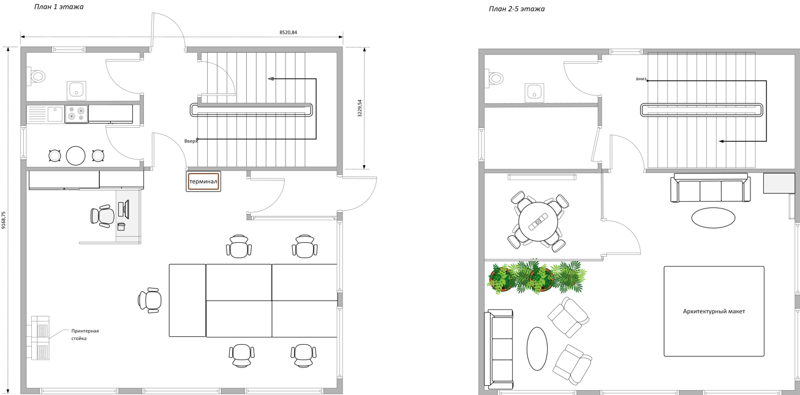
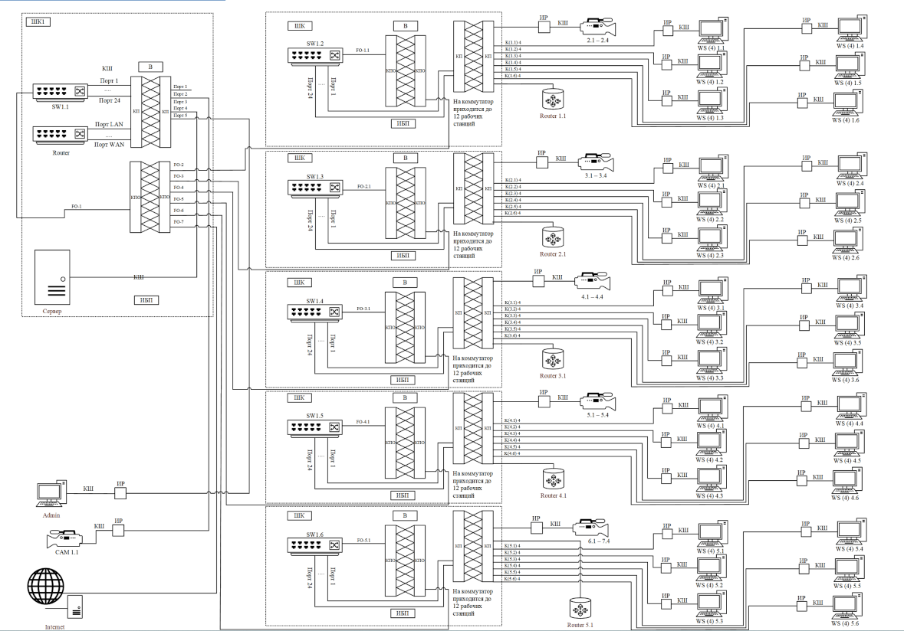
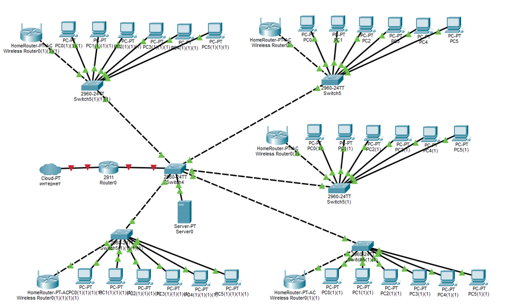

[//]: # (ОГЛАВЛЕНИЕ )

[//]: ### ( ВВЕДЕНИЕ) {

Технологии вычислительных сетей получили широкое распространение в области корпоративных информационных систем
распределенных предприятий, что позволило решать большое количество прикладных задач управления и организации
производства, а также повысить требования к оперативности и актуальности информации.

С помощью современных технических средств возможно разработать индивидуальное решение по проектированию локальной
вычислительной сети, соответствующее особенностям конкретного офисного помещения. При этом учитываются организационная
структура предприятия и расположение рабочих мест, что позволяет повысить эффективность обмена данными и
производительность труда сотрудников.

Целями создания локальной вычислительной сети являются:

- построение локальной вычислительной сети для взаимосвязи компьютеров, периферийных устройств (принтеры и т.п.) и
  оборудования, предназначенного для передачи и обработки информации;

- обеспечение возможности оперативного удовлетворения изменяющихся информационных потребностей учреждения без
  значительных затрат на модернизацию кабельной системы;

- обеспечение адаптации сети к изменениям организационной структуры, количеству пользователей и их размещению, а также к
  изменениям состава оборудования без проведения дополнительных монтажных работ.

В данном курсовом проекте рассматривается процесс проектирования локальной вычислительной сети предприятия с
обоснованием принятых технических решений на основе оборудования компании _Edimax Technology_ и компонентов
структурированной кабельной системы _LANMASTER_ с учетом требований действующих стандартов.
Для достижения поставленной цели в работе решаются следующие задачи:

- анализ исходных данных и формулирование технических требований к создаваемой сети;
- обоснование выбора архитектуры и принципов построения ЛВС;
- выбор технических помещений для размещения активного и пассивного оборудования;
- анализ модельного ряда оборудования Dell и Siemon и подбор конкретных моделей, удовлетворяющих требованиям
  производительности и надежности;
- разработка структурной схемы комплекса технических средств, включая серверное оборудование;
- выполнение моделирования зоны покрытия беспроводной сети Wi-Fi с использованием программного средства Ekahau;
- расчет и проектирование структурированной кабельной системы (горизонтальной, вертикальной и магистральной подсистем)
  на базе компонентов Siemon;
- определение состава программного обеспечения для функционирования сети и ее защиты;
- разработка мероприятий по обеспечению отказоустойчивости и безопасности;
- проектирование логической структуры сети, включая сегментацию на виртуальные сети (VLAN) и план IP-адресации;
- оформление кабельного журнала, спецификаций оборудования, поэтажных планов прокладки кабелей и схем монтажа.

}

[//]: ### (1. Техническое задание на разработку вычислительной сети) {

В рамках курсового проекта по дисциплине «Компьютерные сети и сетевая безопасность» необходимо выполнить проектирование
локальной вычислительной сети (ЛВС) для пятиэтажного офисного здания с организацией структурированной кабельной
системы (СКС), логической и физической структуры сети, а также подбором комплекса технических средств.

Проектируемая сеть должна обеспечивать надежное функционирование информационной инфраструктуры предприятия, включая
автоматизированные рабочие места сотрудников, серверные службы, систему видеонаблюдения и сетевое оборудование.

Основной целью работы является разработка архитектуры ЛВС, обеспечивающей:

- централизованное управление сетевыми ресурсами;
- стабильную и отказоустойчивую передачу данных;
- масштабируемость при увеличении количества подключаемых устройств;
- соответствие современным стандартам построения СКС (ISO/IEC 11801, TIA/EIA-568).

Для достижения поставленной цели необходимо решить следующие задачи:

- проанализировать исходные данные и требования к проектируемой сети;
- разработать структуру локальной вычислительной сети для пятиэтажного офисного здания;
- выполнить выбор архитектуры сети и методов ее построения;
- спроектировать структурированную кабельную систему с разделением на горизонтальную, вертикальную и магистральную
  подсистемы;
- определить состав и расположение активного и пассивного сетевого оборудования;
- выполнить выбор серверного оборудования и сетевых сервисов;
- подобрать коммутаторы, кабельную систему _LANMASTER_ и сетевые устройства _Edimax Technology_;
- разработать логическую структуру сети с учетом сегментации и возможного использования VLAN;
- выполнить расчет количества оборудования и портовой емкости;
- разработать систему видеонаблюдения и дополнительные сетевые сервисы;
- обеспечить требования по надежности, отказоустойчивости и информационной безопасности;
- подготовить схемы размещения оборудования и кабельных соединений.

В результате выполнения курсового проекта должна быть разработана полная проектная документация, включающая структурные
и функциональные схемы сети, спецификации оборудования, а также обоснование принятых технических решений для построения
ЛВС офисного здания.

}

[//]: ### (2. Постановка задачи и технические требования к проектируемой ЛВС){

Проектируемая локальная вычислительная сеть (ЛВС) предназначена для обеспечения информационного взаимодействия
пользователей, серверного оборудования и сетевых устройств в пределах пятиэтажного офисного здания. ЛВС строится на
основе структурированной кабельной системы _LANMASTER_ и активного сетевого оборудования _Edimax Technology_, с
возможностью дальнейшего расширения без существенной модернизации существующей инфраструктуры.

ЛВС должна обеспечивать объединение всех автоматизированных рабочих мест в единую информационную систему, предоставлять
централизованный доступ к файловым ресурсам, а также поддерживать работу сетевых сервисов, включая файловый сервер,
контроллер домена, DHCP и DNS. Дополнительно сеть должна обеспечивать функционирование системы IP-видеонаблюдения и
других сетевых сервисов предприятия.

Скорость передачи данных в пределах локальной сети на уровне рабочих мест должна быть не ниже 1 Гбит/с. Магистральные
соединения между этажами должны обеспечивать пропускную способность не менее 1 Гбит/с с возможностью последующего
увеличения до 10 Гбит/с. Сеть должна гарантировать стабильную работу при одновременном подключении не менее 50 рабочих
станций с возможностью расширения до 70 и более узлов без изменения базовой архитектуры.

Структура ЛВС должна быть построена по иерархическому принципу и включать уровень доступа (этажные коммутаторы), уровень
распределения (межэтажные соединения) и уровень ядра сети (центральный коммутатор и серверное оборудование). Каждый этаж
должен быть оборудован отдельным коммутационным узлом на базе телекоммуникационного шкафа _LANMASTER_ стандарта 19".

Структурированная кабельная система должна обеспечивать использование витой пары категории Cat.5e/Cat.6 для
горизонтальных линий и оптических линий связи для вертикальной магистрали между этажами. Длина горизонтального сегмента
не должна превышать 100 метров. При монтаже должны использоваться компоненты _LANMASTER_, включая патч-панели, розетки и
патч-корды.

Активное сетевое оборудование должно поддерживать Gigabit Ethernet (IEEE 802.3ab), обеспечивать наличие управляемых
коммутаторов уровня L2/L3, поддержку VLAN для сегментации сети, а также поддержку технологии PoE для питания IP-камер.
Коммутаторы должны иметь SFP-порты для организации оптических магистралей и быть совместимыми с кабельной системой
_LANMASTER_.

Серверная часть ЛВС должна обеспечивать круглосуточный режим работы (24/7) и включать один стоечный сервер форм-фактора
Rack Server (Xeon/EPYC), размещённый в 19" телекоммуникационном шкафу. Сервер должен выполнять функции файлового
сервера, контроллера домена, DHCP/DNS-сервисов и резервного копирования данных, а также быть интегрированным с сетевым
оборудованием _Edimax Technology_.

Система IP-видеонаблюдения должна строиться на основе IP-камер с поддержкой PoE, обеспечивающих передачу видеопотока по
сети Ethernet. Камеры должны быть установлены в ключевых зонах здания (входы, коридоры, серверная) и обеспечивать
круглосуточный мониторинг.

ЛВС должна обеспечивать высокий уровень надежности и информационной безопасности, включая сегментацию сети с
использованием VLAN, защиту от несанкционированного доступа, резервирование критически важных узлов и использование
источника бесперебойного питания для серверного оборудования.

Проектируемая сеть должна обладать высокой масштабируемостью, позволяющей увеличивать количество рабочих мест до 70 и
более, добавлять новые сетевые сегменты и расширять серверные и сервисные функции без полной реконструкции
инфраструктуры.

}

[//]: ###  (3. Анализ технических требований, выбор архитектуры и обоснование принципов построения ЛВС){

### 3.1. Выбор технологии сети

Для построения локальной вычислительной сети проектируемого офисного здания выбрана технология проводной пакетной
передачи данных Ethernet, основанная на стандарте IEEE 802.3. Данная технология является наиболее распространённой для
корпоративных сетей благодаря высокой надёжности, масштабируемости, предсказуемым задержкам передачи данных и широкой
совместимости оборудования различных производителей.

В качестве среды передачи данных применяется структурированная кабельная система _LANMASTER_, включающая медные линии
связи на основе витой пары категории не ниже Cat.6 для горизонтальной подсистемы и волоконно-оптические линии связи для
вертикальной магистрали между этажами. Использование витой пары Cat.6 обеспечивает стабильную работу на скорости 1
Гбит/с и выше на уровне рабочих мест, а оптоволоконные линии обеспечивают высокоскоростную передачу данных между этажами
с минимальными потерями сигнала и высокой помехозащищённостью.

Сеть строится на основе коммутируемой технологии (Switched Ethernet), при которой каждое устройство подключается к
отдельному порту коммутатора, что исключает коллизии и повышает общую производительность сети. В качестве активного
оборудования используются управляемые коммутаторы _Edimax Technology_, обеспечивающие поддержку VLAN, QoS и функций
управления трафиком.

Для беспроводного доступа применяется технология Wi-Fi 6 (IEEE 802.11ax), обеспечивающая высокую пропускную способность,
устойчивую работу при высокой плотности подключений и улучшенную энергоэффективность клиентских устройств. Точки доступа
интегрируются в проводную инфраструктуру и получают питание по технологии PoE, что позволяет упростить монтаж и
эксплуатацию оборудования.

Дополнительно в сети реализуется технология VLAN (IEEE 802.1Q), позволяющая логически разделять пользователей на
группы (например, сотрудники, администрация, гости), что повышает уровень информационной безопасности, снижает
широковещательный трафик и улучшает управляемость сети.

Таким образом, для проектируемого объекта выбрана гибридная проводная и беспроводная технология Ethernet-сети с
централизованным управлением и поддержкой современных сетевых стандартов.

### 3.2. Архитектура сети

Архитектура проектируемой локальной вычислительной сети построена по иерархическому принципу с использованием модели
«трёх уровней»: уровень доступа, уровень распределения и уровень ядра сети. Данная архитектура является наиболее
эффективной для зданий средней этажности и позволяет обеспечить гибкость, отказоустойчивость и масштабируемость сети.

__Уровень доступа__ представлен этажными коммутаторами _Edimax Technology_, к которым подключаются конечные устройства:
персональные компьютеры, IP-камеры видеонаблюдения, принтеры и точки доступа Wi-Fi 6. На данном уровне осуществляется
первичная коммутация трафика и подключение пользовательского оборудования через горизонтальную кабельную систему
_LANMASTER_.

__Уровень распределения__ реализуется посредством вертикальной магистрали между этажами. Для соединения этажных
коммутаторов используется волоконно-оптическая линия связи, обеспечивающая высокую пропускную способность, минимальные
потери сигнала и устойчивость к электромагнитным помехам. Данный уровень выполняет функцию агрегации трафика и передачи
его на уровень ядра сети.

__Уровень ядра сети__ располагается в серверной комнате, размещённой на первом этаже здания. На данном уровне находится
центральный управляемый коммутатор, серверное оборудование и средства сетевого администрирования. Ядро сети обеспечивает
взаимодействие между VLAN, доступ к серверным ресурсам и централизованное управление сетевой инфраструктурой.

Топология сети реализуется по принципу иерархической звезды, при которой каждый этаж подключается к центральному узлу
через отдельный канал связи. Такая структура обеспечивает:

- высокую отказоустойчивость (выход из строя одного сегмента не влияет на остальные);
- простоту масштабирования сети;
- удобство администрирования и диагностики;
- оптимальное распределение нагрузки.

Кроме того, архитектура предусматривает возможность дальнейшего расширения сети за счёт добавления новых узлов без
изменения базовой структуры.
}
[//]: ###  (4. Выбор технических помещений и условий размещения оборудования){

### 4.1. Характеристика объекта проектирования

Объектом внедрения является пятиэтажное офисное здание административного назначения. Каждый этаж имеет размеры 9,1 × 8,5
м, что составляет площадь одного этажа 78 м². Общая площадь здания с учётом всех этажей составляет 386 м². Высота
потолков помещений составляет 3 м, что соответствует стандартным требованиям для офисных зданий и обеспечивает удобство
размещения кабельных трасс и телекоммуникационного оборудования. Схема помещений представлена на рисунке 1.

Функциональное назначение этажей распределено следующим образом:

- __1 этаж:__ рабочая зона сотрудников, кабинет руководителя, кухня, санитарный узел, зона размещения оргтехники (
  принтерная стойка);
- __2 этаж:__ серверная комната (центральный узел сети), переговорные помещения, рабочие места сотрудников;
- __3–5 этажи:__ открытые рабочие пространства, переговорные комнаты (включая закрытые), зоны отдыха и демонстрационные
  зоны.

В здании предусмотрена централизованная серверная, расположенная на втором этаже, в которой размещается основное сетевое
оборудование, сервер, центральный коммутатор и коммутационные узлы. На каждом этаже размещается 6 автоматизированных
рабочих мест (АРМ), что обеспечивает общее количество 30 рабочих станций с возможностью расширения до 40 узлов без
изменения архитектуры сети.

Для построения сетевой инфраструктуры предусмотрены следующие элементы:

- центральный узел сети в серверной;
- этажные телекоммуникационные шкафы _LANMASTER_;
- управляемые коммутаторы _Edimax Technology_;
- волоконно-оптическая магистраль между этажами;
- горизонтальная разводка на основе кабеля Cat.6;
- точки доступа Wi-Fi 6 для беспроводного подключения;
- IP-камеры видеонаблюдения с поддержкой PoE.

Таким образом, объект проектирования представляет собой компактное, но функционально насыщенное офисное здание,
требующее надежной, масштабируемой и отказоустойчивой сетевой инфраструктуры, обеспечивающей работу всех информационных
сервисов предприятия в круглосуточном режиме.

}

[//]: ### (5. Анализ модельного ряда, характеристик и возможностей спектра производимого оборудования){

### 4.1 Выбор технических помещений и условия размещения оборудования

Для обеспечения надёжного и бесперебойного функционирования локальной вычислительной сети в проектируемом пятиэтажном
офисном здании необходимо предусмотреть специальные технические помещения, соответствующие требованиям действующих
стандартов (ГОСТ Р 53246–2008, TIA/EIA-569) и санитарно-гигиеническим нормам.

В проектируемой сети предусматриваются следующие типы технических помещений:

- Центральная серверная (главный кросс) — помещение, предназначенное для размещения основного активного оборудования
  сети: маршрутизатора, коммутатора уровня ядра, серверного оборудования, межсетевого экрана, источников бесперебойного
  питания, а также оборудования системы хранения и коммутации.
- Этажные кроссовые (телекоммуникационные шкафы) — запираемые телекоммуникационные шкафы, размещаемые на каждом этаже
  здания и предназначенные для установки коммутаторов уровня доступа, патч-панелей и другого оборудования подключения
  автоматизированных рабочих мест сотрудников.

Объектом внедрения является пятиэтажное офисное здание размерами 9,1 × 8,5 м. Площадь одного этажа составляет 78 м²,
общая площадь объекта — 386 м². На каждом этаже размещается 10 автоматизированных рабочих мест сотрудников, оснащённых
персональными компьютерами. Общее количество подключаемых узлов сети составляет 50 единиц с перспективой дальнейшего
расширения до 70 узлов.

С учётом масштабов проектируемой сети центральная серверная размещается на первом этаже здания, вблизи точки ввода
внешних телекоммуникаций и магистральных кабельных линий. Рекомендуемая площадь серверной составляет не менее 8–10 м²,
что обеспечивает возможность установки серверной стойки стандарта 19″, источников бесперебойного питания,
коммутационного оборудования и системы кондиционирования воздуха.

На каждом из пяти этажей предусматривается установка телекоммуникационного шкафа для размещения оборудования уровня
доступа и организации подключения рабочих мест. Такое решение обеспечивает удобство обслуживания сети, сокращение длины
горизонтальных кабельных линий и возможность дальнейшего масштабирования локальной вычислительной сети.

### 5.2. Коммутаторы

Применение коммутаторов является предпочтительным в ситуациях, когда необходимо увеличить производительность сети или
установить выделенный канал высокой скорости к серверу.

Использование коммутатора повышает производительность и сокращает время отклика сети путём уменьшения количества
пользователей на одном сетевом сегменте. Это достигается за счёт выделения отдельных каналов для каждого устройства,
подключённого к порту коммутатора, включая серверы и рабочие станции. Коммутаторы предпочтительны, так как они не
разделяют скорость передачи данных между пользователями, а обеспечивают каждому устройству полную пропускную способность
порта.

В соответствии с поставленными задачами по созданию локальной вычислительной сети пятиэтажного офисного здания, а также
с учётом выбранного оборудования компании Edimax Technology, было принято решение включить управляемые коммутаторы
данного производителя в реализацию проекта.

В проекте предусмотрено два уровня коммутации:

- __уровень доступа__ — этажные коммутаторы, обслуживающие рабочие места на каждом из пяти этажей;
- __уровень ядра (агрегации)__ — центральный коммутатор в главном распределительном узле, агрегирующий трафик со всех
  этажей и обеспечивающий выход к маршрутизатору.

### 5.2.1. Выбор коммутатора уровня доступа

Сравнительная таблица коммутаторов уровня доступа (Edimax Technology)

Коммутаторы фирмы Edimax Technology подразделяются на серии по их назначению. Каждая серия имеет свои особенности и
характеристики. Основные серии управляемых коммутаторов, рассматриваемых для уровня доступа:

- GS-5208PLG V2;
- GS-5216PLC;
- GS-5416PLC;
- GS-5424PLC;
- GS-5424PLC V2.

Более подробная информация о сериях и их основных особенностях представлена в таблице 1.

| Параметр                                 | GS-5208PLG V2     | GS-5216PLC         | GS-5416PLC         | GS-5424PLC         | GS-5424PLC V2      |
|------------------------------------------|-------------------|--------------------|--------------------|--------------------|--------------------|
| __Порты и интерфейсы__                   |                   |                    |                    |                    |                    |
| Портов RJ45 10/100/1000Base-T            | 8                 | 16                 | 16                 | 24                 | 24                 |
| Портов SFP Gigabit                       | 2 (выделенные)    | 2 (комбо RJ45/SFP) | 4 (комбо RJ45/SFP) | 4 (комбо RJ45/SFP) | 4 (комбо RJ45/SFP) |
| Всего портов                             | 10                | 18                 | 20                 | 28                 | 28                 |
| __PoE__                                  |                   |                    |                    |                    |                    |
| Стандарт PoE                             | IEEE 802.3af/at   | IEEE 802.3af/at    | IEEE 802.3af/at    | IEEE 802.3af/at    | IEEE 802.3af/at    |
| Портов с поддержкой PoE+                 | 8                 | 16                 | 16                 | 24                 | 24                 |
| Макс. мощность на порт                   | 30 Вт             | 30 Вт              | 30 Вт              | 30 Вт              | 30 Вт              |
| Общий бюджет мощности PoE                | 85 Вт             | 280 Вт             | 330 Вт             | 400 Вт             | 400 Вт             |
| Long Range PoE (до 200 м)                | Да                | Да                 | Да                 | Да                 | Да                 |
| Защита от обратной подачи питания        | Да                | Да                 | Да                 | Да                 | Да                 |
| PoE watchdog (PD Alive Check)            | Нет               | Да                 | Да                 | Да                 | Да                 |
| __Производительность__                   |                   |                    |                    |                    |                    |
| Коммутационная ёмкость                   | 20 Гбит/с         | 36 Гбит/с          | 40 Гбит/с          | 56 Гбит/с          | 56 Гбит/с          |
| Скорость передачи пакетов                | 14,88 Мпакет/с    | 26,7 Мпакет/с      | 29,76 Мпакет/с     | 41,67 Мпакет/с     | 41,6 Мпакет/с      |
| Таблица MAC-адресов                      | 4 000             | 8 000              | 8 000              | 8 000              | 8 000              |
| Метод коммутации                         | Store and Forward | Store and Forward  | Store and Forward  | Store and Forward  | Store and Forward  |
| Поддержка Jumbo Frame                    | 9 КБ              | 9 КБ               | 9 КБ               | 9 КБ               | 9 КБ               |
| Буферная память                          | 1,5 МБ            | 1,5 МБ             | 1,5 МБ             | 3 МБ               | 4,1 МБ             |
| __VLAN и сегментация__                   |                   |                    |                    |                    |                    |
| VLAN (IEEE 802.1Q)                       | Да                | Да                 | Да                 | Да                 | Да                 |
| Voice VLAN                               | Нет               | Да                 | Да                 | Да                 | Да                 |
| IP Surveillance VLAN                     | Нет               | Да                 | Нет                | Да                 | Да                 |
| __QoS__                                  |                   |                    |                    |                    |                    |
| QoS (IEEE 802.1p)                        | Да                | Да                 | Да                 | Да                 | Да                 |
| QoS DSCP                                 | Нет               | Да                 | Да                 | Да                 | Да                 |
| Количество очередей QoS                  | 2                 | 4                  | 4                  | 4                  | 4                  |
| CoS (Class of Service)                   | Нет               | Да                 | Да                 | Да                 | Да                 |
| __Безопасность__                         |                   |                    |                    |                    |                    |
| DHCP Snooping                            | Нет               | Да                 | Да                 | Да                 | Да                 |
| Список контроля доступа (ACL)            | Да                | Да                 | Да                 | Да                 | Да                 |
| Broadcast Storm Control                  | Да                | Да                 | Да                 | Да                 | Да                 |
| __Надёжность и управление__              |                   |                    |                    |                    |                    |
| STP / RSTP (IEEE 802.1w)                 | Да                | Да                 | Да                 | Да                 | Да                 |
| IGMP Snooping                            | v1/v2/v3          | v1/v2/v3           | v1/v2/v3           | v1/v2/v3           | v1/v2/v3           |
| Port Trunking / LACP (IEEE 802.3ad)      | Да                | Да                 | Да                 | Да                 | Да                 |
| Port Mirroring                           | Да                | Да                 | Да                 | Да                 | Да                 |
| Rate Limiting                            | Да                | Да                 | Да                 | Да                 | Да                 |
| Loop Detection / Prevention              | Да                | Да                 | Да                 | Да                 | Да                 |
| Резервный образ прошивки (Dual Firmware) | Нет               | Да                 | Да                 | Да                 | Да                 |
| Поддержка IPv4/IPv6                      | Да                | Да                 | Да                 | Да                 | Да                 |
| SNMP                                     | Нет               | v1/v2c/v3          | v1/v2c/v3          | v1/v2c/v3          | v1/v2c/v3          |
| Управление через Web-интерфейс           | Да                | Да                 | Да                 | Да                 | Да                 |
| Поддержка ONVIF Profile Q                | Нет               | Да                 | Нет                | Нет                | Да                 |
| __Физические характеристики__            |                   |                    |                    |                    |                    |
| Форм-фактор                              | 1U, 19"           | 1U, 19"            | 1U, 19"            | 1U, 19"            | 1U, 19"            |
| Корпус                                   | Металл            | Металл             | Металл             | Металл             | Металл             |
| Охлаждение                               | Без вентилятора   | Без вентилятора    | Вентилятор         | Вентилятор         | Сменный вентилятор |
| Рабочая температура                      | 0…+50 °C          | 0…+50 °C           | 0…+50 °C           | 0…+50 °C           | 0…+50 °C           |
| Питание                                  | AC 100–240 В      | AC 100–240 В       | AC 100–240 В       | AC 100–240 В       | AC 100–240 В       |

Для реализации сети целесообразно использовать 24-портовый коммутатор с поддержкой PoE+ и возможностью коммутации по
медной витой паре (RJ-45), а также с наличием SFP-портов для организации магистральных соединений между этажами.

__Выбранный коммутатор уровня доступа: Edimax GS-5424PLC.__ Артикул: GS-5424PLC.

Подробные характеристики выбранной модели коммутатора уровня доступа приведены в таблице 2.

| Параметр                                            | Значение                                                                               |
|-----------------------------------------------------|----------------------------------------------------------------------------------------|
| Количество портов 10/100/1000Base-T (RJ-45)         | 24                                                                                     |
| Количество комбо-портов RJ45/SFP (Gigabit Ethernet) | 4                                                                                      |
| Поддержка PoE (стандарт)                            | IEEE 802.3af / IEEE 802.3at (PoE+)                                                     |
| Максимальная мощность на порт PoE                   | 30 Вт                                                                                  |
| Общий бюджет мощности PoE                           | 400 Вт                                                                                 |
| Общая коммутационная ёмкость                        | 56 Гбит/с                                                                              |
| Скорость передачи пакетов                           | 41,67 Мпакет/с                                                                         |
| Метод коммутации                                    | Store and Forward                                                                      |
| Таблица MAC-адресов                                 | 8 000 записей                                                                          |
| Буферная память                                     | 3 МБ                                                                                   |
| Поддержка Jumbo Frame                               | до 9 КБ                                                                                |
| Форм-фактор                                         | 1U, 19"                                                                                |
| Поддержка VLAN (IEEE 802.1Q)                        | Да                                                                                     |
| Voice VLAN                                          | Да                                                                                     |
| IP Surveillance VLAN                                | Да                                                                                     |
| Качество обслуживания (QoS)                         | IEEE 802.1p, DSCP, 4 очереди                                                           |
| CoS (Class of Service)                              | Да                                                                                     |
| Агрегирование каналов (LACP)                        | IEEE 802.3ad                                                                           |
| Spanning Tree Protocol                              | STP, RSTP (IEEE 802.1w)                                                                |
| IGMP Snooping                                       | v1 / v2 / v3                                                                           |
| DHCP Snooping                                       | Да                                                                                     |
| ACL (Access Control List)                           | Да                                                                                     |
| Broadcast Storm Control                             | Да                                                                                     |
| PoE watchdog (авт. перезагрузка PoE-устройств)      | Да                                                                                     |
| Long Range PoE                                      | До 200 м при 10 Мбит/с                                                                 |
| Защита от обратной подачи питания PoE               | Да                                                                                     |
| Loop Detection / Prevention                         | Да                                                                                     |
| Port Mirroring                                      | Да                                                                                     |
| Rate Limiting                                       | Да                                                                                     |
| Резервный образ прошивки (Dual Firmware)            | Да                                                                                     |
| Управление                                          | Web-интерфейс, SNMP v1/v2c/v3                                                          |
| Поддержка IPv4/IPv6                                 | Да                                                                                     |
| Корпус                                              | Металл                                                                                 |
| Охлаждение                                          | Активное (вентилятор со сменным лотком)                                                |
| Рабочая температура                                 | 0…+50 °C                                                                               |
| Питание                                             | AC 100–240 В, 50/60 Гц                                                                 |
| Соответствие стандартам                             | IEEE 802.3, 802.3u, 802.3ab, 802.3z, 802.1Q, 802.1p, 802.3af, 802.3at, 802.3ad, 802.1w |

### 5.2.2. Выбор коммутатора уровня ядра (агрегации)

Коммутатор уровня ядра выполняет функцию агрегации трафика со всех пяти этажных коммутаторов и обеспечивает подключение
к маршрутизатору и серверному сегменту. В отличие от коммутаторов уровня доступа, к нему предъявляются повышенные
требования по производительности и пропускной способности аплинков: при подключении пяти этажных коммутаторов через
Gigabit-порты суммарный трафик способен создать узкое место на аплинке, что недопустимо для корпоративной сети.

В связи с этим для уровня ядра рассматриваются модели с портами 10 Gigabit Ethernet (SFP+), обеспечивающими достаточный
запас пропускной способности для агрегации трафика.

Для уровня ядра рассматриваются три модели Edimax Technology с поддержкой аплинков 10GbE:

- GS-5424LX;
- GS-5424PLX;
- GS-5654LX.

Более подробная информация о сериях и их основных особенностях представлена в таблице 3.

| Параметр                                      | GS-5424LX          | GS-5424PLX         | GS-5654LX          |
|-----------------------------------------------|--------------------|--------------------|--------------------|
| __Порты и интерфейсы__                        |                    |                    |                    |
| Портов RJ45 10/100/1000Base-T                 | 24                 | 24                 | 48                 |
| Портов SFP+ 10GbE (аплинк)                    | 4                  | 4                  | 6                  |
| Всего портов                                  | 28                 | 28                 | 54                 |
| Поддержка PoE+ на портах RJ45                 | Нет                | Да (IEEE 802.3at)  | Нет                |
| Бюджет PoE                                    | —                  | 400 Вт             | —                  |
| __Производительность__                        |                    |                    |                    |
| Коммутационная ёмкость                        | 128 Гбит/с         | 128 Гбит/с         | 176 Гбит/с         |
| Скорость передачи пакетов                     | 95,2 Мпакет/с      | 95,2 Мпакет/с      | 130,9 Мпакет/с     |
| Таблица MAC-адресов                           | 16 000             | 16 000             | 16 000             |
| Метод коммутации                              | Store and Forward  | Store and Forward  | Store and Forward  |
| Поддержка Jumbo Frame                         | 12 КБ              | 12 КБ              | 12 КБ              |
| __VLAN и сегментация__                        |                    |                    |                    |
| VLAN (IEEE 802.1Q)                            | Да                 | Да                 | Да                 |
| Voice VLAN                                    | Да                 | Да                 | Да                 |
| IP Surveillance VLAN                          | Нет                | Да                 | Нет                |
| __QoS__                                       |                    |                    |                    |
| QoS (IEEE 802.1p / DSCP)                      | Да                 | Да                 | Да                 |
| CoS (Class of Service)                        | Да                 | Да                 | Да                 |
| __Безопасность__                              |                    |                    |                    |
| ACL (Access Control List)                     | Да                 | Да                 | Да                 |
| DHCP Snooping                                 | Да                 | Да                 | Да                 |
| Broadcast Storm Control                       | Да                 | Да                 | Да                 |
| __Надёжность и управление__                   |                    |                    |                    |
| STP / RSTP (IEEE 802.1w)                      | Да                 | Да                 | Да                 |
| IGMP Snooping                                 | v1/v2/v3           | v1/v2/v3           | v1/v2/v3           |
| Port Trunking / LACP (IEEE 802.3ad)           | Да                 | Да                 | Да                 |
| Port Mirroring                                | Да                 | Да                 | Да                 |
| Loop Detection / Prevention                   | Да                 | Да                 | Да                 |
| Резервный образ прошивки (Dual Firmware)      | Да                 | Да                 | Да                 |
| Поддержка IPv4/IPv6                           | Да                 | Да                 | Да                 |
| SNMP                                          | v1/v2c/v3          | v1/v2c/v3          | v1/v2c/v3          |
| Управление через Web-интерфейс                | Да                 | Да                 | Да                 |
| Защита от перегрузок (6 кВ, Surge Protection) | Да                 | Да                 | Да                 |
| Интеллектуальный термоконтроллер вентиляторов | Да                 | Да                 | Да                 |
| __Физические характеристики__                 |                    |                    |                    |
| Форм-фактор                                   | 1U, 19"            | 1U, 19"            | 1U, 19"            |
| Корпус                                        | Металл             | Металл             | Металл             |
| Охлаждение                                    | Сменный вентилятор | Сменный вентилятор | Сменный вентилятор |
| Рабочая температура                           | 0…+50 °C           | 0…+50 °C           | 0…+50 °C           |
| Питание                                       | AC 100–240 В       | AC 100–240 В       | AC 100–240 В       |

Модель __GS-5654LX__ избыточна для объекта с пятью этажами: 48 портов RJ45 и 6 аплинков SFP+ значительно превышают
реальные потребности сети. Модель __GS-5424PLX__ оснащена поддержкой PoE+ на всех 24 портах RJ45, что увеличивает
стоимость и потребляемую мощность устройства, тогда как функция PoE на уровне ядра не требуется — все конечные
устройства получают питание через этажные коммутаторы.

__Выбранный коммутатор уровня ядра: Edimax GS-5424LX.__ Артикул: GS-5424LX.

Модель GS-5424LX оптимально соответствует задачам уровня агрегации: обеспечивает подключение пяти этажных коммутаторов
через Gigabit SFP-порты, подключение маршрутизатора через SFP+ 10GbE и обладает коммутационной ёмкостью 128 Гбит/с, в
2,3 раза превышающей ёмкость этажных коммутаторов, что полностью исключает образование узких мест при агрегации трафика.

Подробные характеристики выбранной модели коммутатора уровня ядра приведены в таблице 4.

| Параметр                                    | Значение                                                                      |
|---------------------------------------------|-------------------------------------------------------------------------------|
| Количество портов 10/100/1000Base-T (RJ-45) | 24                                                                            |
| Количество портов SFP+ 10GbE (аплинк)       | 4                                                                             |
| Всего портов                                | 28                                                                            |
| Поддержка PoE                               | Нет                                                                           |
| Общая коммутационная ёмкость                | 128 Гбит/с                                                                    |
| Скорость передачи пакетов                   | 95,2 Мпакет/с                                                                 |
| Метод коммутации                            | Store and Forward                                                             |
| Таблица MAC-адресов                         | 16 000 записей                                                                |
| Поддержка Jumbo Frame                       | до 12 КБ                                                                      |
| Форм-фактор                                 | 1U, 19"                                                                       |
| Поддержка VLAN (IEEE 802.1Q)                | Да                                                                            |
| Voice VLAN                                  | Да                                                                            |
| Качество обслуживания (QoS)                 | IEEE 802.1p, DSCP                                                             |
| CoS (Class of Service)                      | Да                                                                            |
| Агрегирование каналов (LACP)                | IEEE 802.3ad                                                                  |
| Spanning Tree Protocol                      | STP, RSTP (IEEE 802.1w)                                                       |
| IGMP Snooping                               | v1 / v2 / v3                                                                  |
| DHCP Snooping                               | Да                                                                            |
| ACL (Access Control List)                   | Да                                                                            |
| Broadcast Storm Control                     | Да                                                                            |
| Loop Detection / Prevention                 | Да                                                                            |
| Port Mirroring                              | Да                                                                            |
| Rate Limiting                               | Да                                                                            |
| Резервный образ прошивки (Dual Firmware)    | Да                                                                            |
| Управление                                  | Web-интерфейс, SNMP v1/v2c/v3                                                 |
| Поддержка IPv4/IPv6                         | Да                                                                            |
| Грозозащита (Surge Protection)              | 6 кВ                                                                          |
| Интеллектуальный термоконтроллер            | Да                                                                            |
| Корпус                                      | Металл                                                                        |
| Охлаждение                                  | Активное (сменный вентиляторный лоток)                                        |
| Рабочая температура                         | 0…+50 °C                                                                      |
| Питание                                     | AC 100–240 В, 50/60 Гц                                                        |
| Соответствие стандартам                     | IEEE 802.3, 802.3u, 802.3ab, 802.3z, 802.3ae, 802.1Q, 802.1p, 802.3ad, 802.1w |

### 5.2.3. Итоговая спецификация коммутаторов

| № | Наименование      | Назначение                            | Кол-во, шт. |
|---|-------------------|---------------------------------------|-------------|
| 1 | Edimax GS-5424PLC | Коммутатор уровня доступа (этажи 1–5) | 5           |
| 2 | Edimax GS-5424LX  | Коммутатор уровня ядра (ГРУ, этаж 1)  | 1           |
|   | __Итого__         |                                       | __6__       |

### 5.3 Маршрутизатор

Маршрутизаторы, используемые в структурированной кабельной системе на базе оборудования _LANMASTER_ и _Edimax
Technology_,
являются ключевыми компонентами компьютерной сети и обеспечивают передачу данных между устройствами внутри локальной
сети и между сетями.

Они обеспечивают взаимодействие между рабочими станциями, серверами, устройствами беспроводного доступа и другими
сетевыми узлами, а также выполняют функции маршрутизации трафика между локальной сетью и внешними сетями.

Маршрутизаторы, размещаемые в телекоммуникационных шкафах _LANMASTER_, представляют собой сетевые устройства уровня ядра
или распределения сети и обеспечивают централизованную обработку и направление сетевого трафика.

Основные функции маршрутизаторов:

- маршрутизация IP-пакетов между сетевыми сегментами;
- определение оптимальных маршрутов передачи данных;
- обеспечение взаимодействия между локальной сетью и внешними сетями;
- поддержка сетевых протоколов маршрутизации;
- обеспечение безопасности передачи данных;
- реализация сетевых сервисов (_DHCP_, _NAT_, _VPN_, _Firewall_).

Маршрутизаторы, используемые в шкафах _LANMASTER_, обычно монтируются в стандартные 19" стойки, что обеспечивает
удобство
размещения, обслуживания и охлаждения оборудования.

Оборудование компании _Edimax Technology_ в данной архитектуре используется преимущественно на уровне доступа и
распределения, а маршрутизаторы класса корпоративного сегмента применяются для организации магистральных и межсегментных
соединений.

При проектировании сети учитываются следующие требования к маршрутизаторам:

- высокая пропускная способность магистральных каналов;
- поддержка интерфейсов _Gigabit Ethernet_, _SFP_, _SFP+_;
- масштабируемость сетевой инфраструктуры;
- поддержка _VLAN_ и сегментации сети;
- интеграция с оборудованием _LANMASTER_;
- наличие средств мониторинга и управления сетью;
- поддержка резервирования каналов связи.

В проекте используется оборудование корпоративного класса, обеспечивающее необходимую производительность и возможность
дальнейшего расширения сети.

Сравнительная характеристика моделей маршрутизаторов приведена в таблице 7.

| Маршрутизатор                    | Описание / порты                                                                                                                                                          |
|----------------------------------|---------------------------------------------------------------------------------------------------------------------------------------------------------------------------|
| MIKROTIK CCR2116-12G-4S+         | 13 гигабитных портов _Ethernet_; 4 порта _SFP+_ (10 Гбит/с)                                                                                                               |
| MIKROTIK CCR2004-1G-12S+2XS      | 12 портов _SFP+_ для соединений на скорости 10 Гбит/с; 2 порта _SFP28_ для подключений на скорости 25 Гбит/с; гигабитный _Ethernet_-порт                                  |
| MIKROTIK CCR2004-16G-2S+PC       | Гигабитные порты _Ethernet_ для внутренней сети; порты _SFP+_ для нисходящего и восходящего каналов связи                                                                 |
| MIKROTIK RB5009UG+S+IN           | 7 гигабитных _Ethernet_-портов; _Ethernet_-порт 2,5 Гбит/с; порт _SFP+_ для соединений на скорости 10 Гбит/с                                                              |
| MIKROTIK CCR2216-1G-12XS-2XQ     | Гигабитный порт _Ethernet_; 12 портов _SFP28_ (25 Гбит/с); 2 порта _QSFP28_ (100 Гбит/с)                                                                                  |
| MIKROTIK RB5009UPR+S+IN          | 7 гигабитных _Ethernet_-портов; _Ethernet_-порт 2,5 Гбит/с                                                                                                                |
| MIKROTIK L009UIGS-RM             | Восемь гигабитных портов _Ethernet_; порт _SFP_ (1,25 Гбит/с) с поддержкой скорости 2,5 Гбит/с                                                                            |
| MIKROTIK RB2011IL-RM             | 5 × 10/100 Мбит/с _Fast Ethernet_ (_Auto-MDI/X_); 5 × 10/100/1000 Мбит/с _Gigabit Ethernet_ (_Auto-MDI/X_)                                                                |
| MIKROTIK RB2011UIAS-RM           | 1 разъем _SFP_ с поддержкой модулей 10/100/1000 _Mbps_ и 1,25 _Gbps_; 5 _Ethernet_ 10/100 _BASE-T_, _Auto-MDI/X_; 5 _Gigabit Ethernet_ 10/100/1000 _BASE-T_, _Auto-MDI/X_ |
| MIKROTIK RB2011UIAS-IN           | 5 × 10/100/1000 Мбит/с _Gigabit Ethernet_; 5 × 10/100 Мбит/с _Fast Ethernet_ с поддержкой _Auto-MDI/X_; 1 × _SFP_ (_Mini-GBIC_); 1 × _USB 2.0_                            |
| MIKROTIK CCR1036-8G-2S+          | 2 разъема _SFP+_, поддерживающие модули 10/100/1000 _Mbps_, 1,25 _Gbps_; 8 _Gigabit Ethernet_ 10/100/1000 _BASE-T_, _Auto-MDI/X_                                          |
| MIKROTIK CCR1036-8G-2S+EM        | 2 разъема _SFP+_, поддерживающие модули 10/100/1000 _Mbps_, 1,25 _Gbps_; 8 _Gigabit Ethernet_ 10/100/1000 _BASE-T_, _Auto-MDI/X_                                          |
| MIKROTIK CCR1072-1G-8S+          | 1 × 10/100/1000 Мбит/с _Gigabit Ethernet_ с _Auto-MDI/X_; 8 × _Ethernet SFP+ cage_; в комплекте _SFP_-модули отсутствуют; поддержка _DDM_                                 |
| MIKROTIK HEX LITE                | 5 × 10/100 Мбит/с _Fast Ethernet_ 8P8C (_RJ45_); чип коммутации _QCA9531-BL3A-R_                                                                                          |
| MIKROTIK RB3011UIAS-RM           | 10 гигабитных портов и _USB 3.0_ типа А                                                                                                                                   |
| MIKROTIK HEX                     | 5 × 10/100/1000 Мбит/с _Gigabit Ethernet_                                                                                                                                 |
| MIKROTIK CCR1016-12G             | 12 _Gigabit Ethernet_ 10/100/1000 _BASE-T_, _Auto-MDI/X_                                                                                                                  |
| MIKROTIK CCR1036-12G-4S-EM       | 4 разъема _SFP_, поддерживающие модули 10/100/1000 _Mbps_, 1,25 _Gbps_; 12 _Gigabit Ethernet_ 10/100/1000 _BASE-T_, _Auto-MDI/X_                                          |
| MIKROTIK CCR1036-12G-4S          | 4 разъема _SFP_, поддерживающие модули 10/100/1000 _Mbps_, 1,25 _Gbps_; 12 _Gigabit Ethernet_ 10/100/1000 _BASE-T_, _Auto-MDI/X_                                          |
| MIKROTIK CCR1016-12S-1S+         | 12 портов _SFP_ и 1 порт _SFP+_                                                                                                                                           |
| MIKROTIK CCR1009-7G-1C-1S+PC     | 7 × 10/100/1000 _Gigabit Ethernet_; 1 × _SFP+_ 1.25G/10G; 1 × комбинированный порт _Ethernet_ 10/100/1000 / _SFP_ 100/1.25G                                               |
| MIKROTIK CCR1009-7G-1C-1S+       | 7 × 10/100/1000 _Gigabit Ethernet_; 1 × _SFP+_ 1.25G/10G; 1 × комбинированный порт _Ethernet_ 10/100/1000 / _SFP_ 100/1.25G                                               |
| MIKROTIK CCR1009-7G-1C-PC        | 7 × 10/100/1000 _Gigabit Ethernet_; 1 × комбинированный порт _Ethernet_ 10/100/1000 / _SFP_ 100/1.25G                                                                     |
| MIKROTIK RB1100AHx4              | 13 × 10/100/1000 _Ethernet_                                                                                                                                               |
| MIKROTIK RB1100AHx4 DUDE EDITION | 13 × 10/100/1000 _Ethernet_                                                                                                                                               |
| MIKROTIK RB4011IGS+RM            | 10 гигабитных портов _Ethernet_ и порт _SFP+_                                                                                                                             |
| MIKROTIK CCR2004-16G-2S+         | 16 гигабитных портов _Ethernet_; 2 порта _SFP+_ (10 Гбит/с)                                                                                                               |

Маршрутизатор, используемый в сети: MikroTik RB1100AHx4, артикул 70239.

Подробные характеристики выбранной модели маршрутизатора представлены в таблице 8.

| Параметр                             | Значение                                                                                                                                                                                                           |
|--------------------------------------|--------------------------------------------------------------------------------------------------------------------------------------------------------------------------------------------------------------------|
| Процессор                            | AL21400, 1.4 ГГц, 4 ядра, 4 потока                                                                                                                                                                                 |
| Архитектура                          | ARM (32 бит)                                                                                                                                                                                                       |
| ОЗУ                                  | 1 ГБ RAM                                                                                                                                                                                                           |
| ПЗУ                                  | 128 МБ NAND                                                                                                                                                                                                        |
| Сетевой интерфейс                    | 13 × 10/100/1000 _Ethernet_                                                                                                                                                                                        |
| Способ питания                       | 2 × IEC 100–240 В 50/60 Гц (встроенные БП); клеммная колодка 12–57 В _DC_ (с поддержкой -48 В _Telecom DC_); _PoE Passive_ / _802.3at_ 20–57 В _DC_; функция резервирования любым входом (группа из всех 4 входов) |
| Максимальное энергопотребление       | 20 Вт                                                                                                                                                                                                              |
| Последовательный порт                | 1 × _RS232_                                                                                                                                                                                                        |
| Размеры                              | 444 × 148 × 47 мм                                                                                                                                                                                                  |
| Температура окружающей среды рабочая | -40…+70 °C (протестировано)                                                                                                                                                                                        |
| Дополнительно                        | Резервный блок питания; бипер; датчики напряжения, силы тока и температуры платы                                                                                                                                   |
| Операционная система                 | RouterOS Level 6                                                                                                                                                                                                   |
| Производитель                        | MikroTik                                                                                                                                                                                                           |
| Страна бренда                        | Латвия                                                                                                                                                                                                             |
| Гарантия                             | 12 месяцев                                                                                                                                                                                                         |

### 5.4 Сервер

Сервер является центральным элементом вычислительной инфраструктуры локальной вычислительной сети, построенной на основе
структурированной кабельной системы _LANMASTER_ и активного сетевого оборудования _Edimax Technology_. Серверное
оборудование обеспечивает обработку, хранение и распределение данных, а также предоставляет сетевые сервисы для всех
подключённых рабочих станций и сетевых устройств.

В рамках данной курсовой работы сервер используется для выполнения следующих функций:

- централизованное хранение файлов;
- резервное копирование данных;
- управление пользовательскими учетными записями и правами доступа;
- организация контроллера домена;
- предоставление сетевых сервисов DHCP и DNS;
- обеспечение файлового доступа пользователей;
- поддержка работы корпоративных приложений.

Сервер размещается в телекоммуникационном шкафу _LANMASTER_ стандарта 19", что обеспечивает его интеграцию с остальными
компонентами сети и упрощает организацию кабельной инфраструктуры. Подключение сервера осуществляется через коммутаторы
_Edimax Technology_ с использованием кабельной системы _LANMASTER_ категории Cat.5e/Cat.6.

Основными требованиями к серверному оборудованию являются:

- высокая производительность;
- поддержка круглосуточного режима работы (24/7);
- возможность масштабирования;
- наличие отказоустойчивых компонентов;
- поддержка сетевых интерфейсов Gigabit Ethernet;
- совместимость с оборудованием _LANMASTER_ и _Edimax Technology_;
- возможность установки в серверный шкаф стандарта 19".

Проектируемым объектом является пятиэтажное офисное здание общей площадью 386 м². Каждый этаж включает 10
автоматизированных рабочих мест сотрудников. Общее количество подключаемых узлов сети составляет 50, при этом
предусматривается возможность дальнейшего расширения инфраструктуры до 70 устройств.

Для организации серверной инфраструктуры могут использоваться различные типы серверов, отличающиеся форм-фактором и
назначением. Основные варианты представлены в таблице 4.

| Серия / тип  | Форм-фактор       | Назначение                                                                 |
|--------------|-------------------|----------------------------------------------------------------------------|
| Tower Server | Башенный (Tower)  | Используется в небольших офисах без серверных стоек                        |
| Rack Server  | Стоечный (Rack)   | Предназначен для установки в телекоммуникационные шкафы и серверные стойки |
| Blade Server | Модульный (Blade) | Применяется в масштабируемых корпоративных инфраструктурах                 |

Для проектируемой локальной сети наиболее целесообразным является использование стоечного сервера форм-фактора _Rack
Server_, поскольку в здании предусматривается размещение центральной серверной и телекоммуникационного шкафа стандарта
19". По сравнению с башенными серверами Rack-серверы обеспечивают более удобное размещение оборудования, эффективное
охлаждение и упрощённое обслуживание. Использование Blade-серверов для данного проекта является нецелесообразным из-за
высокой стоимости и избыточности вычислительных ресурсов для офисной сети на 50 рабочих мест.

В качестве серверной платформы рассматривались следующие модели серверов:

| Модель сервера           | Форм-фактор | Основное назначение                                       |
|--------------------------|-------------|-----------------------------------------------------------|
| Dell PowerEdge R250      | Rack 1U     | Файловый сервер и сетевые службы                          |
| Dell PowerEdge R350      | Rack 1U     | Контроллер домена, файловый сервер, резервное копирование |
| Dell PowerEdge R550      | Rack 2U     | Виртуализация и хранение данных                           |
| HPE ProLiant DL20 Gen10  | Rack 1U     | Сервер малого офиса                                       |
| Lenovo ThinkSystem SR250 | Rack 1U     | Сетевые службы и файловое хранилище                       |

Для данного проекта выбран сервер _Dell PowerEdge R350_ в стоечном исполнении Rack 1U. Выбор данной модели обусловлен её
производительностью, поддержкой круглосуточного режима работы и совместимостью с проектируемой серверной
инфраструктурой.

Сервер _Dell PowerEdge R350_ используется для выполнения следующих задач:

- файловый сервер;
- контроллер домена;
- DHCP- и DNS-сервер;
- сервер резервного копирования данных.

Выбор именно данной модели обусловлен следующими преимуществами:

- стоечное исполнение Rack 1U для установки в шкаф _LANMASTER_;
- поддержка процессоров Intel Xeon серии E-2300;
- поддержка оперативной памяти DDR4 ECC;
- возможность установки RAID-массивов;
- наличие системы удаленного администрирования iDRAC;
- поддержка интерфейсов Gigabit Ethernet;
- достаточная производительность для локальной сети на 50–70 рабочих мест;
- высокая надежность и возможность дальнейшего расширения.

По сравнению с более производительными моделями PowerEdge R550 и R750 сервер _Dell PowerEdge R350_ является более
экономически эффективным решением для офисной локальной сети и при этом полностью удовлетворяет требованиям проекта.

Основные технические характеристики сервера приведены в таблице 5.

| Параметр                 | Значение                                       |
|--------------------------|------------------------------------------------|
| Модель                   | Dell PowerEdge R350                            |
| Тип сервера              | Rack Server                                    |
| Форм-фактор              | Rack 1U                                        |
| Процессор                | Intel Xeon E-2300                              |
| Количество процессоров   | 1                                              |
| Оперативная память       | DDR4 ECC UDIMM                                 |
| Максимальный объем ОЗУ   | до 128 ГБ                                      |
| Количество слотов памяти | 4 DIMM                                         |
| Накопители               | SAS/SATA HDD/SSD                               |
| RAID-контроллер          | PERC H345 / H755                               |
| Сетевые интерфейсы       | Gigabit Ethernet                               |
| Удаленное управление     | iDRAC9                                         |
| Форм-фактор установки    | 19" Rack                                       |
| Режим работы             | круглосуточный (24/7)                          |
| Совместимость            | оборудование _LANMASTER_ и _Edimax Technology_ |

Использование сервера _Dell PowerEdge R350_ позволяет обеспечить централизованное хранение данных, управление
пользователями локальной сети и резервное копирование информации, а также повысить надежность и отказоустойчивость
вычислительной инфраструктуры предприятия.

### 5.5 Межсетевые экраны

Для защиты сетевой инфраструктуры рассматриваются межсетевые экраны
Межсетевые экраны являются важным элементом системы информационной безопасности локальной вычислительной сети. Они
предназначены для защиты сетевой инфраструктуры от несанкционированного доступа, фильтрации входящего и исходящего
трафика, а также контроля сетевых соединений между внутренней сетью организации и внешними сетями. Использование
межсетевого экрана позволяет повысить уровень безопасности корпоративной сети, предотвратить сетевые атаки и обеспечить
контроль доступа пользователей к сетевым ресурсам.

В рамках проектируемой локальной вычислительной сети офисного здания предусматривается использование аппаратного
межсетевого экрана, установленного в центральной серверной на первом этаже здания. Такое решение обеспечивает
централизованную защиту всех сегментов сети, включая рабочие станции сотрудников, серверное оборудование и сетевые
сервисы.

Основные виды межсетевых экранов представлены в таблице 6.

| Вид межсетевого экрана                   | Характеристика                                                          | Назначение                                                                           |
|------------------------------------------|-------------------------------------------------------------------------|--------------------------------------------------------------------------------------|
| Аппаратный межсетевой экран              | Отдельное сетевое устройство, устанавливаемое на границе локальной сети | Защита корпоративной сети, фильтрация трафика, контроль сетевых подключений          |
| Программный межсетевой экран             | Программное обеспечение, устанавливаемое на сервер или рабочую станцию  | Защита отдельных устройств и ограничение доступа к сетевым ресурсам                  |
| Виртуальный межсетевой экран             | Межсетевой экран, функционирующий в виртуальной среде                   | Защита виртуальных серверов и облачных сервисов                                      |
| Межсетевой экран нового поколения (NGFW) | Устройство с функциями анализа приложений и обнаружения угроз           | Глубокий анализ трафика, предотвращение атак, поддержка VPN и контроль пользователей |
| Корпоративный межсетевой экран           | Решение для сегментации и защиты сетевой инфраструктуры предприятия     | Разграничение доступа между сегментами сети и защита серверных ресурсов              |

Для проектируемой сети наиболее целесообразным является использование аппаратного межсетевого экрана класса NGFW,
поскольку он обеспечивает высокий уровень защиты, поддержку виртуальных частных сетей (VPN), централизованное управление
доступом и возможность дальнейшего масштабирования сетевой инфраструктуры предприятия.

Одним из ведущих производителей средств сетевой безопасности является компания Fortinet. Межсетевые экраны серии
FortiGate широко применяются при построении корпоративных локальных вычислительных сетей благодаря высокой
производительности, поддержке технологий VPN, встроенным средствам обнаружения угроз и возможностям централизованного
управления. Устройства данного производителя используются для защиты офисных сетей, серверной инфраструктуры и каналов
передачи данных.

Основные серии межсетевых экранов Fortinet представлены в таблице 7.

| Серия                   | Назначение                         | Особенности                                                                 |
|-------------------------|------------------------------------|-----------------------------------------------------------------------------|
| FortiGate 40F / 60F     | Малые офисы и филиалы              | Компактные устройства с базовыми функциями сетевой защиты и VPN             |
| FortiGate 80F / 100F    | Средние офисы и корпоративные сети | Повышенная производительность, поддержка большого количества пользователей  |
| FortiGate 200F / 400F   | Крупные организации                | Расширенные функции безопасности, высокая пропускная способность            |
| FortiGate 600F / 900G   | Центры обработки данных            | Высокая производительность и поддержка масштабируемых сетевых инфраструктур |
| FortiGate Rugged Series | Промышленные объекты               | Защищённое исполнение для эксплуатации в сложных условиях                   |
| FortiGate VM            | Виртуальная инфраструктура         | Виртуальный межсетевой экран для облачных и виртуализированных сред         |

Наиболее распространённые модели межсетевых экранов Fortinet представлены в таблице 8.

| Модель               | Тип устройства    | Назначение                                                                    |
|----------------------|-------------------|-------------------------------------------------------------------------------|
| FortiGate 40F        | Аппаратный NGFW   | Защита небольшой локальной сети и удалённых филиалов                          |
| FortiGate 60F        | Аппаратный NGFW   | Используется в малом офисе для фильтрации трафика и организации VPN           |
| FortiGate 80F        | Аппаратный NGFW   | Подходит для офисов среднего размера с большим количеством пользователей      |
| FortiGate 100F       | Аппаратный NGFW   | Защита корпоративной сети и серверной инфраструктуры                          |
| FortiGate 200F       | Аппаратный NGFW   | Используется в сетях с высокой нагрузкой и большим объёмом трафика            |
| FortiGate 400F       | Аппаратный NGFW   | Предназначен для крупных корпоративных сетей и дата-центров                   |
| FortiGate VM64       | Виртуальный NGFW  | Защита виртуальных серверов и облачной инфраструктуры                         |
| FortiGate Rugged 60F | Промышленный NGFW | Используется на объектах с повышенными требованиями к надёжности оборудования |

Для проектируемой локальной вычислительной сети офисного здания наиболее рациональным является использование межсетевого
экрана FortiGate 60F или FortiGate 80F. Данные модели обеспечивают необходимый уровень производительности для
обслуживания сети из 50–70 узлов, поддерживают VPN-подключения, фильтрацию трафика, защиту от сетевых атак и
централизованное администрирование сетевой безопасности предприятия.

### 5.6 Точки беспроводного доступа

Для обеспечения стабильной и качественной беспроводной связи в офисном здании необходимо использование современных точек
беспроводного доступа с поддержкой централизованного управления и интеграции с системой сетевой безопасности. В рамках
проектируемой локальной вычислительной сети точки доступа должны обеспечивать устойчивое покрытие всех этажей здания,
поддержку большого количества подключаемых устройств и совместимость с используемым межсетевым экраном.

Для построения беспроводной сети целесообразно использовать оборудование компании Fortinet серии FortiAP, поскольку
данные устройства обеспечивают тесную интеграцию с межсетевыми экранами FortiGate, централизованное управление, контроль
безопасности беспроводной сети и возможность масштабирования инфраструктуры.

Основные серии точек доступа FortiAP представлены в таблице 9.

| Серия                  | Назначение                    | Особенности                                                                 |
|------------------------|-------------------------------|-----------------------------------------------------------------------------|
| FortiAP U-Series       | Офисные помещения             | Универсальные точки доступа для корпоративных беспроводных сетей            |
| FortiAP C-Series       | Высокая плотность подключений | Поддержка большого количества пользователей и повышенная производительность |
| FortiAP Outdoor Series | Уличное размещение            | Защищённое исполнение для наружной установки                                |
| FortiAP Wall Plate     | Кабинеты и переговорные       | Компактные точки доступа для настенного монтажа                             |
| FortiAP Integrated     | Интеграция с FortiGate        | Централизованное управление через межсетевой экран                          |

Основные модели точек доступа FortiAP представлены в таблице 10.

| Модель         | Стандарт Wi-Fi | Назначение                                                                     |
|----------------|----------------|--------------------------------------------------------------------------------|
| FortiAP 231F   | Wi-Fi 6        | Универсальная точка доступа для офисных помещений                              |
| FortiAP 231G   | Wi-Fi 6        | Точка доступа с повышенной производительностью для многопользовательской среды |
| FortiAP 431F   | Wi-Fi 6        | Используется в сетях с высокой плотностью подключений                          |
| FortiAP 433F   | Wi-Fi 6        | Высокопроизводительная модель для корпоративных инфраструктур                  |
| FortiAP 223E   | Wi-Fi 5        | Решение для небольших офисов и переговорных комнат                             |
| FortiAP U421EV | Wi-Fi 6E       | Современная точка доступа с поддержкой расширенного диапазона частот           |
| FortiAP 432FR  | Wi-Fi 6        | Модель с усиленной защитой и расширенными функциями безопасности               |

Для проектируемого офисного здания наиболее рациональным является использование точек доступа FortiAP 231F или FortiAP
231G. Данные модели обеспечивают стабильное покрытие беспроводной сети на каждом этаже, поддержку современных стандартов
Wi-Fi 6, высокую скорость передачи данных и централизованное управление через межсетевой экран FortiGate. Это позволяет
повысить уровень безопасности беспроводной сети и упростить администрирование всей сетевой инфраструктуры предприятия.

### 5.7 Кабельная система

При построении структурированной кабельной системы используются кабели на основе неэкранированной витой пары. Для
корректного выбора кабеля учитываются следующие требования:

- категория кабеля;
- пропускная способность сети;
- возможность расширения сети в будущем;
- продолжительность жизненного цикла сети;
- максимальная длина кабельной линии;
- тип волоконно-оптического кабеля (при необходимости);
- условия прокладки кабеля;
- требования противопожарной безопасности;
- стоимость кабеля;
- стоимость монтажных работ, компонентов и активного оборудования.

Для организации связи между рабочими станциями и коммутационными узлами в пределах здания применяется витая пара. Такие
кабели широко используются в системах передачи данных и соответствуют международным стандартам, таким как ISO/IEC 11801
и TIA/EIA-568.

Стандарты регламентируют максимальную длину линии и предъявляют требования к параметрам кабеля, включая затухание,
перекрестные наводки (NEXT), возвратные потери, емкость и волновое сопротивление. В зависимости от требуемой скорости
передачи данных кабели делятся на категории (Cat.5e, Cat.6, Cat.6A и др.).

В данном курсовом проекте выбран кабель _LANMASTER_ UTP Cat.5e (модель LAN-5EUTP-HFLT).

Компания _LANMASTER_ выпускает широкий спектр кабельной продукции для СКС, включая медные кабели различных категорий и
типов экранирования (UTP, FTP, SFTP), соответствующие современным требованиям к качеству и безопасности [2].

Выбранный кабель относится к категории 5e и предназначен для внутренней прокладки. Он состоит из 4 пар медных
проводников диаметром 24 AWG, заключённых в изоляцию из полиэтилена (HDPE), с внешней оболочкой типа LSZH (Low Smoke
Zero Halogen), не распространяющей горение и выделяющей минимальное количество дыма и токсичных веществ [3].

Применение оболочки LSZH обеспечивает соответствие современным требованиям пожарной безопасности и позволяет
использовать кабель в административных зданиях, образовательных учреждениях и других общественных объектах.

Кабель поставляется в упаковках по 305 метров, что упрощает транспортировку и монтаж. Основные технические
характеристики кабеля приведены в таблице 2.

| Тип среды передачи:                           | UTP (неэкранированная витая пара)                  |
|-----------------------------------------------|----------------------------------------------------|
| Категория:                                    | Cat.5e                                             |
| Количество пар:                               | 4                                                  |
| Калибр проводника:                            | 24 AWG                                             |
| Тип проводника:                               | медный (solid)                                     |
| Тип изоляции:                                 | HDPE                                               |
| Тип оболочки:                                 | LSZH (низкое дымо- и газовыделение, без галогенов) |
| Внешний диаметр:                              | ≈ 4,9 мм                                           |
| Волновое сопротивление:                       | 100 ± 15 Ом                                        |
| Рабочая температура:                          | от −20°C до +60°C                                  |
| Номинальная скорость распространения сигнала: | ≈ 71%                                              |
| Длина в упаковке:                             | 305 м                                              |

### 5.8 Коммутационные розетки

Коммутационные (информационные) розетки предназначены для подключения пользовательского оборудования к структурированной
кабельной системе. Они обеспечивают интерфейс между горизонтальной подсистемой СКС и конечными устройствами (
персональными компьютерами, IP-телефонами, принтерами и другим сетевым оборудованием).

В составе информационных розеток используются модульные разъёмы типа _RJ-45_ (8P8C) с IDC-контактами (Insulation
Displacement Contact), реализующими технологию смещения изоляции. Данный способ подключения обеспечивает надежное
электрическое соединение без предварительной зачистки проводников и допускает многократные перекоммутации без ухудшения
характеристик.

Современные розеточные модули соответствуют международным стандартам ISO/IEC 11801 и TIA/EIA-568, поддерживают
приложения Ethernet до 1 Гбит/с и технологии PoE.

Коммутационные розетки различаются по следующим признакам:

- категория кабеля;
- тип экранирования;
- конструктивное исполнение;
- способ монтажа;
- количество портов.

В данном курсовом проекте используются компоненты структурированной кабельной системы _LANMASTER_, выполненные по
модульному принципу Keystone.

В качестве розеточного модуля выбран модуль _LANMASTER LAN-KM45-U5E-WH_, представляющий собой неэкранированный
Keystone-модуль категории Cat.5e с разъемом RJ-45. Модуль предназначен для подключения кабеля витой пары категории
Cat.5e и обеспечивает поддержку скоростей передачи данных до 1 Гбит/с.

Выбранный модуль обеспечивает:

- совместимость со схемами разводки T568A и T568B;
- использование IDC-контактов для быстрого монтажа;
- поддержку Gigabit Ethernet;
- возможность установки в стандартные лицевые панели и монтажные коробки;
- высокую надежность соединения.

Для установки розеточных модулей используются настенные монтажные коробки _LANMASTER LAN-SMB-1P-WH_ для накладного
монтажа на одно рабочее место. Использование монтажных коробок обеспечивает удобство размещения розеток, защиту
соединений и упрощает обслуживание кабельной инфраструктуры.

Выбранные компоненты:

- розеточный модуль _LANMASTER LAN-KM45-U5E-WH_;
- монтажная коробка _LANMASTER LAN-SMB-1P-WH_.

Основные технические характеристики розеточного модуля приведены в таблице 3.

| Параметр                       | Значение                  |
|--------------------------------|---------------------------|
| Модель                         | LANMASTER LAN-KM45-U5E-WH |
| Тип разъема                    | RJ-45 (8P8C)              |
| Категория                      | Cat.5e                    |
| Тип среды передачи             | UTP                       |
| Тип контактов                  | IDC (110)                 |
| Схема разводки                 | T568A / T568B             |
| Поддерживаемая скорость        | до 1 Гбит/с               |
| Количество циклов коммутации   | до 750                    |
| Допустимый диаметр проводников | 22–26 AWG                 |
| Рабочая температура            | от −10 °C до +60 °C       |
| Материал корпуса               | негорючий пластик         |
| Цвет                           | белый                     |
| Тип монтажа                    | Keystone                  |

Использование выбранных информационных розеток обеспечивает совместимость с кабельной системой _LANMASTER_ и активным
сетевым оборудованием _Edimax Technology_, а также позволяет организовать надежную и удобную сетевую инфраструктуру
рабочих мест.

### 5.9 Монтажный шкаф

Монтажный (телекоммуникационный) шкаф предназначен для размещения активного и пассивного сетевого оборудования, а также
организации кабельных соединений структурированной кабельной системы. В шкафах устанавливаются коммутаторы, патч-панели,
серверное оборудование, источники бесперебойного питания, блоки распределения питания и другое оборудование сети.

Современные телекоммуникационные шкафы выполняются по стандарту 19", что обеспечивает совместимость с большинством
сетевого оборудования. Монтаж оборудования осуществляется на вертикальных направляющих с юнитовой разметкой (U), что
упрощает установку, обслуживание и модернизацию сети.

Основными требованиями к монтажным шкафам являются:

- соответствие стандарту 19";
- достаточная вместимость оборудования;
- удобство монтажа и обслуживания;
- эффективная вентиляция и охлаждение;
- возможность организации кабельных соединений;
- защита оборудования;
- высокая несущая способность конструкции.

В данном курсовом проекте для размещения оборудования серверной используется напольный телекоммуникационный шкаф
_LANMASTER_ модели __LAN-DC-CBP-48Ux8x12__ высотой 48U размером 800×1200 мм. Шкаф предназначен для установки серверного
оборудования, коммутационных панелей, коммутаторов, источников бесперебойного питания и организации магистральных линий
связи. Конструкция шкафа обеспечивает размещение оборудования стандарта 19" и позволяет выполнять удобное обслуживание
установленного оборудования.

Шкаф серверной оснащается:

- передней и задней дверями;
- съемными боковыми панелями;
- регулируемыми монтажными профилями;
- кабельными вводами сверху и снизу;
- системой заземления;
- возможностью установки вентиляторных модулей и блоков распределения питания (PDU).

Перфорация дверей обеспечивает эффективное охлаждение оборудования и циркуляцию воздуха внутри шкафа, а наличие
кабельных вводов позволяет организовать аккуратную прокладку кабелей.

Для размещения оборудования на этажах используются настенные телекоммуникационные шкафы _LANMASTER_ модели _
_TWT-CBWPM-22U-6x4-GY__ высотой 22U размером 600×400 мм. В этажных шкафах размещаются коммутаторы доступа, патч-панели и
вспомогательное сетевое оборудование. Использование настенных шкафов позволяет компактно разместить оборудование при
ограниченном пространстве технических помещений.

Основные технические характеристики шкафов приведены в таблице 4.

| Параметр          | Шкаф серверной                          | Этажный шкаф                   |
|-------------------|-----------------------------------------|--------------------------------|
| Модель            | LANMASTER LAN-DC-CBP-48Ux8x12           | LANMASTER TWT-CBWPM-22U-6x4-GY |
| Серия             | DCS                                     | Pro                            |
| Тип шкафа         | телекоммуникационный, 19"               | телекоммуникационный, 19"      |
| Исполнение        | напольный                               | настенный                      |
| Высота            | 48U                                     | 22U                            |
| Ширина            | 800 мм                                  | 600 мм                         |
| Глубина           | 1200 мм                                 | 450 мм                         |
| Материал корпуса  | металл                                  | металл                         |
| Цвет              | черный                                  | серый                          |
| Тип дверей        | металлические / перфорированные         | металлическая дверь            |
| Монтажные профили | регулируемые                            | регулируемые                   |
| Степень защиты    | IP20                                    | IP20                           |
| Дополнительно     | вентиляция, кабельные вводы, заземление | кабельные вводы, вентиляция    |

### 5.10 Коммутационная патч-панели

Коммутационные патч-панели являются важным элементом структурированной кабельной системы (СКС) и используются для
организации централизованной коммутации кабельных линий в телекоммуникационных шкафах. Они обеспечивают удобное
подключение горизонтальных кабельных линий от рабочих мест к активному сетевому оборудованию, а также упрощают
обслуживание, модернизацию и диагностику сети.

В проектируемой локальной вычислительной сети офисного здания патч-панели размещаются в этажных телекоммуникационных
шкафах на каждом этаже, а также в центральной серверной на первом этаже. Это позволяет реализовать иерархическую
структуру СКС и обеспечить гибкое управление сетевыми соединениями.

В рамках проекта используются решения компании LANMASTER, которые обеспечивают высокое качество исполнения, соответствие
стандартам Cat.6/Cat.6A и надежность коммутационных соединений.

Основные типы патч-панелей представлены в таблице 12.

| Тип патч-панели          | Характеристика                                                                 | Назначение                                      |
|--------------------------|--------------------------------------------------------------------------------|-------------------------------------------------|
| Неэкранированная (UTP)   | Используется для стандартных сетей без повышенных требований к защите от помех | Применяется в офисных ЛВС с умеренной нагрузкой |
| Экранированная (FTP/STP) | Имеет дополнительную защиту от электромагнитных помех                          | Используется в серверных и магистральных линиях |
| Модульная                | Позволяет устанавливать сменные Keystone-модули                                | Обеспечивает гибкость конфигурации сети         |
| Фиксированная            | Имеет заранее установленные порты RJ-45                                        | Используется для стандартных офисных решений    |
| 24-портовая              | Наиболее распространённый вариант для этажных шкафов                           | Обеспечивает подключение до 24 рабочих точек    |
| 48-портовая              | Используется в центральной серверной                                           | Предназначена для крупных коммутационных узлов  |

Для проектируемого пятиэтажного офисного здания наиболее рациональным является использование 24-портовых патч-панелей в
этажных шкафах и 48-портовых в центральной серверной. Такое решение обеспечивает удобную организацию кабельных
соединений, упрощает администрирование сети и позволяет эффективно масштабировать инфраструктуру при увеличении
количества подключаемых устройств.
Основные выбранные модели представлены в таблице 12.

| Модель       | Категория | Порты | Форм-фактор | Назначение                                                           |
|--------------|-----------|-------|-------------|----------------------------------------------------------------------|
| LAN-PPL24U6  | Cat.6     | 24    | 1U          | Базовая этажная патч-панель для подключения рабочих мест             |
| LAN-PPL48U6  | Cat.6     | 48    | 2U          | Центральная коммутационная панель в серверной                        |
| LAN-PPC24U6  | Cat.6     | 24    | 0.5U        | Компактное решение для ограниченного пространства этажного шкафа     |
| LAN-PPC48U6  | Cat.6     | 48    | 1U          | Высокоплотная панель для серверной с большим количеством подключений |
| LAN-PPC24U6A | Cat.6A    | 24    | 0.5U        | Перспективное решение для высокоскоростных сегментов сети            |
| LAN-PPC48U6A | Cat.6A    | 48    | 1U          | Используется в магистральных участках и серверной инфраструктуре     |
| LAN-PPN24U6  | Cat.6     | 24    | 1U          | Панель с кабельным организатором для удобства обслуживания           |
| LAN-PPN24U6A | Cat.6A    | 24    | 1U          | Улучшенная защита и организация кабелей в этажных шкафах             |
| LAN-PPL24U5E | Cat.5e    | 24    | 1U          | Экономичное решение для стандартных офисных сетей                    |
| LAN-PPL48U5E | Cat.5e    | 48    | 2U          | Используется в менее нагруженных сегментах сети                      |

Обоснование выбора

В рамках данного проекта основными выбраны следующие модели:

- LAN-PPL24U6 (Cat.6, 24 порта) — для этажных телекоммуникационных шкафов;
- LAN-PPL48U6 (Cat.6, 48 портов) — для центральной серверной.

Такой выбор обусловлен следующими факторами:

- соответствие стандарту Cat.6, обеспечивающему скорость передачи данных до 1 Гбит/с на рабочих местах и до 10 Гбит/с в
  магистральных сегментах;
- обеспечение подключения 50 рабочих мест с возможностью расширения до 70 узлов без замены оборудования;
- оптимальная плотность портов (24 порта на этаж полностью покрывают текущие потребности одного этажа с резервом);
- унификация оборудования по всей структуре сети, что снижает затраты на обслуживание;
- совместимость с 19” телекоммуникационными шкафами LANMASTER;
- удобство кросс-коммутации и минимизация длины патч-кордов в шкафах;
- повышение надёжности за счёт заводской стандартизации IDC-контактов;

Использование патч-панелей LANMASTER серии PPL и PPC позволяет реализовать структурированную и масштабируемую кабельную
систему, обеспечить удобство администрирования сети и повысить общую надёжность телекоммуникационной инфраструктуры
офисного здания.
Отлично — сейчас добавлю тебе реальные, используемые в проектах модели SFP-модулей, оптических кабелей и оптических
патч-панелей LANMASTER , чтобы это выглядело как полноценный инженерный раздел курсовой.

### 5.11 Волоконно-оптическая подсистема СКС (SFP, кабели, патч-панели)

Для организации магистральных соединений между этажными телекоммуникационными шкафами и центральной серверной в
проектируемой локальной вычислительной сети применяется волоконно-оптическая подсистема. Данное решение обеспечивает
высокую пропускную способность, устойчивость к электромагнитным помехам, а также возможность масштабирования сети до
скоростей передачи данных 10 Гбит/с и выше.

В рамках проекта используется гибридная архитектура структурированной кабельной системы (СКС), при которой
горизонтальная подсистема реализуется на основе медного кабеля витой пары категории Cat.6, а вертикальная магистраль —
на основе многомодового оптического волокна стандарта OM3 (50/125 мкм).

Применение волоконно-оптической магистрали обусловлено необходимостью обеспечения надёжной связи между этажами здания, а
также повышения отказоустойчивости сети за счёт полной электрической изоляции каналов передачи данных.

### 5.11.1 SFP и SFP+ оптические модули

Для подключения оптической магистрали в активном сетевом оборудовании применяются SFP/SFP+ трансиверы, обеспечивающие
преобразование электрического сигнала в оптический и обратно.

В проекте выбраны следующие типовые  (таблица 15):

| Модель                | Тип  | Скорость  | Тип волокна         | Дальность    | Назначение                                                     |
|-----------------------|------|-----------|---------------------|--------------|----------------------------------------------------------------|
| 1G SFP LX 1310nm LC   | SFP  | 1 Гбит/с  | OS2 (single-mode)   | до 10 км     | Возможность подключения внешних узлов или резервной магистрали |
| 1G SFP SX 850nm LC    | SFP  | 1 Гбит/с  | OM2/OM3 (multimode) | до 550 м     | Базовая оптическая магистраль внутри здания                    |
| 10G SFP+ SR 850nm LC  | SFP+ | 10 Гбит/с | OM3/OM4             | до 300–400 м | Основной вариант для межэтажных соединений                     |
| 10G SFP+ LR 1310nm LC | SFP+ | 10 Гбит/с | OS2 (single-mode)   | до 10 км     | Перспективное решение для расширения и внешних соединений      |
| 10G SFP+ DAC (Twinax) | SFP+ | 10 Гбит/с | медь                | до 3 м       | Соединение оборудования внутри серверной                       |

Обоснование выбора SFP-модулей

В рамках проекта основным вариантом являются модули 10G SFP+ SR , так как:

- обеспечивают достаточную пропускную способность для офисной сети;
- совместимы с многомодовым волокном OM3;
- оптимальны для расстояний между этажами;
- обладают низкой задержкой и высокой стабильностью;
- имеют наилучшее соотношение цена/производительность.

### 5.11.2 Оптические кабели

Для организации вертикальной магистрали применяется многомодовый волоконно-оптический кабель стандарта OM3. Таблица 15 –
Оптические кабели

| Модель              | Тип         | Кол-во волокон | Стандарт      | Назначение                                     |
|---------------------|-------------|----------------|---------------|------------------------------------------------|
| LANMASTER FO-OM3-4  | Multimode   | 4 волокна      | OM3 50/125 µm | Базовая магистраль между этажами               |
| LANMASTER FO-OM3-8  | Multimode   | 8 волокон      | OM3 50/125 µm | Расширяемая магистраль с резервированием       |
| LANMASTER FO-OM3-12 | Multimode   | 12 волокон     | OM3 50/125 µm | Центральная магистраль с запасом под рост сети |
| LANMASTER FO-OS2-4  | Single-mode | 4 волокна      | OS2 9/125 µm  | Перспективное решение для межзданий соединений |
| LANMASTER FO-OS2-8  | Single-mode | 8 волокон      | OS2 9/125 µm  | Высоконагруженные магистрали и резервирование  |

Обоснование выбора кабеля

В проекте выбран кабель OM3 50/125 µm , так как он обеспечивает:

- поддержку скорости передачи до 10 Гбит/с;
- достаточную дальность для межэтажных соединений;
- совместимость с SFP+ SR модулями;
- экономичность по сравнению с одномодовым волокном;
- возможность дальнейшего апгрейда до 40G (в ограниченных сценариях).

### 5.11.3 Оптические патч-панели LANMASTER

Для организации оконцовки оптических линий в серверной и этажных шкафах используются оптические кроссы (патч-панели).
Таблица 16 – Оптические патч-панели

| Модель                  | Форм-фактор  | Тип       | Вместимость   | Назначение                      |
|-------------------------|--------------|-----------|---------------|---------------------------------|
| LANMASTER ODF-1U-24LC   | 1U           | LC duplex | 24 порта      | Этажные кроссы                  |
| LANMASTER ODF-2U-48LC   | 2U           | LC duplex | 48 портов     | Центральная серверная           |
| LANMASTER ODF-1U-12SC   | 1U           | SC        | 12 портов     | Малые распределительные узлы    |
| LANMASTER ODF-SLIDE-24  | 1U выдвижная | LC        | 24 порта      | Удобство обслуживания и монтажа |
| LANMASTER ODF-SPLICE-48 | 2U           | SC/LC     | до 48 волокон | Магистральная кроссировка       |

Обоснование выбора патч-панелей

Для проекта наиболее рационально использовать:

- ODF-1U-24LC - в этажных шкафах;
- ODF-2U-48LC - в центральной серверной.

Это обусловлено следующими факторами:

- соответствие количеству этажей и магистральных линий;
- удобство кросс-коммутации LC-разъёмов;
- компактность размещения в 19” стойках;
- возможность расширения сети без замены оборудования;
- упрощение обслуживания и диагностики линии связи.

### 5.12 Патч-корды

Патч-корды представляют собой короткие отрезки кабеля, используемые для соединения сетевых устройств между собой или с
коммутационным оборудованием.

Основное назначение патч-кордов заключается в обеспечении гибкого и удобного подключения оборудования в пределах
серверных стоек, коммутационных шкафов и рабочих мест.

К основным характеристикам патч-кордов относятся:

- категория кабеля;
- тип разъемов;
- длина;
- тип экранирования.

Категория кабеля определяет максимально поддерживаемую скорость передачи данных и частотный диапазон.

Наиболее распространенные категории:

- Cat5e;
- Cat6;
- Cat6a.

Тип разъемов для медных кабелей, как правило, соответствует стандарту _RJ-45_.

Длина патч-кордов варьируется от 0,3 до 5 метров, что позволяет оптимизировать кабельную инфраструктуру и снизить
уровень помех внутри телекоммуникационных шкафов.

В зависимости от условий эксплуатации используются следующие типы экранирования:

- UTP — неэкранированный кабель;
- FTP — кабель с фольгированным экраном;
- STP — кабель с дополнительной защитой от электромагнитных помех.

Использование качественных патч-кордов позволяет снизить потери сигнала и повысить надежность сети. Неправильный выбор
категории или длины кабеля может привести к ухудшению характеристик соединения и увеличению количества ошибок передачи
данных.

В рамках данного курсового проекта для подключения активного сетевого оборудования _Edimax Technology_, патч-панелей и
серверного оборудования используются медные патч-корды _LANMASTER_ категории Cat6. Данная категория обеспечивает
передачу данных на скорости до 1 Гбит/с и поддерживает работу сетевого оборудования, применяемого в проекте.

Для коммутации оборудования в серверном шкафу используются экранированные патч-корды _LANMASTER_ типа FTP,
обеспечивающие дополнительную защиту от электромагнитных помех. На рабочих участках сети применяются патч-корды с
разъемами RJ-45 длиной 0,5–2 м.

Для подключения оптических линий связи между коммутаторами и оптическими коммутационными панелями применяются оптические
патч-корды _LANMASTER_ типа LC-LC single-mode 9/125.

В проекте используются следующие модели патч-кордов:

- _LANMASTER LAN-PC45/CAT6/1.0-GY_ — медный патч-корд Cat6 FTP RJ-45 длиной 1 м;
- _LANMASTER LAN-PC45/CAT6/2.0-GY_ — медный патч-корд Cat6 FTP RJ-45 длиной 2 м;
- _LANMASTER LAN-FO-LC/LC-SM-1M_ — оптический патч-корд LC-LC single-mode 9/125 длиной 1 м.

Основные технические характеристики патч-кордов приведены в таблице 6.

| Параметр                | Медный патч-корд                        | Оптический патч-корд                         |
|-------------------------|-----------------------------------------|----------------------------------------------|
| Производитель           | LANMASTER                               | LANMASTER                                    |
| Модель                  | LAN-PC45/CAT6/1.0-GY                    | LAN-FO-LC/LC-SM-1M                           |
| Категория               | Cat6                                    | Single-mode 9/125                            |
| Тип кабеля              | FTP                                     | Оптический                                   |
| Тип разъемов            | RJ-45 — RJ-45                           | LC-LC                                        |
| Длина                   | 1 м                                     | 1 м                                          |
| Поддерживаемая скорость | до 1 Гбит/с                             | до 10 Гбит/с                                 |
| Материал оболочки       | PVC                                     | LSZH                                         |
| Цвет                    | серый                                   | желтый                                       |
| Назначение              | подключение коммутаторов и патч-панелей | подключение SFP-модулей и оптических панелей |

Выбранные патч-корды обеспечивают совместимость с активным сетевым оборудованием _Edimax Technology_, а также позволяют
организовать надежную и удобную коммутацию оборудования внутри телекоммуникационных шкафов и серверной инфраструктуры.

### 5.13 Источник бесперебойного питания

Источник бесперебойного питания (ИБП) является важным элементом инфраструктуры структурированной кабельной системы и
активного сетевого оборудования, обеспечивая защиту оборудования от перебоев электропитания, скачков напряжения и
кратковременных отключений электрической энергии. Использование ИБП позволяет сохранить работоспособность критически
важных компонентов сети и обеспечивает корректное завершение работы оборудования без потери данных.

Компания _LANMASTER_ специализируется на производстве компонентов структурированных кабельных систем, включая
телекоммуникационные шкафы, патч-панели, кабельную продукцию и другое пассивное оборудование. Компания _Edimax
Technology_ производит активное сетевое оборудование: коммутаторы, маршрутизаторы и точки доступа. Профессиональные
источники бесперебойного питания в линейках данных производителей отсутствуют.

В связи с этим в рамках данного курсового проекта выбран источник бесперебойного питания _APC Smart-UPS SRT 3000VA RM
230V_ модели __SRT3000RMXLI__, предназначенный для резервного электропитания серверного и сетевого оборудования,
установленного в телекоммуникационном шкафу _LANMASTER_.

Выбранный ИБП относится к классу устройств с двойным преобразованием напряжения (On-line), что обеспечивает постоянную
стабилизацию параметров электропитания и нулевое время переключения на аккумуляторные батареи при пропадании основного
питания. Использование данной топологии позволяет обеспечить высокий уровень защиты серверного и сетевого оборудования
от перепадов напряжения, импульсных помех и перегрузок.

ИБП поддерживает установку в стандартный 19" телекоммуникационный шкаф и совместим с серверным оборудованием,
коммутаторами и системой электропитания, используемыми в проекте.

Основными преимуществами выбранного ИБП являются:

- высокая надежность работы;
- on-line топология;
- нулевое время переключения;
- возможность установки в 19" стойку;
- поддержка удаленного мониторинга;
- высокая выходная мощность;
- защита оборудования от скачков напряжения и перегрузок.

Технические характеристики ИБП приведены в таблице 5.

| Параметр                        | Значение                                                           |
|---------------------------------|--------------------------------------------------------------------|
| Тип устройства                  | Источник бесперебойного питания (ИБП)                              |
| Модель                          | APC Smart-UPS SRT 3000VA RM 230V (SRT3000RMXLI)                    |
| Топология                       | двойного преобразования (On-line)                                  |
| Форм-фактор                     | стоечный (Rackmount), 19", 2U                                      |
| Номинальная мощность            | 3000 ВА                                                            |
| Активная мощность               | 2700 Вт                                                            |
| Номинальное входное напряжение  | 230 В                                                              |
| Диапазон входного напряжения    | 160–275 В                                                          |
| Частота входного сигнала        | 40–70 Гц                                                           |
| Номинальное выходное напряжение | 220/230/240 В                                                      |
| Форма выходного сигнала         | чистая синусоида                                                   |
| Время переключения              | 0 мс                                                               |
| Тип выходных разъёмов           | 8 × IEC C13, 2 × IEC C19                                           |
| Интерфейсы управления           | USB, RS-232, SmartSlot                                             |
| Тип аккумуляторов               | герметичные свинцово-кислотные (VRLA)                              |
| Время зарядки аккумуляторов     | около 3 часов                                                      |
| Рабочая температура             | 0…+40 °C                                                           |
| Относительная влажность         | 0–95 % без конденсации                                             |
| Габаритные размеры              | 85 × 432 × 635 мм                                                  |
| Масса                           | около 31 кг                                                        |
| Степень защиты                  | IP20                                                               |
| Совместимость                   | серверное и сетевое оборудование _LANMASTER_ и _Edimax Technology_ |

Использование ИБП _APC Smart-UPS SRT3000RMXLI_ позволяет повысить надежность функционирования структурированной
кабельной системы и обеспечить стабильную работу активного сетевого оборудования при возникновении аварийных ситуаций в
системе электроснабжения.

### 5.14 Вентиляционная панель

В телекоммуникационных шкафах _LANMASTER_, предназначенных для размещения активного оборудования _Edimax Technology_ и
пассивных компонентов структурированной кабельной системы, возможно образование зон локального перегрева. Это связано с
высокой плотностью установки оборудования и ограниченным естественным воздушным потоком внутри шкафа.

Для обеспечения стабильного температурного режима и предотвращения перегрева оборудования применяется вентиляционная
панель. Данный элемент инфраструктуры обеспечивает принудительную циркуляцию воздуха, улучшает теплоотвод и повышает
общую надёжность работы сетевых устройств.

В рамках данного курсового проекта используется вентиляционный модуль фирмы DKC 19" с четырьмя вентиляторами и
встроенным термостатом, предназначенный для установки в телекоммуникационные шкафы стандарта 19".

Основные технические характеристики вентиляционной панели приведены в таблице 6.

| Параметр                | Значение                                                |
|-------------------------|---------------------------------------------------------|
| Производитель           | DKC                                                     |
| Артикул                 | R519VSIT4FTB                                            |
| Тип изделия             | Вентиляционный модуль (19")                             |
| Назначение              | Охлаждение телекоммуникационного шкафа                  |
| Количество вентиляторов | 4                                                       |
| Способ монтажа          | Фланцевый (19" стойка)                                  |
| Номинальное напряжение  | 220–240 В                                               |
| Частота питания         | 50/60 Гц                                                |
| Номинальный ток         | 0.6–1.3 А                                               |
| Мощность потребления    | до 300 Вт (зависит от режима работы)                    |
| Управление              | Встроенный термостат                                    |
| Материал корпуса        | Сталь оцинкованная                                      |
| Цвет                    | Чёрный (RAL 9005)                                       |
| Уровень защиты          | IP20                                                    |
| Рабочая температура     | 0…+50 °C                                                |
| Применение              | Шкафы _LANMASTER_ 19", оборудование _Edimax Technology_ |

### 5.15 Система видеонаблюдения

Система видеонаблюдения является важной частью инфраструктуры безопасности локальной вычислительной сети офисного
здания. Основное назначение системы видеонаблюдения заключается в обеспечении визуального контроля помещений, серверной
и входных зон, а также в повышении уровня информационной и физической безопасности объекта.

Современные системы видеонаблюдения строятся на основе IP-камер, подключаемых к локальной сети предприятия через
коммутаторы с поддержкой технологии PoE. Использование IP-камер позволяет передавать видеоданные по структурированной
кабельной системе _LANMASTER_ и обеспечивает централизованное управление системой видеонаблюдения.

Основными требованиями к системе видеонаблюдения являются:

- высокое качество изображения;
- поддержка работы в круглосуточном режиме;
- возможность питания по технологии PoE;
- поддержка сетевого подключения Ethernet;
- наличие ночного режима съёмки;
- поддержка интеллектуального обнаружения движения;
- совместимость с сетевой инфраструктурой _Edimax Technology_;
- возможность установки внутри офисных помещений.

Для организации системы видеонаблюдения рассматривались современные IP-камеры различных производителей. Сравнительные
характеристики моделей представлены в таблице 7.

| Модель камеры             | Разрешение | Тип камеры              | PoE | Ночное видение | Степень защиты | Особенности                    |
|---------------------------|------------|-------------------------|-----|----------------|----------------|--------------------------------|
| TP-Link VIGI C240I        | 4 МП       | Купольная (Dome)        | Да  | IR до 30 м     | IP67           | PoE, H.265+, Smart Detection   |
| TP-Link VIGI C340         | 4 МП       | Цилиндрическая (Bullet) | Да  | Full-Color     | IP67           | Цветное ночное изображение     |
| Hikvision DS-2CD2347G2-LU | 4 МП       | Turret                  | Да  | ColorVu        | IP67           | Высокое качество ночной съёмки |
| Dahua IPC-HDW5442T-ASE    | 4 МП       | Купольная               | Да  | IR             | IP67           | Встроенный микрофон            |
| TP-Link VIGI C440I        | 4 МП       | Turret                  | Да  | IR до 30 м     | IP67           | Аналитика людей и транспорта   |

Для проектируемой локальной вычислительной сети выбрана IP-камера _TP-Link VIGI C240I_ с поддержкой PoE. Выбор данной
модели обусловлен её совместимостью с сетевой инфраструктурой предприятия, поддержкой современных технологий
видеонаблюдения и оптимальным соотношением стоимости и функциональных возможностей. ([TP-Link][1])

Выбранная камера обеспечивает:

- передачу видеоданных по сети Ethernet;
- питание по технологии PoE;
- разрешение 4 МП;
- поддержку кодека H.265+;
- интеллектуальное обнаружение движения;
- ночной режим съёмки;
- защиту корпуса по стандарту IP67;
- круглосуточную эксплуатацию.

Использование камер серии _TP-Link VIGI_ также позволяет обеспечить удобную интеграцию с сетевой инфраструктурой
предприятия и централизованное управление системой видеонаблюдения. По сравнению с решениями _Hikvision_ и _Dahua_
выбранная модель обладает более простой интеграцией, современным интерфейсом управления и меньшей стоимостью при
сохранении необходимых функциональных возможностей для офисного объекта. ([Reddit][2])

Основные технические характеристики выбранной IP-камеры приведены в таблице 8.

| Параметр                      | Значение                                                    |
|-------------------------------|-------------------------------------------------------------|
| Модель                        | TP-Link VIGI C240I                                          |
| Тип камеры                    | IP-камера купольная (Dome)                                  |
| Разрешение                    | 4 МП                                                        |
| Максимальное разрешение видео | 2560 × 1440                                                 |
| Тип объектива                 | фиксированный                                               |
| Фокусное расстояние           | 2.8 / 4 мм                                                  |
| Поддержка PoE                 | IEEE 802.3af                                                |
| Интерфейс подключения         | RJ-45 Ethernet                                              |
| Ночное видение                | IR-подсветка до 30 м                                        |
| Формат сжатия                 | H.265+ / H.264+                                             |
| Интеллектуальные функции      | детекция движения, пересечение линии, обнаружение вторжения |
| Степень защиты                | IP67                                                        |
| Питание                       | PoE / 12 В DC                                               |
| Рабочая температура           | от −30 °C до +60 °C                                         |
| Совместимость                 | оборудование _LANMASTER_ и _Edimax Technology_              |

Подключение IP-камер осуществляется через коммутаторы _Edimax Technology_ с поддержкой PoE с использованием
структурированной кабельной системы _LANMASTER_ категории Cat.5e/Cat.6. Использование системы видеонаблюдения позволяет
повысить уровень безопасности офисного здания и обеспечить контроль основных помещений и коммуникационных узлов
предприятия.

}
[//]: ### (6. Варианты построения логической структуры СКС) {
При проектировании локальной вычислительной сети офисного здания были рассмотрены различные варианты построения
архитектуры ЛВС, отличающиеся топологией, принципами организации сетевого взаимодействия, уровнем отказоустойчивости и
стоимостью реализации. Выбор окончательного варианта осуществлялся с учетом требований к производительности,
масштабируемости, надежности и возможности дальнейшего расширения сети.

Основными рассматриваемыми вариантами архитектуры являлись:

– одноуровневая архитектура сети;
– двухуровневая архитектура сети;
– трехуровневая иерархическая архитектура;
– беспроводная архитектура с преобладанием Wi‑Fi-сегментов;
– распределенная архитектура с резервированием магистральных соединений.

Одноуровневая архитектура:

Одноуровневая архитектура предполагает использование одного центрального коммутатора, к которому напрямую подключаются
все рабочие станции и сетевые устройства. Такая схема отличается простотой реализации и минимальными затратами на
оборудование.

Преимущества:
– низкая стоимость внедрения;
– простота настройки и обслуживания;
– минимальное количество сетевого оборудования.

Недостатки:
– ограниченная масштабируемость;
– высокая нагрузка на центральный коммутатор;
– отсутствие резервирования;
– снижение надежности сети при отказе центрального узла.

Для проектируемого пятиэтажного офисного здания данный вариант является нецелесообразным, поскольку не обеспечивает
требуемую отказоустойчивость и удобство масштабирования.

__Двухуровневая архитектура__

Двухуровневая архитектура включает уровень доступа и уровень распределения. На каждом этаже устанавливаются коммутаторы
доступа, подключаемые к центральному коммутатору распределения.

Преимущества:
– снижение нагрузки на центральный узел;
– возможность сегментации сети;
– упрощение масштабирования;
– уменьшение длины горизонтальных кабельных линий.

Недостатки:
– ограниченные возможности централизованного управления;
– меньшая гибкость при дальнейшем расширении;
– отсутствие выделенного уровня ядра сети.

Данный вариант подходит для небольших офисных зданий, однако при увеличении количества пользователей или сетевых
сервисов может возникнуть необходимость модернизации архитектуры.

__Трехуровневая иерархическая архитектура__

Трехуровневая архитектура включает:
– уровень доступа;
– уровень распределения;
– уровень ядра сети.

Такая модель является наиболее распространенной при построении корпоративных сетей и обеспечивает оптимальное
распределение сетевой нагрузки.

Преимущества:
– высокая производительность сети;
– удобство администрирования;
– возможность логической сегментации VLAN;
– высокая масштабируемость;
– возможность резервирования каналов связи;
– упрощение диагностики и локализации неисправностей.

Недостатки:
– более высокая стоимость реализации;
– увеличение количества активного оборудования;
– более сложная настройка сети.

__Беспроводная архитектура сети__

При данном варианте значительная часть рабочих мест подключается через беспроводную сеть Wi‑Fi, а проводная
инфраструктура используется преимущественно для серверного оборудования и точек доступа.

Преимущества:
– сокращение объема кабельной инфраструктуры;
– гибкость размещения рабочих мест;
– удобство подключения мобильных устройств.

Недостатки:
– меньшая стабильность соединения;
– зависимость качества связи от радиопомех;
– снижение пропускной способности при высокой плотности подключений;
– повышенные требования к защите беспроводной сети.

Рисунок 30 – Схема беспроводной архитектуры

Полностью беспроводная архитектура не обеспечивает требуемого уровня надежности и производительности для корпоративной
сети, поэтому в проекте используется комбинированный вариант с проводной основой и поддержкой Wi‑Fi 6.

__Сравнительный анализ вариантов архитектуры__

Для оценки рассмотренных вариантов была выполнена сравнительная характеристика по основным критериям (Таблица).

| Критерий                   | Одноуровневая | Двухуровневая | Трехуровневая | Беспроводная |
|----------------------------|---------------|---------------|---------------|--------------|
| Масштабируемость           | Низкая        | Средняя       | Высокая       | Средняя      |
| Надежность                 | Низкая        | Средняя       | Высокая       | Средняя      |
| Стоимость                  | Низкая        | Средняя       | Выше средней  | Средняя      |
| Производительность         | Средняя       | Высокая       | Высокая       | Средняя      |
| Сложность настройки        | Низкая        | Средняя       | Высокая       | Средняя      |
| Поддержка VLAN             | Ограниченная  | Да            | Да            | Да           |
| Возможность резервирования | Нет           | Частично      | Да            | Ограниченно  |

Таким образом, анализ альтернативных вариантов построения архитектуры ЛВС показал, что наиболее рациональным решением
для проектируемого пятиэтажного офисного здания является двухуровневая иерархическая архитектура с проводной основой
Ethernet, использованием управляемых коммутаторов Edimax Technology, оптоволоконной магистрали между этажами и
поддержкой беспроводного доступа Wi‑Fi 6. Данный вариант обеспечивает оптимальное соотношение производительности,
надежности, масштабируемости и стоимости реализации сети.
Итоговый вариант сети, привязанный к плану размещения на этажах, представлен на рисунке 3 для 2-5 этажей.

Общая схема проектируемой ЛВС в Cisco Packet Tracer

}

[//]: ### (7. Выбор и определение структуры технических средств локальной вычислительной сети, их характеристики) {

## 7.1. Общий состав комплекса технических средств

На основании технического задания, анализа требований к проектируемой сети и выбора оборудования, выполненного в разделе
5, сформирован полный комплекс технических средств локальной вычислительной сети офисного здания.

Комплекс технических средств включает следующие категории оборудования:

- активное сетевое оборудование — коммутаторы уровней доступа и ядра, маршрутизатор, межсетевой экран, точки
  беспроводного доступа Wi-Fi 6;
- серверное оборудование — стоечный сервер для обеспечения сетевых служб;
- систему IP-видеонаблюдения — купольные IP-камеры с поддержкой PoE;
- пассивные компоненты СКС — телекоммуникационные шкафы, кабели, патч-панели, оптические кроссы, розеточные модули,
  патч-корды;
- систему бесперебойного электропитания — ИБП и блоки распределения питания;
- вспомогательное оборудование — вентиляционные модули, кабельные органайзеры.

## 7.2. Структура активного сетевого оборудования

Активное оборудование организовано по трёхуровневой иерархической модели в соответствии с принятой архитектурой ЛВС.

__Уровень ядра__ представлен управляемым коммутатором Edimax GS-5424LX (1 шт.), установленным в центральном
коммутационном узле КС 0. Коммутатор обеспечивает агрегацию трафика от пяти этажных коммутаторов через SFP
Gigabit-порты, а также подключение маршрутизатора и серверного оборудования. Коммутационная ёмкость устройства
составляет 128 Гбит/с, что в 2,3 раза превышает суммарный трафик этажных коммутаторов и полностью исключает образование
узких мест в сети.

__Уровень доступа__ представлен управляемыми коммутаторами Edimax GS-5424PLC (5 шт.) — по одному на каждом этаже. Каждый
коммутатор обеспечивает подключение до 24 конечных устройств по медной витой паре с поддержкой PoE+ (бюджет 400 Вт) для
питания IP-камер и точек доступа Wi-Fi.

__Маршрутизатор__ MikroTik RB1100AHx4 обеспечивает выход в интернет, IP-маршрутизацию между сегментами сети, функции NAT
и поддержку VPN. Устройство работает под управлением RouterOS Level 6 и размещается в шкафу КС 0.

__Межсетевой экран__ FortiGate серии 60F/80F обеспечивает защиту периметра сети, глубокую инспекцию трафика, фильтрацию
контента и централизованное управление политиками безопасности.

__Точки беспроводного доступа__ FortiAP 231F (5 шт.) обеспечивают покрытие Wi-Fi 6 (IEEE 802.11ax) на каждом этаже
здания. Питание точек доступа осуществляется по PoE от коммутаторов уровня доступа.

## 7.3. Серверное оборудование

Серверная инфраструктура представлена одним стоечным сервером Dell PowerEdge R350 (Rack 1U), размещённым в центральном
узле КС 0. Сервер обеспечивает следующие функции:

- файловый сервер — централизованное хранение корпоративных данных;
- контроллер домена Active Directory — управление учётными записями и групповыми политиками;
- DHCP-сервер — автоматическое назначение IP-адресов;
- DNS-сервер — разрешение имён в локальной сети;
- резервное копирование данных.

Отказоустойчивость обеспечивается RAID-контроллером PERC H345, памятью ECC DDR4 и резервированием питания через ИБП.

## 7.4. Система IP-видеонаблюдения

Система видеонаблюдения построена на базе купольных IP-камер TP-Link VIGI C240I (20 шт.) с поддержкой PoE. На каждом из
пяти этажей устанавливается по 4 камеры в ключевых зонах: входы, коридоры, серверная. Камеры подключаются к коммутаторам
уровня доступа через горизонтальную кабельную систему и обеспечивают круглосуточный мониторинг в разрешении 4 МП с
ИК-подсветкой до 30 м.

## 7.5. Пассивные компоненты СКС

Пассивная инфраструктура реализована на компонентах LANMASTER и включает:

- напольный шкаф 48U LANMASTER LAN-DC-CBP-48Ux8x12 (1 шт.) — для центрального узла КС 0;
- настенные шкафы 22U LANMASTER TWT-CBWPM-22U-6x4-GY (5 шт.) — для этажных узлов КС 1–5;
- медные патч-панели LANMASTER 24-port Cat.5e LAN-PPL24U6 (5 шт.) и 48-port Cat.5e LAN-PPL48U6 (1 шт.);
- оптические кроссы LANMASTER ODF-1U-24LC (5 шт.) и ODF-2U-48LC (1 шт.);
- кабель UTP Cat.5e LANMASTER LAN-5EUTP-HFLT — 1330 м (горизонтальная подсистема);
- оптический кабель OM3 50/125 мкм — 53 м (вертикальная магистраль);
- розеточные модули LANMASTER LAN-KM45-U5E-WH — 56 шт.;
- патч-корды медные LANMASTER LAN-PC45/CAT6/1.0-GY — 62 шт.;
- патч-корды оптические LANMASTER LAN-FO-LC/LC-SM-1M — 11 шт.

## 7.6. Система электропитания

Резервное питание обеспечивается источниками бесперебойного питания APC SRT3000RMXLI (6 шт.) с топологией двойного
преобразования On-line, номинальной мощностью 3000 ВА / 2700 Вт и нулевым временем переключения. ИБП размещаются в
каждом шкафу. Распределение питания оборудования в шкафах выполняется через блоки розеток PDU LANMASTER.

Для обеспечения стабильного теплового режима в каждый шкаф устанавливается вентиляционный модуль DKC R519VSIT4FTB с
четырьмя вентиляторами и встроенным термостатом (7 шт.).

## 7.7. Итоговая спецификация комплекса технических средств

| №  | Наименование                 | Модель                         | Кол-во |
|----|------------------------------|--------------------------------|--------|
| 1  | Коммутатор уровня ядра       | Edimax GS-5424LX               | 1      |
| 2  | Коммутатор уровня доступа    | Edimax GS-5424PLC              | 5      |
| 3  | Маршрутизатор                | MikroTik RB1100AHx4            | 1      |
| 4  | Межсетевой экран             | FortiGate 60F / 80F            | 1      |
| 5  | Точка доступа Wi-Fi 6        | FortiAP 231F                   | 5      |
| 6  | Сервер                       | Dell PowerEdge R350            | 1      |
| 7  | IP-камера купольная          | TP-Link VIGI C240I             | 20     |
| 8  | Шкаф напольный 48U           | LANMASTER LAN-DC-CBP-48Ux8x12  | 1      |
| 9  | Шкаф настенный 22U           | LANMASTER TWT-CBWPM-22U-6x4-GY | 5      |
| 10 | Патч-панель медная 24 порта  | LANMASTER LAN-PPL24U6          | 5      |
| 11 | Патч-панель медная 48 портов | LANMASTER LAN-PPL48U6          | 1      |
| 12 | Оптический кросс 24LC        | LANMASTER ODF-1U-24LC          | 5      |
| 13 | Оптический кросс 48LC        | LANMASTER ODF-2U-48LC          | 1      |
| 14 | Кабель UTP Cat.5e            | LANMASTER LAN-5EUTP-HFLT       | 1330 м |
| 15 | Кабель оптический OM3        | LANMASTER FO-OM3-8             | 53 м   |
| 16 | Розеточный модуль Cat.5e     | LANMASTER LAN-KM45-U5E-WH      | 56     |
| 17 | Монтажная коробка            | LANMASTER LAN-SMB-1P-WH        | 56     |
| 18 | Патч-корд медный Cat.6 1м    | LANMASTER LAN-PC45/CAT6/1.0-GY | 62     |
| 19 | Патч-корд оптический LC-LC   | LANMASTER LAN-FO-LC/LC-SM-1M   | 11     |
| 20 | ИБП 3000 ВА                  | APC SRT3000RMXLI               | 6      |
| 21 | PDU блок розеток             | LANMASTER                      | 6      |
| 22 | Вентиляционный модуль        | DKC R519VSIT4FTB               | 7      |
| 23 | Кабельный органайзер 1U      | LANMASTER 1U                   | 18     |

}
[//]: ### (8. Структурная схема комплекса технических средств ЛВС с выбором серверного оборудования) {

## 8.1. Структурная схема КТС

Структурная схема комплекса технических средств отражает полную топологию проектируемой ЛВС и представлена на рисунке X.
Схема включает центральный коммутационный узел КС 0, пять этажных коммутационных узлов КС 1–5, а также всё подключённое
конечное оборудование.

Центральный узел КС 0 содержит коммутатор ядра SW1.1 (Edimax GS-5424LX), к SFP-портам которого через оптические линии
FO-1–FO-5 подключены коммутаторы доступа SW1.2–SW1.6, расположенные в этажных шкафах КС 1–5. К коммутатору ядра также
подключены маршрутизатор MikroTik RB1100AHx4 и сервер Dell PowerEdge R350.

Каждый этажный коммутационный узел обслуживает: 6 рабочих станций (WS), 4 IP-камеры видеонаблюдения и 1 точку доступа
Wi-Fi. Рабочие станции и камеры подключаются через розетки (КШ) и горизонтальные линии СКС к медным патч-панелям (КП), а
затем патч-кордами — к портам коммутатора доступа.

Питание активного оборудования каждого шкафа осуществляется через ИБП и блок розеток PDU, что обеспечивает непрерывную
работу при кратковременных перебоях электроснабжения.

## 8.2. Состав и структура центрального коммутационного узла КС 0

Центральный коммутационный узел КС 0 предназначен для размещения основного активного и серверного оборудования сети.
Узел размещается на первом этаже здания в напольном телекоммуникационном шкафу LANMASTER LAN-DC-CBP-48Ux8x12 высотой
48U. Монтажный план шкафа КС 0 представлен на рисунке X.

Состав и размещение оборудования в шкафу КС 0 приведены в таблице 1.

| Позиция (U) | Наименование оборудования       | Модель                   | Примечание               |
|-------------|---------------------------------|--------------------------|--------------------------|
| 1–2         | Вентиляционная панель           | DKC R519VSIT4FTB         | Охлаждение               |
| 3           | Коммутатор ядра                 | Edimax GS-5424LX         | L2, агрегация этажей     |
| 4           | Кабельный органайзер            | LANMASTER 1U             | Укладка кабелей          |
| 5           | Сервер                          | Dell PowerEdge R350      | Файлы, AD, DHCP, DNS     |
| 6           | Кабельный органайзер            | LANMASTER 1U             | Укладка кабелей          |
| 8–11        | Патч-панель медная (2 шт.)      | LANMASTER 24-port Cat.5e | Горизонтальная СКС       |
| 12          | Кабельный органайзер            | LANMASTER 1U             | Укладка кабелей          |
| 13–16       | Патч-панель оптическая (2 шт.)  | LANMASTER ODF            | Магистраль (этажи)       |
| 17          | Кабельный органайзер            | LANMASTER 1U             | Укладка кабелей          |
| 18–19       | Коммутатор PoE (резерв/серверы) | Edimax GS-5424PLC        | Подключение серверов/PoE |
| 21          | PDU (блок розеток)              | LANMASTER                | Питание оборудования     |
| 23          | Вентиляционная панель           | DKC R519VSIT4FTB         | Охлаждение               |
| 46–48       | ИБП                             | APC SRT3000RMXLI         | Резерв питания           |

Оптические магистрали от этажных шкафов КС 1–5 приходят в ODF (U13–U16) и соединяются патч-кордами LC-LC с SFP-портами
коммутатора ядра GS-5424LX (U3). Таким образом, каждый этаж занимает один SFP-порт коммутатора ядра.

Кабельный журнал внутренних соединений шкафа КС 0 приведён в таблице 2.

| №  | Обозначение | Откуда                        | Куда                       | Тип                | Длина |
|----|-------------|-------------------------------|----------------------------|--------------------|-------|
| 1  | ПК-0.1      | ODF U13 порт FO-2             | Edimax GS-5424LX U3 SFP1   | Оптический LC-LC   | 0,5 м |
| 2  | ПК-0.2      | ODF U13 порт FO-3             | Edimax GS-5424LX U3 SFP2   | Оптический LC-LC   | 0,5 м |
| 3  | ПК-0.3      | ODF U13 порт FO-4             | Edimax GS-5424LX U3 SFP3   | Оптический LC-LC   | 0,5 м |
| 4  | ПК-0.4      | ODF U13 порт FO-5             | Edimax GS-5424LX U3 SFP4   | Оптический LC-LC   | 0,5 м |
| 5  | ПК-0.5      | ODF U13 порт FO-6             | Edimax GS-5424LX U3 SFP5   | Оптический LC-LC   | 0,5 м |
| 6  | ПК-0.6      | Маршрутизатор Router порт LAN | Edimax GS-5424LX U3 порт 1 | UTP Cat.5e         | 0,5 м |
| 7  | ПК-0.7      | Edimax GS-5424LX U3 порт 2    | Сервер (файловый)          | UTP Cat.5e         | 0,5 м |
| 8  | ПК-0.8      | Edimax GS-5424LX U3 порт 3    | Сервер (контроллер)        | UTP Cat.5e         | 0,5 м |
| 9  | ПК-0.9      | Edimax GS-5424LX U3 порт 4    | Сервер (архив/резерв)      | UTP Cat.5e         | 0,5 м |
| 10 | ПК-0.10     | Edimax GS-5424LX U3 порт 5    | Рабочая станция Admin      | UTP Cat.5e         | 0,5 м |
| 11 | ПК-0.11     | Edimax GS-5424LX U3 порт 6    | IP-камера CAM 1.1          | UTP Cat.5e         | 0,5 м |
| 12 | ПК-0.12     | Router порт WAN               | Интернет-шлюз              | UTP Cat.5e         | 1,0 м |
| 13 | ПК-0.13     | Edimax GS-5424LX U3           | PDU U21                    | Кабель питания C13 | 1,5 м |
| 14 | ПК-0.14     | Сервер (файловый)             | PDU U21                    | Кабель питания C13 | 1,5 м |
| 15 | ПК-0.15     | Сервер (контроллер)           | PDU U21                    | Кабель питания C13 | 1,5 м |
| 16 | ПК-0.16     | Сервер (архив/резерв)         | PDU U21                    | Кабель питания C13 | 1,5 м |
| 17 | ПК-0.17     | ИБП SRT3000RMXLI U46–48       | PDU U21                    | Кабель питания C13 | 1,0 м |

## 8.3. Состав и структура этажных коммутационных узлов КС 1–5

Этажные коммутационные узлы КС 1–5 имеют идентичный состав и размещаются в настенных шкафах LANMASTER
TWT-CBWPM-22U-6x4-GY высотой 22U на каждом этаже здания. Монтажный план этажного шкафа представлен на рисунке X.

Состав и размещение оборудования в шкафах КС 1–5 приведены в таблице 3.

| Позиция (U) | Наименование оборудования      | Модель                   | Примечание               |
|-------------|--------------------------------|--------------------------|--------------------------|
| 1, 17       | Вентиляционная панель (2 шт.)  | DKC R519VSIT4FTB         | Охлаждение               |
| 2           | Кабельный органайзер           | LANMASTER 1U             | Горизонтальный           |
| 3           | Коммутатор доступа PoE         | Edimax GS-5424PLC        | 24 порта, PoE            |
| 4–7         | Патч-панель медная (2 шт.)     | LANMASTER 24-port Cat.5e | Под розетки рабочих мест |
| 8           | Кабельный органайзер           | LANMASTER 1U             | —                        |
| 9–12        | Патч-панель оптическая (2 шт.) | LANMASTER ODF            | Аплинк в КС 0            |
| 13          | Кабельный органайзер           | LANMASTER 1U             | —                        |
| 16          | PDU (блок розеток)             | LANMASTER                | Питание оборудования     |
| 19–21       | ИБП                            | APC SRT3000RMXLI         | Питание шкафа            |

Коммутатор GS-5424PLC (U3) подключается к рабочим местам и IP-камерам через медные патч-панели (U4–U7). Оптическое
соединение с КС 0 выполняется через ODF (U9–U12) и кабель OM3, проложенный по вертикальной магистрали. Питание
оборудования осуществляется от ИБП (U19–U21) через PDU (U16).

Кабельный журнал внутренних соединений шкафов КС 1–5 приведён в таблице 4.

| № | Обозначение | Откуда                   | Куда                     | Тип кабеля         | Длина |
|---|-------------|--------------------------|--------------------------|--------------------|-------|
| 1 | ПК-1.1      | ODF U9 порт FO-2         | GS-5424PLC U3 SFP1       | Оптический LC-LC   | 0,5 м |
| 2 | ПК-1.2      | ODF U9 порт FO-3         | GS-5424PLC U3 SFP2       | Оптический LC-LC   | 0,5 м |
| 3 | ПК-1.3–1.8  | Патч-панель U4 порты 1–6 | GS-5424PLC U3 порты 1–6  | UTP Cat.5e         | 0,5 м |
| 4 | ПК-1.9–1.12 | Патч-панель U5 порты 1–4 | GS-5424PLC U3 порты 7–10 | UTP Cat.5e         | 0,5 м |
| 5 | ПК-1.13     | GS-5424PLC U3            | PDU U16                  | Кабель питания C13 | 1,5 м |
| 6 | ПК-1.14     | ИБП U19–21               | PDU U16                  | Кабель питания C13 | 1,0 м |

## 8.4. Выбор серверного оборудования

Для обеспечения централизованных сетевых сервисов в шкафу КС 0 размещается сервер __Dell PowerEdge R350__ в формате Rack
1U.

Выбор данной модели обусловлен рядом факторов. По сравнению с башенными серверами стоечное исполнение Rack 1U
обеспечивает удобное размещение в шкафу LANMASTER, эффективное охлаждение и упрощённое обслуживание. Модель R350
является оптимальной по соотношению производительность/стоимость для сети из 50–70 рабочих мест: более производительные
модели R550 и R750 обладают избыточными ресурсами для данного объекта и существенно дороже.

Сервер Dell PowerEdge R350 выполняет в проектируемой сети следующие функции:

- __файловый сервер__ — централизованное хранение корпоративных документов и обеспечение доступа к сетевым ресурсам всех
  пользователей;
- __контроллер домена Active Directory__ — управление учётными записями пользователей, аутентификация и применение
  групповых политик безопасности;
- __DHCP-сервер__ — автоматическое назначение IP-адресов всем устройствам сети;
- __DNS-сервер__ — разрешение доменных имён в локальной сети;
- __сервер резервного копирования__ — периодическое архивирование критически важных данных.

Подключение сервера к сетевой инфраструктуре выполняется по медной витой паре Cat.5e к портам коммутатора ядра
GS-5424LX. Для удалённого администрирования без физического присутствия в серверной используется встроенная система
управления iDRAC9, подключённая к отдельному порту управления коммутатора.

Отказоустойчивость серверного оборудования обеспечивается следующими средствами:

- RAID-контроллер PERC H345 с возможностью организации дисковых массивов RAID 1/5/10 для защиты данных от отказа
  накопителей;
- оперативная память DDR4 ECC для обнаружения и исправления одиночных ошибок;
- резервирование электропитания через ИБП APC SRT3000RMXLI с нулевым временем переключения;
- система удалённого мониторинга iDRAC9 с оповещением о критических событиях.

Основные технические характеристики выбранного сервера приведены в таблице 5.

| Параметр                 | Значение                      |
|--------------------------|-------------------------------|
| Модель                   | Dell PowerEdge R350           |
| Форм-фактор              | Rack 1U                       |
| Процессор                | Intel Xeon E-2300             |
| Максимальный объём ОЗУ   | до 128 ГБ DDR4 ECC            |
| Количество слотов памяти | 4 DIMM                        |
| Накопители               | SAS/SATA HDD/SSD              |
| RAID-контроллер          | PERC H345 / H755              |
| Сетевые интерфейсы       | Gigabit Ethernet              |
| Удалённое управление     | iDRAC9                        |
| Режим работы             | круглосуточный (24/7)         |
| Питание                  | от PDU шкафа КС 0, резерв ИБП |

}
[//]: ### (9. Результаты моделирования сети Wi-Fi (Ekahau)) {
Для проектирования беспроводной сети офисного здания выполнено моделирование радиопокрытия в программном комплексе
Ekahau. Расчёт выполнялся с учётом архитектурных особенностей здания, материалов стен, перекрытий и уровня затухания
радиосигнала в диапазонах 2,4 ГГц и 5 ГГц.

Цель моделирования — обеспечение устойчивого Wi-Fi покрытия во всех рабочих и вспомогательных зонах, а также определение
оптимального количества и расположения точек доступа стандарта Wi-Fi 6.

Исходные данные для моделирования

При построении модели были учтены реальные параметры объекта:

- пятиэтажное офисное здание;
- размеры этажа 9,1 × 8,5 м;
- высота потолков 3 м;
- 6 рабочих мест на каждом этаже;
- серверная на 2 этаже;
- наличие переговорных комнат и перегородок;
- использование Wi-Fi 6 (802.11ax);
- питание точек доступа по PoE.

Модель строительных конструкций и затухание сигнала

В Ekahau была создана план-схема здания с учетом строительных материалов, влияющих на распространение радиосигнала. В
модели использовались следующие типы препятствий:

- __внутренние стены (гипсокартон)__ — затухание ~3–5 dB;
- __кирпичные перегородки__ — затухание ~8–12 dB;
- __бетонные перекрытия между этажами__ — затухание ~15–25 dB;
- __дверные проёмы (дерево/МДФ)__ — затухание ~2–4 dB;
- __стеклянные перегородки__ — затухание ~2–6 dB.

Таким образом, наиболее значительное влияние на распространение сигнала оказывают железобетонные перекрытия, что
особенно критично для диапазона 5 ГГц.

Расчёт покрытия в диапазоне 2,4 ГГц

Диапазон 2,4 ГГц характеризуется большей дальностью распространения сигнала и лучшей проникающей способностью через
препятствия. В модели Ekahau он демонстрирует более равномерное покрытие помещений, включая зоны за перегородками.

Однако при проектировании учитывались следующие особенности:

- высокая загруженность диапазона;
- наличие внешних помех;
- более низкая скорость передачи данных.

На __рисунке 1__ представлена карта покрытия в диапазоне 2,4 ГГц с учетом затухания стен и перекрытий.
Зоны с уровнем сигнала ниже −67 dBm считаются потенциально нестабильными для передачи данных.

Расчёт покрытия в диапазоне 5 ГГц

Диапазон 5 ГГц обеспечивает более высокую пропускную способность, но имеет меньшую проникающую способность через стены и
перекрытия.

В модели учитывалось:

- значительное затухание через бетонные перекрытия (до 25 dB);
- снижение уровня сигнала в удалённых помещениях;
- необходимость более плотного размещения точек доступа.

На __рисунке 2__ представлена карта покрытия 5 ГГц с учетом реальных потерь сигнала в конструкциях здания.
В зонах переговорных комнат и открытых рабочих пространств обеспечивается уверенный уровень сигнала не ниже −65 dBm.

Размещение точек доступа

По результатам моделирования в Ekahau точки доступа размещены с учетом:

- компенсации затухания через стены и перекрытия;
- обеспечения перекрытия зон покрытия на уровне −67 dBm;
- минимизации «мертвых зон»;
- равномерного распределения нагрузки между точками доступа.

Точки доступа размещаются преимущественно в центральных зонах этажей, что позволяет уменьшить влияние перегородок и
обеспечить равномерное покрытие рабочих зон.
}
[//]: ### (10. Функциональный уровень реализации, расчёт и структуры магистральной, вертикальной и горизонтальной
подсистем варианта СКС) {

### 10.1. Общие принципы построения СКС

Структурированная кабельная система проектируемого офисного здания построена в соответствии с требованиями стандартов
ISO/IEC 11801 и TIA/EIA-568 и включает три подсистемы:

- __горизонтальная подсистема__ — соединяет рабочие места и конечные устройства с этажными коммутационными узлами;
- __вертикальная (магистральная) подсистема здания__ — соединяет этажные коммутационные узлы КС 1–5 с центральным узлом
  КС 0;
- __подсистема рабочего места__ — розетки, монтажные коробки и оборудование на рабочих местах.

Горизонтальная подсистема реализована на кабеле UTP Cat.5e LANMASTER LAN-5EUTP-HFLT. Вертикальная магистраль выполнена
на многомодовом оптическом кабеле OM3 50/125 мкм. Максимальная длина горизонтального сегмента не превышает 90 м, что
соответствует требованиям стандарта.

### 10.2. Расчёт количества информационных портов

### 10.2.1. Состав подключаемых устройств

Количество информационных портов определяется исходя из числа подключаемых устройств на каждом этаже и в серверной.

Для этажей 1, 3, 4, 5 (типовой этаж):

- рабочие станции — 6 шт.;
- IP-камеры — 4 шт.;
- точка доступа Wi-Fi — 1 шт.

Количество точек на типовом этаже:

N_тип = 6 + 4 + 1 = 11

Для этажа 2 (серверная + рабочая зона):

- рабочие станции — 6 шт.;
- IP-камеры — 4 шт.;
- точка доступа Wi-Fi — 1 шт.;
- сервер Dell PowerEdge R350 — 1 шт.;
- маршрутизатор MikroTik RB1100AHx4 — 1 шт.;
- рабочая станция Admin — 1 шт.

Количество точек на 2 этаже:

N_2 = 6 + 4 + 1 + 1 + 1 + 1 = 14

### 10.2.2. Общее количество информационных портов

| Этаж      | Рабочие станции | IP-камеры | Точки Wi-Fi | Сервер | Маршрутизатор | Admin | Итого  |
|-----------|-----------------|-----------|-------------|--------|---------------|-------|--------|
| 1         | 6               | 4         | 1           | —      | —             | —     | 11     |
| 2         | 6               | 4         | 1           | 1      | 1             | 1     | 14     |
| 3         | 6               | 4         | 1           | —      | —             | —     | 11     |
| 4         | 6               | 4         | 1           | —      | —             | —     | 11     |
| 5         | 6               | 4         | 1           | —      | —             | —     | 11     |
| __Итого__ | __30__          | __20__    | __5__       | __1__  | __1__         | __1__ | __58__ |

Общее количество информационных портов СКС:

N_общ = 11 + 14 + 11 + 11 + 11 = __58 портов__

С учётом резерва 20 %:

N_рез = 58 × 1,2 = 69,6 ≈ __70 портов__

Для покрытия 70 портов принимается 3 патч-панели по 24 порта на 2 этаже (серверная) и по 1 патч-панели 24 порта на
каждом из остальных этажей.

### 10.3. Горизонтальная подсистема СКС

### 10.3.1. Общие положения

Горизонтальная подсистема обеспечивает соединение рабочих мест и конечных устройств с этажными коммутационными узлами (
шкафами КС 1–5) и серверной (КС 0). В соответствии с ГОСТ Р 53246–2008 максимальная длина горизонтального кабеля от
патч-панели до розетки не должна превышать 90 м. Длина полного канала с учётом патч-кордов — не более 100 м.

Для расчёта применяется формула:

L_этаж = N_этаж × L_ср × K_зап

где:

- N_этаж — количество информационных точек на этаже;
- L_ср — средняя длина кабельной линии на этаже, м;
- K_зап — коэффициент технологического запаса (1,1).

### 10.3.2. Определение средней длины кабельной линии

Средняя длина горизонтальной линии определяется по формуле:

L_ср = (L_min + L_max) / 2 + H_пол

где:

- L_min — минимальное расстояние от шкафа до ближайшей розетки, м;
- L_max — максимальное расстояние от шкафа до дальней розетки, м;
- H_пол — запас на подъём кабеля от пола до шкафа и спуск к розетке (принимается 2 м).

Размеры этажа: 9,1 × 8,5 м. Шкаф размещается в центральной части этажа.

- L_min = 5 м (ближайшее рабочее место);
- L_max = 20 м (наиболее удалённое рабочее место с учётом трассы);
- H_пол = 2 м.

L_ср = (5 + 20) / 2 + 2 = 14,5 м

Принимается средняя длина линии:

- для типовых этажей (1, 3, 4, 5) — __L_ср = 20 м__ (с учётом трассировки по кабельным каналам);
- для 2 этажа (серверная) — __L_ср = 18 м__ (шкаф ближе к центру, короче трассы).

### 10.3.3. Расчёт длины кабеля по этажам

__Этаж 1__ (N = 11, L_ср = 20 м):

L_1 = 11 × 20 × 1,1 = __242 м__

__Этаж 2__ (N = 14, L_ср = 18 м):

L_2 = 14 × 18 × 1,1 = __277,2 м__

__Этаж 3__ (N = 11, L_ср = 20 м):

L_3 = 11 × 20 × 1,1 = __242 м__

__Этаж 4__ (N = 11, L_ср = 20 м):

L_4 = 11 × 20 × 1,1 = __242 м__

__Этаж 5__ (N = 11, L_ср = 20 м):

L_5 = 11 × 20 × 1,1 = __242 м__

### 10.3.4. Общая длина кабеля горизонтальной подсистемы

L_гор = L_1 + L_2 + L_3 + L_4 + L_5

L_гор = 242 + 277,2 + 242 + 242 + 242 = __1245,2 м__

Принимается с округлением: __L_гор ≈ 1250 м__

Кабель поставляется в бухтах по 305 м. Необходимое количество бухт:

n_бухт = 1250 / 305 = 4,1 → принимается __5 бухт__ (1525 м с запасом).

### 10.3.5. Сводная таблица горизонтальной подсистемы

| Этаж      | Кол-во точек | L_ср, м | K_зап | Длина кабеля, м |
|-----------|--------------|---------|-------|-----------------|
| 1         | 11           | 20      | 1,1   | 242,0           |
| 2         | 14           | 18      | 1,1   | 277,2           |
| 3         | 11           | 20      | 1,1   | 242,0           |
| 4         | 11           | 20      | 1,1   | 242,0           |
| 5         | 11           | 20      | 1,1   | 242,0           |
| __Итого__ | __58__       | —       | —     | __1245,2__      |

### 10.4. Вертикальная (магистральная) подсистема здания

### 10.4.1. Общие положения

Вертикальная магистраль обеспечивает соединение этажных коммутационных узлов КС 1, 3, 4, 5 с центральным узлом КС 0,
расположенным на 2 этаже. Для организации магистрали применяется многомодовый оптический кабель стандарта OM3 50/125
мкм, обеспечивающий передачу данных на скоростях до 10 Гбит/с на расстояниях до 300 м.

Применение оптического кабеля для магистрали обусловлено:

- необходимостью обеспечить высокую пропускную способность между этажами;
- полной электрической изоляцией между шкафами, исключающей влияние разности потенциалов;
- устойчивостью к электромагнитным помехам;
- малым затуханием сигнала на межэтажных расстояниях.

### 10.4.2. Определение длин магистральных участков

Серверная с КС 0 расположена на 2 этаже. Высота одного этажа — 3 м. Кабель прокладывается вертикально по кабельному
стояку здания с учётом запасов на подключение в шкафах.

Длина одного участка определяется по формуле:

L_уч = |N_эт - 2| × H_эт + H_зап

где:

- N_эт — номер этажа;
- H_эт = 3 м — высота этажа;
- H_зап = 5 м — запас на прокладку внутри шкафов, изгибы и подъёмы.

| Участок | Откуда        | Куда          | Расстояние, м | Запас, м | Итого, м |
|---------|---------------|---------------|---------------|----------|----------|
| BL-1    | КС 1 (этаж 1) | КС 0 (этаж 2) | 3             | 5        | 8        |
| BL-2    | КС 0 (этаж 2) | КС 0 (внутри) | —             | —        | —        |
| BL-3    | КС 3 (этаж 3) | КС 0 (этаж 2) | 3             | 5        | 8        |
| BL-4    | КС 4 (этаж 4) | КС 0 (этаж 2) | 6             | 5        | 11       |
| BL-5    | КС 5 (этаж 5) | КС 0 (этаж 2) | 9             | 5        | 14       |

### 10.4.3. Общая длина магистрального кабеля

L_маг = 8 + 8 + 11 + 14 = __41 м__

С учётом коэффициента запаса 1,1:

L_маг = 41 × 1,1 = __45,1 м__

Принимается: __L_маг ≈ 50 м__

### 10.4.4. Сводная таблица вертикальной подсистемы

| Участок   | Откуда        | Куда          | Тип кабеля     | Длина, м |
|-----------|---------------|---------------|----------------|----------|
| BL-1      | КС 1 (этаж 1) | КС 0 (этаж 2) | OM3 50/125 мкм | 8        |
| BL-3      | КС 3 (этаж 3) | КС 0 (этаж 2) | OM3 50/125 мкм | 8        |
| BL-4      | КС 4 (этаж 4) | КС 0 (этаж 2) | OM3 50/125 мкм | 11       |
| BL-5      | КС 5 (этаж 5) | КС 0 (этаж 2) | OM3 50/125 мкм | 14       |
| __Итого__ |               |               |                | __41 м__ |

### 10.5. Подсистема рабочего места

Подсистема рабочего места включает розеточные модули, монтажные коробки и патч-корды для подключения конечного
оборудования.

На каждом рабочем месте устанавливается один розеточный модуль LANMASTER LAN-KM45-U5E-WH в монтажной коробке LANMASTER
LAN-SMB-1P-WH. IP-камеры и точки доступа подключаются непосредственно к розеткам горизонтальной подсистемы.

Количество розеточных модулей равно общему числу информационных портов:

N_роз = 58 шт.

Длина патч-кордов на рабочих местах не превышает 3 м, что соответствует требованиям стандарта (не более 5 м).

### 10.6. Расчёт коммутационного оборудования

### 10.6.1. Патч-панели

Количество патч-панелей определяется исходя из числа портов на каждом этаже с учётом использования панелей по 24 порта.

| Этаж      | Кол-во портов | Кол-во патч-панелей 24p | Остаток портов |
|-----------|---------------|-------------------------|----------------|
| 1         | 11            | 1                       | 13 свободных   |
| 2         | 14            | 1                       | 10 свободных   |
| 3         | 11            | 1                       | 13 свободных   |
| 4         | 11            | 1                       | 13 свободных   |
| 5         | 11            | 1                       | 13 свободных   |
| __Итого__ | __58__        | __5__                   | —              |

Принимается: __5 патч-панелей LANMASTER LAN-PPL24U6__ (по одной на каждый этаж).

Для серверной КС 0 дополнительно устанавливается патч-панель на 48 портов LANMASTER LAN-PPL48U6 для коммутации
магистральных соединений и оборудования серверной.

### 10.6.2. Оптические кроссы

На каждом этаже устанавливается оптический кросс LANMASTER ODF-1U-24LC для оконцовки магистрального кабеля OM3. В
серверной КС 0 устанавливается оптический кросс LANMASTER ODF-2U-48LC для подключения всех пяти магистральных линий.

| Тип кросса            | Место установки          | Кол-во |
|-----------------------|--------------------------|--------|
| LANMASTER ODF-1U-24LC | КС 1, КС 3, КС 4, КС 5   | 4      |
| LANMASTER ODF-2U-48LC | КС 0 (серверная, этаж 2) | 1      |
| __Итого__             |                          | __5__  |

### 10.6.3. Патч-корды

Количество медных патч-кордов определяется как удвоенное число портов (по одному патч-корду с каждой стороны — от
розетки до патч-панели и от патч-панели до коммутатора):

N_пк_медь = 58 × 2 = __116 шт.__

Принимается с запасом 10 %: __128 шт.__

Количество оптических патч-кордов — по числу магистральных линий (4 этажа × 2 волокна + соединения в КС 0):

N_пк_опт = 4 × 2 = __8 шт.__ (с запасом — __10 шт.__)

### 10.7. Итоговая спецификация СКС

| №  | Наименование                        | Модель                         | Кол-во          |
|----|-------------------------------------|--------------------------------|-----------------|
| 1  | Кабель UTP Cat.5e                   | LANMASTER LAN-5EUTP-HFLT       | 1250 м (5 бухт) |
| 2  | Кабель оптический OM3               | LANMASTER FO-OM3-8             | 50 м            |
| 3  | Патч-панель медная 24 порта Cat.5e  | LANMASTER LAN-PPL24U6          | 5               |
| 4  | Патч-панель медная 48 портов Cat.5e | LANMASTER LAN-PPL48U6          | 1               |
| 5  | Оптический кросс 24LC               | LANMASTER ODF-1U-24LC          | 4               |
| 6  | Оптический кросс 48LC               | LANMASTER ODF-2U-48LC          | 1               |
| 7  | Розеточный модуль Cat.5e            | LANMASTER LAN-KM45-U5E-WH      | 58              |
| 8  | Монтажная коробка                   | LANMASTER LAN-SMB-1P-WH        | 58              |
| 9  | Патч-корд медный Cat.6 1м           | LANMASTER LAN-PC45/CAT6/1.0-GY | 128             |
| 10 | Патч-корд оптический LC-LC          | LANMASTER LAN-FO-LC/LC-SM-1M   | 10              |

Принятая структура СКС обеспечивает надёжную передачу данных на скорости 1 Гбит/с на уровне рабочих мест и до 10 Гбит/с
на магистральных участках, возможность расширения сети до 70 и более узлов без изменения кабельной инфраструктуры, а
также соответствие требованиям действующих нормативных документов ГОСТ Р 53246–2008 и TIA/EIA-568.
}
[//]: ### (11. Структура оборудования СКС) {

### 11.1. Общие положения

Раздел описывает конкретный монтажный состав пассивного оборудования СКС в каждом коммутационном узле — расположение
компонентов по юнитам в шкафах, схему подключения горизонтальных и магистральных линий, а также организацию кабельных
трасс.

Общая структурная схема оборудования СКС с отображением всех коммутационных узлов, межузловых соединений и подключённого
конечного оборудования представлена на рисунке 5. На схеме показаны: центральный шкаф ШК1 (КС 0) с коммутатором ядра
SW1.1 и маршрутизатором Router, этажные шкафы ШК КС 1–5 с коммутаторами доступа SW1.2–SW1.6, оптические магистральные
линии FO-1–FO-5 между шкафами, а также горизонтальные линии до рабочих станций WS, IP-камер и маршрутизаторов на каждом
этаже.

СКС включает шесть коммутационных узлов:

| Узел | Шкаф                                 | Этаж | Тип                  |
|------|--------------------------------------|------|----------------------|
| КС 0 | LANMASTER LAN-DC-CBP-48Ux8x12 (48U)  | 2    | Напольный, серверная |
| КС 1 | LANMASTER TWT-CBWPM-22U-6x4-GY (22U) | 1    | Настенный, этажный   |
| КС 2 | LANMASTER TWT-CBWPM-22U-6x4-GY (22U) | 2    | Настенный, этажный   |
| КС 3 | LANMASTER TWT-CBWPM-22U-6x4-GY (22U) | 3    | Настенный, этажный   |
| КС 4 | LANMASTER TWT-CBWPM-22U-6x4-GY (22U) | 4    | Настенный, этажный   |
| КС 5 | LANMASTER TWT-CBWPM-22U-6x4-GY (22U) | 5    | Настенный, этажный   |

### 11.2. Монтажный состав центрального узла КС 0

Шкаф КС 0 — напольный телекоммуникационный шкаф LANMASTER LAN-DC-CBP-48Ux8x12 высотой 48U, шириной 800 мм, глубиной 1200
мм. Размещается в серверной комнате на втором этаже. На структурной схеме (рисунок X) обозначен как ШК1 — центральный
узел сети, к которому сходятся оптические магистрали FO-1–FO-5 от всех этажных шкафов.

Монтажный план шкафа КС 0 приведён в таблице 1.

| Позиция (U) | Оборудование           | Модель                | Примечание                     |
|-------------|------------------------|-----------------------|--------------------------------|
| 1–2         | Вентиляционная панель  | DKC R519VSIT4FTB      | Охлаждение верхней зоны        |
| 3           | Коммутатор ядра        | Edimax GS-5424LX      | Активное оборудование          |
| 4           | Кабельный органайзер   | LANMASTER 1U          | Укладка патч-кордов            |
| 5           | Сервер                 | Dell PowerEdge R350   | Активное оборудование          |
| 6           | Кабельный органайзер   | LANMASTER 1U          | Укладка патч-кордов            |
| 7           | Патч-панель медная 48p | LANMASTER LAN-PPL48U6 | Горизонтальные линии КС 0      |
| 8           | Кабельный органайзер   | LANMASTER 1U          | Укладка патч-кордов            |
| 9–10        | Оптический кросс ODF   | LANMASTER ODF-2U-48LC | Магистральные линии BL-1–BL-5  |
| 11          | Кабельный органайзер   | LANMASTER 1U          | Укладка оптических патч-кордов |
| 12          | Маршрутизатор          | MikroTik RB1100AHx4   | Активное оборудование          |
| 21          | PDU (блок розеток)     | LANMASTER             | Питание оборудования           |
| 23          | Вентиляционная панель  | DKC R519VSIT4FTB      | Охлаждение средней зоны        |
| 46–48       | ИБП                    | APC SRT3000RMXLI      | Резервное питание              |

__Пассивные компоненты СКС в составе КС 0:__

- патч-панель медная LANMASTER LAN-PPL48U6 (48 портов, Cat.5e) — оконцовка горизонтальных линий от сервера,
  маршрутизатора и рабочей станции Admin; задействовано 3 порта из 48;
- оптический кросс LANMASTER ODF-2U-48LC — оконцовка пяти магистральных линий BL-1–BL-5; задействовано 5 портов LC из
  48; свободные порты — резерв для расширения сети;
- кабельные органайзеры LANMASTER 1U (4 шт.) — упорядоченная укладка медных и оптических патч-кордов между
  оборудованием.

__Схема коммутации пассивного оборудования КС 0:__

Горизонтальные кабели от сервера, маршрутизатора и рабочей станции Admin приходят в патч-панель LAN-PPL48U6. Оттуда
медными патч-кордами Cat.6 соединяются с соответствующими портами коммутатора ядра GS-5424LX. Оптические магистральные
кабели OM3 от КС 1–5 приходят в оптический кросс ODF-2U-48LC и оптическими патч-кордами LC-LC подключаются к SFP-портам
коммутатора ядра.

## 11.3. Монтажный состав этажных узлов КС 1–5

Шкафы КС 1–5 — настенные телекоммуникационные шкафы LANMASTER TWT-CBWPM-22U-6x4-GY высотой 22U, шириной 600 мм, глубиной
450 мм. Размещаются на каждом из пяти этажей здания. На структурной схеме (рисунок X) обозначены как ШК КС 1–5 с
коммутаторами SW1.2–SW1.6; каждый шкаф соединён с ШК1 оптической линией FO и обслуживает рабочие станции WS, IP-камеры и
маршрутизатор своего этажа.

Все этажные шкафы имеют идентичный монтажный состав. Монтажный план шкафов КС 1–5 приведён в таблице 2.

| Позиция (U) | Оборудование           | Модель                | Примечание                     |
|-------------|------------------------|-----------------------|--------------------------------|
| 1           | Вентиляционная панель  | DKC R519VSIT4FTB      | Охлаждение                     |
| 2           | Кабельный органайзер   | LANMASTER 1U          | Укладка патч-кордов            |
| 3           | Коммутатор доступа PoE | Edimax GS-5424PLC     | Активное оборудование          |
| 4           | Кабельный органайзер   | LANMASTER 1U          | Укладка патч-кордов            |
| 5–6         | Патч-панель медная 24p | LANMASTER LAN-PPL24U6 | Горизонтальные линии этажа     |
| 7           | Кабельный органайзер   | LANMASTER 1U          | Укладка патч-кордов            |
| 8–9         | Оптический кросс ODF   | LANMASTER ODF-1U-24LC | Магистральная линия в КС 0     |
| 10          | Кабельный органайзер   | LANMASTER 1U          | Укладка оптических патч-кордов |
| 16          | PDU (блок розеток)     | LANMASTER             | Питание оборудования           |
| 17          | Вентиляционная панель  | DKC R519VSIT4FTB      | Охлаждение                     |
| 19–21       | ИБП                    | APC SRT3000RMXLI      | Резервное питание              |

__Пассивные компоненты СКС в составе каждого КС 1–5:__

- патч-панель медная LANMASTER LAN-PPL24U6 (24 порта, Cat.5e) — оконцовка горизонтальных линий от 6 рабочих станций, 4
  IP-камер и 1 точки доступа Wi-Fi; задействовано 11 портов из 24; 13 свободных портов — резерв;
- оптический кросс LANMASTER ODF-1U-24LC — оконцовка магистрального кабеля OM3 идущего в КС 0; задействован 1 порт LC из
  24;
- кабельные органайзеры LANMASTER 1U (3 шт.) — упорядоченная укладка патч-кордов.

__Схема коммутации пассивного оборудования КС 1–5:__

Горизонтальные кабели UTP Cat.5e от рабочих мест, IP-камер и точки доступа приходят в патч-панель LAN-PPL24U6 (U5–U6).
Оттуда медными патч-кордами Cat.6 соединяются с портами коммутатора доступа GS-5424PLC (U3). Магистральный оптический
кабель OM3 приходит в оптический кросс ODF-1U-24LC (U8–U9) и оптическим патч-кордом LC-LC подключается к SFP-порту
коммутатора GS-5424PLC.

### 11.4. Организация рабочих мест

На каждом рабочем месте устанавливается накладная монтажная коробка LANMASTER LAN-SMB-1P-WH с розеточным модулем
LANMASTER LAN-KM45-U5E-WH (Cat.5e, Keystone, RJ-45). Монтажные коробки крепятся к стенам на высоте 0,3 м от уровня пола
вблизи рабочих мест.

IP-камеры и точки доступа Wi-Fi также подключаются к розеткам горизонтальной подсистемы. Питание IP-камер и точек
доступа осуществляется по технологии PoE от коммутаторов доступа GS-5424PLC через горизонтальный кабель — отдельные
линии электропитания для них не требуются.

Подключение конечного оборудования к розеткам выполняется патч-кордами Cat.6 длиной не более 3 м.

### 11.5. Организация кабельных трасс

Горизонтальные кабели прокладываются по пластиковым кабельным каналам, смонтированным вдоль стен помещений на высоте 0,3
м от пола или под потолком. От кабельного канала к розетке кабель опускается в гофрированной трубе.

Вертикальная магистраль прокладывается в кабельном стояке здания, проходящем через перекрытия всех этажей. Оптический
кабель OM3 заводится в каждый этажный шкаф через кабельный ввод в нижней части шкафа.

Все кабели маркируются в соответствии с кабельным журналом: горизонтальные линии — идентификаторами вида HL-N.M,
магистральные линии — идентификаторами вида BL-N.

### 11.6. Сводная спецификация пассивного оборудования СКС

| №  | Наименование                  | Модель                         | Кол-во | Место установки      |
|----|-------------------------------|--------------------------------|--------|----------------------|
| 1  | Шкаф напольный 48U            | LANMASTER LAN-DC-CBP-48Ux8x12  | 1      | КС 0                 |
| 2  | Шкаф настенный 22U            | LANMASTER TWT-CBWPM-22U-6x4-GY | 5      | КС 1–5               |
| 3  | Патч-панель медная 24p Cat.5e | LANMASTER LAN-PPL24U6          | 5      | КС 1–5               |
| 4  | Патч-панель медная 48p Cat.5e | LANMASTER LAN-PPL48U6          | 1      | КС 0                 |
| 5  | Оптический кросс 24LC         | LANMASTER ODF-1U-24LC          | 5      | КС 1–5               |
| 6  | Оптический кросс 48LC         | LANMASTER ODF-2U-48LC          | 1      | КС 0                 |
| 7  | Розеточный модуль Cat.5e      | LANMASTER LAN-KM45-U5E-WH      | 55     | Рабочие места        |
| 8  | Монтажная коробка             | LANMASTER LAN-SMB-1P-WH        | 55     | Рабочие места        |
| 9  | Патч-корд медный Cat.6 1м     | LANMASTER LAN-PC45/CAT6/1.0-GY | 64     | Все шкафы            |
| 10 | Патч-корд оптический LC-LC 1м | LANMASTER LAN-FO-LC/LC-SM-1M   | 10     | Все шкафы            |
| 11 | Кабель UTP Cat.5e             | LANMASTER LAN-5EUTP-HFLT       | 1250 м | Горизонт. подсистема |
| 12 | Кабель оптический OM3         | LANMASTER FO-OM3-8             | 51 м   | Верт. магистраль     |
| 13 | Кабельный органайзер 1U       | LANMASTER 1U                   | 19     | Все шкафы            |

}
[//]: ### (12. Состав программного обеспечения и его обоснование) {

### 12.1. Общие положения

Программное обеспечение проектируемой локальной вычислительной сети подразделяется на следующие категории:

- __серверное программное обеспечение__ — операционная система и сетевые службы сервера;
- __программное обеспечение сетевого управления__ — управление активным оборудованием и мониторинг сети;
- __программное обеспечение информационной безопасности__ — межсетевой экран, антивирусная защита;
- __программное обеспечение системы видеонаблюдения__ — управление IP-камерами и хранение видеоархива;
- __программное обеспечение рабочих станций__ — операционная система и прикладное ПО пользователей.

### 12.2. Серверное программное обеспечение

### 12.2.1. Операционная система сервера

На сервере Dell PowerEdge R350 устанавливается операционная система __Windows Server 2022 Standard__. Выбор данной ОС
обусловлен следующими факторами:

- поддержка служб Active Directory для централизованного управления учётными записями пользователей и групповыми
  политиками;
- встроенные службы DHCP и DNS, не требующие дополнительного лицензирования;
- поддержка файлового сервера на базе SMB 3.0 с высокой производительностью и защитой данных;
- наличие системы удалённого управления через RDP и интеграция с iDRAC9;
- широкая совместимость с корпоративным программным обеспечением;
- долгосрочная поддержка производителя (до 2031 года).

Альтернативой является __Ubuntu Server 22.04 LTS__ — свободно распространяемая ОС с поддержкой служб Samba (файловый
сервер), BIND9 (DNS) и ISC DHCP. Однако для офисной сети с рабочими станциями на Windows интеграция с Active Directory
на базе Windows Server является более целесообразным решением.

### 12.2.2. Служба Active Directory

__Windows Server Active Directory__ обеспечивает:

- централизованную аутентификацию и авторизацию пользователей;
- управление групповыми политиками (GPO) для настройки рабочих станций;
- разграничение прав доступа к файловым ресурсам;
- управление учётными записями компьютеров и пользователей сети.

### 12.2.3. Служба DHCP

Встроенная служба __Windows Server DHCP__ автоматически назначает IP-адреса всем устройствам сети при подключении.
Настраивается пул адресов для каждого VLAN-сегмента, время аренды адреса и резервирование статических адресов для
серверного оборудования и сетевых устройств.

### 12.2.4. Служба DNS

Встроенная служба __Windows Server DNS__ обеспечивает разрешение доменных имён в локальной сети. Настраивается прямая и
обратная зона для домена предприятия, а также перенаправление внешних запросов на публичные DNS-серверы провайдера.

### 12.2.5. Файловый сервер

Роль __File and Storage Services__ Windows Server обеспечивает централизованное хранение корпоративных данных,
разграничение доступа к папкам и файлам, квотирование дискового пространства и теневые копии (VSS) для восстановления
данных.

### 12.2.6. Резервное копирование

Для резервного копирования данных используется __Windows Server Backup__ — встроенное средство резервного копирования,
обеспечивающее создание резервных копий по расписанию, восстановление отдельных файлов и папок, а также полное
восстановление системы.

### 12.3. Программное обеспечение сетевого управления

### 12.3.1. Управление коммутаторами

Коммутаторы __Edimax GS-5424LX__ и __GS-5424PLC__ управляются через встроенный __Web-интерфейс__ и поддерживают протокол
__SNMP v1/v2c/v3__. Для централизованного мониторинга состояния всех коммутаторов применяется __SNMP-менеджер__ —
программное обеспечение сетевого мониторинга, позволяющее:

- отслеживать состояние портов и загрузку каналов в реальном времени;
- получать уведомления о сбоях оборудования;
- собирать статистику трафика по портам и VLAN;
- управлять конфигурацией коммутаторов удалённо.

### 12.3.2. Управление маршрутизатором

Маршрутизатор __MikroTik RB1100AHx4__ работает под управлением __RouterOS Level 6__. Настройка и управление выполняется
через:

- __Winbox__ — графическая утилита управления MikroTik для Windows;
- __WebFig__ — веб-интерфейс маршрутизатора;
- __SSH/Telnet__ — консольный доступ для администрирования.

RouterOS обеспечивает настройку маршрутизации, NAT, межсетевого экрана, VPN-туннелей, управление полосой пропускания (
QoS) и мониторинг сетевого трафика.

### 12.3.3. Система мониторинга сети

Для комплексного мониторинга всей сетевой инфраструктуры рекомендуется использование __Zabbix__ — свободно
распространяемой системы мониторинга с открытым исходным кодом. Zabbix обеспечивает:

- мониторинг доступности и производительности сетевых устройств по SNMP и ICMP;
- сбор метрик загрузки процессора, памяти и дискового пространства серверов;
- построение графиков и отчётов по работе инфраструктуры;
- оповещение администраторов о критических событиях по электронной почте.

Zabbix устанавливается на сервер Dell PowerEdge R350 и не требует дополнительного оборудования.

### 12.4. Программное обеспечение информационной безопасности

### 12.4.1. Межсетевой экран

Межсетевой экран __FortiGate 60F/80F__ работает под управлением операционной системы __FortiOS__. FortiOS обеспечивает:

- глубокую инспекцию трафика (DPI) и фильтрацию на уровне приложений;
- систему предотвращения вторжений (IPS);
- антивирусную фильтрацию трафика;
- веб-фильтрацию и контроль доступа к интернет-ресурсам;
- организацию VPN-туннелей (IPSec, SSL) для удалённого доступа;
- централизованное управление через __FortiManager__ и мониторинг через __FortiAnalyzer__.

### 12.4.2. Антивирусное программное обеспечение

На рабочих станциях и сервере устанавливается корпоративное антивирусное программное обеспечение. Рекомендуется
использование __Kaspersky Endpoint Security__ или __Dr.Web Enterprise Security Suite__, обеспечивающих:

- защиту от вирусов, троянских программ и шпионского ПО;
- централизованное управление антивирусной защитой с сервера;
- автоматическое обновление антивирусных баз;
- контроль запускаемых приложений и веб-трафика.

### 12.5. Программное обеспечение системы видеонаблюдения

### 12.5.1. Управление IP-камерами

IP-камеры __TP-Link VIGI C240I__ управляются с помощью программного обеспечения __VIGI Security Manager__ — бесплатного
приложения от TP-Link для централизованного управления системой видеонаблюдения. ПО обеспечивает:

- просмотр видеопотока в реальном времени со всех камер;
- настройку параметров записи и детекции движения;
- управление архивом видеозаписей;
- уведомления о срабатывании детекторов движения.

Программное обеспечение устанавливается на сервер Dell PowerEdge R350, видеоархив хранится на дисковом массиве сервера.

### 12.5.2. Хранение видеоархива

Видеозаписи с 20 IP-камер хранятся на дисковом массиве сервера. Расчёт необходимого объёма хранилища:

- поток одной камеры в формате H.265+ при разрешении 4 МП — около 1,5 Мбит/с;
- суммарный поток 20 камер — 30 Мбит/с = 3,75 МБ/с;
- объём за 30 суток непрерывной записи:

V = 3,75 × 86400 × 30 = __9 720 000 МБ ≈ 9,3 ТБ__

С учётом компрессии H.265+ и хранения записей только при детекции движения принимается объём хранилища __4–6 ТБ__.

### 12.6. Программное обеспечение рабочих станций

На рабочих станциях сотрудников устанавливается следующее программное обеспечение:

| Категория            | Наименование ПО                     | Назначение               |
|----------------------|-------------------------------------|--------------------------|
| Операционная система | Windows 10/11 Professional          | Основная ОС рабочих мест |
| Офисный пакет        | Microsoft Office 2021 / LibreOffice | Работа с документами     |
| Браузер              | Google Chrome / Mozilla Firefox     | Доступ к веб-ресурсам    |
| Антивирус            | Kaspersky Endpoint Security         | Защита рабочих мест      |
| Удалённый доступ     | RDP-клиент (встроенный)             | Подключение к серверу    |
| VPN-клиент           | FortiClient                         | Удалённый доступ к сети  |

Рабочие станции вводятся в домен Active Directory, что обеспечивает централизованное управление настройками, применение
групповых политик и единую систему аутентификации пользователей.

### 12.7. Сводная таблица программного обеспечения

| №  | Наименование ПО              | Назначение                                 | Место установки          | Лицензия            |
|----|------------------------------|--------------------------------------------|--------------------------|---------------------|
| 1  | Windows Server 2022 Standard | ОС сервера, AD, DHCP, DNS, файловый сервер | Сервер Dell R350         | Коммерческая        |
| 2  | Windows Server Backup        | Резервное копирование                      | Сервер Dell R350         | Входит в WS 2022    |
| 3  | Zabbix                       | Мониторинг сети                            | Сервер Dell R350         | Свободная (GPL)     |
| 4  | RouterOS Level 6             | Управление маршрутизатором                 | MikroTik RB1100AHx4      | Входит в устройство |
| 5  | Winbox                       | Настройка маршрутизатора                   | АРМ администратора       | Бесплатная          |
| 6  | FortiOS                      | Управление межсетевым экраном              | FortiGate 60F/80F        | Входит в устройство |
| 7  | Kaspersky Endpoint Security  | Антивирусная защита                        | Сервер, рабочие станции  | Коммерческая        |
| 8  | VIGI Security Manager        | Управление видеонаблюдением                | Сервер Dell R350         | Бесплатная          |
| 9  | Windows 10/11 Professional   | ОС рабочих станций                         | Рабочие станции (30 шт.) | Коммерческая        |
| 10 | Microsoft Office 2021        | Офисный пакет                              | Рабочие станции          | Коммерческая        |
| 11 | FortiClient                  | VPN-клиент                                 | Рабочие станции          | Бесплатная          |

Выбранный состав программного обеспечения обеспечивает полноценное функционирование локальной вычислительной сети,
централизованное управление пользователями и ресурсами, защиту информации от внешних угроз и несанкционированного
доступа, а также мониторинг состояния всей сетевой инфраструктуры в режиме реального времени.
}
[//]: ### (13. Мероприятия по обеспечению отказоустойчивости и безопасности) {
Для обеспечения устойчивой работы локальной вычислительной сети проектируемого офисного здания предусмотрен комплекс
организационных и технических мер, направленных на повышение отказоустойчивости, сохранность данных и защиту от
несанкционированного доступа. Архитектура сети построена по иерархическому принципу и включает уровень доступа,
распределения и ядра, что само по себе повышает живучесть сети и упрощает локализацию возможных отказов. Использование
оптоволоконной магистрали между этажами дополнительно повышает помехоустойчивость и уменьшает вероятность потери связи
при внешних воздействиях.

Отказоустойчивость серверного сегмента обеспечивается применением стоечного сервера Dell PowerEdge R350, который
выполняет функции файлового сервера, контроллера домена, DHCP- и DNS-сервера, а также сервера резервного копирования.
Для защиты данных используются RAID-массивы, оперативная память DDR4 ECC, удалённое администрирование через iDRAC9 и
резервирование электропитания через ИБП APC SRT3000RMXLI. Такое решение позволяет сохранить работоспособность критически
важных сервисов при сбоях отдельных компонентов и при кратковременном отключении питания.

Для защиты сетевой инфраструктуры на границе сети применяется аппаратный межсетевой экран FortiGate 60F/80F с функциями
DPI, IPS, антивирусной фильтрации, веб-фильтрации и VPN-туннелей. Это позволяет ограничить доступ к внутренним ресурсам,
контролировать сетевые соединения и обеспечить безопасный удалённый доступ. На рабочих станциях и сервере используется
корпоративная антивирусная защита, а для централизованного мониторинга состояния инфраструктуры предусмотрено
программное обеспечение Zabbix, которое отслеживает доступность оборудования и уведомляет администратора о сбоях.

Дополнительным уровнем защиты выступает логическая сегментация сети с использованием VLAN. Разделение пользователей по
группам снижает широковещательный трафик и ограничивает распространение инцидентов внутри сети. Управляемые коммутаторы
Edimax поддерживают ACL, DHCP Snooping, STP/RSTP, loop detection и storm control, что позволяет предотвратить
несанкционированное подключение, петли в сети, перегрузку широковещательным трафиком и другие типовые аварийные
ситуации. Для магистральных соединений используются SFP-порты и резервируемые каналы, а на уровне ядра предусмотрен
центральный коммутатор GS-5424LX, агрегирующий трафик со всех этажей.

Безопасность беспроводного сегмента обеспечивается использованием точек доступа FortiAP, интегрированных с FortiGate,
что позволяет централизованно управлять политиками доступа и контролировать состояние Wi-Fi-сети. Система
видеонаблюдения на базе IP-камер PoE усиливает физическую безопасность объекта и обеспечивает контроль входов, коридоров
и серверной. Записи видеонаблюдения хранятся на дисковом массиве сервера, что обеспечивает возможность последующего
анализа событий.

Для повышения общей надёжности сети предусмотрены регулярное резервное копирование данных, использование источника
бесперебойного питания, централизованный мониторинг, а также применение защищённой кабельной инфраструктуры LANMASTER с
оболочкой LSZH. Совокупность указанных мер обеспечивает устойчивую работу ЛВС в круглосуточном режиме, защищает данные
от потерь и позволяет быстро восстановить работоспособность системы при возникновении неисправностей.
}
[//]: ### (14. Результаты проектирования логической структуры сети, сегментация, подсети и адресации сети (с учётом
организации виртуальных сетей)) {

### 14. Результаты проектирования логической структуры сети, сегментация, подсети и адресация сети (с учётом организации виртуальных сетей)

В проектируемой локальной вычислительной сети пятиэтажного офисного здания логическая структура построена с
использованием технологии виртуальных локальных сетей VLAN (IEEE 802.1Q). Сегментация сети выполнена как по
функциональному назначению оборудования, так и по этажному принципу. Такое решение позволяет уменьшить широковещательный
трафик, повысить уровень информационной безопасности, упростить администрирование сети и локализовать возможные сетевые
неисправности.

Каждый этаж здания содержит:

- 6 рабочих станций сотрудников;
- 4 IP-камеры видеонаблюдения;
- 1 точку доступа Wi-Fi;
- телекоммуникационный шкаф с коммутатором Edimax GS-5424PLC.

Дополнительно:

- на 1 этаже размещается рабочая станция администратора и маршрутизатор MikroTik RB1100AHx4;
- на 2 этаже располагается сервер Dell PowerEdge R350 в центральной серверной.

Для организации сети используется коммутатор уровня ядра Edimax GS-5424LX, к которому по оптоволоконным линиям
подключаются этажные коммутаторы.

### 14.1. Сегментация сети по этажам

Для упрощения администрирования и повышения безопасности каждому этажу выделена отдельная подсеть.

### Таблица подсетей по этажам

| Этаж              | Назначение           | Подсеть          | Маска         | Шлюз          |
|-------------------|----------------------|------------------|---------------|---------------|
| 1 этаж            | Пользователи 1 этажа | 192.168.10.0/24  | 255.255.255.0 | 192.168.10.1  |
| 2 этаж            | Пользователи 2 этажа | 192.168.20.0/24  | 255.255.255.0 | 192.168.20.1  |
| 3 этаж            | Пользователи 3 этажа | 192.168.30.0/24  | 255.255.255.0 | 192.168.30.1  |
| 4 этаж            | Пользователи 4 этажа | 192.168.40.0/24  | 255.255.255.0 | 192.168.40.1  |
| 5 этаж            | Пользователи 5 этажа | 192.168.50.0/24  | 255.255.255.0 | 192.168.50.1  |
| Серверный сегмент | Сервер и службы      | 192.168.100.0/24 | 255.255.255.0 | 192.168.100.1 |
| Управление        | Сетевое оборудование | 192.168.200.0/24 | 255.255.255.0 | 192.168.200.1 |

### 14.2. Распределение устройств по подсетям

### 1 этаж — подсеть 192.168.10.0/24

| Устройство            | IP-адрес         |
|-----------------------|------------------|
| Шлюз VLAN             | 192.168.10.1     |
| Рабочие станции       | 192.168.10.10–15 |
| IP-камеры             | 192.168.10.20–23 |
| Точка доступа Wi-Fi   | 192.168.10.30    |
| Рабочая станция Admin | 192.168.10.40    |

### 2 этаж — подсеть 192.168.20.0/24

| Устройство          | IP-адрес         |
|---------------------|------------------|
| Шлюз VLAN           | 192.168.20.1     |
| Рабочие станции     | 192.168.20.10–15 |
| IP-камеры           | 192.168.20.20–23 |
| Точка доступа Wi-Fi | 192.168.20.30    |

### 3 этаж — подсеть 192.168.30.0/24

| Устройство          | IP-адрес         |
|---------------------|------------------|
| Шлюз VLAN           | 192.168.30.1     |
| Рабочие станции     | 192.168.30.10–15 |
| IP-камеры           | 192.168.30.20–23 |
| Точка доступа Wi-Fi | 192.168.30.30    |

### 4 этаж — подсеть 192.168.40.0/24

| Устройство          | IP-адрес         |
|---------------------|------------------|
| Шлюз VLAN           | 192.168.40.1     |
| Рабочие станции     | 192.168.40.10–15 |
| IP-камеры           | 192.168.40.20–23 |
| Точка доступа Wi-Fi | 192.168.40.30    |

### 5 этаж — подсеть 192.168.50.0/24

| Устройство          | IP-адрес         |
|---------------------|------------------|
| Шлюз VLAN           | 192.168.50.1     |
| Рабочие станции     | 192.168.50.10–15 |
| IP-камеры           | 192.168.50.20–23 |
| Точка доступа Wi-Fi | 192.168.50.30    |

### 14.3. Серверный сегмент

Для серверного оборудования выделена отдельная подсеть.

| Устройство               | IP-адрес       |
|--------------------------|----------------|
| Шлюз серверного сегмента | 192.168.100.1  |
| Dell PowerEdge R350      | 192.168.100.10 |

Сервер выполняет функции:

- файлового сервера;
- DHCP-сервера;
- DNS-сервера;
- контроллера домена;
- сервера резервного копирования.

### 14.4. Сегмент управления сетью

Для сетевого оборудования выделена отдельная подсеть управления.

| Устройство                | IP-адрес       |
|---------------------------|----------------|
| Коммутатор ядра GS-5424LX | 192.168.200.2  |
| Коммутатор 1 этажа        | 192.168.200.11 |
| Коммутатор 2 этажа        | 192.168.200.12 |
| Коммутатор 3 этажа        | 192.168.200.13 |
| Коммутатор 4 этажа        | 192.168.200.14 |
| Коммутатор 5 этажа        | 192.168.200.15 |
| MikroTik RB1100AHx4       | 192.168.200.1  |

### 14.5. Организация VLAN

Для каждой подсети создаётся отдельная VLAN.

| VLAN     | Назначение        |
|----------|-------------------|
| VLAN 10  | 1 этаж            |
| VLAN 20  | 2 этаж            |
| VLAN 30  | 3 этаж            |
| VLAN 40  | 4 этаж            |
| VLAN 50  | 5 этаж            |
| VLAN 100 | Серверный сегмент |
| VLAN 200 | Управление сетью  |

Между этажными коммутаторами и коммутатором ядра используются trunk-соединения IEEE 802.1Q. Пользовательские порты
настраиваются в режиме access.

### 14.6. Моделирование сети в Cisco Packet Tracer

Для проверки корректности логической структуры сети выполнено моделирование в Cisco Packet Tracer.

В модели были реализованы:

- 5 коммутаторов уровня доступа;
- 1 коммутатор уровня ядра;
- маршрутизатор MikroTik (аналог Cisco Router);
- сервер;
- рабочие станции;
- IP-камеры;
- точки доступа Wi-Fi.

В процессе моделирования были выполнены:

- настройка VLAN;
- настройка trunk-портов;
- настройка межвлановой маршрутизации;
- настройка DHCP;
- проверка связности между устройствами;
- тестирование доступа к серверу.

Результаты моделирования показали корректную работу сети, успешную маршрутизацию между подсетями и стабильную передачу
данных между этажами здания (Рисунок 6).

}
[//]: ### (Заключение) {

## Заключение

В результате выполнения курсового проекта была разработана локальная вычислительная сеть для пятиэтажного офисного
здания с использованием структурированной кабельной системы LANMASTER и активного сетевого оборудования Edimax
Technology. В ходе проектирования были проанализированы технические требования к сети, определены основные задачи и
выполнен подбор оборудования, обеспечивающего надёжную и эффективную работу информационной инфраструктуры предприятия.

В процессе выполнения работы была выбрана и обоснована иерархическая архитектура сети, включающая уровень доступа,
уровень распределения и уровень ядра. Для организации сети использованы управляемые коммутаторы Edimax GS-5424PLC на
уровне доступа и коммутатор Edimax GS-5424LX на уровне ядра сети. В качестве маршрутизатора выбран MikroTik RB1100AHx4,
обеспечивающий маршрутизацию между сетевыми сегментами и взаимодействие локальной сети с внешними сетями.

В проекте выполнено проектирование структурированной кабельной системы с использованием компонентов LANMASTER и кабеля
категории Cat.5e/Cat.6. Для организации вертикальной магистрали между этажами предусмотрено применение
волоконно-оптических линий связи, обеспечивающих высокую пропускную способность и устойчивость к электромагнитным
помехам.

Разработана логическая структура локальной вычислительной сети с сегментацией по этажам и использованием технологии
VLAN. Для каждого этажа выделена отдельная подсеть, что позволило снизить объём широковещательного трафика, повысить
уровень информационной безопасности и упростить администрирование сети. Дополнительно выделены отдельные сегменты для
серверного оборудования и управления сетевой инфраструктурой.

В ходе проектирования была разработана система IP-видеонаблюдения, организована беспроводная сеть Wi-Fi 6, а также
выполнен выбор серверного оборудования на базе Dell PowerEdge R350 для обеспечения работы файлового сервера, DHCP, DNS и
контроллера домена.

Особое внимание уделено вопросам отказоустойчивости и информационной безопасности. В проекте предусмотрено использование
межсетевого экрана FortiGate, источников бесперебойного питания, резервного копирования данных, механизмов VLAN, ACL и
DHCP Snooping. Реализованные решения обеспечивают защиту сети от несанкционированного доступа и повышают стабильность
работы всей инфраструктуры.

Для проверки корректности разработанной логической структуры сети было выполнено моделирование в программной среде Cisco
Packet Tracer. В процессе моделирования была подтверждена работоспособность VLAN, межвлановой маршрутизации, DHCP-служб
и взаимодействия между сетевыми устройствами.

Таким образом, поставленные цели курсового проекта были полностью достигнуты. Разработанная локальная вычислительная
сеть соответствует современным требованиям к производительности, масштабируемости, отказоустойчивости и информационной
безопасности и может быть использована в качестве основы для построения корпоративной сетевой инфраструктуры офисного
здания.

}
[//]: ### (Таблица соединений и подключений — кабельный журнал) {

| Номер линии (ID кабеля) | Тип кабеля     | Откуда                      | Куда                | Длина, м | Примечания    |
|-------------------------|----------------|-----------------------------|---------------------|---------:|---------------|
| HL-1.1                  | UTP Cat.5e     | КС 1, патч-панель U5 порт 1 | WS 1.1              |       18 | Рабочее место |
| HL-1.2                  | UTP Cat.5e     | КС 1, патч-панель U5 порт 2 | WS 1.2              |       20 | Рабочее место |
| HL-1.3                  | UTP Cat.5e     | КС 1, патч-панель U5 порт 3 | WS 1.3              |       24 | Рабочее место |
| HL-1.4                  | UTP Cat.5e     | КС 1, патч-панель U5 порт 4 | WS 1.4              |       21 | Рабочее место |
| HL-1.5                  | UTP Cat.5e     | КС 1, патч-панель U5 порт 5 | WS 1.5              |       23 | Рабочее место |
| HL-1.6                  | UTP Cat.5e     | КС 1, патч-панель U5 порт 6 | WS 1.6              |       26 | Рабочее место |
| HL-1.7                  | UTP Cat.5e     | КС 1, патч-панель U6 порт 1 | Cam 1.1             |       19 | IP-камера     |
| HL-1.8                  | UTP Cat.5e     | КС 1, патч-панель U6 порт 2 | Cam 1.2             |       22 | IP-камера     |
| HL-1.9                  | UTP Cat.5e     | КС 1, патч-панель U6 порт 3 | Cam 1.3             |       25 | IP-камера     |
| HL-1.10                 | UTP Cat.5e     | КС 1, патч-панель U6 порт 4 | Cam 1.4             |       17 | IP-камера     |
| HL-1.11                 | UTP Cat.5e     | КС 1, патч-панель U6 порт 5 | Router 1.1          |       15 | Маршрутизатор |
| HL-2.1                  | UTP Cat.5e     | КС 2, патч-панель U5 порт 1 | WS 2.1              |       18 | Рабочее место |
| HL-2.2                  | UTP Cat.5e     | КС 2, патч-панель U5 порт 2 | WS 2.2              |       19 | Рабочее место |
| HL-2.3                  | UTP Cat.5e     | КС 2, патч-панель U5 порт 3 | WS 2.3              |       20 | Рабочее место |
| HL-2.4                  | UTP Cat.5e     | КС 2, патч-панель U5 порт 4 | WS 2.4              |       18 | Рабочее место |
| HL-2.5                  | UTP Cat.5e     | КС 2, патч-панель U5 порт 5 | WS 2.5              |       16 | Рабочее место |
| HL-2.6                  | UTP Cat.5e     | КС 2, патч-панель U5 порт 6 | WS 2.6              |       24 | Рабочее место |
| HL-2.7                  | UTP Cat.5e     | КС 2, патч-панель U6 порт 1 | Cam 2.1             |       17 | IP-камера     |
| HL-2.8                  | UTP Cat.5e     | КС 2, патч-панель U6 порт 2 | Cam 2.2             |       20 | IP-камера     |
| HL-2.9                  | UTP Cat.5e     | КС 2, патч-панель U6 порт 3 | Cam 2.3             |       22 | IP-камера     |
| HL-2.10                 | UTP Cat.5e     | КС 2, патч-панель U6 порт 4 | Cam 2.4             |       19 | IP-камера     |
| HL-2.11                 | UTP Cat.5e     | КС 2, патч-панель U6 порт 5 | Router 2.1          |       12 | Маршрутизатор |
| HL-2.12                 | UTP Cat.5e     | КС 2, патч-панель U6 порт 6 | Dell PowerEdge R350 |       10 | Сервер        |
| HL-3.1                  | UTP Cat.5e     | КС 3, патч-панель U5 порт 1 | WS 3.1              |       18 | Рабочее место |
| HL-3.2                  | UTP Cat.5e     | КС 3, патч-панель U5 порт 2 | WS 3.2              |       20 | Рабочее место |
| HL-3.3                  | UTP Cat.5e     | КС 3, патч-панель U5 порт 3 | WS 3.3              |       24 | Рабочее место |
| HL-3.4                  | UTP Cat.5e     | КС 3, патч-панель U5 порт 4 | WS 3.4              |       21 | Рабочее место |
| HL-3.5                  | UTP Cat.5e     | КС 3, патч-панель U5 порт 5 | WS 3.5              |       23 | Рабочее место |
| HL-3.6                  | UTP Cat.5e     | КС 3, патч-панель U5 порт 6 | WS 3.6              |       26 | Рабочее место |
| HL-3.7                  | UTP Cat.5e     | КС 3, патч-панель U6 порт 1 | Cam 3.1             |       19 | IP-камера     |
| HL-3.8                  | UTP Cat.5e     | КС 3, патч-панель U6 порт 2 | Cam 3.2             |       22 | IP-камера     |
| HL-3.9                  | UTP Cat.5e     | КС 3, патч-панель U6 порт 3 | Cam 3.3             |       25 | IP-камера     |
| HL-3.10                 | UTP Cat.5e     | КС 3, патч-панель U6 порт 4 | Cam 3.4             |       17 | IP-камера     |
| HL-3.11                 | UTP Cat.5e     | КС 3, патч-панель U6 порт 5 | Router 3.1          |       15 | Маршрутизатор |
| HL-4.1                  | UTP Cat.5e     | КС 4, патч-панель U5 порт 1 | WS 4.1              |       18 | Рабочее место |
| HL-4.2                  | UTP Cat.5e     | КС 4, патч-панель U5 порт 2 | WS 4.2              |       20 | Рабочее место |
| HL-4.3                  | UTP Cat.5e     | КС 4, патч-панель U5 порт 3 | WS 4.3              |       24 | Рабочее место |
| HL-4.4                  | UTP Cat.5e     | КС 4, патч-панель U5 порт 4 | WS 4.4              |       21 | Рабочее место |
| HL-4.5                  | UTP Cat.5e     | КС 4, патч-панель U5 порт 5 | WS 4.5              |       23 | Рабочее место |
| HL-4.6                  | UTP Cat.5e     | КС 4, патч-панель U5 порт 6 | WS 4.6              |       26 | Рабочее место |
| HL-4.7                  | UTP Cat.5e     | КС 4, патч-панель U6 порт 1 | Cam 4.1             |       19 | IP-камера     |
| HL-4.8                  | UTP Cat.5e     | КС 4, патч-панель U6 порт 2 | Cam 4.2             |       22 | IP-камера     |
| HL-4.9                  | UTP Cat.5e     | КС 4, патч-панель U6 порт 3 | Cam 4.3             |       25 | IP-камера     |
| HL-4.10                 | UTP Cat.5e     | КС 4, патч-панель U6 порт 4 | Cam 4.4             |       17 | IP-камера     |
| HL-4.11                 | UTP Cat.5e     | КС 4, патч-панель U6 порт 5 | Router 4.1          |       15 | Маршрутизатор |
| HL-5.1                  | UTP Cat.5e     | КС 5, патч-панель U5 порт 1 | WS 5.1              |       18 | Рабочее место |
| HL-5.2                  | UTP Cat.5e     | КС 5, патч-панель U5 порт 2 | WS 5.2              |       20 | Рабочее место |
| HL-5.3                  | UTP Cat.5e     | КС 5, патч-панель U5 порт 3 | WS 5.3              |       24 | Рабочее место |
| HL-5.4                  | UTP Cat.5e     | КС 5, патч-панель U5 порт 4 | WS 5.4              |       21 | Рабочее место |
| HL-5.5                  | UTP Cat.5e     | КС 5, патч-панель U5 порт 5 | WS 5.5              |       23 | Рабочее место |
| HL-5.6                  | UTP Cat.5e     | КС 5, патч-панель U5 порт 6 | WS 5.6              |       26 | Рабочее место |
| HL-5.7                  | UTP Cat.5e     | КС 5, патч-панель U6 порт 1 | Cam 5.1             |       19 | IP-камера     |
| HL-5.8                  | UTP Cat.5e     | КС 5, патч-панель U6 порт 2 | Cam 5.2             |       22 | IP-камера     |
| HL-5.9                  | UTP Cat.5e     | КС 5, патч-панель U6 порт 3 | Cam 5.3             |       25 | IP-камера     |
| HL-5.10                 | UTP Cat.5e     | КС 5, патч-панель U6 порт 4 | Cam 5.4             |       17 | IP-камера     |
| HL-5.11                 | UTP Cat.5e     | КС 5, патч-панель U6 порт 5 | Router 5.1          |       15 | Маршрутизатор |
| BL-1                    | Оптический OM3 | ODF КС 1                    | ODF КС 0 (ГРУ)      |       12 | Магистраль    |
| BL-2                    | Оптический OM3 | ODF КС 2                    | ODF КС 0 (ГРУ)      |       12 | Магистраль    |
| BL-3                    | Оптический OM3 | ODF КС 3                    | ODF КС 0 (ГРУ)      |       12 | Магистраль    |
| BL-4                    | Оптический OM3 | ODF КС 4                    | ODF КС 0 (ГРУ)      |       12 | Магистраль    |
| BL-5                    | Оптический OM3 | ODF КС 5                    | ODF КС 0 (ГРУ)      |       12 | Магистраль    |

Итоговые данные

| Тип кабеля     | Общая длина |
|----------------|------------:|
| UTP Cat.5e     |      1330 м |
| Оптический OM3 |        53 м |

}
[//]: ### (Спецификации оборудования) {

| №  | Наименование оборудования       | Модель                        | Кол-во     | Назначение                                 |
|----|---------------------------------|-------------------------------|------------|--------------------------------------------|
| 1  | Маршрутизатор                   | MikroTik RB1100AHx4           | 1          | Межсетевое взаимодействие и маршрутизация  |
| 2  | Коммутатор уровня ядра          | Edimax GS-5424LX              | 1          | Центральный коммутатор сети                |
| 3  | Коммутатор уровня доступа       | Edimax GS-5424PLC             | 5          | Подключение рабочих станций, камер и Wi-Fi |
| 4  | Сервер                          | Dell PowerEdge R350           | 1          | Файловый сервер, DHCP, DNS, AD             |
| 5  | Межсетевой экран                | FortiGate 60F                 | 1          | Защита локальной сети                      |
| 6  | Точка беспроводного доступа     | FortiAP                       | 5          | Организация беспроводной сети              |
| 7  | IP-камера видеонаблюдения       | IP Camera PoE                 | 20         | Система видеонаблюдения                    |
| 8  | Источник бесперебойного питания | APC SRT3000RMXLI              | 1          | Резервное питание серверного оборудования  |
| 9  | Кабель витая пара               | LANMASTER Cat.5e UTP          | 1 комплект | Горизонтальная кабельная подсистема        |
| 10 | Оптоволоконный кабель           | LANMASTER Fiber Optic Cable   | 1 комплект | Магистраль между этажами                   |
| 11 | Коммутационная панель           | LANMASTER Patch Panel 24-port | 5          | Организация коммутации в шкафах            |
| 12 | Коммутационный шкаф             | LANMASTER Rack Cabinet        | 5          | Размещение сетевого оборудования           |
| 13 | Информационная розетка RJ-45    | LANMASTER RJ-45 Outlet        | 50         | Подключение рабочих мест                   |
| 14 | Патч-корд                       | LANMASTER Patch Cord Cat.5e   | 60         | Коммутация оборудования                    |
| 15 | SFP-модуль                      | SFP 1G Module                 | 10         | Подключение оптоволоконных линий           |

#### Итоговая структура оборудования

В состав проектируемой локальной вычислительной сети входят:

- 5 этажных коммутаторов доступа;
- 1 коммутатор уровня ядра;
- 1 маршрутизатор;
- 1 сервер;
- 20 IP-камер;
- 5 точек доступа Wi-Fi;
- система бесперебойного питания;
- структурированная кабельная система LANMASTER.

Выбранное оборудование обеспечивает необходимую пропускную способность сети, поддержку VLAN, PoE-питание для IP-камер и
точек доступа, а также возможность дальнейшего масштабирования локальной вычислительной сети предприятия.

}
[//]: ### (Поэтажные план-схемы сети с расположением оборудования и прокладки кабельных трасс) {
Поэтажные планы-схемы сети, иллюстрирующие расположение оборудования, телекоммуникационных розеток, трасс прокладки
кабелей горизонтальной и вертикальной подсистем, выполнены в виде следующих чертежей:

- Лист 3, “Схема соединений в серверной и между этажами”.
- Лист 4, “Схема соединений оборудования на этажах”.
  Данные чертежи содержат всю необходимую информацию для выполнения монтажных работ и являются неотъемлемой частью
  проектной документации
  }
[//]: ### (Схемы монтажа и размещения оборудования в коммутационных шкафах) {
Схемы монтажа и размещения оборудования в коммутационных шкафах, а также материалов и комплектующих структурированной
кабельной системы представлены на чертежах общего вида коммутационных шкафов:

- Лист 1, 090302.К26.102.01.00.ВО “Шкаф коммутационный 48U. Чертеж общего вида”.
- Лист 2, 090302.К26.102.02.00.ВО “Шкаф коммутационный 22U. Чертеж общего вида”.
  В указанных документах приведены полные перечни всего оборудования и материалов, размещаемых в серверной стойке и
  этажных телекоммуникации
  }

[//]: ### (Литература){

Использованная литература:

1. ГОСТ 7.32–2001. Отчет о научно-исследовательской работе. Структура и правила оформления. — Москва : Стандартинформ,
    2002. — 23 с.
2. IEEE 802.3. Ethernet : стандарт локальных вычислительных сетей. — IEEE Standards Association, 2018. — 560 p.
3. TIA/EIA-568B. Commercial Building Telecommunications Cabling Standard. — Telecommunications Industry Association,
    2001. — 350 p.
4. RFC 3986. Uniform Resource Identifier (URI): Generic Syntax / T. Berners-Lee, R. Fielding, L. Masinter. — IETF,
    2005. — 61 p.

[1]: Кабель LANMASTER патч-кордовый UTP, 4x2, кат. 5E, 350 MHz, LSZH, 305 м : [электронный ресурс]. —
URL: [https://LANMASTER.ru/lan-5eutp-pt-lszh/](https://LANMASTER.ru/lan-5eutp-pt-lszh/) (дата обращения:
28.04.2026).

[2]: LANMASTER cables : [электронный ресурс]. —
URL: [https://LANMASTER.com/cable/cable-LANMASTER/](https://LANMASTER.com/cable/cable-LANMASTER/) (дата
обращения:
28.04.2026).

[3]: Кабель LANMASTER UTP, 4 пары, кат. 5Е, 350 MHz, нг(А)-HFLTx, 305 м : [электронный ресурс]. —
URL: [https://LANMASTER.ru/lan-5eutp-hflt/](https://LANMASTER.ru/lan-5eutp-hflt/) (дата обращения: 28.04.2026).

[4]: Паспорт. Модуль UTP категории 5e Keystone RJ45 : [электронный ресурс]. —
URL: [https://eurolan.ru/upload/iblock/e27/pfj2w8hbhy4beykku28x19860i7w3b76/Pasport-Modul-16B_U5_03xx_16B_U5_03WT_.pdf](https://eurolan.ru/upload/iblock/e27/pfj2w8hbhy4beykku28x19860i7w3b76/Pasport-Modul-16B_U5_03xx_16B_U5_03WT_.pdf) (
дата обращения: 28.04.2026).

[5]: Паспорт. Модуль UTP категории 6 Keystone RJ45 : [электронный ресурс]. —
URL: [https://eurolan.ru/upload/iblock/a14/4w0q27bsunky8a1pcuguwsh7x9f5o68h/Pasport-Modul-16B_U6_03xx_16B_U6_03WT_.pdf](https://eurolan.ru/upload/iblock/a14/4w0q27bsunky8a1pcuguwsh7x9f5o68h/Pasport-Modul-16B_U6_03xx_16B_U6_03WT_.pdf) (
дата обращения: 28.04.2026).

[6]: Адаптер RJ45 — выбор по характеристикам и назначению : [электронный ресурс]. —
URL: [https://e-kc.ru/lp/adapter-rj45](https://e-kc.ru/lp/adapter-rj45) (дата обращения: 28.04.2026).

[7]: Шкаф телекоммуникационный настенный 19" : [электронный ресурс]. —
URL: [https://lanbi.ru/uploads/files/Passport_ProNet.pdf](https://lanbi.ru/uploads/files/Passport_ProNet.pdf) (дата
обращения: 28.04.2026).

[8]: Шкаф напольный LANMASTER серии DC шириной 800 мм : [электронный ресурс]. —
URL: [https://LANMASTER.ru/lan-dc-cbp-8/](https://LANMASTER.ru/lan-dc-cbp-8/) (дата обращения: 28.04.2026).

[9]: Шкаф серверный секционный 19" серии DC : [электронный ресурс]. —
URL: [https://LANMASTER.ru/lan-dc-cbp4/](https://LANMASTER.ru/lan-dc-cbp4/) (дата обращения: 28.04.2026).

[10]: Шкаф коммутационный LANMASTER Pro TWT-CBWPM-18U-6x6-GY : [электронный ресурс]. —
URL: [https://dns-shop.kg/ru/product/faefbf9db8c8ed20/skaf-kommutacionnyj-LANMASTER-pro-twt-cbwpm-18u-6x6-gy/](https://dns-shop.kg/ru/product/faefbf9db8c8ed20/skaf-kommutacionnyj-LANMASTER-pro-twt-cbwpm-18u-6x6-gy/) (
дата обращения: 28.04.2026).
[1]: https://www.tp-link.com/de/business-networking/all-vigi-surveillance/?app=decoFor&utm_source=chatgpt.com "VIGI |
TP-Link Deutschland"
[2]: https://www.reddit.com/r/videosurveillance/comments/1jhygna/analog_vs_ip_cctv_best_for_a_4camera_setup_in_the/?utm_source=chatgpt.com "
Analog vs. IP CCTV – Best for a 4-Camera Setup in the Philippines?"

}

