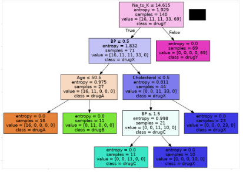

[//]: # (ОГЛАВЛЕНИЕ )

### ВВЕДЕНИЕ

Технологии вычислительных сетей получили широкое распространение в области корпоративных информационных систем
распределенных предприятий, что позволило решать огромное количество актуальных прикладных задач управления и
организации производства, увеличить требования к оперативности и актуальности информации.

С помощью современных технических возможностей можно разработать индивидуальное решение по проектированию ЛВС,
подходящее отдельно взятому офису. Для этого проектировщик тщательно изучает его организационную структуру и
расположение рабочих мест, чтобы упростить обмен информацией и позволить работникам быстрее выполнять поставленные
задачи.

Целями создания ЛВС являются:

- построение локальной вычислительной сети для взаимосвязи компьютеров, периферийных устройств (принтеры и т.п.) и
  оборудования, предназначенного для передачи и обработки информации;

- обеспечение возможности оперативного удовлетворения изменяющихся информационных потребностей учреждений без вложения
  значительных затрат в модернизацию кабельной системы;

- обеспечение возможности адаптации к различным изменениям организационно-штатной структуры, изменениям количества и
  месторасположения пользователей и информационного оборудования, изменениям состава оборудования рабочего места и его
  функциональных возможностей без проведения дополнительных работ.

В данном курсовом проекте описывается процесс проектирования локальной вычислительной сети предприятия с обоснованием
принятых решений и учетом требований стандартов структурированной кабельной системы.

[//]: ### (1. Постановка задачи ){
В данном курсовом проекте необходимо реализовать следующие задачи: разработка структуры локальной вычислительной сети
офисного здания на основе технических решений компаний Extreme Networks и Brand-Rex.
}

[//]: ### (2. Техническое задание на разработку вычислительной сети.){

Курсовая работа включает реализацию следующих аспектов:

- комплекс технических средств ЛВС должен включать серверное оборудование, активное сетевое оборудование и пассивные
  компоненты (кабельные системы);
- в состав технических средств обязательно входит структурированная кабельная система (СКС), включающая магистральную,
  вертикальную и горизонтальную подсистемы;
- технические средства должны обеспечивать проектирование топологической структуры сети в соответствии с выбранной
  архитектурой ЛВС;
- размещение технических средств должно производиться с учётом условий выбранных технических помещений и правил монтажа
  оборудования;
- выбор технических средств осуществляется на основе анализа модельного ряда, характеристик и возможностей производимого
  оборудования;
- комплект технических средств должен быть представлен в виде структурной схемы с указанием серверного оборудования и
  логических связей;
- в состав технических средств СКС входят коммутационные шкафы, кабельные трассы, оборудование монтажа и подключения;
- все соединения технических средств должны быть отражены в таблице соединений (кабельном журнале);
- технические средства специфицируются в отдельном документе (спецификации оборудования);
- для каждого технического средства (оборудования) на поэтажных план-схемах должно быть указано точное место размещения
  и маршруты прокладки кабельных трасс;
- схемы монтажа и размещения оборудования в коммутационных шкафах являются обязательной частью проекта технических
  средств показаны на рисунке @img_1

{#img_1}

}
[//]: ### (3. Анализ технических требований, выбор архитектуры и обоснование принципов построения ЛВС){

#### 3.1. Выбор технологии сети

Для определения технических требований к проектируемой ЛВС необходимо выделить уровень использования программного
комплекса. Проектируемая ЛВС ориентирована на масштаб здания, в которой можно выделить отдельно как каждый этаж, так и
все здание в целом.

Стандарты Ethernet определяют проводные соединения и электрические сигналы на физическом уровне, формат кадров и
протоколы управления доступом к среде — на канальном уровне модели OSI. Ethernet в основном описывается стандартами IEEE
группы 802.3. Ethernet стал самой распространённой технологией ЛВС в середине 1990-х годов, вытеснив такие устаревшие
технологии, как Token Ring, FDDI и ARCNET.

Название «Ethernet» («эфирная сеть» или «среда сети») отражает первоначальный принцип работы этой технологии: всё,
передаваемое одним узлом, одновременно принимается всеми остальными (то есть имеется некое сходство с радиовещанием). В
настоящее время практически всегда подключение происходит через коммутаторы (switch), так что кадры, отправляемые одним
узлом, доходят лишь до адресата (исключение составляют передачи на широковещательный адрес) — это повышает скорость
работы и безопасность сети.

В стандарте первых версий (Ethernet v1.0 и Ethernet v2.0) указано, что в качестве передающей среды используется
коаксиальный кабель, в дальнейшем появилась возможность использовать витую пару и оптический кабель.

Преимущества использования витой пары по сравнению с коаксиальным кабелем:

- возможность работы в дуплексном режиме;
- низкая стоимость кабеля витой пары.

Причиной перехода на оптический кабель была необходимость увеличить длину сегмента без повторителей.

В 1995 году принят стандарт IEEE 802.3u Fast Ethernet со скоростью 100 Мбит/с и появилась возможность работы в режиме
полный дуплекс.

В 1997 году был принят стандарт IEEE 802.3z Gigabit Ethernet со скоростью 1000 Мбит/с для передачи по оптическому
волокну и ещё через два года для передачи по витой паре. Основные стандарты Gigabit Ethernet:

1000BASE-T, IEEE 802.3ab — основной гигабитный стандарт, использует витую пару категории 5e. В передаче данных участвуют
4 пары, каждая пара используется одновременно для передачи по обоим направлениям со скоростью — 250 Мбит/с. Расстояние —
до 100 метров.

1000BASE-TX — стандарт разделяет принимаемые и посылаемые сигналы по парам (две пары передают данные, каждая на 500
Мбит/с и две пары принимают), что упрощало бы конструкцию приёмопередающих устройств. Ещё одним существенным отличием
1000BASE-TX являлось отсутствие схемы цифровой компенсации наводок и возвратных помех, в результате чего сложность,
уровень энергопотребления и цена реализаций должны становиться ниже, чем у стандарта 1000BASE-T. Для работы технологии
требуется кабельная система 6-й категории.

1000BASE-X — общий термин для обозначения стандартов со сменными приёмопередатчиками в форм-факторах GBIC или SFP.

Для организации сетевой технологии в ЛВС офисного здания 25v02 масштаба рекомендуется использовать архитектуру
1000BASE-T Gigabit Ethernet.

#### 3.2. Архитектура сети

Архитектура сети – это реализованная структура сети передачи данных, определяющая её топологию, состав устройств и
правила их взаимодействия в сети. В рамках архитектуры сети рассматриваются вопросы кодирования информации, её адресации
и передачи, управления потоком сообщений, контроля ошибок и анализа работы сети в аварийных ситуациях и при ухудшении
характеристик.

Термин топология сети означает способ соединения компьютеров в сеть. Понятие топологии включает правила, которые
определяют места размещения компьютеров, способы прокладки кабеля, способы размещения связующего оборудования и многое
другое. На сегодняшний день сформировались и устоялись несколько основных топологий.

Для проектируемой в курсовом проекте ЛВС была выбрана топология _звезда_.

Топология _звезда_– это топология локальной сети, где каждая рабочая станция присоединена к центральному устройству (
коммутатору или маршрутизатору). Центральное устройство управляет движением пакетов в сети. Каждый компьютер через
сетевую карту подключается к коммутатору отдельным кабелем. При необходимости можно объединить вместе несколько сетей с
топологией _звезда_ (конфигурация сети с древовидной топологией). Древовидная топология распространена в крупных
компаниях. Топология _звезда_ на сегодняшний день стала основной при построении локальных сетей.

Достоинства данной топологии:

- выход из строя одной рабочей станции или повреждение ее кабеля не отражается на работе всей сети в целом;

- отличная масштабируемость: для подключения новой рабочей станции достаточно проложить от коммутатора отдельный кабель;

- легкий поиск и устранение неисправностей и обрывов в сети;

- высокая производительность;

- простота настройки и администрирования;

- в сеть легко встраивается дополнительное оборудование.

Эта топология обеспечит:

- наиболее удобный вариант прокладки кабеля (а коммутатор устанавливается на каждом этаже посередине);

- усреднение затрат на подключение пользователей, т.к. структура соединения меняется каждый год из-за перетекания машин
  в пределах общежития;

- возможность неограниченно за счет добавления конечного оборудования расширять количество компьютерных рабочих мест.

#### 3.3. Характеристика проекта проектирования

Здание представляет собой административно-офисное сооружение с размерами примерно 8,5 × 9,2 м на этаж. Высота потолков
составляет около 3 м. Объект включает 5 этажей, каждый из которых имеет схожую планировку. Общая область проектирования
локальной вычислительной сети (ЛВС) охватывает все этажи здания и включает рабочие помещения, переговорные комнаты, зоны
отдыха, санитарные узлы, а также технические помещения.

На первом этаже размещены рабочая зона сотрудников, кабинет, кухня и санитарный узел. Также предусмотрена зона
размещения оргтехники (принтерная стойка). На верхних этажах располагаются переговорные комнаты (в том числе закрытого
типа), открытые рабочие пространства, зоны отдыха и демонстрационные зоны (например, архитектурный макет). В здании
предусмотрена отдельная серверная, в которой размещается основное сетевое оборудование.

Для данного объекта рекомендуется построение сети на основе управляемых коммутаторов с использованием иерархической
топологии типа «звезда». Центральный узел сети располагается в серверной и соединяется с этажными коммутаторами
посредством оптоволоконных линий связи. В пределах каждого этажа разводка выполняется с использованием кабеля витой пары
категории не ниже Cat6, обеспечивающей необходимую пропускную способность и надежность соединений.

При проектировании сети предполагается разделение пользователей на логические группы (например, сотрудники,
администрация, гости), что реализуется с помощью виртуальных локальных сетей (VLAN). Администратор сети имеет
возможность задавать дополнительные правила фильтрации трафика, обеспечивая ограничение доступа к определённым ресурсам,
повышение безопасности и предотвращение перегрузок сети, включая широковещательные штормы.

Для обеспечения беспроводного доступа в сеть предусмотрено использование точек доступа стандарта Wi-Fi 6, равномерно
распределённых по этажам. Питание сетевых устройств, таких как точки доступа и IP-телефоны, может осуществляться по
технологии PoE, что упрощает монтаж и эксплуатацию оборудования.

Таким образом, предложенная архитектура ЛВС обеспечивает высокую производительность, масштабируемость и
отказоустойчивость сети, а также соответствует современным требованиям к корпоративной инфраструктуре.
}
[//]: ### (4. Определение технических средств) {

Основой для проектирования локальной вычислительной сети является оборудование компании Edimax Technology, а в качестве
структурированной кабельной системы выбрана продукция LANMASTER.

Выбор данного оборудования обусловлен его доступностью, соответствием современным стандартам передачи данных (Gigabit
Ethernet, PoE, Wi-Fi 6), а также оптимальным соотношением стоимости и функциональности для офисных сетей малого и
среднего масштаба.
#### 4.1 Сетевое оборудование Edimax
Перечень основного оборудования компании Edimax, используемого при построении сети, представлен в таблице 1

| Наименование | Оборудование  | Характеристика                                                                                                             |
| ------------ | ------------- | -------------------------------------------------------------------------------------------------------------------------- |
| GS-5424PLC   | Коммутатор    | 24 порта 10/100/1000BASE-T с поддержкой PoE+ (802.3at/af); 4 порта SFP; пропускная способность до 52 Гбит/с; управление L2 |
| GS-5416PLC   | Коммутатор    | 16 портов Gigabit Ethernet с PoE+; 4 SFP-порта; поддержка VLAN, QoS, IGMP Snooping                                         |
| GS-5208PLG   | Коммутатор    | 8 портов 10/100/1000BASE-T PoE+; 2 uplink-порта Gigabit; компактное решение для этажных узлов                              |
| ES-5824P     | Коммутатор    | 24 порта Gigabit Ethernet; 4 SFP; поддержка VLAN, QoS; управляемый L2 коммутатор                                           |
| BR-6478AC V3 | Маршрутизатор | Поддержка стандартов Wi-Fi 5 (802.11ac); скорость до 1200 Мбит/с; NAT, DHCP, Firewall                                      |
| RG21S        | Точка доступа | Поддержка Wi-Fi 5; MU-MIMO; скорость до 1200 Мбит/с; работа в режиме точки доступа                                         |
| CAP1300      | Точка доступа | Двухдиапазонная Wi-Fi точка (2.4/5 ГГц); поддержка стандарта 802.11ac; централизованное управление                         |

#### 4.2 Используемые типы кабелей

#### 4.3 Коммутационные розетки

#### 4.4 Монтажный шкаф

#### 4.5 Коммутационная патч-панели

#### 4.6 Патч-корды

Патч-корды представляют собой короткие отрезки кабеля, используемые для соединения сетевых устройств между собой или с коммутационным оборудованием.

Основное назначение патч-кордов заключается в обеспечении гибкого и удобного подключения оборудования в пределах серверных стоек, коммутационных шкафов и рабочих мест.

К основным характеристикам патч-кордов относятся:

- категория кабеля
- тип разъемов
- длина
- тип экранирования

Категория кабеля определяет максимально поддерживаемую скорость передачи данных и частотный диапазон.

Наиболее распространенные категории:

1. Cat5e
2. Cat6
3. Cat6a

Тип разъемов, как правило, соответствует стандарту _RJ-45_ для медных кабелей.

Длина патч-кордов варьируется от 0.3 до 5 метров, что позволяет оптимизировать кабельную инфраструктуру и снизить уровень помех.

В зависимости от условий эксплуатации используются следующие типы экранирования:

- UTP — неэкранированный кабель
- FTP — кабель с фольгированным экраном
- STP — кабель с дополнительной защитой от электромагнитных помех

Использование качественных патч-кордов позволяет снизить потери сигнала и повысить надежность сети.

Неправильный выбор категории или длины кабеля может привести к ухудшению характеристик соединения и увеличению уровня ошибок передачи данных.

#### 4.7 Источник бесперебойного питания.

#### 4.8 Вентиляционная панель

#### 4.9 Маршрутизатор

#### 4.10 Сервер

#### 4.11 Серверный шкаф

#### 4.12 Альтернативные варианты построения архитектуры ЛВС
}
[//]: ### (5. Разработка СКС) {

#### 5.1. Общие принципы построения СКС

#### 5.2. Расчет СКС
}
#### ЗАКЛЮЧЕНИЕ

[//]: ### (Литература){

В данной курсовой работе были рассмотрены основные принципы проектирования локальной вычислительной сети предприятия. 

Использованная литература:

1. ГОСТ 7.32-2001. Отчет о научно-исследовательской работе. Структура и правила оформления.
2. IEEE 802.3 - Ethernet. Стандарты локальных сетей.
3. TIA/EIA-568B - Коммерческая стандартная система кабелирования.
4. RFC 3986 - Uniform Resource Identifier (URI): Generic Syntax.
}

[//]: # (Приложения)
