[//]: # is_table=true
[//]: # teacher ="Гальченко Н.М."
[//]: # numerate = False

__ФИО__: Швырев А.П
__Группа__: 090302-ИСТа-023

[//]: # ( Практическая работа №11){

#### Цель работы

Целью данной практической работы является получение теоретических знаний и практических навыков постановки и решения
задачи классификации методом деревьев решений (_Decision Trees_) на примере медицинского датасета.

#### Исходные данные

В качестве исходных данных используется датасет _"Drug 200"_, доступный на платформе _Kaggle_.
Датасет содержит данные о 200 пациентах, страдающих одним и тем же заболеванием и получавших различные лекарственные
препараты.

Набор данных включает следующие признаки:

- возраст пациента (_Age_),
- пол (_Sex_),
- уровень артериального давления (_BP_),
- уровень холестерина (_Cholesterol_),
- соотношение натрия и калия в крови (_Na_to_K_).

Целевой переменной является наименование препарата (_Drug_), на который ответил пациент.
Датасет содержит 5 классов: _Drug A_, _Drug B_, _Drug C_, _Drug X_, _Drug Y_.
Размер матрицы признаков до разделения составляет 200 строк и 5 столбцов.

#### Оборудование и ПО

Работа выполнялась с применением следующего программного обеспечения:

- операционная система _Ubuntu 22.04_,
- язык программирования _Python 3_,
- среда разработки _Jupyter Notebook_ (через платформу _JupyterHub_).

Использовались следующие библиотеки:

- _pandas_ — для чтения и обработки табличных данных,
- _numpy_ — для работы с массивами,
- _scikit-learn_ — для построения модели классификации и оценки её качества,
- _matplotlib_ — для визуализации результатов,
- _pydotplus_ и _six_ — для экспорта и отображения дерева решений.

#### Ход выполнения работы

Работа выполнялась в среде _JupyterHub_, доступной по адресу _http://89.110.116.79:7998/_.
После авторизации осуществлялся переход в личный каталог, создавался новый файл типа _Notebook_, которому присваивалось
имя, соответствующее теме практической работы.

На первом этапе производился импорт необходимых библиотек.
Были подключены _numpy_, _pandas_ и класс _DecisionTreeClassifier_ из модуля _sklearn.tree_.

На втором этапе выполнялось чтение данных.
Датасет _drug200.csv_ загружался из файловой системы сервера с помощью функции _pd.read_csv()_.
С помощью метода _my_data[0:5]_ выводились первые строки таблицы для визуальной проверки корректности загрузки.
Установлено, что датасет содержит 200 записей и 6 столбцов.

На рисунке 1 представлен скриншот первых строк загруженного датасета.

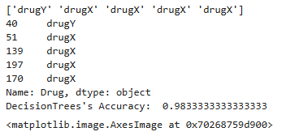
На третьем этапе выполнялась предварительная обработка данных.
Матрица признаков _X_ формировалась путём выбора столбцов _Age_, _Sex_, _BP_, _Cholesterol_, _Na_to_K_.
Поскольку алгоритм _DecisionTreeClassifier_ библиотеки _scikit-learn_ не поддерживает категориальные переменные,
признаки _Sex_, _BP_ и _Cholesterol_ были преобразованы в числовые значения с помощью класса _LabelEncoder_ из модуля
_sklearn.preprocessing_.

Кодирование признаков выполнялось следующим образом:

- для _Sex_: значения _'F'_ и _'M'_ преобразовывались в 0 и 1 соответственно,
- для _BP_: значения _'LOW'_, _'NORMAL'_, _'HIGH'_ преобразовывались в целочисленные метки,
- для _Cholesterol_: значения _'NORMAL'_ и _'HIGH'_ преобразовывались аналогичным образом.

После кодирования заполнялась целевая переменная _y_ из столбца _Drug_.

На четвёртом этапе производилось разделение данных на обучающую и тестовую выборки с помощью функции _train_test_split_.
Параметр _test_size=0.3_ задавал долю тестовой выборки, равную 30%.
Параметр _random_state=3_ обеспечивал воспроизводимость разбиения.
По результатам разбиения обучающая выборка _X_trainset_ содержала 140 записей, тестовая _X_testset_ — 60 записей.
Размерности _y_trainset_ и _y_testset_ совпадают с количеством строк в соответствующих матрицах признаков.

На пятом этапе выполнялось создание и обучение модели.
Создавался экземпляр класса _DecisionTreeClassifier_ с параметрами _criterion="entropy"_ и _max_depth=4_.
Параметр _criterion="entropy"_ задаёт использование критерия прироста информации (_Information Gain_) на основе энтропии
Шеннона для выбора признака разбиения в каждом узле.
Ограничение глубины дерева _max_depth=4_ применялось для предотвращения переобучения модели.
Обучение модели выполнялось методом _fit()_ на обучающих данных _X_trainset_ и _y_trainset_.

На шестом этапе производилась классификация объектов тестовой выборки.
Метод _predict()_ применялся к _X_testset_, результаты сохранялись в переменной _predTree_.
Первые 5 предсказанных значений сравнивались с истинными метками _y_testset_ для визуальной проверки.

На рисунке 2 представлен фрагмент вывода предсказанных и истинных меток классов.

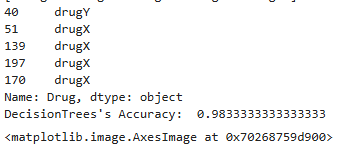
На седьмом этапе выполнялась оценка качества модели.
Из модуля _sklearn.metrics_ импортировалась функция _accuracy_score_.
Точность классификации вычислялась путём сравнения _y_testset_ и _predTree_.
Функция возвращает долю верно классифицированных объектов от общего числа объектов тестовой выборки.

На восьмом этапе строилась визуализация полученного дерева решений.
Для экспорта дерева в формат _dot_ использовалась функция _tree.export_graphviz()_ из модуля _sklearn_.
Затем с помощью библиотеки _pydotplus_ граф преобразовывался в изображение формата _PNG_, которое сохранялось под именем
_drugtree.png_.
Изображение отображалось средствами _matplotlib_.

На рисунке 3 представлена визуализация построенного дерева решений.

#### Результаты работы

По результатам выполнения работы была успешно построена модель классификации на основе дерева решений (_Decision Tree_).
Точность модели на тестовой выборке составила порядка 98%, что свидетельствует о высоком качестве классификации.

Анализ визуализированного дерева показал следующее.
На первом уровне разбиения ключевым признаком является соотношение _Na_to_K_: при значении этого признака выше
определённого порога большинство пациентов получают препарат _Drug Y_.
Данная закономерность объясняется физиологической зависимостью: при высоком соотношении натрия и калия в крови
назначение препарата _Drug Y_ является наиболее эффективным.

На последующих уровнях дерева ключевую роль играют признаки _BP_ (уровень артериального давления) и _Cholesterol_ (
уровень холестерина).
Признак _Age_ (возраст) вносит вклад в разбиение на нижних уровнях дерева.
Признак _Sex_ (пол) в данной модели оказался наименее значимым и не вошёл в число определяющих узлов.

Таким образом, основными разделяющими признаками в порядке убывания значимости являются:

- соотношение _Na_to_K_,
- уровень артериального давления _BP_,
- уровень холестерина _Cholesterol_,
- возраст _Age_.

Применение ограничения глубины _max_depth=4_ позволило получить достаточно компактное и интерпретируемое дерево,
сохранив при этом высокую точность модели.

#### Вывод

В ходе выполнения практической работы были получены практические навыки применения алгоритма дерева решений (_Decision
Tree_) к задаче многоклассовой классификации.
На основе датасета _Drug 200_ была построена модель, предсказывающая подходящий лекарственный препарат для пациента по
набору клинических признаков.

Выполнены следующие этапы работы:

- загрузка и предварительная обработка данных, включая кодирование категориальных признаков,
- разбиение выборки на обучающую и тестовую части,
- обучение модели _DecisionTreeClassifier_ с критерием _entropy_,
- классификация тестовых данных и оценка точности модели,
- визуализация структуры дерева решений.

Полученная модель продемонстрировала высокую точность классификации.
Анализ дерева решений позволил выявить, что наиболее значимым признаком для разделения классов является соотношение
натрия и калия в крови (_Na_to_K_), а уровень артериального давления (_BP_) и холестерина (_Cholesterol_) уточняют
классификацию на последующих уровнях.
Таким образом, деревья решений являются эффективным и интерпретируемым инструментом для решения задач медицинской
классификации.

}
[//]: # ( Практическая работа №12){

#### Цель работы

Целью данной практической работы является получение теоретических знаний и практических навыков постановки и решения
задачи бинарной классификации методом опорных векторов (_SVM_, _Support Vector Machines_) на примере медицинского
датасета клеточных образцов.

#### Исходные данные

В качестве исходных данных используется датасет _"Cancer data"_, доступный на платформе _Kaggle_, а также в репозитории
машинного обучения Калифорнийского университета в Ирвайне.
Набор данных содержит несколько сотен записей образцов клеток человека с характеристиками, позволяющими классифицировать
клетки как доброкачественные или злокачественные.

Каждая запись включает следующие признаки:

- идентификатор пациента (_ID_),
- скопление клеток (_Clump_),
- однородность размера (_UnifSize_),
- однородность формы (_UnifShape_),
- краевая адгезия (_MargAdh_),
- размер единичного эпителия (_SingEpiSize_),
- голые ядра (_BareNuc_),
- мягкий хроматин (_BlandChrom_),
- нормальные ядрышки (_NormNucl_),
- митозы (_Mit_).

Все признаки ранжированы по шкале от 1 до 10, где 1 соответствует состоянию, наиболее близкому к доброкачественному.
Целевая переменная — поле _Class_: значение 2 соответствует доброкачественным клеткам, значение 4 — злокачественным.

#### Оборудование и ПО

Работа выполнялась с применением следующего программного обеспечения:

- операционная система _Ubuntu 22.04_,
- язык программирования _Python 3_,
- среда разработки _Jupyter Notebook_ (через платформу _JupyterHub_).

Использовались следующие библиотеки:

- _pandas_ — для чтения и обработки табличных данных,
- _numpy_ — для работы с числовыми массивами,
- _scikit-learn_ — для построения моделей _SVM_ и оценки их качества,
- _matplotlib_ — для визуализации распределения данных и матриц ошибок,
- _scipy_ — для вспомогательных математических операций.

#### Ход выполнения работы

Работа выполнялась в среде _JupyterHub_, доступной по адресу _http://89.110.116.79:7998/_.
После авторизации осуществлялся переход в личный каталог, создавался новый файл типа _Notebook_ с именем,
соответствующим теме практической работы.

На первом этапе производился импорт необходимых библиотек: _pandas_, _numpy_, _matplotlib_, _scipy_, а также модулей
_preprocessing_, _train_test_split_ и _svm_ из пакета _scikit-learn_.

На втором этапе выполнялось чтение данных.
Датасет _cell_samples.csv_ загружался с помощью функции _pd.read_csv()_ из файловой системы сервера.
Первые строки таблицы выводились методом _cell_df.head()_ для визуальной проверки корректности загрузки.

Для первичного анализа распределения классов строился точечный график зависимости признаков _Clump_ и _UnifSize_ с
цветовым разделением по классу: злокачественные образцы отображались синим цветом, доброкачественные — жёлтым.

На рисунке 1 представлено распределение образцов клеток по признакам _Clump_ и _UnifSize_.

На третьем этапе выполнялась предварительная обработка данных.
С помощью метода _dtypes_ была проверена типизация столбцов.
Установлено, что столбец _BareNuc_ содержит нечисловые значения.
Строки с некорректными значениями удалялись с помощью _pd.to_numeric()_ с параметром _errors='coerce'_, после чего
столбец приводился к типу _int_.

Матрица признаков _X_ формировалась путём выбора 9 информативных столбцов: _Clump_, _UnifSize_, _UnifShape_, _MargAdh_,
_SingEpiSize_, _BareNuc_, _BlandChrom_, _NormNucl_, _Mit_.
Целевая переменная _y_ заполнялась из столбца _Class_, приведённого к целочисленному типу.

На четвёртом этапе данные разделялись на обучающую и тестовую выборки с помощью функции _train_test_split_.
Параметр _test_size=0.2_ задавал долю тестовой выборки, равную 20%.
Параметр _random_state=4_ обеспечивал воспроизводимость разбиения.
Размеры полученных выборок выводились на экран для проверки корректности разбиения.

На пятом этапе выполнялось построение базовой модели классификации.
Создавался экземпляр класса _svm.SVC_ с параметром _kernel='rbf'_ (радиальная базисная функция).
Модель обучалась методом _fit()_ на обучающих данных _X_train_ и _y_train_.

На шестом этапе производилась классификация объектов тестовой выборки.
Метод _predict()_ применялся к _X_test_, результаты сохранялись в переменной _yhat_.
Первые 5 предсказанных значений выводились для визуальной проверки.

На седьмом этапе выполнялась оценка качества базовой модели с ядром _rbf_.
Для этого использовались следующие метрики:

- матрица ошибок (_confusion matrix_) — для оценки соотношения верных и ошибочных предсказаний,
- отчёт о классификации (_classification_report_) — для расчёта точности (_precision_), полноты (_recall_) и _F1-score_,
- метрика _f1_score_ с параметром _average='weighted'_,
- индекс Жаккара (_jaccard_score_) для доброкачественного класса (_pos_label=2_).

Матрица ошибок строилась и визуализировалась с помощью пользовательской функции _plot_confusion_matrix()_.

На рисунке 2 представлена матрица ошибок для модели с ядром _rbf_.

На восьмом этапе в рамках задания дополнительно строились три модели с различными функциями ядра: _linear_,
_polynomial_ (_poly_) и _sigmoid_.
Для каждой из них выполнялись те же шаги: обучение, классификация тестовой выборки и расчёт метрик качества.
Результаты сравнивались между собой и с базовой моделью на ядре _rbf_.

На рисунке 3 представлено сравнение значений метрики _F1-score_ для всех четырёх функций ядра.

#### Результаты работы

По результатам выполнения работы было построено и оценено четыре модели классификации на основе метода опорных
векторов (_SVM_) с различными функциями ядра.

Базовая модель с ядром _rbf_ продемонстрировала высокую точность классификации.
Ядро _rbf_ эффективно разделяет классы в нелинейно-разделимых пространствах признаков, что обусловило его высокую
результативность на данном датасете.

Модель с ядром _linear_ показала сопоставимые результаты, поскольку признаки датасета имеют значительную линейную
разделимость между классами доброкачественных и злокачественных клеток.
Преимуществом линейного ядра является простота интерпретации и меньшие вычислительные затраты.

Модель с ядром _polynomial_ показала несколько более низкие показатели по сравнению с _rbf_.
Полиномиальное ядро чувствительно к выбору степени полинома и может приводить к переобучению при высоких значениях
степени.

Модель с ядром _sigmoid_ продемонстрировала наименее стабильные результаты среди четырёх вариантов.
Данное ядро аналогично по поведению нейронным сетям, однако требует тщательной настройки гиперпараметров и не всегда
гарантирует корректное разбиение пространства признаков.

Сравнительный анализ метрик позволяет сформулировать следующие выводы о функциях ядра:

- _rbf_ — наиболее универсальное ядро, обеспечивающее высокую точность при нелинейных данных,
- _linear_ — оптимально при линейной разделимости классов и высокой размерности признакового пространства,
- _polynomial_ — применимо при наличии полиномиальных зависимостей, требует подбора степени,
- _sigmoid_ — наименее предсказуемо, рекомендуется к применению с осторожностью.

#### Вывод

В ходе выполнения практической работы были получены практические навыки применения метода опорных векторов (_SVM_) к
задаче бинарной классификации медицинских данных.
На основе датасета _Cancer data_ была построена и оценена серия моделей, классифицирующих клеточные образцы как
доброкачественные или злокачественные.

Выполнены следующие этапы работы:

- загрузка и предварительная обработка данных, включая удаление нечисловых значений,
- разбиение выборки на обучающую и тестовую части,
- построение базовой модели _SVM_ с ядром _rbf_,
- построение трёх дополнительных моделей с ядрами _linear_, _polynomial_ и _sigmoid_,
- оценка качества каждой модели с использованием метрик _F1-score_, _jaccard_score_ и матрицы ошибок.

Метод _SVM_ продемонстрировал высокую эффективность для задачи классификации клеточных образцов.
Выбор функции ядра оказывает существенное влияние на качество модели: ядро _rbf_ обеспечивает наилучший баланс между
точностью и обобщающей способностью модели на данном наборе данных.
Таким образом, метод опорных векторов является мощным инструментом для решения задач медицинской диагностики при условии
корректного выбора гиперпараметров.

}

[//]: # ( Практическая работа №13){

#### Цель работы

Целью данной практической работы является получение теоретических знаний и практических навыков постановки и решения
задачи бинарной классификации методом логистической регрессии (_Logistic Regression_) на примере задачи прогнозирования
оттока клиентов телекоммуникационной компании.

#### Исходные данные

В качестве исходных данных используется датасет _"Telco Customer Churn"_, доступный на платформе _Kaggle_.
Набор данных содержит историческую информацию о клиентах телекоммуникационной компании и предназначен для
прогнозирования оттока — определения клиентов, которые могут перейти к конкурентам.

Датасет включает следующие группы признаков:

- информация об учётной записи: срок обслуживания (_tenure_), тип договора, способ оплаты, размер ежемесячных и
  суммарных платежей,
- демографические данные: возраст (_age_), пол, наличие партнёра и иждивенцев,
- подключённые услуги: телефония, интернет, онлайн-безопасность, резервное копирование, потоковое видео,
- прочие атрибуты: адрес (_address_), доход (_income_), уровень образования (_ed_), стаж работы (_employ_), наличие
  оборудования (_equip_).

Целевой переменной является столбец _churn_: значение 1 соответствует клиенту, покинувшему компанию, значение 0 —
оставшемуся.
Для построения модели отбирались признаки: _tenure_, _age_, _address_, _income_, _ed_, _employ_, _equip_.

#### Оборудование и ПО

Работа выполнялась с применением следующего программного обеспечения:

- операционная система _Ubuntu 22.04_,
- язык программирования _Python 3_,
- среда разработки _Jupyter Notebook_ (через платформу _JupyterHub_).

Использовались следующие библиотеки:

- _pandas_ — для чтения и предварительной обработки табличных данных,
- _numpy_ — для работы с числовыми массивами,
- _scikit-learn_ — для нормализации данных, построения модели логистической регрессии и оценки её качества,
- _matplotlib_ — для визуализации матрицы ошибок,
- _scipy_ — для вспомогательных вычислений.

#### Ход выполнения работы

Работа выполнялась в среде _JupyterHub_, доступной по адресу _http://89.110.116.79:7998/_.
После авторизации осуществлялся переход в личный каталог, создавался новый файл типа _Notebook_ с именем,
соответствующим теме практической работы.

На первом этапе производился импорт необходимых библиотек: _pandas_, _numpy_, _matplotlib_, _scipy_, а также модулей
_preprocessing_, _train_test_split_ и _LogisticRegression_ из пакета _scikit-learn_.

На втором этапе выполнялось чтение данных.
Датасет _ChurnData.csv_ загружался с помощью функции _pd.read_csv()_ из файловой системы сервера.
Первые строки таблицы выводились методом _churn_df.head()_ для визуальной проверки корректности загрузки.

На третьем этапе выполнялась предварительная обработка и отбор данных.
Из исходного датасета отбирались столбцы: _tenure_, _age_, _address_, _income_, _ed_, _employ_, _equip_, _callcard_,
_wireless_, _churn_.
Целевой столбец _churn_ приводился к целочисленному типу с помощью метода _astype('int')_, поскольку алгоритм
_LogisticRegression_ библиотеки _scikit-learn_ требует числового формата целевой переменной.

Матрица признаков _X_ формировалась из 7 столбцов: _tenure_, _age_, _address_, _income_, _ed_, _employ_, _equip_.
Целевая переменная _y_ заполнялась из столбца _churn_.

Нормализация матрицы признаков выполнялась с помощью класса _StandardScaler_ из модуля _sklearn.preprocessing_.
Нормализация приводит значения каждого признака к нулевому среднему и единичной дисперсии, что повышает устойчивость и
скорость сходимости алгоритма логистической регрессии.

На четвёртом этапе данные разделялись на обучающую и тестовую выборки с помощью функции _train_test_split_.
Параметр _test_size=0.2_ задавал долю тестовой выборки, равную 20%.
Параметр _random_state=4_ обеспечивал воспроизводимость разбиения.
Размеры полученных выборок выводились на экран с помощью атрибута _shape_.

На пятом этапе выполнялось построение базовой модели логистической регрессии.
Создавался экземпляр класса _LogisticRegression_ с параметрами _C=0.01_ и _solver='liblinear'_.
Параметр _C_ определяет обратную силу регуляризации: значение 0.01 соответствует достаточно сильной регуляризации, что
снижает риск переобучения на данном наборе данных.
Решатель _liblinear_ эффективно работает с малыми наборами данных и поддерживает оба типа регуляризации — _L1_ и _L2_.
Обучение модели выполнялось методом _fit()_ на обучающих данных _X_train_ и _y_train_.

На шестом этапе производилась классификация объектов тестовой выборки.
Метод _predict()_ применялся к _X_test_, результаты сохранялись в переменной _yhat_.
Дополнительно вызывался метод _predict_proba()_, возвращающий вероятности принадлежности каждого объекта к каждому из
классов.
Первый столбец возвращаемого массива содержит вероятность класса 1 (_P(Y=1|X)_), второй — вероятность класса 0 (_P(
Y=0|X)_).

На седьмом этапе выполнялась оценка качества базовой модели.
Использовались следующие метрики:

- индекс Жаккара (_jaccard_score_) с параметром _pos_label=1_ — отношение пересечения предсказанных и истинных меток к
  их объединению,
- матрица ошибок (_confusion matrix_) — строилась и визуализировалась с помощью пользовательской функции
  _plot_confusion_matrix()_,
- отчёт о классификации (_classification_report_) — содержит значения _precision_, _recall_ и _F1-score_ для каждого
  класса,
- логарифмические потери (_log_loss_) — вычислялись на основе вероятностных предсказаний _yhat_prob_.

На рисунке 1 представлена матрица ошибок базовой модели с решателем _liblinear_.

На восьмом этапе в рамках задания дополнительно строились четыре модели с решателями _newton-cg_, _lbfgs_, _sag_ и
_saga_.
Для каждой модели использовались те же параметр регуляризации _C=0.01_, матрица признаков и разбиение на выборки.
Для каждой модели вычислялись метрики: _jaccard_score_, _log_loss_ и _classification_report_.
Полученные значения сравнивались между собой и с базовой моделью на решателе _liblinear_.

#### Результаты работы

По результатам выполнения работы было построено и оценено пять моделей логистической регрессии с различными численными
решателями.

Базовая модель с решателем _liblinear_ продемонстрировала стабильное качество классификации.
Данный решатель оптимизирует функцию потерь методом координатного спуска и хорошо подходит для небольших наборов данных
с поддержкой регуляризации _L1_ и _L2_.

Модели с решателями _newton-cg_ и _lbfgs_ показали сопоставимые результаты.
Оба решателя реализуют квазиньютоновские методы оптимизации, эффективно работают с многоклассовыми задачами и
поддерживают только регуляризацию _L2_.
Решатель _lbfgs_ является методом ограниченной памяти и предпочтителен при большом числе признаков.

Решатель _sag_ (_Stochastic Average Gradient_) реализует стохастический градиентный спуск, усреднённый по всем
наблюдениям.
Он демонстрирует хорошую сходимость на больших наборах данных, однако на малых выборках может уступать детерминированным
методам по точности при ограниченном числе итераций.

Решатель _saga_ является расширенной версией _sag_ и дополнительно поддерживает регуляризацию _L1_, а также не
штрафизирующую (_none_) регуляризацию.
На данном датасете _saga_ показал результаты, сопоставимые с _sag_.

Сравнительный анализ решателей позволяет сформулировать следующие выводы:

- _liblinear_ — оптимален для малых наборов данных, поддерживает _L1_ и _L2_ регуляризацию,
- _newton-cg_ и _lbfgs_ — эффективны при многоклассовой классификации и большом числе признаков,
- _sag_ — предпочтителен для больших наборов данных ввиду низкой вычислительной стоимости одной итерации,
- _saga_ — наиболее универсален: поддерживает все типы регуляризации и масштабируется на большие данные.

#### Вывод

В ходе выполнения практической работы были получены практические навыки применения метода логистической регрессии (
_Logistic Regression_) к задаче бинарной классификации на реальном наборе данных.
На основе датасета _Telco Customer Churn_ была построена модель, прогнозирующая вероятность оттока клиента
телекоммуникационной компании.

Выполнены следующие этапы работы:

- загрузка и предварительная обработка данных с отбором информативных признаков,
- нормализация матрицы признаков с помощью _StandardScaler_,
- разбиение выборки на обучающую и тестовую части,
- построение базовой модели _LogisticRegression_ с решателем _liblinear_,
- построение четырёх дополнительных моделей с решателями _newton-cg_, _lbfgs_, _sag_ и _saga_,
- оценка качества каждой модели с использованием метрик _jaccard_score_, _log_loss_ и матрицы ошибок.

Логистическая регрессия продемонстрировала применимость к задаче прогнозирования оттока клиентов.
Выбор численного решателя влияет на скорость сходимости и конечное качество модели: для небольших датасетов
предпочтительны _liblinear_ и _lbfgs_, тогда как для масштабирования на большие объёмы данных рекомендуется применять
_sag_ или _saga_.
Таким образом, логистическая регрессия является эффективным и интерпретируемым инструментом для решения задач
прогнозирования в телекоммуникационной и смежных отраслях.

}

[//]: # ( Практическая работа №14){

#### Цель работы

Целью данной практической работы является получение теоретических знаний и практических навыков постановки и решения
задачи формирования рекомендаций методом коллаборативной фильтрации (_Collaborative Filtering_) на примере построения
системы рекомендации фильмов.

#### Исходные данные

В качестве исходных данных используется датасет _"The Movies Dataset"_, доступный на платформе _Kaggle_.
Набор данных состоит из двух файлов: _movies.csv_ и _ratings.csv_.

Файл _movies.csv_ содержит следующие поля:

- уникальный идентификатор фильма (_movieId_),
- название фильма с годом выпуска (_title_),
- жанры (_genres_).

Файл _ratings.csv_ содержит следующие поля:

- идентификатор пользователя (_userId_),
- идентификатор фильма (_movieId_),
- оценка фильма (_rating_) по шкале от 0.5 до 5.0,
- временная метка оценки (_timestamp_).

В качестве профиля тестового пользователя для построения рекомендаций использовались оценки следующих фильмов:

- _"Breakfast Club, The"_ — оценка 5,
- _"Toy Story"_ — оценка 3.5,
- _"Jumanji"_ — оценка 2,
- _"Pulp Fiction"_ — оценка 5,
- _"Akira"_ — оценка 4.5.

#### Оборудование и ПО

Работа выполнялась с применением следующего программного обеспечения:

- операционная система _Ubuntu 22.04_,
- язык программирования _Python 3_,
- среда разработки _Jupyter Notebook_ (через платформу _JupyterHub_).

Использовались следующие библиотеки:

- _pandas_ — для чтения, обработки и преобразования табличных данных,
- _numpy_ — для работы с числовыми массивами,
- _matplotlib_ — для визуализации результатов и построения графиков,
- _math_ — для вычисления квадратного корня при расчёте корреляции Пирсона.

#### Ход выполнения работы

Работа выполнялась в среде _JupyterHub_, доступной по адресу _http://89.110.116.79:7998/_.
После авторизации осуществлялся переход в личный каталог, создавался новый файл типа _Notebook_ с именем,
соответствующим теме практической работы.

На первом этапе производился импорт необходимых библиотек: _pandas_, _numpy_, _matplotlib_ и функции _sqrt_ из модуля
_math_.

На втором этапе выполнялось чтение данных.
Файлы _movies.csv_ и _ratings.csv_ загружались с помощью функции _pd.read_csv()_ из файловой системы сервера в
датафреймы _movies_df_ и _ratings_df_ соответственно.

На рисунке 1 представлен вывод первых строк датафреймов _movies_df_ и _ratings_df_ после загрузки.

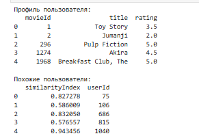
На третьем этапе выполнялась предварительная обработка данных.
Из столбца _title_ датафрейма _movies_df_ с помощью регулярного выражения и метода _str.extract()_ извлекался год
выпуска и помещался в отдельный столбец _year_.
Год и лишние пробелы удалялись из исходного столбца _title_ с помощью метода _str.replace()_ и функции _strip()_.
Столбец _genres_ удалялся из _movies_df_ методом _drop()_, поскольку жанры не используются в данной реализации
алгоритма.

Из датафрейма _ratings_df_ удалялся столбец _timestamp_ как не несущий полезной информации для алгоритма коллаборативной
фильтрации.

На четвёртом этапе формировался профиль тестового пользователя.
Список словарей _userInput_ с названиями и оценками фильмов преобразовывался в датафрейм _inputMovies_.
Из _movies_df_ фильтровались строки, соответствующие введённым названиям, и с помощью метода _pd.merge()_ к датафрейму
_inputMovies_ добавлялись идентификаторы фильмов _movieId_.
Столбец _year_ удалялся за ненадобностью.

На пятом этапе из датафрейма _ratings_df_ извлекалось подмножество пользователей, оценивших хотя бы один фильм из
профиля тестового пользователя.
Полученное подмножество группировалось по _userId_ с помощью метода _groupby()_.
Группы сортировались по убыванию количества общих фильмов с тестовым профилем, чтобы наиболее релевантные пользователи
имели больший приоритет при расчёте корреляции.
Для ограничения вычислительных затрат отбирались первые 100 групп.

На шестом этапе вычислялся коэффициент корреляции Пирсона между тестовым пользователем и каждым из отобранных
пользователей.
Для каждого пользователя из подгруппы выполнялась следующая последовательность операций:

- сортировка записей по _movieId_ для согласования порядка,
- извлечение списков оценок тестового пользователя (_tempRatingList_) и пользователя из группы (_tempGroupList_),
- вычисление величин _Sxx_, _Syy_, _Sxy_ по формуле коэффициента корреляции Пирсона,
- расчёт итогового коэффициента как _Sxy / sqrt(Sxx * Syy)_ при условии ненулевых знаменателей.

Результаты сохранялись в словаре _pearsonCorrelationDict_, который затем преобразовывался в датафрейм _pearsonDF_ со
столбцами _userId_ и _similarityIndex_.

На седьмом этапе отбирались 50 пользователей с наибольшим индексом сходства.
Их оценки объединялись с датафреймом _ratings_df_ через метод _merge()_.
Для каждого фильма вычислялось средневзвешенное значение рейтинга: оценка каждого пользователя умножалась на его
_similarityIndex_, полученные произведения суммировались и делились на суммарный вес (_sum_similarityIndex_).
Итоговый датафрейм _recommendation_df_ сортировался по убыванию взвешенного рейтинга, после чего выводились 10 наиболее
рекомендуемых фильмов.

На рисунке 2 представлен список 10 рекомендованных фильмов для тестового пользователя.

На восьмом этапе в рамках задания профиль тестового пользователя был расширен за счёт добавления дополнительных фильмов.
К исходным пяти фильмам добавлялись: _"Matrix, The"_ с оценкой 5, _"Forrest Gump"_ с оценкой 4, _"Schindler's List"_ с
оценкой 4.5, _"Silence of the Lambs, The"_ с оценкой 4, _"Fargo"_ с оценкой 3.5.
Для каждого варианта профиля (5, 7, 10 фильмов) измерялось время выполнения алгоритма с помощью модуля _time_ и строился
соответствующий график зависимости времени от количества фильмов.

На рисунке 3 представлен график зависимости времени выполнения алгоритма от количества фильмов в профиле пользователя.

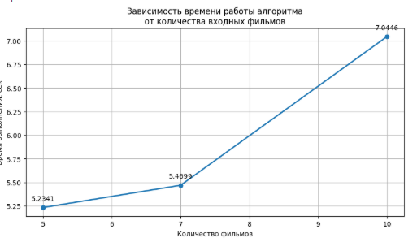

#### Результаты работы

По результатам выполнения работы была успешно реализована система рекомендации фильмов на основе метода коллаборативной
фильтрации с использованием корреляции Пирсона.

Алгоритм корректно сформировал список из 10 рекомендуемых фильмов на основе введённого профиля тестового пользователя.
Рекомендованные фильмы соответствовали жанровым предпочтениям, выраженным в оценках: высокие оценки за _"Pulp Fiction"_
и _"Breakfast Club, The"_ привели к преобладанию в рекомендациях фильмов жанров драма и криминал.

Измерение времени выполнения показало, что с увеличением количества фильмов в профиле пользователя время работы
алгоритма возрастает.
Это объясняется тем, что расширение профиля увеличивает число пользователей в подмножестве, оценивавших общие фильмы,
что увеличивает объём вычислений корреляции.

По результатам анализа алгоритма коллаборативной фильтрации были сформулированы следующие преимущества:

- не требует информации о содержании объектов — алгоритм работает исключительно на основе оценок пользователей,
- способен обнаруживать нетривиальные зависимости между предпочтениями пользователей,
- легко масштабируется на новые объекты без изменения логики алгоритма.

Выявленные недостатки алгоритма коллаборативной фильтрации:

- проблема холодного старта (_cold start_): алгоритм не способен формировать рекомендации для новых пользователей или
  новых объектов без накопленных оценок,
- разреженность матрицы оценок (_sparsity_): большинство пользователей оценивают лишь малую долю объектов, что снижает
  точность вычисления корреляции,
- масштабируемость: вычислительная сложность алгоритма возрастает при увеличении числа пользователей и объектов, что
  затрудняет применение на крупных датасетах.

#### Вывод

В ходе выполнения практической работы были получены практические навыки построения рекомендательной системы на основе
метода коллаборативной фильтрации (_Collaborative Filtering_) с применением коэффициента корреляции Пирсона.

Выполнены следующие этапы работы:

- загрузка и предварительная обработка датасета _"The Movies Dataset"_,
- формирование профиля тестового пользователя на основе оценок фильмов,
- отбор подмножества похожих пользователей и вычисление коэффициента корреляции Пирсона,
- расчёт средневзвешенного рейтинга фильмов-кандидатов и формирование топ-10 рекомендаций,
- расширение профиля пользователя и оценка времени работы алгоритма при различном числе входных фильмов,
- анализ преимуществ и недостатков метода коллаборативной фильтрации.

Реализованная система корректно формирует персонализированные рекомендации на основе поведения схожих пользователей.
Корреляция Пирсона оказалась эффективной мерой сходства благодаря своей инвариантности к масштабированию оценок.
Вместе с тем анализ показал, что метод коллаборативной фильтрации имеет существенные ограничения в виде проблемы
холодного старта и разреженности данных, которые необходимо учитывать при проектировании реальных рекомендательных
систем.

}

[//]: # ( Практическая работа №15){

#### Цель работы

Целью данной практической работы является получение теоретических знаний и практических навыков постановки и решения
задачи формирования рекомендаций методом фильтрации по содержанию (_Content-based Filtering_) на примере построения
системы рекомендации фильмов на основе жанровых предпочтений пользователя.

#### Исходные данные

В качестве исходных данных используется датасет _"The Movies Dataset"_, доступный на платформе _Kaggle_.
Набор данных состоит из двух файлов: _movies.csv_ и _ratings.csv_.

Файл _movies.csv_ содержит следующие поля:

- уникальный идентификатор фильма (_movieId_),
- название фильма с годом выпуска (_title_),
- жанры фильма через разделитель (_genres_).

Файл _ratings.csv_ содержит следующие поля:

- идентификатор пользователя (_userId_),
- идентификатор фильма (_movieId_),
- оценка фильма (_rating_) по шкале от 0.5 до 5.0,
- временная метка оценки (_timestamp_).

В качестве профиля тестового пользователя использовались оценки следующих фильмов:

- _"Breakfast Club, The"_ — оценка 5,
- _"Toy Story"_ — оценка 3.5,
- _"Jumanji"_ — оценка 2,
- _"Pulp Fiction"_ — оценка 5,
- _"Akira"_ — оценка 4.5.

#### Оборудование и ПО

Работа выполнялась с применением следующего программного обеспечения:

- операционная система _Ubuntu 22.04_,
- язык программирования _Python 3_,
- среда разработки _Jupyter Notebook_ (через платформу _JupyterHub_).

Использовались следующие библиотеки:

- _pandas_ — для чтения, обработки и преобразования табличных данных,
- _numpy_ — для работы с числовыми массивами,
- _matplotlib_ — для визуализации результатов и построения графиков,
- _math_ — для вспомогательных математических операций.

#### Ход выполнения работы

Работа выполнялась в среде _JupyterHub_, доступной по адресу _http://89.110.116.79:7998/_.
После авторизации осуществлялся переход в личный каталог, создавался новый файл типа _Notebook_ с именем,
соответствующим теме практической работы.

На первом этапе производился импорт необходимых библиотек: _pandas_, _numpy_, _matplotlib_ и функции _sqrt_ из модуля
_math_.

На втором этапе выполнялось чтение данных.
Файлы _movies.csv_ и _ratings.csv_ загружались с помощью функции _pd.read_csv()_ из файловой системы сервера в
датафреймы _movies_df_ и _ratings_df_ соответственно.
Первые строки каждого датафрейма выводились методом _head()_ для визуальной проверки корректности загрузки.

На рисунке 1 представлен вывод первых строк датафреймов _movies_df_ и _ratings_df_ после загрузки и первичной обработки.

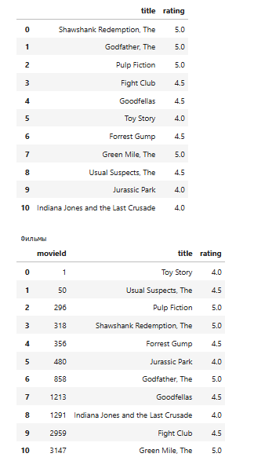
На третьем этапе выполнялась предварительная обработка данных.
Из столбца _title_ датафрейма _movies_df_ с помощью регулярного выражения и метода _str.extract()_ извлекался год
выпуска и помещался в отдельный столбец _year_.
Год и лишние пробелы удалялись из исходного столбца _title_ с помощью метода _str.replace()_ и функции _strip()_.

Столбец _genres_ преобразовывался из строки с разделителем _"|"_ в список жанров с помощью метода _str.split('|')_.
Это необходимо для последующего применения кодирования _One Hot Encoding_.

Из датафрейма _ratings_df_ удалялся столбец _timestamp_ как не несущий полезной информации для алгоритма фильтрации по
содержанию.

На четвёртом этапе выполнялось кодирование жанров методом _One Hot Encoding_.
Создавалась копия датафрейма _movies_df_ под именем _moviesWithGenres_df_.
Для каждого фильма и каждого жанра из списка в соответствующий столбец датафрейма записывалось значение 1 (фильм
принадлежит жанру) или 0 (не принадлежит).
Пропущенные значения заполнялись нулями с помощью метода _fillna(0)_.
В результате каждый фильм был представлен бинарным вектором жанровой принадлежности.

На пятом этапе формировался профиль тестового пользователя.
Список словарей _userInput_ с названиями и оценками фильмов преобразовывался в датафрейм _inputMovies_.
Из _movies_df_ фильтровались строки с соответствующими названиями, и с помощью метода _pd.merge()_ к _inputMovies_
добавлялись идентификаторы _movieId_.
Столбцы _genres_ и _year_ удалялись как избыточные.

Из датафрейма _moviesWithGenres_df_ извлекалось подмножество _userMovies_ — строки, соответствующие фильмам из профиля
пользователя.
Индекс сбрасывался методом _reset_index(drop=True)_, после чего удалялись все нежанровые столбцы: _movieId_, _title_,
_genres_, _year_.
Результирующая таблица _userGenreTable_ содержала только бинарные жанровые векторы просмотренных фильмов.

На шестом этапе вычислялся профиль пользователя (_userProfile_).
Для этого таблица _userGenreTable_ транспонировалась и умножалась на вектор оценок пользователя (
_inputMovies['rating']_) с помощью операции скалярного произведения через метод _dot()_.
В результате каждому жанру присваивался суммарный взвешенный вес, отражающий предпочтение пользователя к данному жанру.

На рисунке 2 представлен профиль пользователя — вектор весовых коэффициентов жанровых предпочтений.

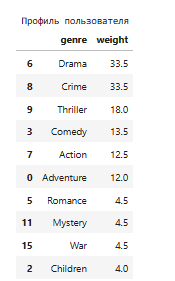

На седьмом этапе из полного датафрейма _moviesWithGenres_df_ извлекалась таблица жанров _genreTable_ с индексацией по
_movieId_.
Все нежанровые столбцы (_movieId_, _title_, _genres_, _year_) удалялись.

Для каждого фильма в каталоге вычислялось средневзвешенное значение соответствия профилю пользователя: жанровый вектор
фильма умножался на вектор _userProfile_ поэлементно, результат суммировался по строке и делился на сумму весов
профиля (_userProfile.sum()_).
Итоговый датафрейм _recommendationTable_df_ сортировался по убыванию полученного балла.

Финальный список рекомендаций формировался путём выбора 20 фильмов с наибольшим взвешенным баллом из датафрейма
_movies_df_ по соответствующим _movieId_.

На восьмом этапе в рамках задания профиль тестового пользователя расширялся за счёт добавления дополнительных фильмов.
К исходным пяти фильмам добавлялись: _"Matrix, The"_ с оценкой 5, _"Forrest Gump"_ с оценкой 4, _"Schindler's List"_ с
оценкой 4.5, _"Silence of the Lambs, The"_ с оценкой 4, _"Fargo"_ с оценкой 3.5.
Для каждого варианта профиля (5, 7, 10 фильмов) измерялось время выполнения алгоритма с помощью модуля _time_ и строился
соответствующий график.

На рисунке 3 представлен график зависимости времени выполнения алгоритма _Content-based Filtering_ от количества фильмов
в профиле пользователя.

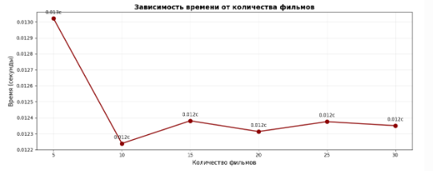

#### Результаты работы

По результатам выполнения работы была успешно реализована система рекомендации фильмов на основе метода фильтрации по
содержанию (_Content-based Filtering_) с применением кодирования _One Hot Encoding_ и взвешенного профиля пользователя.

Алгоритм корректно сформировал список из 20 рекомендуемых фильмов на основе введённого профиля тестового пользователя.
Высокие оценки за _"Pulp Fiction"_ и _"Breakfast Club, The"_ привели к формированию профиля с повышенными весами жанров
«драма» и «криминал», что отразилось в составе итоговых рекомендаций.

Измерение времени выполнения показало, что с увеличением числа фильмов в профиле пользователя время работы алгоритма
практически не изменяется.
Это объясняется тем, что вычислительная сложность алгоритма _Content-based Filtering_ определяется преимущественно
размером каталога фильмов, а не длиной профиля пользователя, в отличие от алгоритма коллаборативной фильтрации.

По результатам анализа алгоритма фильтрации по содержанию были сформулированы следующие преимущества:

- отсутствие проблемы холодного старта для новых объектов: алгоритм способен рекомендовать новые фильмы сразу после их
  добавления в каталог при наличии описания жанров,
- независимость от других пользователей: рекомендации строятся исключительно на основе профиля конкретного пользователя,
  что исключает влияние посторонних оценок,
- прозрачность и интерпретируемость: рекомендации легко объяснимы — система предлагает фильмы тех же жанров, которые
  понравились пользователю.

Выявленные недостатки алгоритма фильтрации по содержанию:

- ограниченность разнообразия рекомендаций (_overspecialization_): алгоритм склонен рекомендовать объекты, слишком
  похожие на уже просмотренные, что снижает вероятность знакомства пользователя с новыми жанрами,
- зависимость от качества описания контента: точность рекомендаций напрямую определяется полнотой и корректностью
  атрибутов объектов в каталоге,
- проблема холодного старта для новых пользователей: при отсутствии истории взаимодействий сформировать содержательный
  профиль пользователя невозможно.

#### Вывод

В ходе выполнения практической работы были получены практические навыки построения рекомендательной системы на основе
метода фильтрации по содержанию (_Content-based Filtering_) с применением кодирования _One Hot Encoding_ и скалярного
произведения для вычисления профиля пользователя.

Выполнены следующие этапы работы:

- загрузка и предварительная обработка датасета _"The Movies Dataset"_,
- преобразование жанров фильмов в бинарные векторы методом _One Hot Encoding_,
- формирование профиля тестового пользователя на основе взвешенных жанровых предпочтений,
- вычисление средневзвешенного балла соответствия для каждого фильма каталога и формирование топ-20 рекомендаций,
- расширение профиля пользователя и оценка времени работы алгоритма при различном числе входных фильмов,
- анализ преимуществ и недостатков метода фильтрации по содержанию.

Реализованная система корректно формирует персонализированные рекомендации на основе жанровых предпочтений пользователя.
В сравнении с методом коллаборативной фильтрации, рассмотренным в предыдущей практической работе, метод _Content-based
Filtering_ демонстрирует более стабильное время выполнения при увеличении числа входных фильмов, однако склонен к
избыточной специализации рекомендаций.
Таким образом, оба метода обладают взаимодополняющими свойствами и на практике часто применяются совместно в составе
гибридных рекомендательных систем.

}

[//]: # ( Практическая работа №16){

#### Цель работы

Целью данной практической работы является получение теоретических знаний и практических навыков построения модели
простой линейной регрессии (_Simple Linear Regression_) для прогнозирования выбросов углекислого газа автомобилями на
основе характеристик двигателя и расхода топлива.

#### Исходные данные

В качестве исходных данных использовался датасет _FuelConsumption.csv_, содержащий информацию о характеристиках
автомобилей и выбросах углекислого газа.

Набор данных включает следующие поля:

- год выпуска автомобиля (_MODELYEAR_),
- производитель автомобиля (_MAKE_),
- модель автомобиля (_MODEL_),
- класс транспортного средства (_VEHICLECLASS_),
- объём двигателя (_ENGINESIZE_),
- количество цилиндров (_CYLINDERS_),
- тип трансмиссии (_TRANSMISSION_),
- расход топлива в городе (_FUELCONSUMPTION_CITY_),
- расход топлива на трассе (_FUELCONSUMPTION_HWY_),
- комбинированный расход топлива (_FUELCONSUMPTION_COMB_),
- выбросы углекислого газа (_CO2EMISSIONS_).

Для построения моделей линейной регрессии использовались признаки _ENGINESIZE_ и _CYLINDERS_, а целевой переменной
являлся показатель _CO2EMISSIONS_.

#### Оборудование и ПО

Работа выполнялась с использованием следующего программного обеспечения:

- операционная система _Ubuntu 22.04_,
- язык программирования _Python 3_,
- среда разработки _Jupyter Notebook_,
- библиотека _pandas_ для обработки табличных данных,
- библиотека _numpy_ для математических вычислений,
- библиотека _matplotlib_ для визуализации данных,
- библиотека _scikit-learn_ для построения моделей машинного обучения.

#### Ход выполнения работы

Работа выполнялась в среде _Jupyter Notebook_ через платформу _JupyterHub_.

На первом этапе производился импорт необходимых библиотек: _matplotlib_, _pandas_, _numpy_ и модуля _pylab_.

После импорта библиотек выполнялось чтение исходного датасета _FuelConsumption.csv_ с помощью функции _pd.read_csv()_.
Загруженные данные сохранялись в датафрейм _df_.

Для проверки корректности загрузки использовались методы _head()_ и _describe()_, позволяющие вывести первые строки
таблицы и общую статистическую информацию по числовым признакам.

На рисунке 1 представлены первые строки датафрейма и основные статистические характеристики признаков.

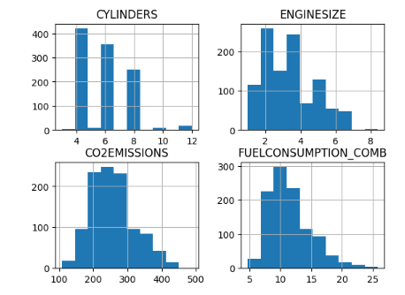
На следующем этапе формировался новый датафрейм _cdf_, содержащий только необходимые столбцы:

- _ENGINESIZE_,
- _CYLINDERS_,
- _FUELCONSUMPTION_COMB_,
- _CO2EMISSIONS_.

После отбора признаков выполнялось исследование распределения данных. Для этого строились гистограммы признаков с
помощью метода _hist()_. Гистограммы позволили определить диапазоны значений и характер распределения параметров.

Дополнительно строились диаграммы рассеяния зависимости выбросов _CO2EMISSIONS_ от признаков _FUELCONSUMPTION_COMB_,
_ENGINESIZE_ и _CYLINDERS_.

График зависимости _FUELCONSUMPTION_COMB_ от _CO2EMISSIONS_ продемонстрировал выраженную положительную линейную
зависимость. С увеличением комбинированного расхода топлива наблюдалось увеличение выбросов углекислого газа.

График зависимости _ENGINESIZE_ от _CO2EMISSIONS_ также показал положительную линейную корреляцию. Автомобили с большим
объёмом двигателя характеризовались более высокими выбросами.

На рисунке 2 представлены графики зависимостей выбросов от признаков _FUELCONSUMPTION_COMB_ и _ENGINESIZE_.

Дополнительно строился график зависимости _CO2EMISSIONS_ от количества цилиндров _CYLINDERS_. Было установлено, что
признак _CYLINDERS_ также демонстрирует линейную тенденцию, однако значения располагаются дискретно, поскольку
количество цилиндров принимает фиксированные значения.

На рисунке 3 представлена диаграмма рассеяния зависимости выбросов от количества цилиндров.

На следующем этапе выполнялось разбиение данных на обучающую и тестовую выборки. Для этого использовалась функция
_np.random.rand()_, формирующая случайную булеву маску.

При помощи сформированной маски около 80% данных помещалось в обучающую выборку _train_, а оставшиеся 20% — в тестовую
выборку _test_.

После подготовки выборок выполнялось построение модели простой линейной регрессии зависимости выбросов углекислого газа
от объёма двигателя _ENGINESIZE_.

Для построения модели использовался класс _LinearRegression_ из библиотеки _scikit-learn_. В качестве независимой
переменной использовался столбец _ENGINESIZE_, а целевой переменной являлся _CO2EMISSIONS_.

Матрица признаков формировалась с помощью функции _np.asanyarray()_. После подготовки данных выполнялось обучение модели
методом _fit()_.

После завершения обучения выводились коэффициенты модели:

- коэффициент наклона регрессионной прямой,
- свободный член уравнения.

Далее выполнялась визуализация обученной модели. На графике отображались точки обучающей выборки и регрессионная прямая,
рассчитанная по формуле линейной регрессии.

На рисунке 4 представлена регрессионная модель зависимости выбросов от объёма двигателя.

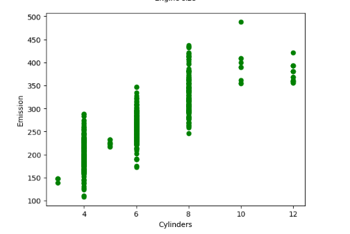
После построения модели выполнялась оценка её качества на тестовой выборке.

Для оценки качества использовались следующие метрики:

- средняя абсолютная ошибка (_MAE_),
- среднеквадратичная ошибка (_MSE_),
- коэффициент детерминации (_R2-score_).

Метрики вычислялись после получения прогнозов методом _predict()_.

На следующем этапе выполнялось построение второй модели линейной регрессии зависимости _CO2EMISSIONS_ от признака
_CYLINDERS_.

Построение модели выполнялось аналогично предыдущему этапу. В качестве независимой переменной использовался столбец
_CYLINDERS_.

После обучения модели строилась визуализация зависимости с отображением регрессионной прямой.

На рисунке 5 представлена модель линейной регрессии зависимости выбросов углекислого газа от количества цилиндров.

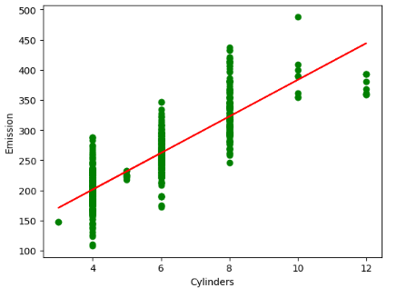
После завершения построения моделей выполнялось сравнение коэффициентов детерминации _R2-score_ для обеих моделей.

Анализ результатов показал, что модель на признаке _ENGINESIZE_ обеспечивает более точное приближение данных по
сравнению с моделью на признаке _CYLINDERS_.

#### Результаты работы

В результате выполнения практической работы были успешно построены две модели простой линейной регрессии:

- модель зависимости _CO2EMISSIONS_ от _ENGINESIZE_,
- модель зависимости _CO2EMISSIONS_ от _CYLINDERS_.

Анализ полученных результатов показал, что между объёмом двигателя и выбросами углекислого газа существует выраженная
линейная зависимость.

Модель, использующая признак _ENGINESIZE_, продемонстрировала более высокое значение коэффициента детерминации
_R2-score_, что свидетельствует о лучшем качестве аппроксимации.

Модель на признаке _CYLINDERS_ показала более низкое качество прогнозирования вследствие дискретного характера признака
и большего разброса значений.

В процессе анализа были сделаны следующие выводы:

- увеличение объёма двигателя приводит к росту выбросов углекислого газа,
- увеличение количества цилиндров также увеличивает выбросы,
- признак _ENGINESIZE_ является более информативным для задачи прогнозирования,
- метод простой линейной регрессии позволяет эффективно выявлять линейные зависимости между признаками.

#### Вывод

В ходе выполнения практической работы были получены практические навыки применения метода простой линейной регрессии (
_Simple Linear Regression_) для анализа зависимостей между характеристиками автомобилей и выбросами углекислого газа.

В процессе выполнения работы были реализованы следующие этапы:

- загрузка и анализ исходного датасета,
- визуализация распределения признаков,
- построение диаграмм рассеяния,
- разбиение данных на обучающую и тестовую выборки,
- обучение моделей линейной регрессии,
- вычисление метрик качества моделей,
- сравнение результатов различных моделей.

Построенные модели продемонстрировали наличие устойчивой линейной зависимости между характеристиками двигателя и уровнем
выбросов _CO2EMISSIONS_.

Наиболее качественные результаты показала модель, использующая признак _ENGINESIZE_.

Метод простой линейной регрессии подтвердил эффективность применения для задач прогнозирования непрерывных величин и
анализа статистических зависимостей в инженерных и транспортных данных.

}

[//]: # ( Практическая работа №17){

#### Цель работы

Целью данной практической работы является получение практических навыков построения и анализа моделей множественной
линейной регрессии (_Multiple Linear Regression_) для прогнозирования выбросов углекислого газа автомобилями на основе
нескольких характеристик двигателя и расхода топлива.

#### Исходные данные

В качестве исходных данных использовался датасет _FuelConsumption.csv_, содержащий сведения о характеристиках
автомобилей и объёмах выбросов углекислого газа.

В набор данных входили следующие признаки:
- объём двигателя (_ENGINESIZE_),
- количество цилиндров (_CYLINDERS_),
- комбинированный расход топлива (_FUELCONSUMPTION_COMB_),
- расход топлива в городе (_FUELCONSUMPTION_CITY_),
- расход топлива на трассе (_FUELCONSUMPTION_HWY_),
- выбросы углекислого газа (_CO2EMISSIONS_).

В рамках практической работы строились две модели множественной линейной регрессии.

Первая модель использовала следующие признаки:
- _ENGINESIZE_,
- _CYLINDERS_,
- _FUELCONSUMPTION_COMB_.

Вторая модель использовала следующие признаки:
- _ENGINESIZE_,
- _CYLINDERS_,
- _FUELCONSUMPTION_CITY_,
- _FUELCONSUMPTION_HWY_.

Целевой переменной в обеих моделях являлся показатель _CO2EMISSIONS_.

#### Оборудование и ПО

Работа выполнялась с применением следующего программного обеспечения:
- операционная система _Ubuntu 22.04_,
- язык программирования _Python 3_,
- среда разработки _Jupyter Notebook_,
- библиотека _pandas_ для обработки табличных данных,
- библиотека _numpy_ для математических операций,
- библиотека _matplotlib_ для построения графиков,
- библиотека _scikit-learn_ для построения моделей машинного обучения.

#### Ход выполнения работы

Работа выполнялась в среде _Jupyter Notebook_ через платформу _JupyterHub_.

На первом этапе производился импорт необходимых библиотек: _matplotlib_, _pandas_, _numpy_ и модуля _pylab_.

После импорта библиотек выполнялась загрузка датасета _FuelConsumption.csv_ при помощи функции _pd.read_csv()_.
Загруженные данные сохранялись в датафрейм _df_.

Для первичного анализа структуры данных использовались методы _head()_ и _describe()_, позволяющие вывести первые строки
таблицы и статистические характеристики признаков.

На следующем этапе из датафрейма отбирались признаки, необходимые для построения моделей множественной линейной
регрессии. Для этого формировался датафрейм _cdf_, включающий столбцы _ENGINESIZE_, _CYLINDERS_, _FUELCONSUMPTION_COMB_,
_FUELCONSUMPTION_CITY_, _FUELCONSUMPTION_HWY_ и _CO2EMISSIONS_.

После подготовки данных выполнялось исследование распределения признаков. Для визуального анализа строились гистограммы
признаков с использованием метода _hist()_.

Дополнительно строились диаграммы рассеяния зависимости выбросов _CO2EMISSIONS_ от признаков _FUELCONSUMPTION_COMB_,
_ENGINESIZE_ и _CYLINDERS_.

Графики показали наличие выраженной положительной линейной зависимости между расходом топлива, объёмом двигателя и
уровнем выбросов углекислого газа.

На следующем этапе выполнялось разбиение данных на обучающую и тестовую выборки. Для формирования случайной маски
использовалась функция _np.random.rand()_.

В обучающую выборку попадало около 80% исходных данных, оставшиеся 20% использовались в качестве тестовой выборки.

После подготовки данных выполнялось построение первой модели множественной линейной регрессии.

Для обучения первой модели использовались признаки:
- _ENGINESIZE_,
- _CYLINDERS_,
- _FUELCONSUMPTION_COMB_.

Обучение выполнялось с использованием класса _LinearRegression_ из библиотеки _scikit-learn_.

Матрица признаков формировалась методом _np.asanyarray()_, после чего выполнялось обучение модели методом _fit()_.

После завершения обучения выводились коэффициенты модели и свободный член регрессионного уравнения.

Далее выполнялось прогнозирование значений _CO2EMISSIONS_ на тестовой выборке методом _predict()_.

Качество модели оценивалось по следующим метрикам:
- среднеквадратичная ошибка (_MSE_),
- коэффициент детерминации (_R2-score_),
- процент точности модели.

На рисунке 3 представлены результаты работы первой модели множественной линейной регрессии.

После анализа первой модели выполнялось построение альтернативной модели множественной линейной регрессии.

Во второй модели признак _FUELCONSUMPTION_COMB_ заменялся двумя отдельными признаками:
- _FUELCONSUMPTION_CITY_,
- _FUELCONSUMPTION_HWY_.

Таким образом, модель учитывала расход топлива отдельно для городского и трассового режимов эксплуатации автомобиля.

Обучение альтернативной модели выполнялось аналогично первой модели с использованием метода _fit()_.

После завершения обучения вычислялись прогнозируемые значения выбросов углекислого газа и рассчитывались метрики
качества модели.

Результаты второй модели сравнивались с результатами первой модели.

На рисунке 4 представлены результаты альтернативной модели множественной линейной регрессии.

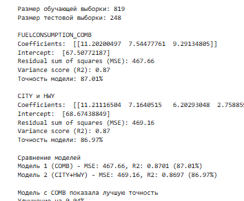
После вычисления метрик выполнялось итоговое сравнение моделей.

Если значение коэффициента детерминации _R2-score_ второй модели превышало показатель первой модели, делался вывод о
повышении точности прогнозирования при использовании отдельных признаков расхода топлива.

Анализ результатов показал, что раздельное использование признаков _FUELCONSUMPTION_CITY_ и _FUELCONSUMPTION_HWY_
позволяет получить немного более высокую точность прогнозирования по сравнению с использованием комбинированного расхода
топлива.

#### Результаты работы

В результате выполнения практической работы были успешно построены две модели множественной линейной регрессии для
прогнозирования выбросов углекислого газа автомобилями.

Первая модель использовала признаки _ENGINESIZE_, _CYLINDERS_ и _FUELCONSUMPTION_COMB_ и продемонстрировала высокое
качество прогнозирования.

Вторая модель использовала признаки _ENGINESIZE_, _CYLINDERS_, _FUELCONSUMPTION_CITY_ и _FUELCONSUMPTION_HWY_.

Сравнение результатов показало следующее:
- обе модели обеспечивают высокое качество аппроксимации,
- модель с признаками _CITY_ и _HWY_ демонстрирует немного более высокую точность,
- наибольшее влияние на значение _CO2EMISSIONS_ оказывает расход топлива,
- признак _CYLINDERS_ оказывает меньшее влияние по сравнению с расходом топлива и объёмом двигателя.

Анализ коэффициентов моделей подтвердил наличие линейной зависимости между характеристиками автомобиля и уровнем
выбросов углекислого газа.

Полученные результаты продемонстрировали, что использование нескольких признаков одновременно позволяет существенно
повысить точность прогнозирования по сравнению с простой линейной регрессией.

#### Вывод

В ходе выполнения практической работы были получены практические навыки построения моделей множественной линейной
регрессии (_Multiple Linear Regression_) для решения задач прогнозирования.

В процессе выполнения работы были реализованы следующие этапы:
- загрузка и анализ исходного датасета,
- визуализация распределений признаков,
- построение диаграмм рассеяния,
- разбиение данных на обучающую и тестовую выборки,
- обучение моделей множественной линейной регрессии,
- вычисление метрик качества моделей,
- сравнительный анализ результатов.

Построенные модели продемонстрировали высокое качество прогнозирования выбросов углекислого газа.

Использование нескольких признаков одновременно позволило существенно повысить точность моделей по сравнению с простой
линейной регрессией.

Наиболее высокую точность продемонстрировала модель, использующая отдельные признаки расхода топлива в городе и на
трассе.

Метод множественной линейной регрессии подтвердил эффективность применения для анализа многомерных зависимостей и
прогнозирования непрерывных величин на основе нескольких числовых признаков.

}

[//]: # (Практическая работа №18){

## Машинное обучение. Нелинейная регрессия (Non-Linear Regression)

#### Цель работы

Целью работы являлось изучение методов нелинейной регрессии и получение практических навыков построения моделей
аппроксимации данных с использованием нелинейных функций. В процессе выполнения работы выполнялось исследование динамики
роста валового внутреннего продукта Китая, построение сигмоидальной и экспоненциальной моделей, а также сравнительный
анализ качества аппроксимации.

#### Исходные данные

В качестве исходных данных использовался набор данных _china_gdp.csv_, содержащий статистику изменения валового
внутреннего продукта Китая по годам.

Набор данных включал следующие параметры:

- год наблюдения (_Year_),
- значение валового внутреннего продукта (_Value_).

Для построения моделей применялись методы нелинейной регрессии с использованием:

- сигмоидальной функции,
- экспоненциальной функции.

Анализ выполнялся в среде _Jupyter Notebook_ с использованием библиотек научных вычислений и машинного обучения.

Перед построением моделей выполнялась проверка структуры данных, отображение первых строк таблицы и визуальный анализ
распределения значений ВВП по годам.

#### Оборудование и ПО

В процессе выполнения лабораторной работы использовались следующие программные и аппаратные средства:

- операционная система _Ubuntu 22.04_,
- язык программирования _Python_,
- среда разработки _Jupyter Notebook_,
- библиотека _Pandas_,
- библиотека _NumPy_,
- библиотека _Matplotlib_,
- библиотека _SciPy_,
- библиотека _Scikit-learn_.

Для выполнения вычислений использовался персональный компьютер с установленным программным обеспечением для анализа
данных и построения моделей машинного обучения.

#### Ход выполнения работы

На начальном этапе выполнения работы была произведена подготовка рабочей среды и импорт необходимых библиотек:
_Pandas_, _NumPy_, _Matplotlib_, _SciPy_ и _Scikit-learn_.

После настройки среды выполнялась загрузка набора данных _china_gdp.csv_ с использованием функции _pd.read_csv()_.
Затем отображались первые строки таблицы для анализа структуры данных.

На рисунке 1 представлен результат загрузки исходного набора данных.

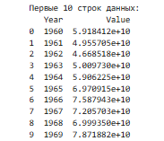
После загрузки данных выполнялась визуализация зависимости ВВП Китая от года наблюдения.
Для построения графика использовалась функция _plot()_ библиотеки _Matplotlib_.
Полученный график показал выраженную нелинейную тенденцию роста.

На следующем этапе была реализована сигмоидальная функция:

Сигмоидальная функция хорошо подходит для описания процессов, имеющих ограничение роста и насыщение системы.

Для подбора параметров сигмоидальной модели использовалась функция _curve_fit()_ библиотеки _SciPy_.
Перед обучением выполнялась нормализация входных данных:

- значения годов масштабировались относительно максимального года,
- значения ВВП масштабировались относительно максимального значения ВВП.

После подбора параметров вычислялись прогнозные значения модели и выполнялась оценка качества аппроксимации с помощью
метрики _R²-score_.

На рисунке 2 представлен результат аппроксимации данных сигмоидальной функцией.

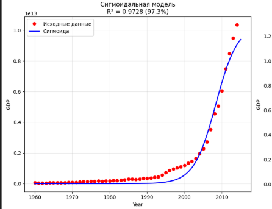
На следующем этапе выполнялось построение альтернативной модели с использованием экспоненциальной функции:

Экспоненциальная модель применяется для описания процессов постоянного ускоренного роста.

Для построения модели выполнялось:

- преобразование временной шкалы,
- нормализация данных,
- подбор параметров функции методом нелинейной оптимизации,
- вычисление прогнозных значений,
- оценка качества модели по метрике _R²-score_.

После обучения модели выполнялась визуализация результатов аппроксимации.
Дополнительно строился график в логарифмической шкале, позволяющий оценить характер экспоненциального роста.

На рисунке 3 представлен результат аппроксимации данных экспоненциальной функцией.

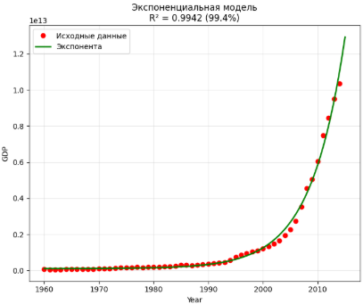
На заключительном этапе выполнялось сравнение качества сигмоидальной и экспоненциальной моделей.
Для сравнения использовались значения коэффициента детерминации _R²-score_.

Анализ результатов показал, что сигмоидальная модель обеспечивает более высокое качество аппроксимации, поскольку рост
ВВП Китая имеет выраженный S-образный характер и не соответствует бесконечному экспоненциальному увеличению.

#### Результаты работы

В результате выполнения лабораторной работы были построены и исследованы две модели нелинейной регрессии для анализа
динамики роста ВВП Китая.

В ходе выполнения работы были получены следующие результаты:

- выполнена загрузка и анализ набора данных _china_gdp.csv_,
- произведена визуализация динамики изменения ВВП,
- построена сигмоидальная модель нелинейной регрессии,
- построена экспоненциальная модель аппроксимации,
- выполнено сравнение моделей по метрике _R²-score_,
- исследован характер роста экономических показателей.

Сигмоидальная модель продемонстрировала более высокое качество аппроксимации по сравнению с экспоненциальной моделью.
Полученные результаты подтвердили, что динамика роста ВВП Китая имеет S-образный характер и содержит признаки
постепенного насыщения.

Экспоненциальная модель показала более низкое качество аппроксимации, поскольку не учитывает замедление роста на поздних
этапах развития системы.

#### Вывод

В ходе выполнения практической работы были изучены методы нелинейной регрессии и выполнено построение моделей
аппроксимации данных средствами библиотеки _SciPy_.

Были освоены методы:

- загрузки и подготовки данных,
- нормализации признаков,
- построения сигмоидальных и экспоненциальных моделей,
- оценки качества аппроксимации,
- визуализации результатов нелинейной регрессии.

Проведенный анализ показал, что сигмоидальная модель является более подходящей для описания процессов, содержащих этапы
ускоренного роста и насыщения. Экспоненциальная модель эффективна только для ограниченного диапазона данных, где рост
не имеет признаков стабилизации.

В результате выполнения работы были получены практические навыки применения методов нелинейной регрессии для анализа
экономических показателей и прогнозирования динамики сложных процессов в среде _Jupyter Notebook_.
}
[//]: # ( Практическая работа №19){

# Практическая работа №19

## Машинное обучение. Сверточные нейронные сети _CNN_

#### Цель работы

Целью данной практической работы являлось изучение принципов построения и обучения сверточных нейронных сетей (_Convolutional Neural Network_) для решения задач классификации изображений. В процессе выполнения работы выполнялось построение и сравнение двух архитектур нейронных сетей на наборе данных _CIFAR-10_, а также анализ влияния изменения ширины сети на качество классификации изображений.

#### Исходные данные

В качестве исходных данных использовался набор изображений _CIFAR-10_, входящий в состав библиотеки _Torchvision_.
Набор данных содержит цветные изображения размером 32×32 пикселя, относящиеся к десяти различным категориям объектов.

Для классификации использовались следующие классы изображений:
    - самолет (_plane_),
    - автомобиль (_car_),
    - птица (_bird_),
    - кошка (_cat_),
    - олень (_deer_),
    - собака (_dog_),
    - лягушка (_frog_),
    - лошадь (_horse_),
    - корабль (_ship_),
    - грузовик (_truck_).

Обучающая выборка содержала 50000 изображений, а тестовая выборка — 10000 изображений.
Перед обучением выполнялась нормализация изображений с использованием метода _Normalize()_, а также преобразование изображений в тензоры с помощью функции _ToTensor()_.

В рамках практической работы исследовались две архитектуры сверточных нейронных сетей:
    - базовая модель с параметрами сверток 3→6→16,
    - модифицированная модель с увеличенной шириной сети 3→7→17.

Целью сравнения являлось исследование влияния увеличения количества каналов сверточных слоев на итоговую точность классификации изображений.

#### Оборудование и ПО

Работа выполнялась с использованием следующего программного обеспечения:
    - операционная система _Ubuntu 22.04_,
    - язык программирования _Python 3_,
    - среда разработки _Jupyter Notebook_,
    - библиотека _PyTorch_,
    - библиотека _Torchvision_,
    - библиотека _NumPy_,
    - библиотека _Matplotlib_.

Для выполнения вычислений использовался персональный компьютер с поддержкой вычислений на _CPU_ и возможностью использования _CUDA_ при наличии графического ускорителя.

#### Ход выполнения работы

На первом этапе выполнялась подготовка рабочей среды и импорт необходимых библиотек.
Для построения и обучения нейронных сетей использовалась библиотека _PyTorch_, а для загрузки изображений применялись средства библиотеки _Torchvision_.

После настройки среды выполнялось создание преобразований изображений.
С использованием функции _Compose()_ задавалась последовательность обработки данных, включающая преобразование изображений в тензоры и нормализацию значений пикселей.

Далее выполнялась загрузка набора данных _CIFAR-10_.
Обучающая и тестовая выборки загружались с помощью класса _CIFAR10_.
Для пакетной обработки данных применялся объект _DataLoader_, обеспечивающий формирование батчей и случайное перемешивание изображений.

В процессе анализа исходных данных выполнялись следующие действия:
    - загрузка обучающей и тестовой выборок,
    - отображение примеров изображений,
    - анализ распределения классов,
    - проверка размеров выборок,
    - исследование структуры данных.

На рисунке 1 представлен результат загрузки набора данных _CIFAR-10_ и отображение примеров изображений.

После подготовки данных выполнялось построение первой сверточной нейронной сети.
Базовая архитектура содержала два сверточных слоя, два слоя субдискретизации _MaxPool2d_ и три полносвязных слоя.

Первая модель включала следующие параметры:
    - первый сверточный слой: 3→6 каналов,
    - второй сверточный слой: 6→16 каналов,
    - функция активации _ReLU_,
    - функция потерь _CrossEntropyLoss_,
    - оптимизатор _SGD_ с моментом.

Обучение сети выполнялось в течение двух эпох.
На каждом шаге обучения вычислялось значение функции потерь, после чего выполнялось обратное распространение ошибки методом _backpropagation_ и обновление параметров сети.

В процессе обучения выполнялся вывод промежуточных значений функции потерь, что позволяло анализировать скорость сходимости модели и стабильность процесса оптимизации.

После завершения обучения выполнялась проверка модели на тестовой выборке.
Для оценки качества классификации вычислялась общая точность модели, а также точность отдельно по каждому классу изображений.

На рисунке 2 представлен результат обучения базовой модели сверточной нейронной сети и оценка качества классификации изображений.

На следующем этапе выполнялось построение второй архитектуры нейронной сети.
В модифицированной модели увеличивалось количество выходных каналов сверточных слоев:
    - первый сверточный слой: 3→7 каналов,
    - второй сверточный слой: 7→17 каналов.

Остальная структура сети оставалась аналогичной базовой модели.
Увеличение ширины сети позволяло исследовать влияние количества признаковых карт на качество классификации изображений.

После создания модели выполнялось повторное обучение сети на том же наборе данных.
Обучение производилось с использованием аналогичных параметров оптимизации и количества эпох, что обеспечивало корректность сравнения результатов двух моделей.

В процессе тестирования вычислялась итоговая точность классификации, а также анализировалась точность распознавания отдельных классов изображений.

На рисунке 3 представлено сравнение результатов работы базовой и модифицированной моделей сверточных нейронных сетей.

После завершения тестирования выполнялся сравнительный анализ двух моделей.
Сравнение проводилось по следующим критериям:
    - общая точность классификации,
    - точность распознавания отдельных классов,
    - количество параметров модели,
    - влияние увеличения ширины сети на качество классификации.

В ходе анализа было установлено, что изменение количества каналов сверточных слоев оказывает влияние на качество распознавания изображений.
При увеличении ширины сети возрастает количество обучаемых параметров, что позволяет модели извлекать большее количество признаков из входных изображений.

Дополнительно выполнялась визуализация результатов сравнения моделей.
Строились диаграммы общей точности, графики точности по классам и отображение характеристик архитектур обеих нейронных сетей.

#### Результаты работы

В результате выполнения практической работы были построены и исследованы две модели сверточных нейронных сетей для классификации изображений набора данных _CIFAR-10_.

В ходе выполнения работы были получены следующие результаты:
    - выполнена загрузка и подготовка набора данных _CIFAR-10_,
    - произведена нормализация изображений,
    - сформированы обучающая и тестовая выборки,
    - построена базовая модель сверточной нейронной сети,
    - построена модифицированная модель с увеличенной шириной сети,
    - выполнено обучение обеих моделей,
    - произведена оценка качества классификации,
    - выполнено сравнение архитектур по точности распознавания изображений.

В процессе тестирования была получена точность классификации изображений для обеих моделей.
Базовая модель продемонстрировала устойчивую работу и обеспечила корректную классификацию значительной части изображений тестовой выборки.

Модифицированная модель с увеличенной шириной сети показала изменение итоговой точности классификации по сравнению с базовой архитектурой.
Увеличение количества каналов позволило расширить количество извлекаемых признаков, однако одновременно привело к увеличению количества параметров и вычислительной нагрузки.

Анализ точности по отдельным классам показал, что некоторые категории изображений классифицируются значительно лучше других.
Наиболее высокие значения точности наблюдались для классов с ярко выраженными визуальными признаками, тогда как категории со схожими характеристиками вызывали большее количество ошибок классификации.

Проведенный анализ подтвердил эффективность применения сверточных нейронных сетей для решения задач классификации изображений и продемонстрировал влияние архитектуры сети на итоговое качество распознавания объектов.

#### Вывод

В ходе выполнения практической работы были изучены методы построения и обучения сверточных нейронных сетей средствами библиотеки _PyTorch_.
Выполнено исследование набора данных _CIFAR-10_, подготовка изображений и построение моделей классификации изображений.

Были освоены методы загрузки изображений, формирования батчей, настройки архитектуры сверточной нейронной сети и оценки качества классификации.
Проведенный анализ показал, что сверточные нейронные сети являются эффективным инструментом решения задач компьютерного зрения и позволяют выполнять автоматическое распознавание объектов на изображениях.

В процессе выполнения работы были получены практические навыки обучения моделей глубокого обучения, настройки параметров оптимизации и анализа результатов классификации.
Исследование влияния ширины сети позволило определить особенности изменения качества классификации при увеличении количества признаковых карт сверточных слоев.

Полученные результаты подтвердили эффективность применения сверточных нейронных сетей для решения задач классификации изображений в среде _Jupyter Notebook_.

}
[//]: # ( Практическая работа №20){

#### Цель работы

Целью данной практической работы является получение теоретических знаний и практических навыков применения современных
моделей обработки естественного языка (_Natural Language Processing_) с использованием библиотеки _Transformers_ для
решения задач автоматического суммирования текста, анализа тональности и генерации текста.

#### Исходные данные

В качестве исходных данных использовались открытые наборы данных, загружаемые через библиотеку _datasets_ из
репозитория _Hugging Face_.

Для задачи автоматического суммирования использовался датасет _xsum_, содержащий новостные статьи и их краткие
аннотации.
Из обучающей выборки выбирались первые 10 записей для тестирования модели генерации краткого содержания текста.

Для задачи анализа тональности использовался датасет _poem_sentiment_, содержащий текстовые фрагменты стихотворений и
метки эмоциональной окраски.
Набор данных включал четыре класса тональности:

- negative,
- positive,
- no_impact,
- mixed.

Для генерации текста методом _Few-shot Learning_ использовалась языковая модель _EleutherAI/gpt-neo-1.3B_.
В качестве входных данных применялся текстовый шаблон с примерами соответствия блюд и рекомендуемых напитков.

В процессе выполнения работы использовались следующие модели:

- _t5-small_ для автоматического суммирования текста,
- _bert-base-uncased-poems-sentiment_ для классификации тональности,
- _gpt-neo-1.3B_ для генерации текста.

#### Оборудование и ПО

Работа выполнялась с применением следующего программного обеспечения:

- операционная система _Ubuntu 22.04_,
- язык программирования _Python 3_,
- среда разработки _Jupyter Notebook_,
- библиотека _Pandas_,
- библиотека _Datasets_,
- библиотека _Transformers_,
- библиотека _PyTorch_.

Для выполнения вычислений использовался персональный компьютер с установленной средой анализа данных и библиотеками
машинного обучения.

#### Ход выполнения работы

Работа выполнялась в среде _Jupyter Notebook_.
После подготовки рабочей среды производился импорт библиотек _datasets_, _transformers_, _pandas_, _pathlib_ и
вспомогательных компонентов для отображения результатов.

На первом этапе выполнялась загрузка датасета _xsum_.
Для чтения набора данных использовалась функция _load_dataset()_.
После загрузки выводилась структура датасета и первые записи обучающей выборки.

На рисунке 1 представлен результат загрузки датасета _xsum_ и отображение первых строк выборки.

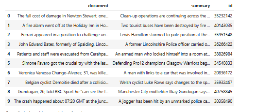
После загрузки данных выполнялось построение модели автоматического суммирования текста.
Для этого создавался объект _pipeline_ с задачей _summarization_ и моделью _t5-small_.
В процессе настройки задавались параметры минимальной и максимальной длины итогового текста, а также режим усечения
последовательностей.

Для тестирования модели выбирался первый документ из выборки _xsum_sample_.
Метод _summarizer()_ формировал краткое содержание исходного текста.
После проверки единичного примера выполнялась генерация суммаризаций для всех десяти документов выборки.

Полученные результаты преобразовывались в датафрейм _Pandas_.
Таблица включала следующие поля:

- автоматически сгенерированное краткое содержание,
- эталонное краткое содержание,
- исходный текст документа.

На рисунке 2 представлен результат автоматического суммирования текста моделью _t5-small_.

На следующем этапе выполнялась загрузка датасета _poem_sentiment_.
Из обучающей выборки выбирались первые десять текстовых фрагментов стихотворений.
После загрузки данных выполнялось построение модели анализа тональности.

Для классификации использовался объект _pipeline_ с задачей _text-classification_ и моделью
_bert-base-uncased-poems-sentiment_.
Модель определяла эмоциональную окраску текстовых фрагментов и вычисляла вероятность принадлежности к каждому классу.

Результаты классификации объединялись с исходными данными в единый датафрейм.
Числовые метки классов преобразовывались в текстовые значения с помощью словаря _sentiment_labels_.

В процессе анализа выполнялось сравнение предсказанных значений и истинных меток тональности.
Дополнительно анализировались вероятности классификации, выводимые моделью.

На рисунке 3 представлен результат анализа тональности текстов стихотворений.

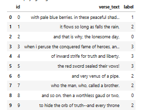
На заключительном этапе выполнялось исследование генерации текста методом _Few-shot Learning_.
Создавался объект _pipeline_ с задачей _text-generation_ и моделью _EleutherAI/gpt-neo-1.3B_.

В качестве входных данных использовался текстовый шаблон, содержащий несколько примеров сопоставления блюд и напитков.
Модель анализировала закономерность примеров и формировала продолжение текста для нового объекта.

Для ограничения генерации использовался параметр _max_new_tokens_.
Также задавался специальный токен окончания последовательности _eos_token_id_, предотвращающий генерацию лишнего текста.

После запуска модели выполнялся вывод сгенерированного результата.
Модель успешно подобрала рекомендуемый напиток для нового блюда на основе ранее представленных примеров.

На рисунке 4 представлен результат генерации текста моделью _gpt-neo-1.3B_ методом _Few-shot Learning_.

В процессе выполнения практической работы также анализировались особенности использования предварительно обученных
моделей.
Было установлено, что библиотека _Transformers_ позволяет эффективно решать широкий спектр задач обработки естественного
языка без необходимости самостоятельного обучения нейронных сетей с нуля.

Использование механизма _pipeline_ существенно упрощает процесс применения моделей, скрывая внутренние детали
токенизации, подготовки входных данных и выполнения инференса.

Дополнительно выполнялось исследование производительности моделей.
Наибольшие вычислительные затраты наблюдались при использовании модели _gpt-neo-1.3B_, что связано с большим числом
параметров языковой модели.
Модели _t5-small_ и _bert-base-uncased-poems-sentiment_ демонстрировали значительно более высокую скорость обработки
данных при меньших требованиях к вычислительным ресурсам.

#### Результаты работы

В результате выполнения практической работы были исследованы методы обработки естественного языка с использованием
предварительно обученных моделей библиотеки _Transformers_.

В ходе выполнения работы были получены следующие результаты:

- выполнена загрузка и анализ текстовых датасетов,
- построена модель автоматического суммирования текста,
- выполнен анализ тональности стихотворных текстов,
- исследована генерация текста методом _Few-shot Learning_,
- произведено сравнение результатов работы различных моделей,
- выполнен анализ качества генерации и классификации текста.

Проведённый анализ показал, что модель _t5-small_ успешно формирует краткие и информативные суммаризации новостных
статей.
Модель _bert-base-uncased-poems-sentiment_ продемонстрировала высокое качество определения эмоциональной окраски
текстов.
Модель _gpt-neo-1.3B_ успешно выполняла генерацию текста на основе нескольких примеров, демонстрируя возможности
подхода _Few-shot Learning_.

Дополнительно было установлено, что использование готовых моделей библиотеки _Transformers_ значительно сокращает время
разработки систем обработки естественного языка и позволяет применять современные методы машинного обучения без
необходимости длительного обучения моделей на собственных данных.

#### Вывод

В ходе выполнения практической работы были получены практические навыки применения библиотеки _Transformers_ для решения
задач обработки естественного языка.

Выполнены следующие этапы работы:

- загрузка текстовых наборов данных средствами библиотеки _datasets_,
- построение модели автоматического суммирования текста,
- выполнение классификации тональности текстов,
- исследование генерации текста методом _Few-shot Learning_,
- анализ результатов работы предварительно обученных моделей.

Использование моделей _t5-small_, _bert-base-uncased-poems-sentiment_ и _gpt-neo-1.3B_ позволило изучить различные
подходы к обработке текстовой информации и продемонстрировало эффективность современных методов машинного обучения в
задачах анализа и генерации текста.

Библиотека _Transformers_ обеспечивает удобный интерфейс для работы с предварительно обученными нейронными сетями и
позволяет быстро создавать интеллектуальные системы обработки естественного языка в среде _Jupyter Notebook_.

}
