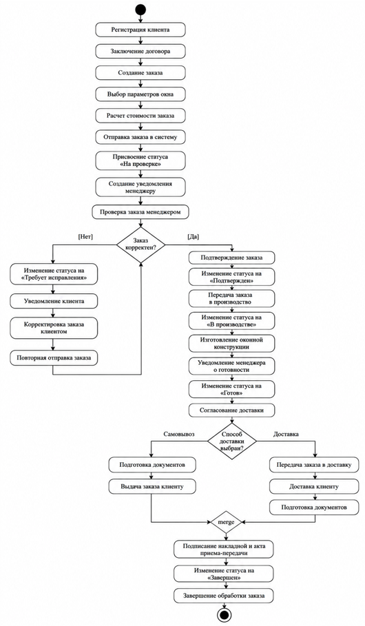
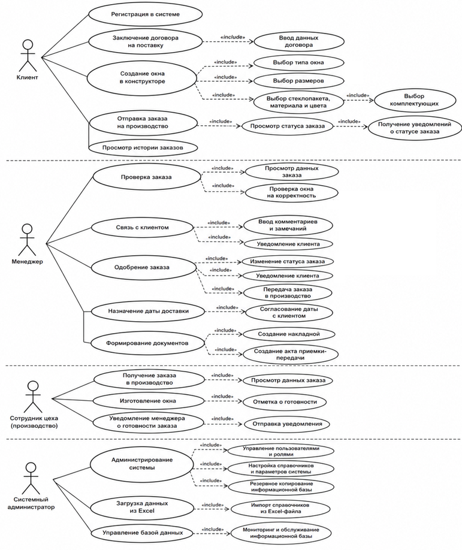
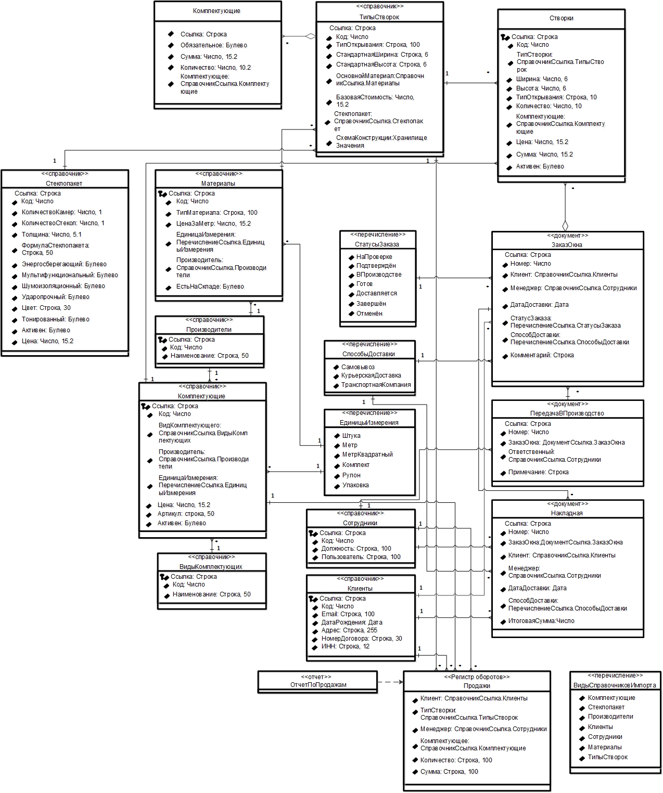

[//]: # (ОГЛАВЛЕНИЕ )

[//]: ### (ВВЕДЕНИЕ){

Современные предприятия по производству окон осуществляют большое количество операций, связанных с обработкой заказов
клиентов, учетом материалов, производством продукции, складским учетом, ведением бухгалтерского и налогового учета, а
также формированием обязательной отчетности. Выполнение указанных операций вручную приводит к увеличению времени
обработки информации, возникновению ошибок и снижению эффективности управления предприятием.

Для повышения эффективности деятельности предприятия требуется внедрение информационной системы, обеспечивающей
автоматизацию основных бизнес-процессов организации. В качестве платформы разработки используется -1С:Предприятие 8.3-,
предназначенная для создания корпоративных информационных систем и автоматизации учета.

Целью курсовой работы является разработка информационной системы предприятия по производству окон на платформе -1С:
Предприятие 8.3-.

В рамках выполнения курсовой работы необходимо решить следующие задачи:

1. Выполнить постановку задачи и описание предметной области.
2. Разработать модели бизнес-процессов предметной области в виде -UML--диаграмм деятельности.
3. Построить функциональную модель информационной системы в виде диаграммы прецедентов.
4. Разработать объектно-ориентированную модель прикладных объектов конфигурации в виде диаграммы классов.
5. Реализовать информационную систему на платформе -1С:Предприятие 8.3-.
6. Разработать процедуры проведения документов по регистрам.
7. Разработать отчеты с помощью системы компоновки данных.
8. Реализовать программную обработку событий форм и модулей объектов.

}

[//]: ### (1. Постановка задачи. Краткое описание предметной области.){

Предприятие по производству окон осуществляет изготовление оконных конструкций по индивидуальным заказам клиентов.
В процессе деятельности организации выполняются следующие операции: прием и регистрация заказов, расчет стоимости
изделий, организация производственного процесса, учет материалов и комплектующих, а также передача готовой продукции
заказчику.

В условиях отсутствия автоматизированной информационной системы выполнение перечисленных операций осуществляется
вручную, что приводит к следующим проблемам:

1. Увеличение времени обработки заказов вследствие ручного ввода данных.
2. Возникновение ошибок при расчете стоимости изделий.
3. Отсутствие оперативного контроля состояния заказов на всех этапах производства.
4. Затрудненное взаимодействие между подразделениями предприятия.
5. Отсутствие аналитической отчетности по деятельности предприятия.

Целью разработки информационной системы является автоматизация основных бизнес-процессов предприятия [7].
Для достижения поставленной цели необходимо обеспечить выполнение следующих функциональных требований:

1. Регистрация клиентов и ведение базы заказчиков.
2. Автоматизированное формирование заказов с расчетом стоимости.
3. Контроль жизненного цикла заказа с использованием системы статусов.
4. Автоматическое уведомление менеджера о поступлении новых заказов.
5. Передача подтвержденных заказов в производственное подразделение.
6. Учет расходования материалов и комплектующих.
7. Формирование аналитической отчетности по заказам и производственным ресурсам.

Предметная область охватывает деятельность трех категорий пользователей: клиентов, менеджеров и сотрудников
производственного подразделения. Взаимодействие между участниками осуществляется посредством разрабатываемой
информационной системы, реализованной на платформе -1С:Предприятие 8.3- [2].

Основными объектами учета информационной системы являются заказы оконных конструкций, данные о клиентах,
производственные материалы и комплектующие, а также сведения о сотрудниках предприятия. Совокупность перечисленных
объектов образует информационную базу, необходимую для автоматизации полного производственного цикла [4].

}

[//]: ### (2. Разработка моделей бизнес-процессов предметной области в виде UML-диаграмм деятельности){

Разработка информационной системы предприятия по производству окон требует предварительного анализа процессов предметной
области и определения последовательности действий пользователей системы. Перед программной реализацией прикладного
решения необходимо выполнить моделирование основных процессов предприятия для выявления участников взаимодействия, точек
принятия решений и переходов между состояниями заказа [1].

Для решения данной задачи используются -UML--диаграммы деятельности [5]. Диаграмма деятельности представляет собой
инструмент моделирования бизнес-процессов, позволяющий описать последовательность действий пользователей системы,
условия выполнения операций и варианты перехода между этапами обработки данных.

Применение диаграмм деятельности при проектировании информационной системы предприятия по производству окон позволяет
решить следующие задачи:

1. Определить последовательность выполнения операций.
2. Выявить взаимодействие между клиентом, менеджером и производственным подразделением.
3. Формализовать переходы между состояниями заказа.
4. Определить точки принятия решений.
5. Снизить вероятность ошибок при реализации программной логики.

Разрабатываемая информационная система ориентирована на автоматизацию деятельности предприятия, осуществляющего
изготовление оконных конструкций по индивидуальным требованиям клиентов.

Основной особенностью рассматриваемой предметной области является наличие нескольких участников бизнес-процесса,
взаимодействующих между собой на различных этапах обработки заказа.

В рамках проектируемой системы выделяются следующие участники:

1. Клиент.
2. Менеджер.
3. Производственный цех.
4. Информационная система.

Каждый участник выполняет определенный набор операций и взаимодействует с другими элементами системы посредством
обработки данных и изменения состояния заказа.
Начальным этапом работы информационной системы является регистрация клиента.
Для оформления заказа клиент должен пройти процедуру регистрации и заключить договор поставки продукции. Договор
необходим для подтверждения сотрудничества между заказчиком и предприятием.
После завершения регистрации клиент получает доступ к функциональным возможностям системы.
Следующим этапом является формирование заказа.
Пользователь использует конструктор окон для создания изделия с индивидуальными характеристиками.
При создании окна клиент выполняет выбор параметров, перечисленных в таблице 1.

Таблица 1 — Параметры выбора оконной конструкции

| Параметр       | Назначение                               |
|----------------|------------------------------------------|
| Тип створки    | Выбор конструкции окна                   |
| Ширина         | Указание размеров изделия                |
| Высота         | Определение геометрических характеристик |
| Материал       | Выбор материала изготовления             |
| Тип открывания | Настройка функциональности конструкции   |
| Комплектующие  | Выбор дополнительных элементов           |
| Количество     | Определение числа изделий                |

После выбора параметров система автоматически выполняет расчет стоимости заказа.

Расчет производится на основании информации из справочников «Материалы», «Комплектующие» и «ТипыОкон».

В процессе расчета используется программная процедура автоматического формирования итоговой стоимости.

Стоимость заказа определяется составляющими, перечисленными в таблице 2.

Таблица 2 — Составляющие стоимости заказа

| Компонент           | Описание                            |
|---------------------|-------------------------------------|
| Базовая стоимость   | Стоимость типа окна                 |
| Материалы           | Стоимость производственных ресурсов |
| Комплектующие       | Стоимость дополнительных элементов  |
| Размеры конструкции | Влияние площади изделия             |
| Количество изделий  | Общая стоимость заказа              |

После завершения формирования заказа пользователь выполняет отправку данных в информационную систему.

При сохранении документа «ЗаказОкна» автоматически запускаются программные механизмы обработки.
В модуле объекта документа выполняется процедура «ПередЗаписью».
Данная процедура обеспечивает автоматическую установку состояния заказа.
Первоначально заказ получает статус «НаПроверке».
После записи документа выполняется программная процедура «ПриЗаписи».
На данном этапе система автоматически создает уведомление менеджеру посредством регистра сведений
«УведомленияМенеджеров».
Уведомление содержит поля, приведенные в таблице 3.

Таблица 3 — Состав записи уведомления менеджера

| Поле      | Назначение              |
|-----------|-------------------------|
| Заказ     | Идентификатор заказа    |
| Менеджер  | Ответственный сотрудник |
| Текст     | Описание уведомления    |
| Прочитано | Статус просмотра        |

После получения уведомления начинается этап проверки заказа.

Менеджер анализирует корректность введенных клиентом данных.

В рамках проверки осуществляется контроль следующих параметров:

1. Корректность размеров конструкции.
2. Соответствие материалов требованиям производства.
3. Проверка комплектующих.
4. Проверка полноты заполнения документа.
5. Контроль итоговой стоимости.

При обнаружении ошибок используется альтернативный сценарий обработки.

Менеджер связывается с клиентом для корректировки параметров заказа.

После исправления замечаний заказ повторно направляется на проверку.

Для обработки подобного сценария в системе используется дополнительный статус заказа «ТребуетИсправления».

Использование отдельного состояния позволяет повысить прозрачность обработки заказов и обеспечить контроль проблемных
ситуаций.

Если проверка завершена успешно, менеджер выполняет подтверждение заказа.

После одобрения автоматически изменяется состояние заказа.

Статус принимает значение «Подтвержден».

Следующим этапом является передача заказа в производство.

Для выполнения данной операции используется документ «ПередачаВПроизводство».

Проведение документа инициирует программную процедуру «ОбработкаПроведения».

В процессе выполнения проводится проверка состояния заказа.

Передача допускается только при наличии статуса «Подтвержден».

При успешной проверке состояние заказа изменяется.

Заказ получает статус «ВПроизводстве».

После передачи заказа начинается производственный этап.

Сотрудники производственного подразделения выполняют изготовление оконной конструкции согласно параметрам, указанным в
документе.

В процессе производства используются данные, перечисленные в таблице 4.

Таблица 4 — Объекты, используемые в производственном процессе

| Объект        | Назначение                            |
|---------------|---------------------------------------|
| ТипыОкон      | Получение характеристик изделия       |
| Материалы     | Определение производственных ресурсов |
| Комплектующие | Получение состава изделия             |
| ЗаказОкна     | Получение параметров заказа           |

После завершения изготовления изделия сотрудники производства выполняют уведомление менеджера.

Состояние заказа изменяется.

Заказ получает статус «Готов».

После завершения производства начинается этап согласования доставки.

Менеджер связывается с клиентом для определения даты передачи продукции.

Дополнительно определяется способ доставки.

В системе предусмотрены варианты доставки, приведенные в таблице 5.

Таблица 5 — Способы доставки готовой продукции

| Способ               | Описание                               |
|----------------------|----------------------------------------|
| Самовывоз            | Клиент самостоятельно получает изделие |
| КурьерскаяДоставка   | Доставка транспортом предприятия       |
| ТранспортнаяКомпания | Передача стороннему перевозчику        |

После согласования параметров доставки выполняется подготовка документации.

Формируются следующие документы:

1. Накладная.
2. Акт приема-передачи.

Документы подтверждают передачу готовой продукции заказчику и фиксируют завершение обязательств предприятия.

После подписания документов выполняется финальное изменение состояния заказа.

Статус заказа получает значение «Завершен».

При невозможности выполнения заказа может использоваться статус «Отменен».

На рисунке 1 представлена диаграмма деятельности бизнес-процесса обработки заказа оконной конструкции.


Разработанная диаграмма деятельности позволяет формализовать последовательность выполнения операций, определить
взаимодействие участников системы и обеспечить основу для последующей реализации программной логики средствами платформы
«1С:Предприятие 8.3» [2].

}

[//]: ### (3. Построение функциональной модели информационной системы в виде диаграммы прецедентов){

После анализа бизнес-процессов предметной области и построения диаграммы деятельности следующим этапом проектирования
информационной системы является разработка функциональной модели. Функциональная модель предназначена для определения
возможностей системы, выявления состава пользователей и формализации взаимодействия участников с программным
обеспечением [1].

Для описания функциональных возможностей прикладного решения используются диаграммы прецедентов -UML- [5]. Диаграмма
прецедентов позволяет определить состав действующих лиц системы, их роли и набор доступных операций.

Использование диаграммы прецедентов в рамках проектирования информационной системы предприятия по производству окон
обеспечивает решение следующих задач:

1. Определение пользователей системы.
2. Выявление функциональных возможностей программного обеспечения.
3. Формализация взаимодействия между пользователями и системой.
4. Определение границ прикладного решения.
5. Подготовка структуры для дальнейшей программной реализации.

Разрабатываемая информационная система предназначена для автоматизации полного жизненного цикла заказа оконной
конструкции.

Основными участниками взаимодействия являются:

1. Клиент.
2. Менеджер.
3. Сотрудник производственного подразделения.

Каждый пользователь обладает определенным набором функциональных возможностей.

Клиент представляет собой основного пользователя информационной системы.

Взаимодействие клиента начинается с процедуры регистрации.

После создания учетной записи пользователь выполняет заключение договора поставки продукции.

Наличие договора является обязательным условием дальнейшего оформления заказа.

После завершения регистрации клиент получает доступ к функционалу конструктора окон.

Основной задачей клиента является формирование заказа.

При создании изделия пользователь определяет параметры оконной конструкции.

Используемые характеристики изделия представлены в таблице 6.

Таблица 6 — Параметры оконной конструкции, задаваемые клиентом

| Параметр       | Назначение                            |
|----------------|---------------------------------------|
| Тип створки    | Выбор конструкции изделия             |
| Размеры        | Определение геометрических параметров |
| Материал       | Выбор производственного материала     |
| Тип открывания | Настройка механизма открытия          |
| Комплектующие  | Формирование состава изделия          |
| Количество     | Определение объема заказа             |

После настройки параметров пользователь выполняет отправку заказа.

Дополнительно клиент получает возможность отслеживания состояния обработки заявки.

В системе предусмотрены состояния заказа, приведенные в таблице 7.

Таблица 7 — Состояния заказа в информационной системе

| Статус             | Назначение                      |
|--------------------|---------------------------------|
| НаПроверке         | Заказ поступил менеджеру        |
| ТребуетИсправления | Необходима корректировка данных |
| Подтвержден        | Заказ одобрен                   |
| ВПроизводстве      | Выполняется изготовление        |
| Готов              | Изделие изготовлено             |
| Доставляется       | Выполняется передача клиенту    |
| Завершен           | Заказ полностью выполнен        |
| Отменен            | Обработка заказа прекращена     |

Клиент также получает уведомления об изменении состояния заказа.

Функциональные возможности клиента представлены в таблице 8.

Таблица 8 — Функциональные возможности клиента

| Функция               | Назначение                   |
|-----------------------|------------------------------|
| Регистрация           | Создание учетной записи      |
| Заключение договора   | Подтверждение сотрудничества |
| Создание окна         | Работа с конструктором       |
| Выбор параметров      | Настройка изделия            |
| Отправка заказа       | Передача данных менеджеру    |
| Просмотр статуса      | Контроль обработки заказа    |
| Получение уведомлений | Информирование пользователя  |

Следующим участником системы является менеджер.

Менеджер выполняет функции контроля корректности оформления заказов и организации взаимодействия между клиентом и
производственным подразделением.

После поступления заказа система автоматически создает уведомление.

Информация фиксируется в регистре сведений «УведомленияМенеджеров».

Менеджер получает доступ к обработке «УведомленияМенеджера», содержащей список поступивших заявок.

При обработке заказа менеджер выполняет следующие действия:

1. Проверка размеров конструкции.
2. Анализ выбранных материалов.
3. Контроль комплектующих.
4. Проверка корректности заполнения данных.
5. Проверка итоговой стоимости.

При наличии ошибок менеджер инициирует процедуру корректировки заказа.

Система изменяет статус документа на «ТребуетИсправления».

Клиент получает уведомление о необходимости внесения изменений.

После повторной отправки заказ вновь поступает менеджеру.

При успешном прохождении проверки выполняется подтверждение заказа.

Менеджер изменяет состояние документа.

Заказ получает статус «Подтвержден».

Следующим этапом является передача заявки в производство.

Для реализации данного процесса используется документ «ПередачаВПроизводство».

Функциональные возможности менеджера представлены в таблице 9.

Таблица 9 — Функциональные возможности менеджера

| Функция                 | Назначение                             |
|-------------------------|----------------------------------------|
| Проверка заказа         | Контроль корректности данных           |
| Одобрение заказа        | Подтверждение производства             |
| Отклонение заказа       | Возврат клиенту на доработку           |
| Просмотр клиента        | Получение информации о заказчике       |
| Передача в производство | Формирование производственного задания |
| Согласование доставки   | Определение даты передачи              |
| Формирование документов | Создание сопроводительной документации |

Следующим участником системы является сотрудник производственного подразделения.

После подтверждения заказа менеджером производственный отдел получает информацию о необходимости изготовления продукции.

В работе используются параметры изделия, содержащиеся в документе «ЗаказОкна».

После завершения изготовления выполняется изменение состояния заказа.

Менеджеру направляется уведомление о готовности изделия.

Функциональные возможности производственного подразделения представлены в таблице 10.

Таблица 10 — Функциональные возможности производственного подразделения

| Функция               | Назначение                  |
|-----------------------|-----------------------------|
| Получение задания     | Получение параметров заказа |
| Производство изделия  | Изготовление конструкции    |
| Изменение статуса     | Указание этапа выполнения   |
| Уведомление менеджера | Сообщение о готовности      |

После завершения производства менеджер связывается с клиентом.

Производится согласование даты доставки.

Дополнительно определяется способ передачи продукции.

В системе предусмотрены варианты доставки, приведенные в таблице 11.

Таблица 11 — Варианты доставки готовой продукции

| Способ               | Назначение                     |
|----------------------|--------------------------------|
| Самовывоз            | Получение продукции клиентом   |
| КурьерскаяДоставка   | Доставка силами предприятия    |
| ТранспортнаяКомпания | Передача сторонней организации |

После доставки выполняется оформление сопроводительной документации.

Формируются следующие документы:

1. Накладная.
2. Акт приема-передачи.

Подписание документов завершает процесс обработки заказа.

Документ получает статус «Завершен».

На рисунке 2 представлена диаграмма прецедентов информационной системы предприятия по производству окон.



Разработанная функциональная модель позволяет определить состав функций системы, разграничить зоны ответственности
пользователей и обеспечить основу для последующей реализации конфигурации средствами платформы «1С:Предприятие 8.3» [2].

}

[//]: ### (4. Разработка объектно-ориентированной модели прикладных объектов конфигурации в виде диаграммы классов){

Проектирование объектно-ориентированной модели является важным этапом разработки информационной системы, поскольку
позволяет определить состав прикладных объектов конфигурации, их структуру и взаимосвязи между ними. Для формализации
архитектуры прикладного решения используется диаграмма классов -UML- [5], отражающая основные сущности системы и
отношения между ними [1].

Разрабатываемая информационная система предприятия по производству окон реализуется на платформе «1С:Предприятие 8.3». В
качестве прикладных объектов используются справочники, документы, перечисления, регистры сведений и обработки.

В процессе проектирования были выделены основные справочники информационной системы.

Справочник «Клиенты» предназначен для хранения информации о заказчиках предприятия. Объект содержит сведения о
контактных данных клиента, адресе, договоре поставки и идентификационной информации.

Справочник «Сотрудники» используется для хранения сведений о работниках организации. В справочнике фиксируются данные
менеджеров и сотрудников производственного подразделения.

Справочник «Производители» предназначен для хранения информации о поставщиках материалов и комплектующих.

Справочник «Материалы» содержит сведения о материалах, применяемых при изготовлении оконных конструкций. Для каждого
материала определяются тип, единица измерения, стоимость и производитель.

Справочник «Комплектующие» используется для хранения информации о дополнительных элементах оконной конструкции,
включающих фурнитуру и вспомогательные элементы.

Справочник «Стеклопакеты» предназначен для хранения параметров стеклопакетов. В объекте содержатся сведения о количестве
камер, толщине, типе конструкции и дополнительных свойствах.

Справочник «ТипыОкон» используется как шаблон оконных конструкций и содержит базовые характеристики изделий.

Для хранения информации о заказах используется документ «ЗаказОкна». Документ является основным объектом системы и
обеспечивает фиксацию сведений о клиенте, параметрах изделия, стоимости заказа и текущем состоянии выполнения.

Документ «ПередачаВПроизводство» используется для передачи утвержденного заказа в производственное подразделение.

Для организации механизма уведомлений используется регистр сведений «УведомленияМенеджеров», предназначенный для
хранения сообщений о состоянии обработки заказов.

В системе используются перечисления, обеспечивающие унификацию вводимых данных.

Перечисление «СтатусыЗаказа» используется для хранения этапов жизненного цикла заказа.

Перечисление «СпособыДоставки» определяет доступные варианты передачи готовой продукции клиенту.

Перечисление «ЕдиницыИзмерения» применяется для унификации измерения материалов и комплектующих.

Перечисление «ВидыСправочниковИмпорта» используется механизмом загрузки данных из внешних файлов.

В процессе анализа взаимосвязей были определены основные отношения между объектами конфигурации.

Один клиент может формировать несколько заказов.

Один менеджер может сопровождать несколько заказов.

Один производитель может поставлять множество материалов и комплектующих.

Документ «ЗаказОкна» включает состав изделия посредством табличных частей, содержащих сведения о створках и
комплектующих.

Документ «ПередачаВПроизводство» связан с конкретным заказом и обеспечивает передачу данных производственному
подразделению.

Регистр сведений обеспечивает связь уведомлений с менеджером и конкретным заказом.

На рисунке 3 представлена диаграмма классов прикладных объектов конфигурации информационной системы предприятия по
производству окон.



Разработанная объектно-ориентированная модель позволяет определить состав прикладных объектов конфигурации, обеспечить
целостность структуры данных и подготовить основу для последующей реализации информационной системы средствами платформы
«1С:Предприятие 8.3» [2].

}

[//]: ### (5. Программная реализация информационной системы на платформе «1С:Предприятие 8.3»){

Программная реализация информационной системы предприятия по производству окон выполнялась на платформе «1С:Предприятие
8.3» [6]. Разрабатываемая конфигурация предназначена для автоматизации полного жизненного цикла обработки заказа оконной
конструкции, начиная от регистрации клиента и формирования договора поставки, заканчивая передачей готовой продукции и
завершением заказа.

Основной задачей программной реализации являлось создание единого информационного пространства предприятия,
обеспечивающего взаимодействие между клиентами, менеджерами и производственным подразделением.

В рамках разработки конфигурации были реализованы следующие объекты платформы:

1. Перечисления.
2. Справочники.
3. Документы.
4. Регистры сведений.
5. Регистры накопления.
6. Обработки.
7. Отчеты.

Структура конфигурации обеспечивает автоматизацию процессов оформления заказа, контроля производства, учета материалов и
формирования аналитической информации.

В первую очередь были реализованы перечисления, перечисленные в таблице 12.

Таблица 12 — Перечисления конфигурации

| Перечисление            | Назначение                                         |
|-------------------------|----------------------------------------------------|
| СтатусыЗаказа           | Хранение состояний заказа                          |
| СпособыДоставки         | Определение способа доставки                       |
| ЕдиницыИзмерения        | Стандартизация хранения количественных показателей |
| ВидыСправочниковИмпорта | Выбор объекта загрузки данных                      |

Перечисление «СтатусыЗаказа» обеспечивает контроль жизненного цикла заказа.

В системе реализованы следующие состояния:

1. НаПроверке.
2. Подтвержден.
3. ТребуетИсправления.
4. ВПроизводстве.
5. Готов.
6. Доставляется.
7. Завершен.
8. Отменен.

Следующим этапом разработки являлось создание справочников, перечисленных в таблице 13.

Таблица 13 — Справочники конфигурации

| Справочник    | Назначение                            |
|---------------|---------------------------------------|
| Клиенты       | Хранение информации о заказчиках      |
| Сотрудники    | Хранение данных персонала             |
| Комплектующие | Каталог элементов конструкции         |
| Материалы     | Хранение производственных материалов  |
| ТипыОкон      | Хранение шаблонов оконных конструкций |

Справочник «Клиенты» обеспечивает хранение информации о заказчиках предприятия. Состав реквизитов справочника приведен
в таблице 14.

Таблица 14 — Реквизиты справочника «Клиенты»

| Реквизит      | Назначение                 |
|---------------|----------------------------|
| Телефон       | Контактная информация      |
| Email         | Электронная почта          |
| ДатаРождения  | Персональная информация    |
| Адрес         | Адрес доставки             |
| НомерДоговора | Идентификатор договора     |
| ИНН           | Идентификационные сведения |

Справочник «ТипыОкон» используется для функционирования конструктора окон. Состав реквизитов представлен в таблице 15.

Таблица 15 — Реквизиты справочника «ТипыОкон»

| Реквизит          | Назначение                 |
|-------------------|----------------------------|
| ТипОткрывания     | Характеристика конструкции |
| СтандартнаяШирина | Базовый размер             |
| СтандартнаяВысота | Базовый размер             |
| ОсновнойМатериал  | Материал изготовления      |
| БазоваяСтоимость  | Исходная стоимость         |
| СхемаКонструкции  | Хранение структуры окна    |

Для хранения состава конструкции используется табличная часть с полями, приведенными в таблице 16.

Таблица 16 — Структура табличной части справочника «ТипыОкон»

| Поле          | Назначение                     |
|---------------|--------------------------------|
| Комплектующее | Элемент конструкции            |
| Количество    | Количество единиц              |
| Сумма         | Стоимость                      |
| Обязательное  | Признак обязательного элемента |

Центральным объектом прикладного решения является документ «ЗаказОкна».

Документ обеспечивает регистрацию заказа и хранение информации о производимой продукции. Реквизиты документа приведены
в таблице 17.

Таблица 17 — Реквизиты документа «ЗаказОкна»

| Реквизит       | Назначение                |
|----------------|---------------------------|
| Клиент         | Заказчик                  |
| Менеджер       | Ответственный сотрудник   |
| СтатусЗаказа   | Текущее состояние         |
| ДатаДоставки   | Дата передачи изделия     |
| СпособДоставки | Вариант доставки          |
| Комментарий    | Дополнительная информация |
| ИтоговаяСумма  | Общая стоимость           |

Документ содержит табличные части, перечисленные в таблице 18.

Таблица 18 — Табличные части документа «ЗаказОкна»

| Табличная часть | Назначение                    |
|-----------------|-------------------------------|
| Створки         | Параметры оконной конструкции |
| Комплектующие   | Дополнительные элементы       |

Табличная часть «Створки» содержит параметры производимого изделия. Её структура приведена в таблице 19.

Таблица 19 — Структура табличной части «Створки»

| Поле          | Назначение             |
|---------------|------------------------|
| ТипСтворки    | Выбранная конструкция  |
| Ширина        | Размер конструкции     |
| Высота        | Размер конструкции     |
| Материал      | Материал изготовления  |
| ТипОткрывания | Характеристика изделия |
| Количество    | Количество изделий     |
| Цена          | Стоимость единицы      |
| Сумма         | Итоговая стоимость     |

Для автоматизации расчетов реализована серверная процедура «ПересчитатьВсёНаСервере()».

Процедура выполняет следующие операции:

1. Автоматический расчет стоимости материалов.
2. Автоматическое заполнение комплектующих на основе шаблона типа створки.
3. Расчет стоимости конструкции с учетом площади и коэффициента.
4. Формирование итоговой суммы заказа.

После сохранения документа автоматически устанавливается статус «НаПроверке».

Дополнительно выполняется создание уведомления менеджеру.

Для хранения уведомлений используется регистр сведений, структура которого приведена в таблице 20.

Таблица 20 — Регистр сведений «УведомленияМенеджеров»

| Элемент   | Назначение              |
|-----------|-------------------------|
| Заказ     | Идентификатор заказа    |
| Менеджер  | Ответственный сотрудник |
| Текст     | Текст уведомления       |
| Прочитано | Признак просмотра       |

Дополнительно в конфигурации реализованы регистры накопления, перечисленные в таблице 21.

Таблица 21 — Регистры накопления конфигурации

| Регистр                   | Назначение                  |
|---------------------------|-----------------------------|
| ЗаказыВРаботе             | Учет активных заказов       |
| МатериалыПроизводства     | Контроль расхода материалов |
| КомплектующиеПроизводства | Учет комплектующих          |

Для обеспечения взаимодействия пользователей с системой реализованы обработки, перечисленные в таблице 22.

Таблица 22 — Обработки конфигурации

| Обработка            | Назначение                             |
|----------------------|----------------------------------------|
| УведомленияМенеджера | Управление входящими заказами          |
| ЗагрузкаИзExcel      | Загрузка данных из внешних файлов      |
| РабочееМестоЦеха     | Управление производственными заданиями |

Регистры накопления используются для хранения количественных показателей деятельности предприятия.

Регистр накопления «ЗаказыВРаботе» используется для хранения сведений о текущих заказах предприятия. Его структура
приведена в таблице 23.

Таблица 23 — Структура регистра «ЗаказыВРаботе»

| Тип данных | Поле              |
|------------|-------------------|
| Измерение  | Заказ             |
| Измерение  | Клиент            |
| Измерение  | СтатусЗаказа      |
| Ресурс     | КоличествоЗаказов |
| Ресурс     | СуммаЗаказов      |

Регистр накопления «МатериалыПроизводства» обеспечивает учет материалов. Его структура приведена в таблице 24.

Таблица 24 — Структура регистра «МатериалыПроизводства»

| Тип данных | Поле       |
|------------|------------|
| Измерение  | Материал   |
| Ресурс     | Количество |
| Ресурс     | Сумма      |

Регистр накопления «КомплектующиеПроизводства» используется для анализа используемых элементов конструкции. Его
структура приведена в таблице 25.

Таблица 25 — Структура регистра «КомплектующиеПроизводства»

| Тип данных | Поле          |
|------------|---------------|
| Измерение  | Комплектующее |
| Ресурс     | Количество    |
| Ресурс     | Сумма         |

Обработка «УведомленияМенеджера» обеспечивает отображение списка поступивших заказов.

Менеджер получает возможность:

1. Проверки заказа.
2. Подтверждения заявки.
3. Отклонения заявки с переводом в статус «ТребуетИсправления».
4. Просмотра информации о клиенте.

Дополнительно реализована обработка загрузки данных из файлов формата -Excel-.

Обработка позволяет сократить время первоначального заполнения информационной базы.

Информационная система обеспечивает автоматизацию полного производственного цикла предприятия и формирует основу для
дальнейшей аналитической обработки данных [4].

}

[//]: ### (5.1. Разработка процедур проведения документов по регистрам){

Процедуры проведения документов обеспечивают формирование движений по регистрам накопления и регистрам сведений [3].

Основным документом конфигурации является документ «ЗаказОкна».

При записи документа выполняются предопределенные процедуры модуля объекта.

В процедуре «ПередЗаписью» автоматически устанавливается состояние «НаПроверке».

После завершения записи выполняется процедура «ПриЗаписи».

Процедура обеспечивает формирование уведомления менеджеру.

Дополнительно в процедуре «ОбработкаПроведения» реализовано движение по регистру накопления «Продажи2».

Состав движений документа «ЗаказОкна» приведен в таблице 26.

Таблица 26 — Формирование движений документа «ЗаказОкна»

| Регистр               | Вид движения      |
|-----------------------|-------------------|
| Продажи2              | Приход            |
| УведомленияМенеджеров | Добавление записи |

При проведении документа для каждой строки табличной части «Створки» создается запись о продаже с указанием клиента,
менеджера, типа створки, количества и суммы.

Передача заказа в производственное подразделение выполняется документом «ПередачаВПроизводство».

В процессе проведения выполняется проверка статуса заказа.

Передача допускается только для состояния «Подтвержден».

После успешного прохождения проверки автоматически выполняется изменение состояния заказа.

Статус изменяется на «ВПроизводстве».

Дополнительно производится движение по регистрам накопления.

Состав движений документа «ПередачаВПроизводство» приведен в таблице 27.

Таблица 27 — Формирование движений документа «ПередачаВПроизводство»

| Регистр                   | Вид движения |
|---------------------------|--------------|
| МатериалыПроизводства     | Расход       |
| КомплектующиеПроизводства | Расход       |

При передаче в производство выполняется списание материалов и комплектующих, используемых для изготовления продукции.

После завершения производства выполняется изменение состояния заказа.

Статус получает значение «Готов».

После передачи продукции клиенту и проведения документа «Накладная» заказ получает статус «Завершен».

Использование процедур проведения обеспечивает автоматизацию учета и исключает необходимость ручного формирования
аналитической информации [6].

}

[//]: ### (5.2. Разработка отчетов с помощью системы компоновки данных){

Для формирования аналитической информации используется система компоновки данных (-СКД-) [3].

Применение механизма -СКД- позволяет автоматически получать аналитические отчеты на основании данных информационной
базы.

В рамках конфигурации реализованы отчеты, перечисленные в таблице 28.

Таблица 28 — Отчеты системы

| Отчет                      | Источник данных                   |
|----------------------------|-----------------------------------|
| СписокЗаказов              | Документ ЗаказОкна                |
| СтатистикаЗаказов          | Регистр ЗаказыВРаботе             |
| ИспользованиеМатериалов    | Регистр МатериалыПроизводства     |
| ИспользованиеКомплектующих | Регистр КомплектующиеПроизводства |

Отчет «СписокЗаказов» обеспечивает получение информации по оформленным заказам.

Пользователь получает следующие сведения:

1. Клиент.
2. Статус заказа.
3. Менеджер.
4. Дата доставки.
5. Итоговая стоимость.

Отчет «СтатистикаЗаказов» обеспечивает анализ количества активных заказов.

Дополнительно отображается распределение по состояниям обработки.

Отчет «ИспользованиеМатериалов» обеспечивает анализ расходования производственных ресурсов.

Отчет позволяет определить наиболее востребованные материалы предприятия.

Отчет «ИспользованиеКомплектующих» используется для анализа структуры производимой продукции.

Для каждого отчета реализованы механизмы отбора, параметры которых приведены в таблице 29.

Таблица 29 — Параметры отбора отчетов

| Параметр | Назначение                       |
|----------|----------------------------------|
| Период   | Ограничение временного интервала |
| Клиент   | Отбор по заказчику               |
| Менеджер | Отбор по ответственному          |
| Статус   | Фильтрация состояния заказа      |

Использование системы компоновки данных обеспечивает повышение эффективности анализа информации и сокращает трудозатраты
сотрудников предприятия [6].

}

[//]: ### (5.3. Программирование обработчиков событий на форме, предопределенных процедур модуля объекта){

В рамках разработки прикладного решения реализованы обработчики событий формы и предопределенные процедуры объектов
конфигурации [4].

В документе «ЗаказОкна» используется серверная процедура «ПересчитатьВсёНаСервере()».

Процедура выполняет автоматический расчет стоимости изделия.

При изменении размеров конструкции, материала или типа окна выполняется перерасчет параметров заказа.

Использование обработчиков событий формы обеспечивает автоматизацию заполнения документа.

В модуле объекта реализованы процедуры:

1. ПередЗаписью.
2. ПриЗаписи.

Процедура «ПередЗаписью» обеспечивает автоматическое присвоение статуса «НаПроверке».

Процедура «ПриЗаписи» выполняет создание уведомления менеджеру.

В обработке «УведомленияМенеджера» реализованы команды:

1. Одобрить.
2. Отклонить.

Команда одобрения изменяет статус заказа на «Подтвержден».

Команда отклонения переводит заказ в состояние «ТребуетИсправления», что означает необходимость доработки заказа
клиентом без его полной отмены.

После выполнения операции уведомление автоматически получает состояние «Прочитано».

Использование программных обработчиков позволило реализовать автоматизацию бизнес-процессов предприятия и обеспечить
корректное функционирование информационной системы [2].

}

### ЗАКЛЮЧЕНИЕ

В ходе выполнения курсовой работы разработана информационная система предприятия по производству окон на платформе
«1С:Предприятие 8.3».

В рамках работы выполнены следующие задачи:

1. Проведен анализ предметной области и сформулирована постановка задачи автоматизации деятельности предприятия.
2. Разработаны модели бизнес-процессов предметной области в виде -UML--диаграмм деятельности, отражающих
   последовательность обработки заказа оконной конструкции.
3. Построена функциональная модель информационной системы в виде диаграммы прецедентов, определяющей состав
   пользователей и их функциональные возможности.
4. Разработана объектно-ориентированная модель прикладных объектов конфигурации в виде диаграммы классов, отражающей
   структуру и взаимосвязи сущностей системы.
5. Выполнена программная реализация информационной системы на платформе «1С:Предприятие 8.3», включающая справочники,
   документы, перечисления, регистры сведений, регистры накопления, обработки и отчеты.
6. Реализованы процедуры проведения документов по регистрам накопления, обеспечивающие автоматизацию учета материалов,
   комплектующих и продаж предприятия.
7. Разработаны отчеты на основе системы компоновки данных, предназначенные для анализа состояния заказов и расходования
   производственных ресурсов.
8. Реализованы обработчики событий форм и предопределенные процедуры модулей объектов, обеспечивающие автоматизацию
   жизненного цикла заказа.

Разработанная информационная система обеспечивает автоматизацию полного производственного цикла предприятия: от
оформления заказа клиентом до передачи готовой продукции и завершения обязательств.

Применение платформы «1С:Предприятие 8.3» позволило реализовать гибкую конфигурацию с использованием стандартных
механизмов платформы, обеспечивающих надежность, масштабируемость и удобство сопровождения прикладного решения.

Практическая значимость разработанной системы состоит в сокращении времени обработки заказов, повышении прозрачности
производственных процессов и снижении вероятности ошибок при ручном вводе данных.

[//]: ### (Литература ){

1. ГОСТ 7.32-2001. Система стандартов по информации, библиотечному и издательскому делу. Отчет о
   научно-исследовательской работе. Структура и правила оформления. — Введ. 2002-07-01. — М.: ИПК Издательство
   стандартов, 2001. — 20 с.
2. Радченко М. Г. 1С:Предприятие 8.3. Практическое пособие разработчика / М. Г. Радченко, Е. Ю. Хрусталева. — М.: ООО
   «1С-Паблишинг», 2013. — 965 с.
3. Хрусталева Е. Ю. Язык запросов «1С:Предприятия 8» / Е. Ю. Хрусталева. — М.: ООО «1С-Паблишинг», 2013. — 369 с.
4. Габец А. П. Профессиональная разработка в системе «1С:Предприятие 8» / А. П. Габец, Д. И. Гончаров, Д. В. Козырев и
   др. — М.: ООО «1С-Паблишинг», 2012. — 808 с.
5. Fowler M. UML Distilled: A Brief Guide to the Standard Object Modeling Language / M. Fowler. — 3rd ed. — Boston:
   Addison-Wesley, 2003. — 208 p.
6. 1С:Предприятие 8.3. Документация разработчика [Электронный ресурс]. — URL: https://its.1c.ru/db/v8std
7. Официальный сайт фирмы «1С» [Электронный ресурс]. — URL: https://www.1c.ru

}

[//]: ### (Приложение А){

### Листинг А.1 — Модуль объекта документа «ЗаказОкна»

```


Перем ЭтоНовыйДокумент;
Перем УведомлениеУжеСоздано;


Процедура ПередЗаписью(Отказ, РежимЗаписи)

    ЭтоНовыйДокумент = ЭтоНовый();

    Если НЕ ЭтоНовыйДокумент Тогда
        Возврат;
    КонецЕсли;

    Если УведомлениеУжеСоздано = Истина Тогда
        Возврат;
    КонецЕсли;

    СтатусЗаказа = Перечисления.СтатусыЗаказа.НаПроверке;

    Если НЕ ЗначениеЗаполнено(Менеджер) Тогда
        Менеджер = НайтиСвободногоМенеджера();
    КонецЕсли;

    
    ПересчитатьИтоговуюСумму();

КонецПроцедуры

Процедура ПересчитатьИтоговуюСумму()

    Итог = 0;

    Для Каждого Строка Из Створки Цикл
        Строка.Сумма = Окр(Строка.Цена * Строка.Количество, 2);
        Итог = Итог + Строка.Сумма;
    КонецЦикла;

    ИтоговаяСумма = Итог;

КонецПроцедуры

Процедура ПриЗаписи(Отказ)

    Если НЕ ЭтоНовыйДокумент Тогда
        Возврат;
    КонецЕсли;

    Если УведомлениеУжеСоздано = Истина Тогда
        Возврат;
    КонецЕсли;

    Если НЕ ЗначениеЗаполнено(Менеджер) Тогда
        Возврат;
    КонецЕсли;

    УведомлениеУжеСоздано = Истина;

    СоздатьУведомлениеМенеджера();

КонецПроцедуры


Процедура СоздатьУведомлениеМенеджера()

    НаборЗаписей =
        РегистрыСведений
        .УведомленияМенеджеров
        .СоздатьНаборЗаписей();

    
    НаборЗаписей.Отбор.Заказ.Установить(Ссылка);
    НаборЗаписей.Отбор.Менеджер.Установить(Менеджер);

    НоваяЗапись           = НаборЗаписей.Добавить();
    НоваяЗапись.Период    = ТекущаяДата();
    НоваяЗапись.Заказ     = Ссылка;
    НоваяЗапись.Менеджер  = Менеджер;
    НоваяЗапись.Текст     = "Поступил новый заказ № " + Номер;
    НоваяЗапись.Прочитано = Ложь;

    НаборЗаписей.Записать();

КонецПроцедуры


Функция НайтиСвободногоМенеджера()

    Запрос = Новый Запрос;
    Запрос.Текст =
    "ВЫБРАТЬ ПЕРВЫЕ 1
    |   Сотрудники.Ссылка КАК Ссылка
    |ИЗ
    |   Справочник.Сотрудники КАК Сотрудники
    |ГДЕ
    |   НЕ Сотрудники.ПометкаУдаления
    |УПОРЯДОЧИТЬ ПО
    |   Сотрудники.Наименование";

    Результат = Запрос.Выполнить().Выбрать();

    Если Результат.Следующий() Тогда
        Возврат Результат.Ссылка;
    КонецЕсли;

    Возврат Справочники.Сотрудники.ПустаяСсылка();

КонецФункции

Процедура ОбработкаПроведения(Отказ, Режим)
    
    
    
    

    
    Движения.Продажи2.Записывать = Истина;
    Для Каждого ТекСтрокаСтворки Из Створки Цикл
        Движение               = Движения.Продажи2.Добавить();
        Движение.ВидДвижения   = ВидДвиженияНакопления.Приход;
        Движение.Период        = Дата;
        Движение.Клиент        = Клиент;
        Движение.Менеджер      = Менеджер;
        Движение.ТипСтворки    = ТекСтрокаСтворки.ТипСтворки;
        Движение.Сумма         = ТекСтрокаСтворки.Сумма;
        Движение.Количество    = ТекСтрокаСтворки.Количество;
    КонецЦикла;

    
КонецПроцедуры
```

### Листинг А.2 — Модуль формы документа «ЗаказОкна»

```
&НаСервереБезКонтекста
Функция ПолучитьДанныеТипаСтворки(Ссылка)
    Запрос = Новый Запрос;
    Запрос.Текст =
    "ВЫБРАТЬ
    |   ТипыСтворок.СтандартнаяШирина КАК СтандартнаяШирина,
    |   ТипыСтворок.СтандартнаяВысота КАК СтандартнаяВысота,
    |   ТипыСтворок.БазоваяСтоимость  КАК БазоваяСтоимость
    |ИЗ
    |   Справочник.ТипыСтворок КАК ТипыСтворок
    |ГДЕ
    |   ТипыСтворок.Ссылка = &Ссылка";
    Запрос.УстановитьПараметр("Ссылка", Ссылка);
    Результат = Запрос.Выполнить().Выбрать();
    Если Результат.Следующий() Тогда
        Данные = Новый Структура;
        Данные.Вставить("СтандартнаяШирина",
            Результат.СтандартнаяШирина);
        Данные.Вставить("СтандартнаяВысота",
            Результат.СтандартнаяВысота);
        Данные.Вставить("БазоваяСтоимость",
            Результат.БазоваяСтоимость);
        Возврат Данные;
    КонецЕсли;
    Возврат Неопределено;
КонецФункции
&НаСервереБезКонтекста
Функция ПолучитьЦенуМатериала(Ссылка)
    Запрос = Новый Запрос;
    Запрос.Текст =
    "ВЫБРАТЬ
    |   Материалы.ЦенаЗаМетр КАК ЦенаЗаМетр
    |ИЗ
    |   Справочник.Материалы КАК Материалы
    |ГДЕ
    |   Материалы.Ссылка = &Ссылка";
    Запрос.УстановитьПараметр("Ссылка", Ссылка);
    Результат = Запрос.Выполнить().Выбрать();
    Если Результат.Следующий() Тогда
        Возврат Результат.ЦенаЗаМетр;
    КонецЕсли;
    Возврат 0;
КонецФункции
&НаСервереБезКонтекста
Функция ПолучитьКомплектующиеТипаСтворки(Ссылка)
    Запрос = Новый Запрос;
    Запрос.Текст =
    "ВЫБРАТЬ
    |   Комплектующие.Комплектующее      КАК Комплектующее,
    |   Комплектующие.Количество         КАК КоличествоНаСтворку,
    |   Комплектующие.Комплектующее.Цена КАК Цена
    |ИЗ
    |   Справочник.ТипыСтворок.Комплектующие КАК Комплектующие
    |ГДЕ
    |   Комплектующие.Ссылка = &Ссылка";
    Запрос.УстановитьПараметр("Ссылка", Ссылка);
    Возврат Запрос.Выполнить().Выгрузить();
КонецФункции
&НаСервере
Процедура ПересчитатьВсёНаСервере()
    Для Каждого Строка Из Объект.Створки Цикл
        Если НЕ ЗначениеЗаполнено(Строка.ТипСтворки) Тогда
            Продолжить;
        КонецЕсли;
        ДанныеТипа =
            ПолучитьДанныеТипаСтворки(Строка.ТипСтворки);
        Если ДанныеТипа = Неопределено Тогда
            Продолжить;
        КонецЕсли;
        Если Строка.Ширина = 0 Тогда
            Строка.Ширина = ДанныеТипа.СтандартнаяШирина;
        КонецЕсли;
        Если Строка.Высота = 0 Тогда
            Строка.Высота = ДанныеТипа.СтандартнаяВысота;
        КонецЕсли;
        Площадь = Строка.Ширина * Строка.Высота;
        СтандартнаяПлощадь =
            ДанныеТипа.СтандартнаяШирина *
            ДанныеТипа.СтандартнаяВысота;
        Если СтандартнаяПлощадь = 0 Тогда
            Продолжить;
        КонецЕсли;
        Коэффициент = Площадь / СтандартнаяПлощадь;
        Цена = ДанныеТипа.БазоваяСтоимость * Коэффициент;
        Если ЗначениеЗаполнено(Строка.Материал) Тогда
            ЦенаМатериала =
                ПолучитьЦенуМатериала(Строка.Материал);
            Цена = Цена + (Площадь * ЦенаМатериала);
        КонецЕсли;
        Если Строка.Количество = 0 Тогда
            Строка.Количество = 1;
        КонецЕсли;
        Строка.Цена  = Окр(Цена, 2);
        Строка.Сумма = Окр(
            Строка.Цена * Строка.Количество, 2);
    КонецЦикла;
    Итог = 0;
    Для Каждого Строка Из Объект.Створки Цикл
        Итог = Итог + Строка.Сумма;
    КонецЦикла;
    Объект.ИтоговаяСумма = Итог;
    Накопитель = Новый Соответствие;
    Для Каждого СтрокаСтворки Из Объект.Створки Цикл
        Если НЕ ЗначениеЗаполнено(
            СтрокаСтворки.ТипСтворки) Тогда
            Продолжить;
        КонецЕсли;
        КоличествоСтворок = ?(
            СтрокаСтворки.Количество > 0,
            СтрокаСтворки.Количество, 1);
        ДанныеКомплектующих =
            ПолучитьКомплектующиеТипаСтворки(
                СтрокаСтворки.ТипСтворки);
        Для Каждого Стр Из ДанныеКомплектующих Цикл
            Позиция = Накопитель[Стр.Комплектующее];
            Если Позиция = Неопределено Тогда
                Накопитель.Вставить(
                    Стр.Комплектующее,
                    Новый Структура(
                        "Комплектующее, Количество, Цена",
                        Стр.Комплектующее,
                        Стр.КоличествоНаСтворку *
                            КоличествоСтворок,
                        Стр.Цена));
            Иначе
                Позиция.Количество =
                    Позиция.Количество +
                    Стр.КоличествоНаСтворку *
                        КоличествоСтворок;
            КонецЕсли;
        КонецЦикла;
    КонецЦикла;
    Объект.Комплектующие.Очистить();
    Для Каждого Элемент Из Накопитель Цикл
        НоваяСтрока = Объект.Комплектующие.Добавить();
        НоваяСтрока.Комплектующее =
            Элемент.Значение.Комплектующее;
        НоваяСтрока.Количество =
            Элемент.Значение.Количество;
        НоваяСтрока.Цена =
            Элемент.Значение.Цена;
        НоваяСтрока.Сумма = Окр(
            НоваяСтрока.Количество *
            НоваяСтрока.Цена, 2);
    КонецЦикла;
КонецПроцедуры
&НаКлиенте
Процедура СтворкиТипСтворкиПриИзменении(Элемент)
    ПересчитатьВсёНаСервере();
КонецПроцедуры
&НаКлиенте
Процедура СтворкиШиринаПриИзменении(Элемент)
    ПересчитатьВсёНаСервере();
КонецПроцедуры
&НаКлиенте
Процедура СтворкиВысотаПриИзменении(Элемент)
    ПересчитатьВсёНаСервере();
КонецПроцедуры
&НаКлиенте
Процедура СтворкиМатериалПриИзменении(Элемент)
    ПересчитатьВсёНаСервере();
КонецПроцедуры
&НаКлиенте
Процедура СтворкиКоличествоПриИзменении(Элемент)
    ПересчитатьВсёНаСервере();
КонецПроцедуры
&НаКлиенте
Процедура СтворкиПередУдалением(Элемент, Отказ)
    ПодключитьОбработчикОжидания(
        "ОбновитьПослеУдаления", 0.1, Истина);
КонецПроцедуры
&НаКлиенте
Процедура СоздатьОкно(Команда)
    
    Объект.Створки.Очистить();
    Объект.Комплектующие.Очистить();
    Объект.ИтоговаяСумма = 0;
    НоваяСтрока = Объект.Створки.Добавить();
    НоваяСтрока.Количество = 1;
    
    Элементы.Створки.ТекущаяСтрока =
        НоваяСтрока.ПолучитьИдентификатор();
КонецПроцедуры
&НаКлиенте
Процедура СоздатьЕщёОкно(Команда)
    
    НоваяСтрока = Объект.Створки.Добавить();
    НоваяСтрока.Количество = 1;
    
    Элементы.Створки.ТекущаяСтрока =
        НоваяСтрока.ПолучитьИдентификатор();
КонецПроцедуры
&НаКлиенте
Процедура ОбновитьПослеУдаления()
    ПересчитатьВсёНаСервере();
КонецПроцедуры
```

### Листинг А.3 — Модуль формы обработки «УведомленияМенеджера»

```


&НаСервере
Процедура ПриСозданииНаСервере(Отказ, СтандартнаяОбработка)
    СотрудникСсылка = НайтиСотрудникаТекущегоПользователя();
    СписокУведомлений.Параметры.УстановитьЗначениеПараметра(
        "ТекущийПользователь",
        СотрудникСсылка);
    ОчиститьДеталиНаСервере();
КонецПроцедуры


&НаКлиенте
Процедура СписокУведомленийПриАктивизацииСтроки(Элемент)
    ТекущаяСтрока = Элементы.СписокУведомлений.ТекущиеДанные;
    Если ТекущаяСтрока = Неопределено Тогда
        Возврат;
    КонецЕсли;
    Если НЕ ЗначениеЗаполнено(ТекущаяСтрока.Заказ) Тогда
        Возврат;
    КонецЕсли;
    ЗаполнитьДанныеЗаказаНаСервере(ТекущаяСтрока.Заказ);
КонецПроцедуры


&НаСервере
Процедура ЗаполнитьДанныеЗаказаНаСервере(ЗаказСсылка)
    Если НЕ ЗначениеЗаполнено(ЗаказСсылка) Тогда
        Возврат;
    КонецЕсли;
    Объект.ТекущийЗаказ = ЗаказСсылка;
    
    Запрос = Новый Запрос;
    Запрос.Текст =
    "ВЫБРАТЬ
    |   ЗаказОкна.Номер               КАК Номер,
    |   ЗаказОкна.Дата                КАК Дата,
    |   ЗаказОкна.ИтоговаяСумма       КАК ИтоговаяСумма,
    |   ЗаказОкна.СтатусЗаказа        КАК СтатусЗаказа,
    |   ЗаказОкна.Клиент.Наименование КАК КлиентИмя,
    |   ЗаказОкна.Клиент.Телефон      КАК КлиентТелефон,
    |   ЗаказОкна.Клиент.Email        КАК КлиентEmail,
    |   ЗаказОкна.Клиент.Адрес        КАК КлиентАдрес
    |ИЗ
    |   Документ.ЗаказОкна КАК ЗаказОкна
    |ГДЕ
    |   ЗаказОкна.Ссылка = &Ссылка";
    Запрос.УстановитьПараметр("Ссылка", ЗаказСсылка);
    Выборка = Запрос.Выполнить().Выбрать();
    Если Выборка.Следующий() Тогда
        Объект.НомерЗаказа    = Выборка.Номер;
        Объект.ДатаЗаказа     = Выборка.Дата;
        Объект.ИтоговаяСумма  = Выборка.ИтоговаяСумма;
        Объект.СтатусЗаказа   = Строка(Выборка.СтатусЗаказа);
        Объект.ИмяКлиента     = Выборка.КлиентИмя;
        Объект.ТелефонКлиента = Выборка.КлиентТелефон;
        Объект.EmailКлиента   = Выборка.КлиентEmail;
        Объект.АдресКлиента   = Выборка.КлиентАдрес;
    КонецЕсли;
    
    ТаблицаСтворок.Очистить();
    ЗапросСтворок = Новый Запрос;
    ЗапросСтворок.Текст =
    "ВЫБРАТЬ
    |   Створки.ТипСтворки    КАК ТипСтворки,
    |   Створки.Ширина        КАК Ширина,
    |   Створки.Высота        КАК Высота,
    |   Створки.Материал      КАК Материал,
    |   Створки.ТипОткрывания КАК ТипОткрывания,
    |   Створки.Количество    КАК Количество
    |ИЗ
    |   Документ.ЗаказОкна.Створки КАК Створки
    |ГДЕ
    |   Створки.Ссылка = &Ссылка";
    ЗапросСтворок.УстановитьПараметр("Ссылка", ЗаказСсылка);
    ВыборкаСтворок = ЗапросСтворок.Выполнить().Выбрать();
    Пока ВыборкаСтворок.Следующий() Цикл
        НоваяСтрока               = ТаблицаСтворок.Добавить();
        НоваяСтрока.ТипСтворки    = Строка(ВыборкаСтворок.ТипСтворки);
        НоваяСтрока.Ширина        = ВыборкаСтворок.Ширина;
        НоваяСтрока.Высота        = ВыборкаСтворок.Высота;
        НоваяСтрока.Материал      = Строка(ВыборкаСтворок.Материал);
        НоваяСтрока.ТипОткрывания = Строка(ВыборкаСтворок.ТипОткрывания);
        НоваяСтрока.Количество    = ВыборкаСтворок.Количество;
    КонецЦикла;
КонецПроцедуры


&НаКлиенте
Процедура Одобрить(Команда)
    Если НЕ ЗначениеЗаполнено(Объект.ТекущийЗаказ) Тогда
        ПоказатьПредупреждение(, "Выберите уведомление.");
        Возврат;
    КонецЕсли;
    ПоказатьВопрос(
        Новый ОписаниеОповещения("ОдобритьОтвет", ЭтаФорма),
        "Одобрить заказ № " + Объект.НомерЗаказа + "?",
        РежимДиалогаВопрос.ДаНет);
КонецПроцедуры
&НаКлиенте
Процедура Отклонить(Команда)
    Если НЕ ЗначениеЗаполнено(Объект.ТекущийЗаказ) Тогда
        ПоказатьПредупреждение(, "Выберите уведомление.");
        Возврат;
    КонецЕсли;
    ПоказатьВопрос(
        Новый ОписаниеОповещения("ОтклонитьОтвет", ЭтаФорма),
        "Отклонить заказ № " + Объект.НомерЗаказа + "?",
        РежимДиалогаВопрос.ДаНет);
КонецПроцедуры
&НаКлиенте
Процедура ОдобритьОтвет(Ответ, ДопПараметры) Экспорт
    Если Ответ <> КодВозвратаДиалога.Да Тогда
        Возврат;
    КонецЕсли;
    ВыполнитьОдобрение(Объект.ТекущийЗаказ);
    Элементы.СписокУведомлений.Обновить();
    ОчиститьДетали();
КонецПроцедуры
&НаКлиенте
Процедура ОтклонитьОтвет(Ответ, ДопПараметры) Экспорт
    Если Ответ <> КодВозвратаДиалога.Да Тогда
        Возврат;
    КонецЕсли;
    ВыполнитьОтклонение(Объект.ТекущийЗаказ);
    Элементы.СписокУведомлений.Обновить();
    ОчиститьДетали();
КонецПроцедуры


&НаСервере
Процедура ВыполнитьОдобрение(ЗаказСсылка)
    Если НЕ ЗначениеЗаполнено(ЗаказСсылка) Тогда
        Возврат;
    КонецЕсли;
    ОбъектЗаказа = ЗаказСсылка.ПолучитьОбъект();
    Если ОбъектЗаказа = Неопределено Тогда
        Возврат;
    КонецЕсли;
    ОбъектЗаказа.СтатусЗаказа =
        Перечисления.СтатусыЗаказа.Подтверждён;
    ОбъектЗаказа.Записать(РежимЗаписиДокумента.Запись);
    ОтметитьПрочитанным(ЗаказСсылка);
КонецПроцедуры
&НаСервере
Процедура ВыполнитьОтклонение(ЗаказСсылка)
    Если НЕ ЗначениеЗаполнено(ЗаказСсылка) Тогда
        Возврат;
    КонецЕсли;
    ОбъектЗаказа = ЗаказСсылка.ПолучитьОбъект();
    Если ОбъектЗаказа = Неопределено Тогда
        Возврат;
    КонецЕсли;
    
    
    ОбъектЗаказа.СтатусЗаказа =
        Перечисления.СтатусыЗаказа.ТребуетИсправления;
    ОбъектЗаказа.Записать(РежимЗаписиДокумента.Запись);
    ОтметитьПрочитанным(ЗаказСсылка);
КонецПроцедуры


&НаСервере
Процедура ОтметитьПрочитанным(ЗаказСсылка)
    СотрудникСсылка = НайтиСотрудникаТекущегоПользователя();
    Если НЕ ЗначениеЗаполнено(СотрудникСсылка) Тогда
        Возврат;
    КонецЕсли;
    НаборЗаписей =
        РегистрыСведений
        .УведомленияМенеджеров
        .СоздатьНаборЗаписей();
    НаборЗаписей.Отбор.Заказ.Установить(ЗаказСсылка);
    НаборЗаписей.Отбор.Менеджер.Установить(СотрудникСсылка);
    НаборЗаписей.Прочитать();
    Для Каждого Запись Из НаборЗаписей Цикл
        Запись.Прочитано = Истина;
    КонецЦикла;
    НаборЗаписей.Записать();
КонецПроцедуры


&НаКлиенте
Процедура ОчиститьДетали()
    ОчиститьДеталиНаСервере();
КонецПроцедуры
&НаСервере
Процедура ОчиститьДеталиНаСервере()
    Объект.ТекущийЗаказ   = Неопределено;
    Объект.НомерЗаказа    = "";
    Объект.ДатаЗаказа     = '00010101';
    Объект.ИтоговаяСумма  = 0;
    Объект.СтатусЗаказа   = "";
    Объект.ИмяКлиента     = "";
    Объект.ТелефонКлиента = "";
    Объект.EmailКлиента   = "";
    Объект.АдресКлиента   = "";
    ТаблицаСтворок.Очистить();
КонецПроцедуры
&НаСервере
Функция НайтиСотрудникаТекущегоПользователя()
    Запрос = Новый Запрос;
    Запрос.Текст =
    "ВЫБРАТЬ ПЕРВЫЕ 1
    |   Сотрудники.Ссылка КАК Ссылка
    |ИЗ
    |   Справочник.Сотрудники КАК Сотрудники
    |ГДЕ
    |   Сотрудники.Пользователь = &Пользователь";
    Запрос.УстановитьПараметр(
        "Пользователь",
        ПользователиИнформационнойБазы.ТекущийПользователь().Имя);
    Результат = Запрос.Выполнить().Выбрать();
    Если Результат.Следующий() Тогда
        Возврат Результат.Ссылка;
    КонецЕсли;
    Возврат Справочники.Сотрудники.ПустаяСсылка();
КонецФункции
```

### Листинг А.4 — Модуль формы обработки «ЗагрузкаИзExcel»

```
&НаКлиенте
Перем АдресФайлаExcel;
&НаКлиенте
Перем ИмяФайлаExcel;
&НаКлиенте
Процедура ВыбратьФайл(Команда)
    НачатьПомещениеФайла(
        Новый ОписаниеОповещения(
            "ПослеВыбораФайла",
            ЭтаФорма));
КонецПроцедуры
&НаКлиенте
Процедура ПослеВыбораФайла(
    Результат,
    АдресФайла,
    ИмяФайла,
    ДопПараметры) Экспорт
    Если НЕ Результат Тогда
        Возврат;
    КонецЕсли;
    АдресФайлаExcel = АдресФайла;
    ИмяФайлаExcel   = ИмяФайла;
    Сообщить("Файл выбран: " + ИмяФайла);
КонецПроцедуры
&НаКлиенте
Процедура Загрузить(Команда)
    Если НЕ ЗначениеЗаполнено(АдресФайлаExcel) Тогда
        ПоказатьПредупреждение(, "Выберите Excel файл");
        Возврат;
    КонецЕсли;
    Если НЕ ЗначениеЗаполнено(Объект.ТипСправочника) Тогда
        ПоказатьПредупреждение(, "Выберите справочник");
        Возврат;
    КонецЕсли;
    ЗагрузитьИзExcelНаСервере(
        АдресФайлаExcel,
        Объект.ТипСправочника);
КонецПроцедуры
&НаСервере
Функция НайтиЗначениеРеквизита(НовыйЭлемент, ИмяРеквизита, СтрЗначение)
    МетаОбъекта  = НовыйЭлемент.Метаданные();
    МетаРеквизит = МетаОбъекта.Реквизиты.Найти(ИмяРеквизита);
    
    Если МетаРеквизит = Неопределено Тогда
        Возврат СокрЛП(СтрЗначение);
    КонецЕсли;
    ТипРеквизита = МетаРеквизит.Тип;
    
    Если ТипРеквизита.СодержитТип(Тип("Булево")) Тогда
        СтрН = НРег(СокрЛП(СтрЗначение));
        Возврат СтрН = "да" ИЛИ СтрН = "true" ИЛИ СтрН = "1";
    КонецЕсли;
    
    Если ТипРеквизита.СодержитТип(Тип("Число")) Тогда
        Возврат Число(СтрЗначение);
    КонецЕсли;
    
    Если ТипРеквизита.СодержитТип(Тип("Дата")) Тогда
        
        Попытка
            ЧисловаяДата = Число(СтрЗначение);
            Возврат '19700101' + (ЧисловаяДата - 25569) * 86400;
        Исключение
        КонецПопытки;
        
        Попытка
            Части = СтрРазделить(СтрЗначение, ".");
            Если Части.Количество() = 3 Тогда
                Возврат Дата(Число(Части[2]), Число(Части[1]), Число(Части[0]));
            КонецЕсли;
        Исключение
        КонецПопытки;
        Возврат '00010101';
    КонецЕсли;
    
    Для Каждого ОписТип Из ТипРеквизита.Типы() Цикл
        МетаТип = Метаданные.НайтиПоТипу(ОписТип);
        Если МетаТип = Неопределено Тогда
            Продолжить;
        КонецЕсли;
        
        Если Метаданные.Справочники.Содержит(МетаТип) Тогда
            МенеджерСпр = Вычислить("Справочники." + МетаТип.Имя);
            Результат   = МенеджерСпр.НайтиПоНаименованию(
                СокрЛП(СтрЗначение), Истина);
            Если ЗначениеЗаполнено(Результат) Тогда
                Возврат Результат;
            КонецЕсли;
            
            НовыйЭлементСпр = МенеджерСпр.СоздатьЭлемент();
            НовыйЭлементСпр.Наименование = СокрЛП(СтрЗначение);
            НовыйЭлементСпр.Записать();
            Сообщить(
                "Создан новый элемент справочника «" + МетаТип.Имя
                + "»: " + СтрЗначение);
            Возврат НовыйЭлементСпр.Ссылка;
        КонецЕсли;
        Если Метаданные.Перечисления.Содержит(МетаТип) Тогда
            МенеджерПер = Вычислить("Перечисления." + МетаТип.Имя);
            Для Каждого ЗначПер Из МенеджерПер Цикл
                МетаЗнач = ЗначПер.Метаданные();
                Если НРег(МетаЗнач.Имя) = НРег(СокрЛП(СтрЗначение))
                    ИЛИ НРег(МетаЗнач.Синоним) = НРег(СокрЛП(СтрЗначение)) Тогда
                    Возврат ЗначПер;
                КонецЕсли;
            КонецЦикла;
            Сообщить(
                "Не найдено значение перечисления «" + МетаТип.Имя
                + "» для «" + СтрЗначение + "»");
            Возврат МенеджерПер.ПустаяСсылка();
        КонецЕсли;
    КонецЦикла;
    Возврат СокрЛП(СтрЗначение);
КонецФункции
&НаСервере
Процедура ЗагрузитьИзExcelНаСервере(
    АдресХранилища,
    ТипСправочника)
    ИмяВременногоФайла =
        ПолучитьИмяВременногоФайла("xlsx");
    ДвоичныеДанные =
        ПолучитьИзВременногоХранилища(АдресХранилища);
    ДвоичныеДанные.Записать(ИмяВременногоФайла);
    Попытка
        Excel = Новый COMОбъект("Excel.Application");
    Исключение
        Сообщить("Не удалось запустить Excel: " + ОписаниеОшибки());
        Возврат;
    КонецПопытки;
    Excel.Visible       = Ложь;
    Excel.DisplayAlerts = Ложь;
    Попытка
        Книга = Excel.Workbooks.Open(ИмяВременногоФайла);
    Исключение
        Сообщить("Не удалось открыть файл: " + ОписаниеОшибки());
        Excel.Quit();
        Возврат;
    КонецПопытки;
    Лист = Книга.Worksheets(1);
    ИмяСправочника = "";
    МетаПеречисление = Метаданные.Перечисления.Найти(
        "ВидыСправочниковИмпорта");
    Если МетаПеречисление <> Неопределено Тогда
        Для Каждого МетаЗначение Из МетаПеречисление.ЗначенияПеречисления Цикл
            ЗначениеПер = Перечисления
                .ВидыСправочниковИмпорта[МетаЗначение.Имя];
            Если ЗначениеПер = ТипСправочника Тогда
                ИмяСправочника = МетаЗначение.Имя;
                Прервать;
            КонецЕсли;
        КонецЦикла;
    КонецЕсли;
    Если ПустаяСтрока(ИмяСправочника) Тогда
        Сообщить("Неизвестный тип справочника");
        Книга.Close(Ложь);
        Excel.Quit();
        Возврат;
    КонецЕсли;
    Если Метаданные.Справочники.Найти(ИмяСправочника) = Неопределено Тогда
        Сообщить(
            "Справочник «" + ИмяСправочника + "» не найден в метаданных. "
            + "Имя значения перечисления должно совпадать с именем справочника.");
        Книга.Close(Ложь);
        Excel.Quit();
        Возврат;
    КонецЕсли;
    МенеджерСправочника = Вычислить("Справочники." + ИмяСправочника);
    Заголовки    = Новый Соответствие();
    НомерКолонки = 1;
    Пока Истина Цикл
        ЗначениеЗаголовка = Лист.Cells(1, НомерКолонки).Value;
        Если ЗначениеЗаголовка = Неопределено
            ИЛИ ЗначениеЗаголовка = Null
            ИЛИ ПустаяСтрока(СокрЛП(Строка(ЗначениеЗаголовка))) Тогда
            Прервать;
        КонецЕсли;
        Заголовки.Вставить(НомерКолонки,
            СокрЛП(Строка(ЗначениеЗаголовка)));
        НомерКолонки = НомерКолонки + 1;
    КонецЦикла;
    КоличествоКолонок = НомерКолонки - 1;
    НомерСтроки      = 2;
    КоличествоОК     = 0;
    КоличествоОшибок = 0;
    Пока Истина Цикл
        ЗначениеЯчейки = Лист.Cells(НомерСтроки, 1).Value;
        Если ЗначениеЯчейки = Неопределено
            ИЛИ ЗначениеЯчейки = Null
            ИЛИ ПустаяСтрока(СокрЛП(Строка(ЗначениеЯчейки))) Тогда
            Прервать;
        КонецЕсли;
        НовыйЭлемент = МенеджерСправочника.СоздатьЭлемент();
        Для НомерКол = 1 По КоличествоКолонок Цикл
            ИмяРеквизита    = Заголовки[НомерКол];
            ЗначениеКолонки = Лист.Cells(НомерСтроки, НомерКол).Value;
            Если ЗначениеКолонки = Неопределено
                ИЛИ ЗначениеКолонки = Null
                ИЛИ ПустаяСтрока(СокрЛП(Строка(ЗначениеКолонки))) Тогда
                Продолжить;
            КонецЕсли;
            Попытка
                ЗначениеДляЗаписи = НайтиЗначениеРеквизита(
                    НовыйЭлемент,
                    ИмяРеквизита,
                    Строка(ЗначениеКолонки));
                НовыйЭлемент[ИмяРеквизита] = ЗначениеДляЗаписи;
            Исключение
                Сообщить(
                    "Строка " + НомерСтроки
                    + ", колонка «" + ИмяРеквизита + "»: "
                    + ОписаниеОшибки());
            КонецПопытки;
        КонецЦикла;
        Попытка
            НовыйЭлемент.Записать();
            КоличествоОК = КоличествоОК + 1;
        Исключение
            КоличествоОшибок = КоличествоОшибок + 1;
            Сообщить(
                "Ошибка записи строки " + НомерСтроки
                + ": " + ОписаниеОшибки());
        КонецПопытки;
        НомерСтроки = НомерСтроки + 1;
    КонецЦикла;
    Книга.Close(Ложь);
    Excel.Quit();
    Попытка
        УдалитьФайлы(ИмяВременногоФайла);
    Исключение
    КонецПопытки;
    Сообщить(
        "Загрузка завершена. "
        + "Успешно: " + Строка(КоличествоОК)
        + ", Ошибок: " + Строка(КоличествоОшибок));
КонецПроцедуры
```

### Листинг А.5 — Модуль формы обработки «РабочееМестоЦеха»

```
&НаСервере
Процедура ПриСозданииНаСервере(Отказ, СтандартнаяОбработка)
    ЗагрузитьСписокЗаказов();
    ОчиститьДеталиНаСервере();
КонецПроцедуры
&НаСервере
Процедура ЗагрузитьСписокЗаказов()
    ЭтаФорма.СписокЗаказов.Очистить();
    Запрос = Новый Запрос;
    Запрос.Текст =
    "ВЫБРАТЬ
    |   ЗаказОкна.Ссылка               КАК Ссылка,
    |   ЗаказОкна.Номер                КАК Номер,
    |   ЗаказОкна.Дата                 КАК Дата,
    |   ЗаказОкна.Клиент.Наименование  КАК Клиент,
    |   ЗаказОкна.ИтоговаяСумма        КАК ИтоговаяСумма
    |ИЗ
    |   Документ.ЗаказОкна КАК ЗаказОкна
    |ГДЕ
    |   ЗаказОкна.СтатусЗаказа В
    |       (ЗНАЧЕНИЕ(Перечисление.СтатусыЗаказа.Подтверждён),
    |        ЗНАЧЕНИЕ(Перечисление.СтатусыЗаказа.ВПроизводстве))
    |   И НЕ ЗаказОкна.ПометкаУдаления";
    Выборка = Запрос.Выполнить().Выбрать();
    Сообщить("Найдено заказов: " + Выборка.Количество());
    Пока Выборка.Следующий() Цикл
        Стр               = ЭтаФорма.СписокЗаказов.Добавить();
        Стр.Ссылка        = Выборка.Ссылка;
        Стр.Номер         = Выборка.Номер;
        Стр.Дата          = Выборка.Дата;
        Стр.Клиент        = Выборка.Клиент;
        Стр.ИтоговаяСумма = Выборка.ИтоговаяСумма;
    КонецЦикла;
КонецПроцедуры
&НаКлиенте
Процедура СписокЗаказовПриАктивизацииСтроки(Элемент)
    ТекущаяСтрока = Элементы.СписокЗаказов.ТекущиеДанные;
    ЗагрузитьСписокЗаказов();
    Если ТекущаяСтрока = Неопределено Тогда
        Возврат;
    КонецЕсли;
    Объект.ТекущийЗаказ = ТекущаяСтрока.Ссылка;
    Объект.НомерЗаказа  = ТекущаяСтрока.Номер;
КонецПроцедуры
&НаКлиенте
Процедура ОтметитьГотовым(Команда)
    Если НЕ ЗначениеЗаполнено(Объект.ТекущийЗаказ) Тогда
        ПоказатьПредупреждение(, "Выберите заказ из списка.");
        Возврат;
    КонецЕсли;
    ПоказатьВопрос(
        Новый ОписаниеОповещения("ОтметитьГотовымОтвет", ЭтаФорма),
        "Отметить заказ № " + Объект.НомерЗаказа + " как готовый?",
        РежимДиалогаВопрос.ДаНет);
КонецПроцедуры
&НаКлиенте
Процедура ОтметитьГотовымОтвет(Ответ, ДопПараметры) Экспорт
    Если Ответ <> КодВозвратаДиалога.Да Тогда
        Возврат;
    КонецЕсли;
    ВыполнитьОтметкуГотовым(Объект.ТекущийЗаказ);
    ЗагрузитьСписокЗаказов();
    ОчиститьДеталиНаСервере();
КонецПроцедуры
&НаСервере
Процедура ВыполнитьОтметкуГотовым(ЗаказСсылка)
    ОбъектЗаказа = ЗаказСсылка.ПолучитьОбъект();
    Если ОбъектЗаказа = Неопределено Тогда
        Возврат;
    КонецЕсли;
    ОбъектЗаказа.СтатусЗаказа =
        Перечисления.СтатусыЗаказа.Готов;
    ОбъектЗаказа.Записать(РежимЗаписиДокумента.Запись);
    СоздатьНакладную(ЗаказСсылка, ОбъектЗаказа);
КонецПроцедуры
&НаСервере
Процедура СоздатьНакладную(ЗаказСсылка, ОбъектЗаказа)
    Запрос = Новый Запрос;
    Запрос.Текст =
    "ВЫБРАТЬ ПЕРВЫЕ 1
    |   Накладная.Ссылка КАК Ссылка
    |ИЗ
    |   Документ.Накладная КАК Накладная
    |ГДЕ
    |   Накладная.ЗаказОкна = &Заказ
    |   И НЕ Накладная.ПометкаУдаления";
    Запрос.УстановитьПараметр("Заказ", ЗаказСсылка);
    Результат = Запрос.Выполнить().Выбрать();
    Если Результат.Следующий() Тогда
        Возврат;
    КонецЕсли;
    НоваяНакладная                = Документы.Накладная.СоздатьДокумент();
    НоваяНакладная.Дата           = ТекущаяДата();
    НоваяНакладная.ЗаказОкна      = ЗаказСсылка;
    НоваяНакладная.Клиент         = ОбъектЗаказа.Клиент;
    НоваяНакладная.Менеджер       = ОбъектЗаказа.Менеджер;
    НоваяНакладная.ДатаДоставки   = ОбъектЗаказа.ДатаДоставки;
    НоваяНакладная.СпособДоставки = ОбъектЗаказа.СпособДоставки;
    НоваяНакладная.ИтоговаяСумма  = ОбъектЗаказа.ИтоговаяСумма;
    НоваяНакладная.Записать(РежимЗаписиДокумента.Проведение);
КонецПроцедуры
&НаСервере
Процедура ОчиститьДеталиНаСервере()
    Объект.ТекущийЗаказ  = Неопределено;
    Объект.НомерЗаказа   = "";
    Объект.ДатаЗаказа    = '00010101';
    Объект.ИмяКлиента    = "";
    Объект.ИтоговаяСумма = 0;
КонецПроцедуры
```

### Листинг А.6 — Модуль формы документа «Накладная»

```
&НаКлиенте
Процедура ЗаказОкнаПриИзменении(Элемент)
    ЗаполнитьПоЗаказуНаСервере();
КонецПроцедуры
&НаСервере
Процедура ЗаполнитьПоЗаказуНаСервере()
    Если НЕ ЗначениеЗаполнено(Объект.ЗаказОкна) Тогда
        Возврат;
    КонецЕсли;
    Запрос = Новый Запрос;
    Запрос.Текст =
    "ВЫБРАТЬ
    |   з.Клиент         КАК Клиент,
    |   з.Менеджер       КАК Менеджер,
    |   з.ДатаДоставки   КАК ДатаДоставки,
    |   з.СпособДоставки КАК СпособДоставки,
    |   з.ИтоговаяСумма  КАК ИтоговаяСумма
    |ИЗ
    |   Документ.ЗаказОкна КАК з
    |ГДЕ
    |   з.Ссылка = &Заказ";
    Запрос.УстановитьПараметр("Заказ", Объект.ЗаказОкна);
    Выборка = Запрос.Выполнить().Выбрать();
    Если Выборка.Следующий() Тогда
        Объект.Клиент         = Выборка.Клиент;
        Объект.Менеджер       = Выборка.Менеджер;
        Объект.ДатаДоставки   = Выборка.ДатаДоставки;
        Объект.СпособДоставки = Выборка.СпособДоставки;
        Объект.СуммаЗаказа    = Выборка.ИтоговаяСумма;
    КонецЕсли;
КонецПроцедуры
```

### Листинг А.7 — Модуль объекта документа «Накладная»

```
Процедура ОбработкаПроведения(Отказ, РежимПроведения)
    Движения.Продажи.Записывать = Истина;
    Движение               = Движения.Продажи.Добавить();
    Движение.Период        = Дата;
    Движение.Клиент        = Клиент;
    Движение.Менеджер      = Менеджер;
    Движение.ТипСтворки    = Справочники.ТипыСтворок.ПустаяСсылка();
    Движение.Комплектующее = Справочники.Комплектующие.ПустаяСсылка();
    Движение.Сумма         = ЭтотОбъект.ИтоговаяСумма;
    Движение.Количество    = 1;
    Движение.Заказ         = ЗаказОкна;
    Движение.ВидНоменклатуры = "Заказ";
    
    Если ЗначениеЗаполнено(ЗаказОкна) Тогда
        ОбъектЗаказа = ЗаказОкна.ПолучитьОбъект();
        Если ОбъектЗаказа <> Неопределено Тогда
            ОбъектЗаказа.СтатусЗаказа =
                Перечисления.СтатусыЗаказа.Завершён;
            ОбъектЗаказа.Записать(
                РежимЗаписиДокумента.Запись);
        КонецЕсли;
    КонецЕсли;
КонецПроцедуры
Процедура ОбработкаУдаленияПроведения(Отказ)
    Движения.Продажи.Записывать = Истина;
    Если НЕ ЗначениеЗаполнено(ЗаказОкна) Тогда
        Возврат;
    КонецЕсли;
    ОбъектЗаказа = ЗаказОкна.ПолучитьОбъект();
    Если ОбъектЗаказа = Неопределено Тогда
        Возврат;
    КонецЕсли;
    ОбъектЗаказа.СтатусЗаказа =
        Перечисления.СтатусыЗаказа.Доставляется;
    ОбъектЗаказа.Записать(
        РежимЗаписиДокумента.Запись);
КонецПроцедуры
```

}