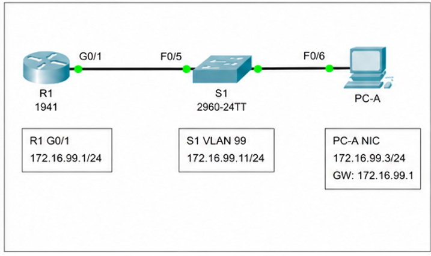
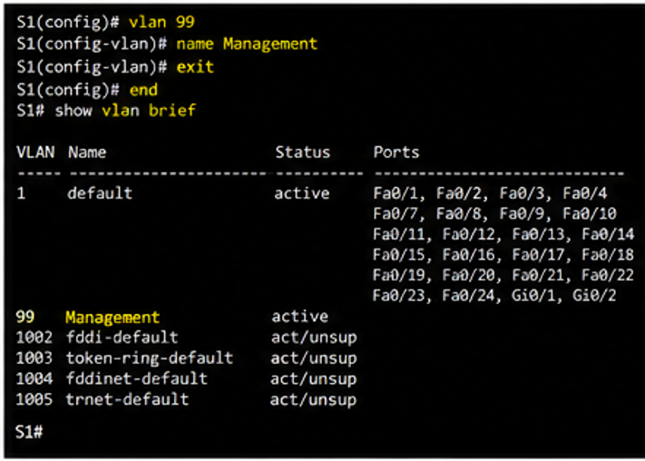
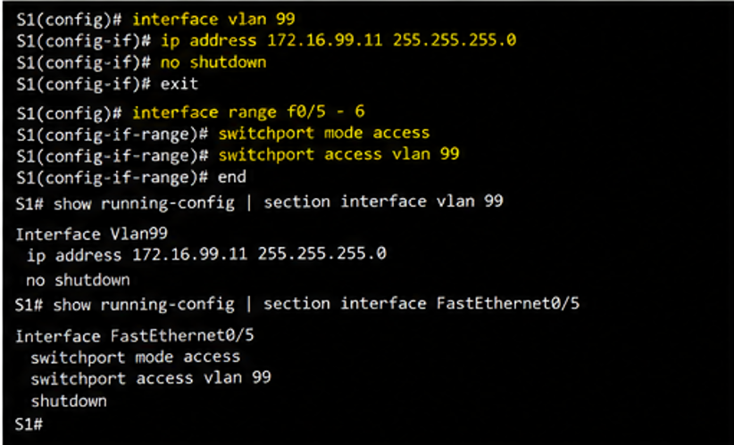
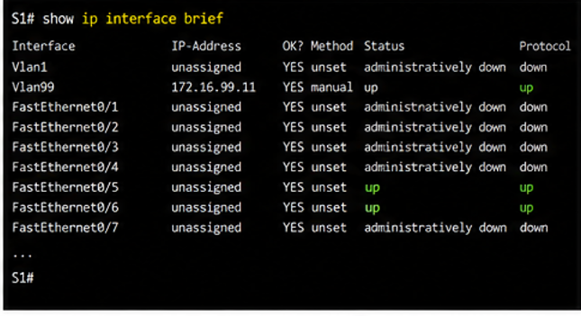
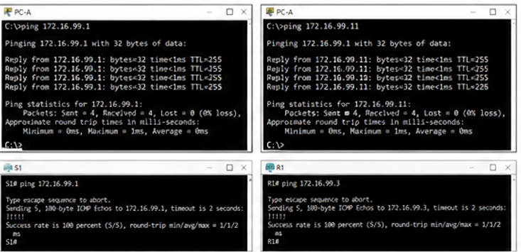
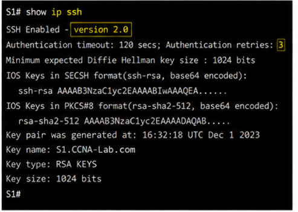
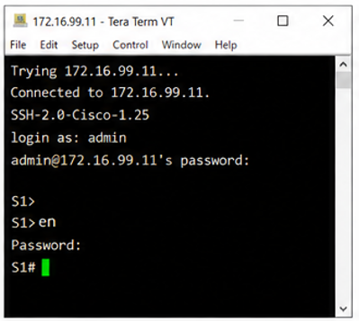
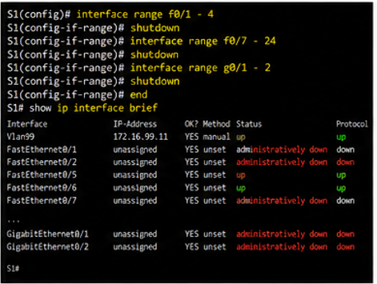
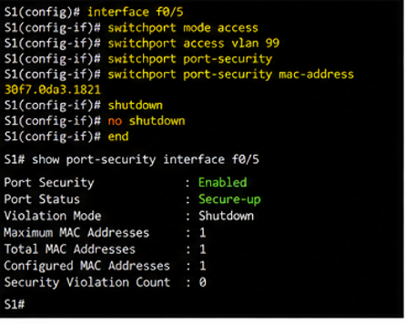

[//]: # is_table=true
[//]: # teacher ="Воробьев С.П."
[//]: # numerate = False

__ФИО__: Швырев А.П, Скиба А.Р, Мусиенко А.Е  
__Группа__: 090302-ИСТа-023

# Лабораторная работа №18

## Настройка параметров безопасности коммутатора

#### Цель работы

Целью лабораторной работы являлось изучение механизмов обеспечения безопасности коммутаторов Cisco, настройка
защищенного удаленного доступа по протоколу _SSH_, настройка безопасности портов коммутатора, ограничение подключения
устройств по MAC-адресам, а также проверка работы защитных механизмов в среде _Cisco Packet Tracer_.

#### Исходные данные

В лабораторной работе использовалась сеть, состоящая из маршрутизатора Cisco, коммутатора Cisco Catalyst 2960 и
персонального компьютера.

В процессе выполнения лабораторной работы использовалась следующая схема адресации:

| Устройство | Интерфейс          | IP-адрес     | Маска подсети | default gateway |
|------------|--------------------|--------------|---------------|-----------------|
| R1         | GigabitEthernet0/1 | 172.16.99.1  | 255.255.255.0 | отсутствует     |
| S1         | VLAN 99            | 172.16.99.11 | 255.255.255.0 | 172.16.99.1     |
| PC-A       | Ethernet           | 172.16.99.3  | 255.255.255.0 | 172.16.99.1     |

Топология сети представлена на рисунке 1.

#### Оборудование и ПО

В ходе выполнения лабораторной работы использовались следующие аппаратные и программные средства:
- маршрутизатор Cisco 1941,
- коммутатор Cisco Catalyst 2960,
- персональный компьютер,
- кабели Ethernet,
- программа _Cisco Packet Tracer_,
- интерфейсы _GigabitEthernet_ и _FastEthernet_,
- консоль Cisco IOS.

Для проверки сетевого взаимодействия использовались команды:
- _ping_,
- _show vlan_,
- _show ip interface brief_,
- _show port-security_,
- _show mac address-table_.

#### Ход выполнения работы

На начальном этапе была собрана топология сети и выполнено подключение оборудования в соответствии со схемой.

После подключения устройств выполнялась базовая настройка маршрутизатора R1 и коммутатора S1. Для устройств были заданы
имена, отключен DNS-поиск, настроены пароли консоли и виртуальных терминалов, а также включено шифрование паролей.

Дополнительно на коммутаторе была создана VLAN 99 для административного управления устройством.

Создание VLAN 99 представлено на рисунке 2.

После создания VLAN выполнялась настройка интерфейса управления VLAN 99. Коммутатору S1 был назначен _IP-адрес_
172.16.99.11 и настроен параметр _default gateway_.

Для корректной работы интерфейса VLAN 99 были переведены в данную VLAN порты _FastEthernet0/5_ и _FastEthernet0/6_.

Настройка интерфейса VLAN 99 представлена на рисунке 3.

После настройки сетевых параметров была выполнена проверка состояния интерфейсов с помощью команды _show ip interface
brief_. Проверка показала успешный переход интерфейса VLAN 99 в активное состояние.

Результат проверки интерфейсов представлен на рисунке 4.

Следующим этапом стала проверка сетевого взаимодействия между устройствами. С компьютера PC-A выполнялась отправка
эхо-запросов _ping_ на маршрутизатор R1 и коммутатор S1.

В результате тестирования было установлено:
- маршрутизатор R1 успешно отвечает на _ping_,
- интерфейс управления коммутатора S1 доступен,
- обмен пакетами между устройствами выполняется корректно.

Проверка сетевого подключения представлена на рисунке 5.

После завершения базовой настройки выполнялась настройка удаленного доступа по протоколу _SSH_. На коммутаторе было
настроено доменное имя _CCNA-Lab.com_ и создан пользователь admin с максимальными привилегиями.

Для обеспечения безопасного подключения были выполнены команды:
- _ip domain-name_,
- _username admin privilege 15 secret_,
- _transport input ssh_,
- _login local_.

Далее был создан RSA-ключ длиной 1024 бита для поддержки шифрования соединения.

Генерация RSA-ключа представлена на рисунке 6.

После создания ключей выполнялась проверка параметров SSH с использованием команды _show ip ssh_. Проверка показала
использование второй версии протокола SSH и корректную работу параметров аутентификации.

Проверка параметров SSH представлена на рисунке 7.

Следующим этапом была изменена стандартная конфигурация SSH. Время ожидания подключения было изменено до 75 секунд, а
количество попыток аутентификации ограничено двумя.

Данные меры позволили повысить уровень безопасности удаленного подключения и уменьшить вероятность подбора учетных
данных.

После настройки параметров SSH выполнялось тестовое подключение к коммутатору с компьютера PC-A. Подключение было
успешно установлено с использованием имени пользователя admin и пароля sshadmin.

Подключение по SSH представлено на рисунке 8.

Следующим этапом выполнялась настройка дополнительных механизмов безопасности коммутатора. На устройстве был настроен
баннер MOTD с предупреждением о запрете несанкционированного доступа.

После этого были отключены неиспользуемые порты коммутатора при помощи команды _interface range_ и команды _shutdown_.

Отключение неиспользуемых интерфейсов представлено на рисунке 9.

В процессе анализа безопасности была выполнена проверка работы HTTP-сервера коммутатора. Было установлено, что служба
HTTP активна по умолчанию и использует незашифрованное соединение.

Для повышения безопасности использовалась команда:
- _no ip http server_.

После отключения HTTP-сервера подключение через обычный браузер по протоколу HTTP стало недоступным. При этом защищенный
доступ по HTTPS продолжал функционировать корректно.

Следующим этапом была выполнена настройка функции безопасности порта. На интерфейсе _FastEthernet0/5_ была активирована
технология _port-security_.

В процессе настройки использовались команды:
- _switchport port-security_,
- _switchport port-security mac-address_,
- _switchport mode access_.

Для порта был вручную задан разрешенный MAC-адрес маршрутизатора R1.

Настройка port-security представлена на рисунке 10.

После настройки выполнялась проверка функции безопасности порта с использованием команды _show port-security interface_.
Проверка показала, что интерфейс находится в состоянии Secure-up и допускает подключение только одного MAC-адреса.

Далее выполнялось тестирование механизма защиты. На маршрутизаторе был изменен MAC-адрес интерфейса
_GigabitEthernet0/1_. После повторного подключения коммутатор зафиксировал нарушение политики безопасности и перевел
интерфейс _FastEthernet0/5_ в состояние err-disabled.

В результате нарушения безопасности обмен пакетами между устройствами был прекращен. Команда _show port-security_
показала увеличение счетчика нарушений безопасности до единицы.

После анализа ошибки интерфейс был переведен в рабочее состояние при помощи последовательного выполнения команд:
- _shutdown_,
- _no shutdown_.

После восстановления интерфейса соединение между устройствами снова стало доступным.

В ходе лабораторной работы дополнительно анализировалась работа таблицы MAC-адресов. Команда _show mac address-table_
позволила определить динамически изученные адреса устройств и проверить корректность работы коммутации кадров.

Также выполнялся анализ работы протокола _ARP_. После отправки команды _ping_ устройства автоматически формировали
таблицы соответствия между _IP-адресами_ и физическими MAC-адресами.

#### Результаты работы

В результате выполнения лабораторной работы были получены следующие результаты:
- выполнена базовая настройка коммутатора Cisco,
- создана VLAN 99 для административного управления,
- настроен защищенный доступ по протоколу _SSH_,
- выполнено отключение неиспользуемых интерфейсов,
- отключен небезопасный HTTP-сервер,
- настроена функция безопасности порта,
- выполнено ограничение подключения по MAC-адресу,
- проверена работа механизмов защиты коммутатора.

В процессе тестирования подтверждено, что механизм _port-security_ позволяет предотвращать подключение неавторизованных
устройств и автоматически блокировать интерфейс при нарушении политики безопасности.

#### Вывод

В ходе выполнения лабораторной работы были изучены механизмы защиты коммутаторов Cisco и практические методы повышения
безопасности локальной сети.

Практически реализована настройка защищенного подключения по протоколу _SSH_, выполнено отключение небезопасных служб и
настроен механизм безопасности портов с фильтрацией по MAC-адресам.

Полученные результаты подтвердили эффективность применения функций безопасности Cisco IOS для предотвращения
несанкционированного доступа к сетевой инфраструктуре и защиты коммутаторов от сетевых атак второго уровня.