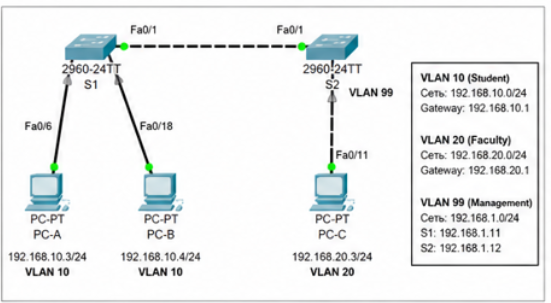
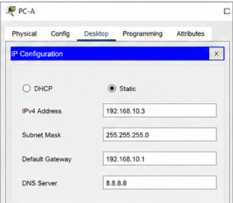
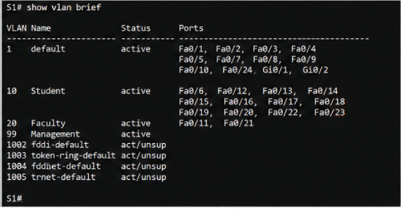
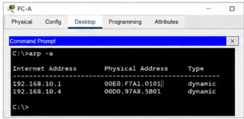
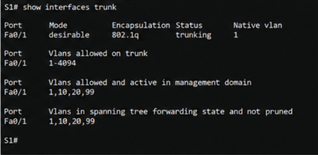
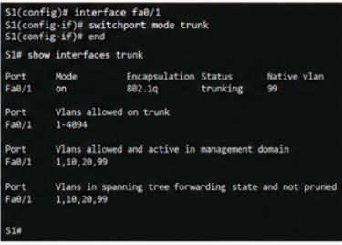
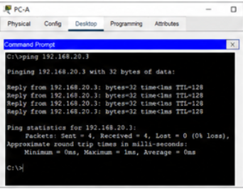
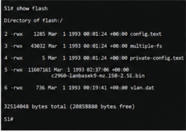
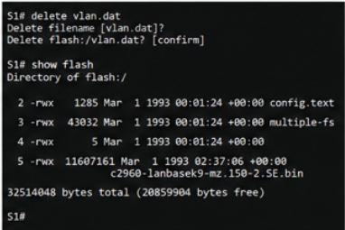

[//]: # is_table=true
[//]: # teacher ="Воробьев С.П."
[//]: # numerate = False
[//]: # use_headings = False

__ФИО__: Швырев А.П, Скиба А.Р, Мусиенко А.Е  
__Группа__: 090302-ИСТа-023

# Лабораторная работа №19

## Конфигурация сетей VLAN и транковых каналов

#### Цель работы

Целью работы являлось изучение принципов настройки виртуальных локальных сетей VLAN, настройка транкового соединения между коммутаторами, проверка передачи трафика между устройствами в пределах одной сети VLAN, а также анализ работы протокола _ARP_, механизма передачи кадров и работы интерфейсов _GigabitEthernet_ и _FastEthernet_ в среде _Cisco Packet Tracer_.

#### Исходные данные

В ходе выполнения лабораторной работы использовалась топология, состоящая из двух коммутаторов и трех персональных компьютеров.

В работе применялась следующая схема адресации:

| Устройство | Интерфейс | IP-адрес | Маска подсети | default gateway |
|---|---|---|---|---|
| S1 | VLAN 99 | 192.168.1.11 | 255.255.255.0 | отсутствует |
| S2 | VLAN 99 | 192.168.1.12 | 255.255.255.0 | отсутствует |
| PC-A | Ethernet | 192.168.10.3 | 255.255.255.0 | 192.168.10.1 |
| PC-B | Ethernet | 192.168.10.4 | 255.255.255.0 | 192.168.10.1 |
| PC-C | Ethernet | 192.168.20.3 | 255.255.255.0 | 192.168.20.1 |

Для разделения трафика были созданы сети VLAN:
    - VLAN 10 для пользовательских устройств,
    - VLAN 20 для отдельного сегмента сети,
    - VLAN 99 для управления коммутаторами.

#### Оборудование и ПО

В процессе выполнения лабораторной работы использовались следующие аппаратные и программные средства:
    - коммутаторы Cisco Catalyst 2960,
    - персональные компьютеры,
    - патч-корды Ethernet,
    - программа _Cisco Packet Tracer_,
    - интерфейсы _FastEthernet_ и _GigabitEthernet_,
    - консоль подключения Cisco IOS.

Для настройки сетевых параметров использовались команды операционной системы Cisco IOS.

В начале выполнения лабораторной работы была подготовлена топология сети с подключением всех устройств согласно схеме.

Топология сети представлена на рисунке 1.

#### Ход выполнения работы

На первом этапе была выполнена базовая настройка коммутаторов. Для устройств были заданы имена, отключен DNS-поиск, настроены пароли консоли и виртуальных терминалов, а также активирована синхронизация системных сообщений.

Дополнительно были настроены интерфейсы VLAN управления:
    - на коммутаторе S1 использовался IP-адрес 192.168.1.11,
    - на коммутаторе S2 использовался IP-адрес 192.168.1.12,
    - управление было перенесено в VLAN 99.

После настройки базовых параметров была выполнена конфигурация персональных компьютеров. Для каждого устройства были назначены собственные _IP-адреса_, маски подсети и параметры _default gateway_.

Настройка адресации на ПК представлена на рисунке 2.

Далее на обоих коммутаторах были созданы виртуальные локальные сети VLAN. Для этого использовались команды создания VLAN и назначения имен.

В процессе конфигурации были созданы следующие сети:
    - VLAN 10 с именем Student,
    - VLAN 20 с именем Faculty,
    - VLAN 99 с именем Management.

После создания VLAN выполнялась проверка таблицы VLAN при помощи команды _show vlan brief_.

Результат проверки созданных VLAN представлен на рисунке 3.

Следующим этапом стало назначение интерфейсов коммутаторов соответствующим VLAN. Порт _FastEthernet0/6_ на коммутаторе S1 был переведен в режим доступа и связан с VLAN 10. На втором коммутаторе аналогичная настройка была выполнена для порта подключения PC-B.

Для устройства PC-C был настроен отдельный сегмент VLAN 20. Такое разделение позволило организовать логическую сегментацию сети и ограничить широковещательный трафик.

При настройке интерфейсов использовались команды:
    - _switchport mode access_,
    - _switchport access vlan_,
    - _interface vlan 99_,
    - _ip address_.

После завершения конфигурации выполнялась проверка связи между устройствами с использованием команды _ping_.

Проверка передачи пакетов внутри VLAN показана на рисунке 4.

В результате проверки было установлено, что узлы PC-A и PC-B успешно обмениваются пакетами, так как находятся в одной VLAN 10. Передача данных между PC-A и PC-C не выполнялась, поскольку устройства располагались в разных VLAN и маршрутизация между VLAN не настраивалась.

Дополнительно была проверена работа протокола _ARP_. После выполнения команды _ping_ на компьютерах появились динамические записи сопоставления _IP-адресов_ и MAC-адресов.

Результат проверки таблицы _ARP_ представлен на рисунке 5.

После проверки работы VLAN была выполнена настройка транкового соединения между коммутаторами. Для организации транкового канала использовался интерфейс _FastEthernet0/1_.

Первоначально применялся режим динамического согласования DTP. Для этого интерфейс был переведен в режим:
    - _switchport mode dynamic desirable_.

После согласования транкового соединения выполнялась проверка состояния транка с помощью команды _show interfaces trunk_.

Состояние транкового соединения представлено на рисунке 6.

В результате анализа было установлено, что транковый канал использует инкапсуляцию 802.1Q и обеспечивает передачу трафика нескольких VLAN через один физический интерфейс.

Через транковое соединение передавались VLAN:
    - VLAN 1,
    - VLAN 10,
    - VLAN 20,
    - VLAN 99.

После проверки динамического режима транковый интерфейс был переведен в статический режим с использованием команды:
    - _switchport mode trunk_.

Ручная настройка транка позволила исключить автоматическое согласование DTP и повысить уровень безопасности сети.

Настройка транкового режима вручную представлена на рисунке 7.

Далее была выполнена дополнительная проверка сетевого взаимодействия между устройствами, подключенными к разным коммутаторам.

Проверка прохождения трафика через trunk показана на рисунке 8.

В результате проверки установлено:
    - узлы VLAN 10 успешно взаимодействуют между собой через транковый канал,
    - устройства из разных VLAN не обмениваются пакетами,
    - интерфейсы управления VLAN 99 успешно отвечают на _ping_,
    - сегментация сети функционирует корректно.

На следующем этапе выполнялась работа с базой VLAN. Для проверки существующих записей использовалась команда _show flash_. В памяти устройства был обнаружен файл _vlan.dat_, содержащий информацию о VLAN.

Проверка содержимого flash-памяти представлена на рисунке 9.

После этого была выполнена процедура удаления базы VLAN с использованием команды:
    - _delete vlan.dat_.

Удаление файла VLAN представлено на рисунке 10.

После удаления файла была повторно выполнена проверка flash-памяти, которая подтвердила отсутствие базы VLAN и возврат параметров коммутатора к исходному состоянию.

Дополнительно был проведен анализ поведения портов при удалении VLAN из базы данных. После удаления VLAN 30 интерфейс, связанный с данной сетью, перешел в неактивное состояние до повторного назначения VLAN.

В ходе лабораторной работы также был выполнен анализ работы широковещательного трафика и сегментации сети. Использование VLAN позволило разделить устройства на отдельные логические группы независимо от физического расположения.

Применение транкового соединения обеспечило передачу кадров нескольких VLAN через один физический интерфейс без нарушения структуры сети.

При передаче данных использовались механизмы:
    - маркировки кадров IEEE 802.1Q,
    - разрешения MAC-адресов через _ARP_,
    - проверки доступности узлов командой _ping_,
    - коммутации кадров на втором уровне модели OSI.

#### Результаты работы

В результате выполнения лабораторной работы были получены следующие результаты:
    - выполнена настройка VLAN на двух коммутаторах,
    - реализовано разделение сети на логические сегменты,
    - настроен транковый канал стандарта 802.1Q,
    - проверена работа интерфейсов _FastEthernet_ и _GigabitEthernet_,
    - выполнена проверка передачи трафика внутри VLAN,
    - проанализирована работа протокола _ARP_,
    - выполнено удаление базы данных VLAN.

В ходе тестирования подтверждено корректное функционирование VLAN и транковых соединений. Устройства, расположенные в одной VLAN, успешно обменивались пакетами через транковый канал. Узлы из разных VLAN не имели сетевого взаимодействия без настройки маршрутизации между VLAN.

#### Вывод

В ходе выполнения лабораторной работы были изучены механизмы создания и настройки VLAN на коммутаторах Cisco. Выполнена конфигурация интерфейсов доступа и транковых соединений стандарта 802.1Q.

Практически подтверждено, что использование VLAN позволяет уменьшить объем широковещательного трафика, повысить уровень безопасности сети и упростить логическое разделение инфраструктуры.

Дополнительно была изучена работа протокола _ARP_, процесс передачи кадров между коммутаторами, а также особенности работы транковых интерфейсов. Полученные результаты подтвердили корректность настройки сети и работоспособность созданной топологии.