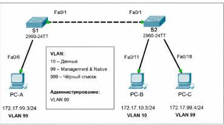
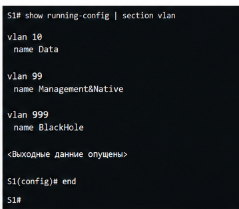
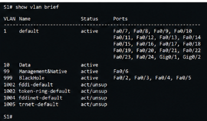
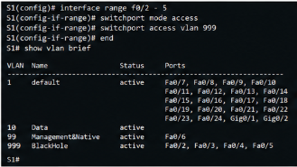
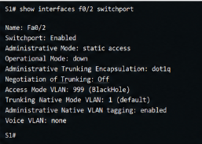
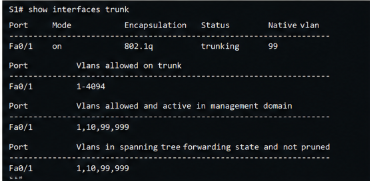
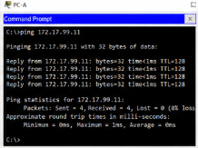
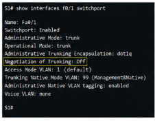
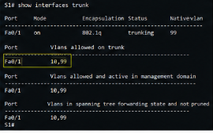
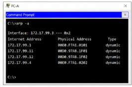

[//]: # is_table=true
[//]: # teacher ="Воробьев С.П."
[//]: # numerate = False

__ФИО__: Швырев А.П, Скиба А.Р, Мусиенко А.Е  
__Группа__: 090302-ИСТа-023

# Лабораторная работа №20

## Реализация системы безопасности сети VLAN

#### Цель работы

Целью лабораторной работы являлось изучение механизмов повышения безопасности сетей VLAN, настройка защищенных транковых соединений между коммутаторами Cisco, ограничение распространения трафика VLAN, а также анализ работы механизмов защиты сети в среде _Cisco Packet Tracer_.

#### Исходные данные

В ходе выполнения лабораторной работы использовалась сеть, состоящая из двух коммутаторов Cisco и трех персональных компьютеров.

Для настройки сети использовалась следующая схема адресации:

| Устройство | Интерфейс | IP-адрес | Маска подсети | default gateway |
|---|---|---|---|---|
| S1 | VLAN 99 | 172.17.99.11 | 255.255.255.0 | 172.17.99.1 |
| S2 | VLAN 99 | 172.17.99.12 | 255.255.255.0 | 172.17.99.1 |
| PC-A | Ethernet | 172.17.99.3 | 255.255.255.0 | 172.17.99.1 |
| PC-B | Ethernet | 172.17.10.3 | 255.255.255.0 | 172.17.10.1 |
| PC-C | Ethernet | 172.17.99.4 | 255.255.255.0 | 172.17.99.1 |

В лабораторной работе использовались следующие VLAN:
    - VLAN 10 для пользовательских данных,
    - VLAN 99 для управления и native VLAN,
    - VLAN 999 для изоляции неиспользуемых портов.

Топология сети представлена на рисунке 1.

#### Оборудование и ПО

В процессе выполнения лабораторной работы использовались следующие аппаратные и программные средства:
    - коммутаторы Cisco Catalyst 2960,
    - персональные компьютеры,
    - кабели Ethernet,
    - программный пакет _Cisco Packet Tracer_,
    - интерфейсы _FastEthernet_ и _GigabitEthernet_,
    - консоль Cisco IOS.

Для проверки сетевого взаимодействия использовались команды _ping_, _show vlan brief_, _show interface trunk_ и _show interface switchport_.

#### Ход выполнения работы

На начальном этапе была выполнена базовая настройка коммутаторов. Для устройств были назначены имена S1 и S2, отключен DNS-поиск, настроены пароли консоли и виртуальных терминалов, а также активировано шифрование паролей.

Дополнительно была настроена система предупреждения доступа MOTD. Данная мера позволила ограничить несанкционированное подключение к оборудованию.

После настройки основных параметров была выполнена конфигурация VLAN. На каждом коммутаторе были созданы сети VLAN 10, VLAN 99 и VLAN 999.

Создание VLAN и назначение имен представлено на рисунке 2.

После создания VLAN были назначены интерфейсы доступа для пользовательских устройств. На коммутаторе S1 порт _FastEthernet0/6_ был переведен в режим доступа и помещен в VLAN 99. На коммутаторе S2 интерфейс _FastEthernet0/11_ был связан с VLAN 10, а интерфейс _FastEthernet0/18_ — с VLAN 99.

Настройка интерфейсов доступа выполнялась командами:
    - _switchport mode access_,
    - _switchport access vlan_,
    - _interface vlan 99_,
    - _ip address_.

После завершения настройки была выполнена проверка таблицы VLAN. Проверка позволила убедиться в правильном распределении интерфейсов между VLAN.

Результат проверки VLAN представлен на рисунке 3.

В ходе анализа было установлено, что все неиспользуемые порты по умолчанию принадлежат VLAN 1. Такое состояние снижает уровень безопасности сети, поскольку свободные интерфейсы могут использоваться для несанкционированного подключения.

Для повышения безопасности была выполнена настройка неиспользуемых портов. Интерфейсы с _FastEthernet0/2_ по _FastEthernet0/5_ были переведены в VLAN 999 и настроены как порты доступа.

Настройка защищенных неиспользуемых портов представлена на рисунке 4.

После этого была выполнена проверка режима работы интерфейсов с использованием команды _show interface switchport_. Проверка показала, что согласование транкового режима на неиспользуемых портах отключено.

Результат проверки режима интерфейсов представлен на рисунке 5.

Следующим этапом стала настройка транкового соединения между коммутаторами. Для организации транкового канала использовался интерфейс _FastEthernet0/1_.

На обоих коммутаторах были выполнены команды:
    - _switchport mode trunk_,
    - _switchport trunk native vlan 99_.

После настройки native VLAN была выполнена проверка состояния транкового интерфейса.

Проверка trunk-соединения представлена на рисунке 6.

В процессе настройки была получена ошибка _CDP-4-NATIVE_VLAN_MISMATCH_. Сообщение указывало на различие native VLAN на противоположных сторонах транкового соединения. После настройки VLAN 99 на обоих коммутаторах предупреждение исчезло.

Дополнительно была выполнена проверка передачи кадров между VLAN через trunk-интерфейс. Проверка показала корректную передачу трафика VLAN 10 и VLAN 99 между коммутаторами.

Проверка сетевого взаимодействия представлена на рисунке 7.

В результате проверки установлено:
    - устройства VLAN 99 успешно взаимодействуют между собой,
    - узлы VLAN 10 обмениваются пакетами через trunk,
    - устройства из разных VLAN не передают трафик без маршрутизации,
    - интерфейсы управления корректно отвечают на _ping_.

Для повышения уровня безопасности было выполнено отключение протокола динамического согласования транков DTP. На интерфейсах _FastEthernet0/1_ обоих коммутаторов использовалась команда:
    - _switchport nonegotiate_.

После отключения DTP была выполнена проверка параметров интерфейсов. Проверка показала, что параметр Negotiation of Trunking перешел в состояние Off.

Отключение DTP представлено на рисунке 8.

Следующим этапом стала настройка ограничения VLAN на trunk-интерфейсе. По умолчанию транковый канал разрешает прохождение всех VLAN, что может привести к появлению лишнего трафика и снижению безопасности сети.

Для ограничения трафика использовалась команда:
    - _switchport trunk allowed vlan 10,99_.

После применения настройки была выполнена повторная проверка транкового соединения.

Результат ограничения VLAN на trunk представлен на рисунке 9.

В результате анализа установлено, что через trunk-интерфейс разрешена передача только VLAN 10 и VLAN 99. VLAN 999 использовалась исключительно для изоляции неиспользуемых интерфейсов.

Во время тестирования также анализировалась работа протокола _ARP_. После выполнения команды _ping_ на устройствах были сформированы динамические записи MAC-адресов.

Проверка таблицы _ARP_ представлена на рисунке 10.

В ходе выполнения лабораторной работы была подтверждена эффективность применения дополнительных механизмов безопасности VLAN. Настройка native VLAN, ограничение trunk VLAN и отключение DTP позволили снизить вероятность несанкционированного доступа к сети.

Дополнительно было установлено, что перенос неиспользуемых интерфейсов в VLAN 999 уменьшает риск подключения сторонних устройств и предотвращает случайное использование свободных портов.

#### Результаты работы

В результате выполнения лабораторной работы были получены следующие результаты:
    - выполнена настройка VLAN безопасности,
    - настроены trunk-интерфейсы стандарта 802.1Q,
    - изменена native VLAN на VLAN 99,
    - отключен протокол DTP,
    - ограничен список VLAN для trunk-портов,
    - неиспользуемые порты перенесены в VLAN 999,
    - проверена работа _ARP_ и _ping_,
    - подтверждена корректная работа механизмов защиты VLAN.

В процессе тестирования установлено, что использование настроек безопасности VLAN существенно повышает устойчивость сети к несанкционированному подключению и снижает риск распространения широковещательного трафика.

#### Вывод

В ходе выполнения лабораторной работы были изучены механизмы обеспечения безопасности VLAN на коммутаторах Cisco. Практически реализована настройка trunk-интерфейсов, ограничение разрешенных VLAN и отключение динамического согласования транков.

Дополнительно выполнена изоляция неиспользуемых интерфейсов в отдельную VLAN 999 и изменена native VLAN для повышения безопасности сети.

Полученные результаты подтвердили, что применение механизмов безопасности VLAN позволяет уменьшить вероятность атак второго уровня, снизить объем нежелательного трафика и повысить надежность работы сети.